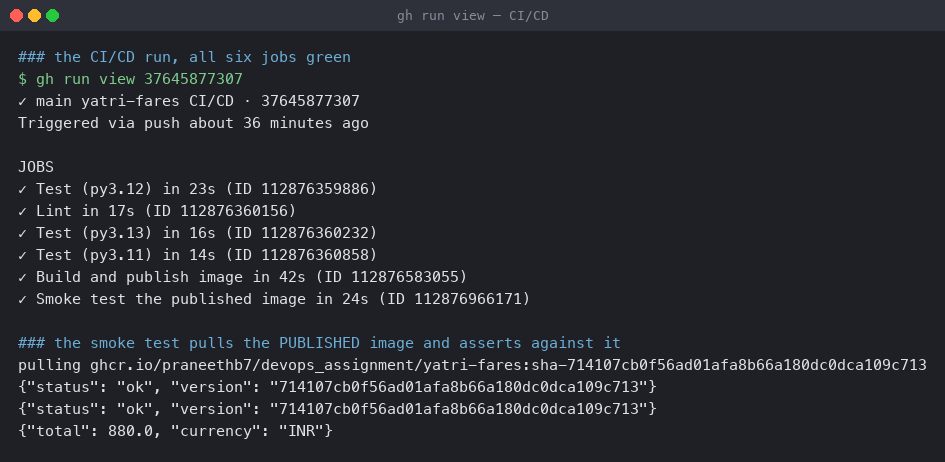
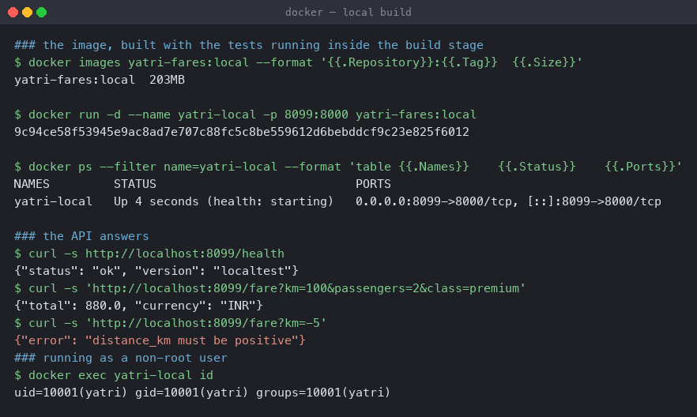

# CI/CD with GitHub Actions

A fare-quoting service with a pipeline that lints, tests on three Python versions, publishes
an image to GHCR, and then **pulls that published image back and asserts against it**.

**Environment:** GitHub Actions on `ubuntu-24.04` runners; Python 3.11/3.12/3.13;
Docker Buildx; registry `ghcr.io`.

Workflow: [`.github/workflows/yatri-fares-cicd.yml`](../.github/workflows/yatri-fares-cicd.yml)
— at the repository root, because GitHub only reads workflows from `.github/workflows/`. A
`paths:` filter scopes it to this folder.

```
cicd-github-actions/
├── app/fares.py       # pure fare rules - no I/O, cheap to test
├── app/main.py        # stdlib HTTP API over them
├── tests/             # 14 tests: unit + API
├── Dockerfile         # multi-stage; tests run INSIDE the build
└── requirements-dev.txt
```

---

## The run

```
✓ main yatri-fares CI/CD · 37645877307

JOBS
✓ Test (py3.12) in 23s
✓ Lint in 17s
✓ Test (py3.13) in 16s
✓ Test (py3.11) in 14s
✓ Build and publish image in 42s
✓ Smoke test the published image in 24s

### the smoke test pulls the PUBLISHED image and asserts against it
pulling ghcr.io/praneethb7/devops_assignment/yatri-fares:sha-714107cb0f56ad01afa8b66a180dc0dca109c713
{"status": "ok", "version": "714107cb0f56ad01afa8b66a180dc0dca109c713"}
{"total": 880.0, "currency": "INR"}
```



The `version` field is the **commit SHA**, passed in as a build argument and baked into the
image as `APP_VERSION`. Seeing it come back from a container that was pulled from the
registry proves the whole chain: this source produced this image, and that image runs.

`{"total": 880.0}` is the fare for 100km × 2 passengers × premium — the same number
`tests/test_api.py` asserts locally. The smoke test checks the **artifact**, not the source.

---

## CI versus CD, in this file

| | Jobs | What it protects |
|---|---|---|
| **CI** | `lint`, `test` (×3) | the source is correct |
| **CD** | `publish`, `smoke` | the artifact is correct and available |

The boundary is one line:

```yaml
publish:
  needs: [lint, test]
  if: github.event_name != 'pull_request'
```

**`needs` is the gate.** Nothing publishes until every lint and test job has passed — a
failing test does not produce an image at all. The `if` means pull requests run CI only;
publishing happens on `main`.

---

## Workflow, jobs, steps, runners

- **Workflow** — this file. Triggered by `push`, `pull_request` and `workflow_dispatch`
  (a manual button in the Actions tab).
- **Jobs** — `lint`, `test`, `publish`, `smoke`. Each gets a **fresh runner**, which is why
  nothing is shared between them implicitly. They run in parallel unless `needs` orders
  them, which is visible above: the three test jobs and lint all finished within 23s of each
  other.
- **Steps** — sequential within a job, sharing a filesystem and a workspace.
- **Runners** — `ubuntu-latest`, GitHub-hosted and ephemeral. The annotation on every run
  (`The ubuntu-latest label will migrate to Ubuntu 26`) is a reminder that `latest` is a
  moving target; pinning `ubuntu-24.04` is the reproducible choice.

### The matrix

```yaml
strategy:
  fail-fast: false
  matrix:
    python-version: ['3.11', '3.12', '3.13']
```

Three parallel jobs from one definition. **`fail-fast: false` is the setting worth
knowing** — the default cancels the siblings as soon as one fails, so a 3.13-only
incompatibility would hide whether 3.11 and 3.12 were fine. Turning it off costs a few
runner-minutes and tells you the whole truth.

### Secrets

`${{ secrets.GITHUB_TOKEN }}` is injected automatically per run and expires with it, so
there is no long-lived credential to rotate or leak. It needs an explicit grant to push:

```yaml
permissions:
  contents: read
  packages: write
```

Least privilege, as in [Session 18's IAM notes](../terraform-infrastructure-as-code/aws-services/01-iam/)
— `contents: read` because the job only clones, `packages: write` because it pushes.

### Artifacts

```yaml
- name: Upload test results
  if: always()
```

**`if: always()` is the important part.** The default skips a step when an earlier one
failed, which would discard the test report exactly when it matters. Artifacts outlive the
runner and are downloadable from the run page.

---

## Tests inside the image build

[`Dockerfile`](Dockerfile) runs pytest in the build stage:

```dockerfile
FROM python:3.12-slim AS build
...
RUN PYTHONPATH=/deps:. /deps/bin/pytest

FROM python:3.12-slim AS runtime
COPY --from=build /src/app ./app
USER yatri
```

```
#14 [build 8/8] RUN PYTHONPATH=/deps:. /deps/bin/pytest
#14 0.260 ..............                       [100%]
#14 0.264 14 passed in 0.03s
```

**A broken image cannot be produced** — the build fails before the runtime stage. And
because the test dependencies live only in the build stage, the published image contains
neither pytest nor the tests: 203MB, running as uid 10001.

```
$ docker run -d -p 8099:8000 yatri-fares:local
$ curl -s http://localhost:8099/health
{"status": "ok", "version": "localtest"}
$ curl -s 'http://localhost:8099/fare?km=100&passengers=2&class=premium'
{"total": 880.0, "currency": "INR"}
$ curl -s 'http://localhost:8099/fare?km=-5'
{"error": "distance_km must be positive"}
$ docker exec yatri-local id
uid=10001(yatri) gid=10001(yatri) groups=10001(yatri)
```



---

## Two failures worth recording

The first push failed, and both causes are ordinary mistakes rather than exotic ones.

**1. A job with no `checkout` cannot run a shell step.**

```
##[error]An error occurred trying to start process '/usr/bin/bash' with working
directory '/home/runner/work/devOps_Assignment/devOps_Assignment/cicd-github-actions'.
No such file or directory
```

`defaults.run.working-directory` applies to **every** job, including `smoke`, which pulls a
published image and builds nothing. The directory did not exist on that runner. Adding
`actions/checkout@v4` to the job fixed it. The same mistake recurred in Session 17's gate
job.

**2. GHCR rejects uppercase image names.**

This repository is `devOps_Assignment`. `docker/metadata-action` lowercases automatically on
push, which is why `publish` succeeded — but the smoke job built its image reference by hand
and did not:

```yaml
IMAGE=$(echo "${{ env.REGISTRY }}/${{ env.IMAGE_NAME }}:sha-${{ github.sha }}" \
          | tr '[:upper:]' '[:lower:]')
```

An inconsistency between a helper action's behaviour and hand-written shell is a good
general warning: anything an action normalises for you has to be normalised again wherever
you bypass it.

---

## Running it locally

```bash
pip install -r requirements-dev.txt
PYTHONPATH=. pytest                      # 14 tests
docker build -t yatri-fares:local --build-arg APP_VERSION=localtest .
docker run --rm -p 8000:8000 yatri-fares:local
```
