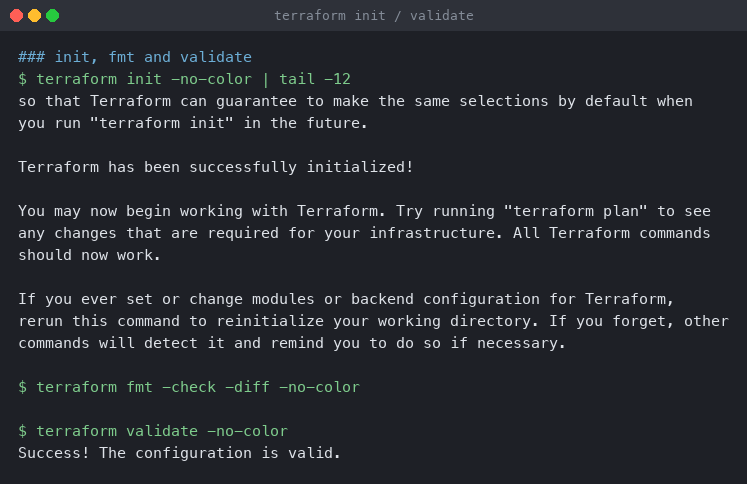
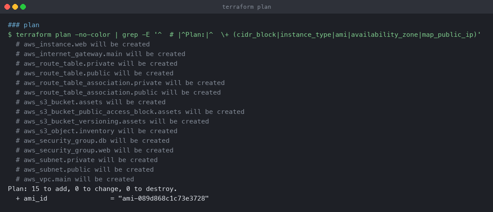
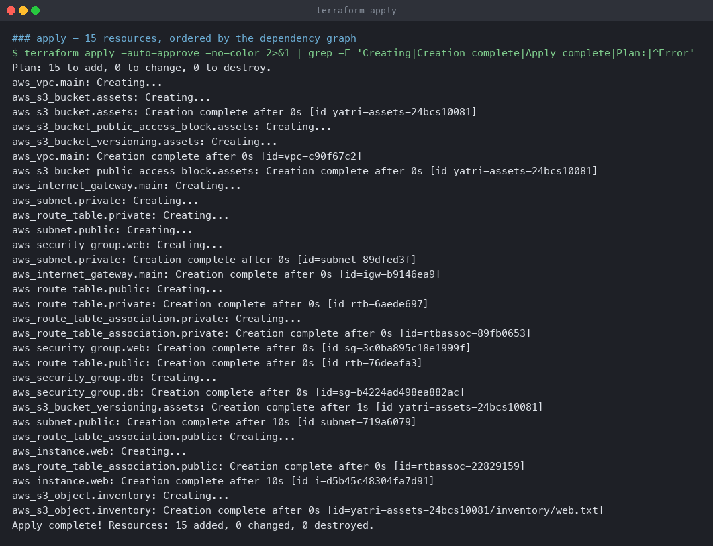
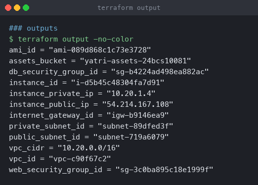
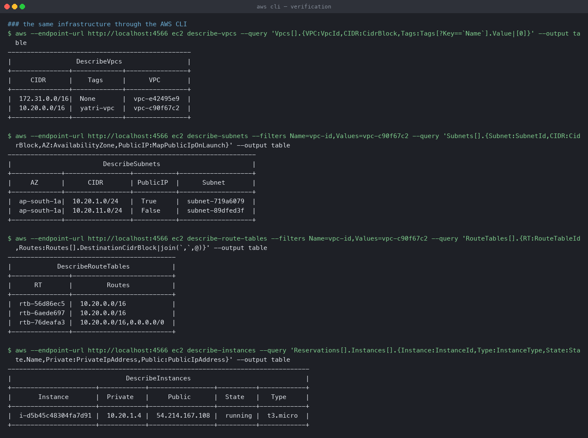
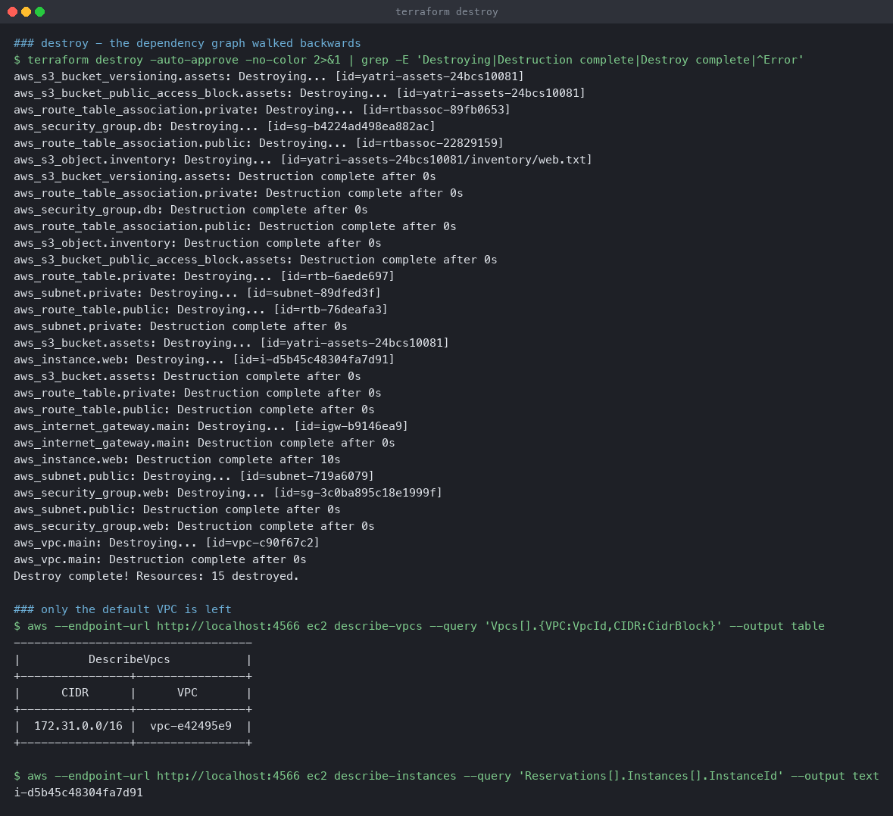

# Cloud and Terraform in Action

One `terraform apply` that builds a complete small cloud environment — VPC, two subnets,
routing, an internet gateway, two security groups, an EC2 instance and an S3 bucket — then
tears it down. Fifteen resources, no hand-wiring.

**Environment:** Terraform v1.16.4 on macOS (Apple silicon), `hashicorp/aws` provider
v6.67.0, AWS CLI v2.36.14, against **LocalStack 3.8.1** in Docker. See
[`../terraform-infrastructure-as-code/README.md`](../terraform-infrastructure-as-code/README.md)
for why, and for what the `provider` block's `endpoints` override does.

## Architecture

```
                         Internet
                             |
                    [ aws_internet_gateway ]
                             |
  VPC 10.20.0.0/16           |
  +--------------------------|-----------------------------------+
  |                          |                                   |
  |  public 10.20.1.0/24  <--+ route 0.0.0.0/0 -> igw            |
  |  +--------------------------------------------+              |
  |  |  aws_instance.web  t3.micro                |              |
  |  |  private 10.20.1.4  public 54.214.167.108  |              |
  |  |  sg: web  (80 from anywhere, 22 from VPC)  |              |
  |  +--------------------------------------------+              |
  |                                                              |
  |  private 10.20.11.0/24    route table: local only            |
  |  +--------------------------------------------+              |
  |  |  sg: db  (5432 from sg-web only)           |              |
  |  +--------------------------------------------+              |
  +--------------------------------------------------------------+

        aws_s3_bucket.assets   (versioned, public access blocked)
        └── inventory/web.txt  (content interpolates the instance's attributes)
```

## Files

| File | Contents |
|---|---|
| [`versions.tf`](versions.tf) | `required_version`, provider constraint |
| [`provider.tf`](provider.tf) | AWS provider, LocalStack endpoints, `default_tags` |
| [`variables.tf`](variables.tf) | 9 inputs with descriptions and CIDR validation |
| [`main.tf`](main.tf) | the 15 resources and one `aws_ami` data source |
| [`outputs.tf`](outputs.tf) | 12 outputs |
| [`terraform.tfvars`](terraform.tfvars) | the values for this run |

---

## 1. init, fmt, validate

```bash
terraform init
terraform fmt -check -diff
terraform validate
```

```
Terraform has been successfully initialized!

$ terraform fmt -check -diff
                                  <- clean

$ terraform validate
Success! The configuration is valid.
```



---

## 2. plan

```bash
terraform plan
```

```
  # aws_instance.web will be created
  # aws_internet_gateway.main will be created
  # aws_route_table.private will be created
  # aws_route_table.public will be created
  # aws_route_table_association.private will be created
  # aws_route_table_association.public will be created
  # aws_s3_bucket.assets will be created
  # aws_s3_bucket_public_access_block.assets will be created
  # aws_s3_bucket_versioning.assets will be created
  # aws_s3_object.inventory will be created
  # aws_security_group.db will be created
  # aws_security_group.web will be created
  # aws_subnet.private will be created
  # aws_subnet.public will be created
  # aws_vpc.main will be created

Plan: 15 to add, 0 to change, 0 to destroy.
  + ami_id = "ami-089d868c1c73e3728"
```



`ami_id` is already a concrete value in the plan because it comes from a **data source**,
which Terraform reads during planning rather than creating:

```hcl
data "aws_ami" "al2023" {
  most_recent = true
  owners      = ["amazon"]
  filter {
    name   = "name"
    values = ["al2023-ami-*-x86_64"]
  }
}
```

An AMI ID is region-specific, so hardcoding one breaks the moment `var.aws_region` changes.
Looking it up is the difference between a module that is reusable and one that only works
where it was written.

---

## 3. apply — and the dependency graph

```bash
terraform apply -auto-approve
```

```
aws_vpc.main: Creating...
aws_s3_bucket.assets: Creating...
aws_s3_bucket.assets: Creation complete after 0s [id=yatri-assets-24bcs10081]
aws_vpc.main: Creation complete after 0s [id=vpc-c90f67c2]
aws_internet_gateway.main: Creating...
aws_subnet.private: Creating...
aws_route_table.private: Creating...
aws_subnet.public: Creating...
aws_security_group.web: Creating...
aws_subnet.private: Creation complete after 0s [id=subnet-89dfed3f]
aws_internet_gateway.main: Creation complete after 0s [id=igw-b9146ea9]
aws_route_table.public: Creating...
aws_security_group.web: Creation complete after 0s [id=sg-3c0ba895c18e1999f]
aws_security_group.db: Creating...
aws_security_group.db: Creation complete after 0s [id=sg-b4224ad498ea882ac]
aws_subnet.public: Creation complete after 10s [id=subnet-719a6079]
aws_route_table_association.public: Creating...
aws_instance.web: Creating...
aws_instance.web: Creation complete after 10s [id=i-d5b45c48304fa7d91]
aws_s3_object.inventory: Creating...
aws_s3_object.inventory: Creation complete after 0s

Apply complete! Resources: 15 added, 0 changed, 0 destroyed.
```



This ordering is the most instructive output in the whole project, and **nothing in the
configuration specifies it**. Terraform derives it from attribute references:

- `aws_vpc.main` and `aws_s3_bucket.assets` start **simultaneously** — neither references
  the other, so they are independent subgraphs.
- The gateway, both subnets, both route tables and `aws_security_group.web` all wait for the
  VPC, then run **in parallel**, because each only needs `aws_vpc.main.id`.
- `aws_security_group.db` waits for `aws_security_group.web` — it references
  `aws_security_group.web.id` as its ingress source.
- `aws_instance.web` waits for `aws_subnet.public`.
- `aws_s3_object.inventory` is **last of all**, because its content interpolates
  `aws_instance.web.id` and `aws_instance.web.private_ip`.

That last one is an **implicit dependency**: no `depends_on`, just a reference inside a
string. It is the normal and preferred way to express ordering — `depends_on` is only needed
when a dependency exists that Terraform cannot see from the code.

---

## 4. outputs

```bash
terraform output
```

```
ami_id = "ami-089d868c1c73e3728"
assets_bucket = "yatri-assets-24bcs10081"
db_security_group_id = "sg-b4224ad498ea882ac"
instance_id = "i-d5b45c48304fa7d91"
instance_private_ip = "10.20.1.4"
instance_public_ip = "54.214.167.108"
internet_gateway_id = "igw-b9146ea9"
private_subnet_id = "subnet-89dfed3f"
public_subnet_id = "subnet-719a6079"
vpc_cidr = "10.20.0.0/16"
vpc_id = "vpc-c90f67c2"
web_security_group_id = "sg-3c0ba895c18e1999f"
```



`instance_private_ip` is `10.20.1.4` — the fifth address in `10.20.1.0/24`, because AWS
reserves `.0` through `.3` and `.255` in every subnet. The private IP comes out of the
subnet CIDR by definition; the public one exists **only** because the subnet sets
`map_public_ip_on_launch = true`.

---

## 5. Verifying with the AWS CLI

```bash
aws --endpoint-url http://localhost:4566 ec2 describe-vpcs --output table
aws --endpoint-url http://localhost:4566 ec2 describe-subnets --filters Name=vpc-id,Values=$(terraform output -raw vpc_id)
aws --endpoint-url http://localhost:4566 ec2 describe-route-tables --filters Name=vpc-id,Values=$(terraform output -raw vpc_id)
aws --endpoint-url http://localhost:4566 ec2 describe-instances
```

```
+---------------+-------------+----------------+
|     CIDR      |    Tags     |      VPC       |
+---------------+-------------+----------------+
|  172.31.0.0/16|  None       |  vpc-e42495e9  |     <- the default VPC
|  10.20.0.0/16 |  yatri-vpc  |  vpc-c90f67c2  |     <- ours
+---------------+-------------+----------------+

+-------------+-----------------+-----------+-------------------+
|     AZ      |      CIDR       | PublicIP  |      Subnet       |
+-------------+-----------------+-----------+-------------------+
|  ap-south-1a|  10.20.1.0/24   |  True     |  subnet-719a6079  |
|  ap-south-1a|  10.20.11.0/24  |  False    |  subnet-89dfed3f  |
+-------------+-----------------+-----------+-------------------+

+---------------+--------------------------+
|      RT       |         Routes           |
+---------------+--------------------------+
|  rtb-56d86ec5 |  10.20.0.0/16            |     <- main, implicit
|  rtb-6aede697 |  10.20.0.0/16            |     <- private
|  rtb-76deafa3 |  10.20.0.0/16,0.0.0.0/0  |     <- public
+---------------+--------------------------+

+----------------------+------------+-----------------+----------+------------+
|       Instance       |  Private   |     Public      |  State   |   Type     |
+----------------------+------------+-----------------+----------+------------+
|  i-d5b45c48304fa7d91 |  10.20.1.4 |  54.214.167.108 |  running |  t3.micro  |
+----------------------+------------+-----------------+----------+------------+
```



The route table output is the one to study. **Exactly one of the three has `0.0.0.0/0`** —
and that is the only difference between the public subnet and the private one. There is no
"public" attribute anywhere in `main.tf`:

```hcl
resource "aws_route_table" "public" {
  vpc_id = aws_vpc.main.id
  route {
    cidr_block = "0.0.0.0/0"
    gateway_id = aws_internet_gateway.main.id
  }
}
```

`10.20.0.0/16 -> local` appears in all three and is implicit — it cannot be removed, and it
is why the two subnets can reach each other with no configuration at all.

`rtb-56d86ec5` is the VPC's **main** route table, created automatically. It matters because
a subnet with no explicit `aws_route_table_association` silently falls back to it — which is
an easy way to make a subnet accidentally public, and the reason both associations are
written out explicitly here.

The default VPC appearing alongside ours is also worth seeing: `172.31.0.0/16` with no
tags, which every AWS account has in every region and which is why an instance launched
with all defaults is immediately on the public internet.

---

## 6. destroy

```bash
terraform destroy -auto-approve
```

```
aws_s3_bucket_versioning.assets: Destroying...
aws_route_table_association.private: Destroying...
aws_security_group.db: Destroying...
aws_route_table_association.public: Destroying...
aws_s3_object.inventory: Destroying...
aws_s3_bucket_public_access_block.assets: Destroying...
...
aws_route_table.private: Destroying...
aws_subnet.private: Destroying...
aws_route_table.public: Destroying...
aws_s3_bucket.assets: Destroying...
aws_instance.web: Destroying...
aws_internet_gateway.main: Destroying...
aws_instance.web: Destruction complete after 10s
aws_subnet.public: Destroying...
aws_security_group.web: Destroying...
aws_vpc.main: Destroying...
aws_vpc.main: Destruction complete after 0s

Destroy complete! Resources: 15 destroyed.
```



The same graph, walked backwards:

- **Leaves first** — route table associations, the S3 object, `aws_security_group.db` (which
  depends on `web`, so it must go before it).
- `aws_instance.web` before `aws_subnet.public`, because a subnet with an instance in it
  cannot be deleted.
- `aws_security_group.web` only after the instance that uses it is gone.
- **`aws_vpc.main` last**, since everything else lived inside it.

This is the ordering AWS enforces anyway — try deleting a VPC with a running instance and
it refuses. Terraform knows the order in advance instead of discovering it through errors.

---

## Security choices worth pointing at

**SSH is not open to the internet.** From [`variables.tf`](variables.tf):

```hcl
variable "allowed_ssh_cidr" {
  default = "10.20.0.0/16"     # the VPC, not 0.0.0.0/0
}
```

Port 22 open to `0.0.0.0/0` is the most common avoidable finding in a security review. Port
80 is open to the world because that is the instance's job.

**The database security group takes a group, not a CIDR:**

```hcl
ingress {
  from_port       = 5432
  to_port         = 5432
  protocol        = "tcp"
  security_groups = [aws_security_group.web.id]
}
```

Anything in `sg-web` can reach PostgreSQL; nothing else can. No address ranges to maintain
as instances come and go, and no chance of a CIDR being widened by accident.

**The root volume is encrypted** (`encrypted = true` on `root_block_device`), and the S3
bucket has versioning on with all four public-access flags set.

**`default_tags` on the provider** applies `Project`, `Environment` and `ManagedBy` to every
resource without repeating them 15 times — which is what makes cost allocation and
"who created this" answerable later.

---

## Cleanup

```bash
terraform destroy -auto-approve
docker rm -f localstack
```
