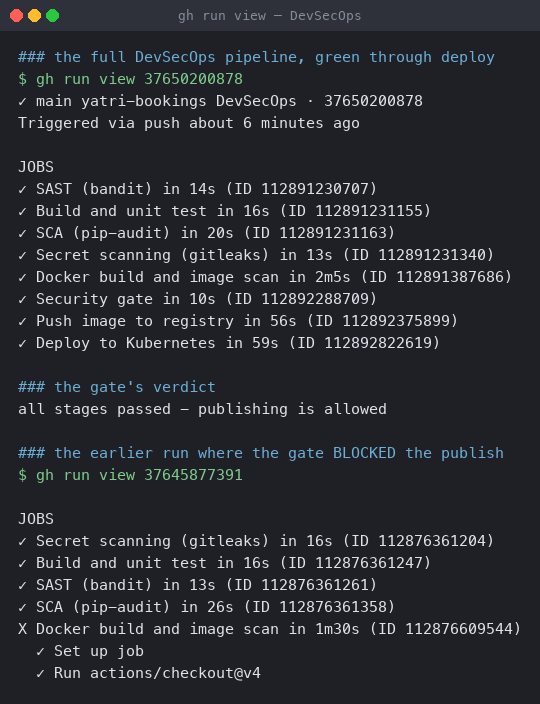
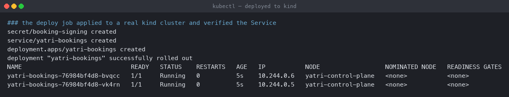

# Complete CI/CD with DevSecOps

A booking-reference service behind a pipeline that runs four independent security scans into
a **gate** that must pass before anything is published, then deploys to a real Kubernetes
cluster.

**Environment:** GitHub Actions on `ubuntu-24.04`; Python 3.12; bandit, pip-audit, gitleaks,
Trivy v0.36.0; distroless runtime image; `kind` cluster created in-job.

Workflow: [`.github/workflows/yatri-devsecops.yml`](../.github/workflows/yatri-devsecops.yml)

```
Code → Build → Unit Test → SAST → SCA → Secret Scan → Docker Build
     → Image Scan → SECURITY GATE → Push Image → Deploy to Kubernetes
```

---

## The run

```
✓ main yatri-bookings DevSecOps · 37650200878

JOBS
✓ SAST (bandit) in 14s
✓ Build and unit test in 16s
✓ SCA (pip-audit) in 20s
✓ Secret scanning (gitleaks) in 13s
✓ Docker build and image scan in 2m5s
✓ Security gate in 10s
✓ Push image to registry in 56s
✓ Deploy to Kubernetes in 59s

### the gate's verdict
all stages passed - publishing is allowed
```



The four scan jobs run **in parallel** — they are independent, and nothing is gained by
serialising them. `image` depends on all four; `gate` depends on all five; `publish` depends
on `gate`.

---

## The gate, and the run where it worked

The gate is the point of the exercise, and it is easiest to believe because **an earlier run
was blocked by it**:

```
✓ Secret scanning (gitleaks) in 16s
✓ Build and unit test in 16s
✓ SAST (bandit) in 13s
✓ SCA (pip-audit) in 26s
X Docker build and image scan in 1m30s     <- Trivy
- Security gate                             (skipped)
- Push image to registry                    (skipped)
- Deploy to Kubernetes                      (skipped)
```

Trivy reported `Total: 25 (HIGH: 25, CRITICAL: 0)` and the job failed, so `gate`, `publish`
and `deploy` never ran. **No image reached the registry** — which is what a gate is for.

### Then a policy decision, not a workaround

The 25 HIGH findings are fixable CVEs in Debian 12 system packages inside
`gcr.io/distroless/python3-debian12`. **No change to this application can fix them** — they
are resolved when the base image is rebuilt upstream.

A gate that blocks on HIGH therefore blocks every build, for days at a time, through no
fault of the code. In practice that gate gets switched off, and then nothing is gated at
all. So the severity split is now explicit in the workflow:

```yaml
- name: Trivy table output for the log      # scan and report HIGH + CRITICAL
  severity: 'CRITICAL,HIGH'
  continue-on-error: true

- name: Trivy gate - CRITICAL blocks        # only CRITICAL fails the build
  severity: 'CRITICAL'
  exit-code: '1'
```

HIGH findings are still scanned, still printed, and still uploaded to GitHub code scanning
as SARIF — they are tracked, not ignored. Only CRITICAL stops a release. That is a policy
that survives contact with a real base image, which a stricter one does not.

`ignore-unfixed: true` matters here too: a CVE with no available patch is not actionable, and
counting it only trains people to ignore the number.

---

## The four scans, and what each one cannot see

| Stage | Tool | Looks at |
|---|---|---|
| **SAST** | bandit | **our source** — weak hashes, shell injection, hardcoded secrets |
| **SCA** | pip-audit | **our dependencies** — known CVEs in third-party packages |
| **Secret scanning** | gitleaks | **git history** — credentials ever committed |
| **Image scanning** | Trivy | **the built image** — OS and language packages in the layers |

Four tools because they genuinely answer four different questions. Perfect application code
can ship a vulnerable `libexpat`; a clean dependency tree can still contain an
`eval(user_input)`; and both can be fine while an AWS key sits in a commit from March.

The application is written to pass SAST honestly rather than by suppression:

```python
return hmac.new(_signing_key(), reference.encode(), hashlib.sha256).hexdigest()
```

`hashlib.sha256` rather than `md5`/`sha1`, `hmac` rather than a bare hash, and
`hmac.compare_digest` rather than `==` for comparison — `==` short-circuits on the first
differing byte and leaks signature information through timing.

The signing key has **no default**:

```python
key = os.environ.get("BOOKING_SIGNING_KEY")
if not key:
    raise BookingError("BOOKING_SIGNING_KEY is not set")
```

A literal fallback is exactly what the secret-scanning stage exists to catch, so the
application refuses to start instead. The test fixture's fake key is allowlisted explicitly
in [`.gitleaks.toml`](.gitleaks.toml) — an allowlist entry for a known-fake value is
reviewable, whereas a tool switched off is not.

**`fetch-depth: 0`** on the gitleaks checkout is required: the default shallow clone has no
history, so a scanner looking for secrets in past commits would find nothing and report
success.

---

## Deploying to a real cluster

```
secret/booking-signing created
service/yatri-bookings created
deployment.apps/yatri-bookings created
deployment "yatri-bookings" successfully rolled out

NAME                              READY   STATUS    RESTARTS   AGE   IP           NODE
yatri-bookings-76984bf4d8-bvqcc   1/1     Running   0          5s    10.244.0.6   yatri-control-plane
yatri-bookings-76984bf4d8-vk4rn   1/1     Running   0          5s    10.244.0.5   yatri-control-plane
```



The job creates a **`kind` cluster inside the runner**, so `deploy` applies to a real API
server rather than running `--dry-run` and proving nothing. Both Pods reached `1/1 Running`
and `rollout status` confirmed it, which means the readiness probe passed — and that probe
hits `/ready`, which **signs a reference** and therefore exercises the Secret. A broken
secret would have failed the rollout rather than passing silently.

The Secret is created from a GitHub secret at deploy time:

```bash
kubectl create secret generic booking-signing \
  --from-literal=BOOKING_SIGNING_KEY='${{ secrets.BOOKING_SIGNING_KEY || 'ci-fallback-key' }}' \
  --dry-run=client -o yaml | kubectl apply -f -
```

[`k8s/secret.yaml`](k8s/secret.yaml) is in the repository with a placeholder value, so the
shape is documented and the real value never is. The `--dry-run=client | kubectl apply`
pattern makes it idempotent, which `kubectl create` alone is not.

### Pod-level hardening

[`k8s/deployment.yaml`](k8s/deployment.yaml):

```yaml
securityContext:
  runAsNonRoot: true
  runAsUser: 65532
  seccompProfile: { type: RuntimeDefault }
containers:
  - securityContext:
      allowPrivilegeEscalation: false
      readOnlyRootFilesystem: true
      capabilities: { drop: ["ALL"] }
```

The scans find known vulnerabilities; this limits what an unknown one can do.
`readOnlyRootFilesystem` means a successful RCE cannot write a payload to disk, and
`drop: ["ALL"]` removes every Linux capability. The image supports it because it is
distroless — **no shell at all**, so there is nothing for an attacker to spawn. That is a
security control as much as a size optimisation, and it is why Trivy had so little to find
beyond the base OS packages.

---

## Running the checks locally

```bash
pip install -r requirements-dev.txt
BOOKING_SIGNING_KEY=local-test pytest     # unit tests
bandit -r app -ll                          # SAST
pip-audit -r requirements.txt              # SCA
docker build -t yatri-bookings:scan .
trivy image --severity CRITICAL,HIGH --ignore-unfixed yatri-bookings:scan
```

Every one of these runs the same way in CI. A security check that can only be run by pushing
is a check developers will not run.
