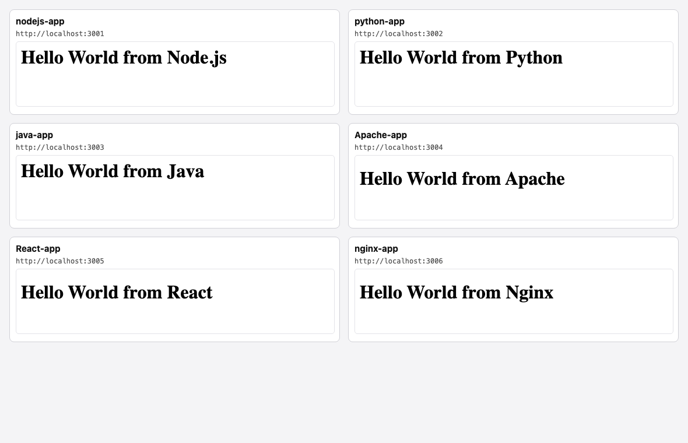
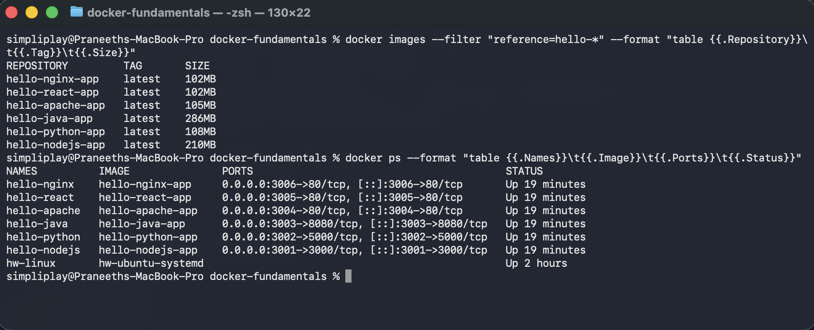
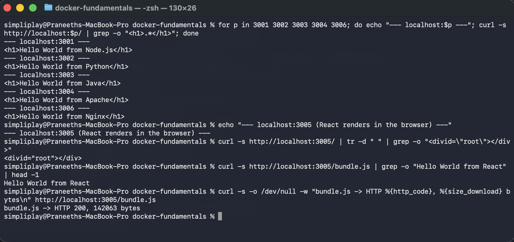

# Docker Fundamentals — Hello World applications

Six Hello World web applications, each in its own folder with its own Dockerfile, built and run
as containers on an Apple Silicon Mac (Docker 29.6.2, `aarch64`).

| Folder | Stack | Image | Host port | Container port |
|---|---|---|---|---|
| `nodejs-app` | Node.js 20 + Express | `hello-nodejs-app` | 3001 | 3000 |
| `python-app` | Python 3.12 + Flask | `hello-python-app` | 3002 | 5000 |
| `java-app` | Java 21 (multi-stage) | `hello-java-app` | 3003 | 8080 |
| `Apache-app` | Apache httpd 2.4 | `hello-apache-app` | 3004 | 80 |
| `React-app` | React 18 (multi-stage) | `hello-react-app` | 3005 | 80 |
| `nginx-app` | Nginx | `hello-nginx-app` | 3006 | 80 |

Each app got a different host port so all six can run at once and be checked side by side.

## All six running in a browser



Every panel is a live request to a different container. This is the actual proof for the
"verify Hello World is displayed on a webpage" requirement — particularly for React, which is
explained below.

## Build and run

```bash
# build all six
for a in nodejs-app python-app java-app Apache-app React-app nginx-app; do
  docker build -t "hello-$(echo $a | tr 'A-Z' 'a-z')" "$a"
done

# run all six on separate host ports
docker run -d --name hello-nodejs -p 3001:3000 hello-nodejs-app
docker run -d --name hello-python -p 3002:5000 hello-python-app
docker run -d --name hello-java   -p 3003:8080 hello-java-app
docker run -d --name hello-apache -p 3004:80   hello-apache-app
docker run -d --name hello-react  -p 3005:80   hello-react-app
docker run -d --name hello-nginx  -p 3006:80   hello-nginx-app
```

```
simpliplay@Praneeths-MacBook-Pro docker-fundamentals % docker images --filter "reference=hello-*" --format "table {{.Repository}}\t{{.Tag}}\t{{.Size}}"
REPOSITORY         TAG       SIZE
hello-nginx-app    latest    102MB
hello-react-app    latest    102MB
hello-apache-app   latest    105MB
hello-java-app     latest    286MB
hello-python-app   latest    108MB
hello-nodejs-app   latest    210MB
simpliplay@Praneeths-MacBook-Pro docker-fundamentals % docker ps --format "table {{.Names}}\t{{.Image}}\t{{.Ports}}\t{{.Status}}"
NAMES          IMAGE               PORTS                                         STATUS
hello-nginx    hello-nginx-app     0.0.0.0:3006->80/tcp, [::]:3006->80/tcp       Up 19 minutes
hello-react    hello-react-app     0.0.0.0:3005->80/tcp, [::]:3005->80/tcp       Up 19 minutes
hello-apache   hello-apache-app    0.0.0.0:3004->80/tcp, [::]:3004->80/tcp       Up 19 minutes
hello-java     hello-java-app      0.0.0.0:3003->8080/tcp, [::]:3003->8080/tcp   Up 19 minutes
hello-python   hello-python-app    0.0.0.0:3002->5000/tcp, [::]:3002->5000/tcp   Up 19 minutes
hello-nodejs   hello-nodejs-app    0.0.0.0:3001->3000/tcp, [::]:3001->3000/tcp   Up 19 minutes
hw-linux       hw-ubuntu-systemd                                                 Up 2 hours
simpliplay@Praneeths-MacBook-Pro docker-fundamentals %
```



`docker ps` confirms all six are `Up` with their port mappings. (`hw-linux` in that list is an
unrelated container used for the earlier Linux assignments.)

## Verifying each one responds

```
simpliplay@Praneeths-MacBook-Pro docker-fundamentals % for p in 3001 3002 3003 3004 3006; do echo "--- localhost:$p ---"; curl -s http://localhost:$p/ | grep -o "<h1>.*</h1>"; done
--- localhost:3001 ---
<h1>Hello World from Node.js</h1>
--- localhost:3002 ---
<h1>Hello World from Python</h1>
--- localhost:3003 ---
<h1>Hello World from Java</h1>
--- localhost:3004 ---
<h1>Hello World from Apache</h1>
--- localhost:3006 ---
<h1>Hello World from Nginx</h1>
simpliplay@Praneeths-MacBook-Pro docker-fundamentals % echo "--- localhost:3005 (React renders in the browser) ---"
--- localhost:3005 (React renders in the browser) ---
simpliplay@Praneeths-MacBook-Pro docker-fundamentals % curl -s http://localhost:3005/ | tr -d " " | grep -o "<divid=\"root\"></div>"
<divid="root"></div>
simpliplay@Praneeths-MacBook-Pro docker-fundamentals % curl -s http://localhost:3005/bundle.js | grep -o "Hello World from React" | head -1
Hello World from React
simpliplay@Praneeths-MacBook-Pro docker-fundamentals % curl -s -o /dev/null -w "bundle.js -> HTTP %{http_code}, %{size_download} bytes\n" http://localhost:3005/bundle.js
bundle.js -> HTTP 200, 142063 bytes
simpliplay@Praneeths-MacBook-Pro docker-fundamentals %
```



Five of the six return the `<h1>` directly. **React does not, and that is correct** — see the
React section.

---

## 1. `nodejs-app` — Node.js + Express

`server.js`:

```javascript
const express = require('express');

const app = express();
const PORT = process.env.PORT || 3000;

app.get('/', (req, res) => {
  res.send('<h1>Hello World from Node.js</h1>');
});

app.listen(PORT, '0.0.0.0', () => {
  console.log(`Node.js app listening on port ${PORT}`);
});
```

`Dockerfile`:

```dockerfile
FROM node:20-alpine

WORKDIR /app

# copy the manifest first so `npm install` is cached unless deps change
COPY package.json ./
RUN npm install --omit=dev

COPY server.js ./

EXPOSE 3000
CMD ["node", "server.js"]
```

The `COPY package.json` before `COPY server.js` is deliberate. Docker caches each layer, so
copying the manifest and running `npm install` first means editing `server.js` does not
re-install dependencies — only the last, cheap layer is rebuilt. Copying everything at once
would invalidate the install on every source change.

`app.listen(PORT, '0.0.0.0')` also matters: binding to `127.0.0.1` inside a container would make
it unreachable from the host even with `-p`, because the published port forwards to the
container's external interface, not its loopback.

## 2. `python-app` — Python + Flask

`app.py`:

```python
from flask import Flask

app = Flask(__name__)


@app.route("/")
def hello():
    return "<h1>Hello World from Python</h1>"


if __name__ == "__main__":
    app.run(host="0.0.0.0", port=5000)
```

`Dockerfile`:

```dockerfile
FROM python:3.12-alpine

WORKDIR /app

COPY requirements.txt ./
RUN pip install --no-cache-dir -r requirements.txt

COPY app.py ./

EXPOSE 5000
CMD ["python", "app.py"]
```

`--no-cache-dir` keeps pip from leaving its download cache in the image layer, which is dead
weight in a final image. Same `0.0.0.0` reasoning as the Node app.

## 3. `java-app` — Java 21, multi-stage

`HelloWorld.java` uses the JDK's built-in `com.sun.net.httpserver`, so there is no Maven or
Gradle and no external dependency to download:

```java
import com.sun.net.httpserver.HttpExchange;
import com.sun.net.httpserver.HttpServer;

import java.io.IOException;
import java.io.OutputStream;
import java.net.InetSocketAddress;

public class HelloWorld {

    private static final String BODY = "<h1>Hello World from Java</h1>";

    public static void main(String[] args) throws IOException {
        int port = 8080;
        HttpServer server = HttpServer.create(new InetSocketAddress("0.0.0.0", port), 0);
        server.createContext("/", HelloWorld::handle);
        server.setExecutor(null);
        server.start();
        System.out.println("Java app listening on port " + port);
    }

    private static void handle(HttpExchange exchange) throws IOException {
        byte[] bytes = BODY.getBytes("UTF-8");
        exchange.getResponseHeaders().set("Content-Type", "text/html; charset=utf-8");
        exchange.sendResponseHeaders(200, bytes.length);
        try (OutputStream out = exchange.getResponseBody()) {
            out.write(bytes);
        }
    }
}
```

`Dockerfile`:

```dockerfile
# ---- build stage: needs the full JDK to compile ----
FROM eclipse-temurin:21-jdk-alpine AS build

WORKDIR /src
COPY HelloWorld.java ./
RUN javac -d /out HelloWorld.java

# ---- run stage: only needs the JRE, so the JDK is left behind ----
FROM eclipse-temurin:21-jre-alpine

WORKDIR /app
COPY --from=build /out ./

EXPOSE 8080
CMD ["java", "HelloWorld"]
```

Java needs the **JDK** to compile and only the **JRE** to run, which is exactly what
multi-stage builds are for. The first stage compiles `.java` to `.class`; the second starts from
a clean JRE image and copies in only the compiled output. The compiler, its sources and the
`.java` file never reach the final image.

## 4. `Apache-app` — Apache httpd

```html
<!doctype html>
<html lang="en">
  <head>
    <meta charset="utf-8" />
    <title>Apache Hello World</title>
  </head>
  <body>
    <h1>Hello World from Apache</h1>
  </body>
</html>
```

```dockerfile
FROM httpd:2.4-alpine

# httpd serves whatever is in this directory
COPY index.html /usr/local/apache2/htdocs/index.html

EXPOSE 80
```

The official `httpd` image already runs the server; all it needs is content in its document
root, `/usr/local/apache2/htdocs`. There is no `CMD` because the base image's own command is
already right — overriding it would only risk breaking it.

## 5. `React-app` — React 18, multi-stage

`src/main.jsx` — real JSX, compiled at build time:

```jsx
import React from "react";
import { createRoot } from "react-dom/client";

function App() {
  return <h1>Hello World from React</h1>;
}

createRoot(document.getElementById("root")).render(<App />);
```

`package.json`:

```json
{
  "name": "react-hello",
  "version": "1.0.0",
  "private": true,
  "scripts": {
    "build": "esbuild src/main.jsx --bundle --minify --outfile=dist/bundle.js"
  },
  "dependencies": {
    "react": "^18.3.1",
    "react-dom": "^18.3.1"
  },
  "devDependencies": {
    "esbuild": "^0.23.1"
  }
}
```

`Dockerfile`:

```dockerfile
# ---- build stage: Node compiles the JSX into a static bundle ----
FROM node:20-alpine AS build

WORKDIR /app
COPY package.json ./
RUN npm install

COPY index.html ./
COPY src ./src
RUN npm run build

# ---- run stage: only the built static files ship, no Node ----
FROM nginx:alpine

COPY --from=build /app/dist/bundle.js /usr/share/nginx/html/bundle.js
COPY --from=build /app/index.html     /usr/share/nginx/html/index.html

EXPOSE 80
```

### Why `curl` shows no "Hello World" here

This is the most interesting result of the assignment. `curl http://localhost:3005/` returns:

```html
<div id="root"></div>
<script src="bundle.js"></script>
```

There is no "Hello World" in the HTML at all. React is a **client-side** framework: the server
sends an empty container plus JavaScript, and the browser builds the DOM. The text only exists
after the bundle runs, which is why the browser screenshot above is the real verification and
`curl` on the page is not.

The text *is* in the shipped JavaScript, which the verification block confirms:

```
Hello World from React
bundle.js -> HTTP 200, 142063 bytes
```

142 KB is React plus React DOM plus the app, bundled and minified — it is a genuine React build,
not a hand-written `<h1>`.

The build is multi-stage for the same reason as Java: Node and the whole `node_modules` tree are
needed to compile JSX, but nothing needs them at run time. The final image is nginx serving two
static files — 102 MB, the same as the plain nginx app, versus 210 MB for the Node app that has
to keep its runtime.

## 6. `nginx-app` — Nginx

```dockerfile
FROM nginx:alpine

COPY index.html /usr/share/nginx/html/index.html

EXPOSE 80
```

The simplest of the six: copy an `index.html` into `/usr/share/nginx/html`. Worth contrasting
with Apache — same job, different document root (`/usr/share/nginx/html` vs
`/usr/local/apache2/htdocs`), which is the kind of detail that has to be looked up per image
rather than guessed.

---

## What I took from this

- **`EXPOSE` documents, it does not publish.** It records which port the image expects to serve
  on; `-p 3001:3000` is what actually forwards a host port. Leaving out `-p` means nothing is
  reachable no matter what `EXPOSE` says.
- **Bind to `0.0.0.0`, not `127.0.0.1`.** Inside a container, loopback means the container's own
  loopback, which the host cannot reach.
- **Layer order is cache strategy.** Copy dependency manifests and install before copying source,
  so source edits do not trigger a reinstall.
- **Multi-stage builds pay off when build tooling is heavy.** The Java and React images both drop
  their compilers: React ends at 102 MB serving static files, while the Node app that needs its
  runtime is 210 MB and the Java image is 286 MB even after discarding the JDK.
- **Static and client-rendered apps need different verification.** For five apps `curl` is
  sufficient proof; for React only a browser is, because the HTML is empty by design.
