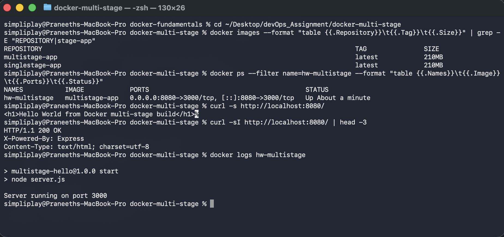
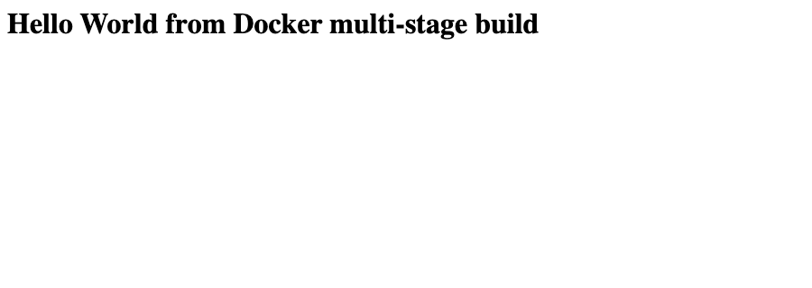
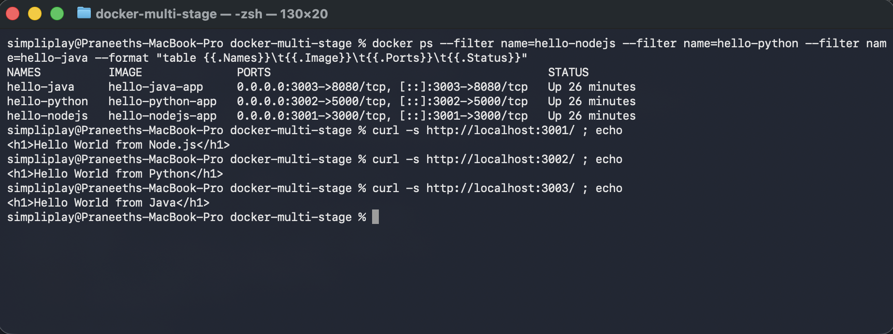

# Docker Multi-Stage Build

**Name:** Praneeth Budati
**Enrollment number:** 24bcs10081
**Email:** praneeth.24bcs10081@sst.scaler.com

---

## Task 1 — Build and run the multi-stage Dockerfile

A two-stage Node.js + Express application. The app listens on **3000** inside the container and
is published on **port 8080** on the host, which is what the task asks for.

`server.js`:

```javascript
const express = require("express");

const app = express();
const PORT = process.env.PORT || 3000;

app.get("/", (req, res) => {
  res.send("<h1>Hello World from Docker multi-stage build</h1>");
});

app.listen(PORT, "0.0.0.0", () => {
  console.log(`Server running on port ${PORT}`);
});
```

`Dockerfile`:

```dockerfile
# ---------- Stage 1: build ----------
# Installs every dependency, including anything needed only to build.
FROM node:20-alpine AS builder

WORKDIR /app
COPY package.json ./
RUN npm install
COPY server.js ./

# ---------- Stage 2: production ----------
# Starts from a clean base and takes only what is needed to run.
FROM node:20-alpine AS production

WORKDIR /app
COPY --from=builder /app/package.json ./
RUN npm install --omit=dev
COPY --from=builder /app/server.js ./

EXPOSE 3000
CMD ["npm", "start"]
```

### Build and run

```bash
docker build -t multistage-app .
docker run -d --name hw-multistage -p 8080:3000 multistage-app
```

### The application running on port 8080

```
simpliplay@Praneeths-MacBook-Pro docker-fundamentals % cd ~/Desktop/devOps_Assignment/docker-multi-stage
simpliplay@Praneeths-MacBook-Pro docker-multi-stage % docker images --format "table {{.Repository}}\t{{.Tag}}\t{{.Size}}" | grep -E "REPOSITORY|stage-app"
REPOSITORY                                                                                  TAG               SIZE
multistage-app                                                                              latest            210MB
singlestage-app                                                                             latest            210MB
simpliplay@Praneeths-MacBook-Pro docker-multi-stage % docker ps --filter name=hw-multistage --format "table {{.Names}}\t{{.Image}}\t{{.Ports}}\t{{.Status}}"
NAMES           IMAGE            PORTS                                         STATUS
hw-multistage   multistage-app   0.0.0.0:8080->3000/tcp, [::]:8080->3000/tcp   Up About a minute
simpliplay@Praneeths-MacBook-Pro docker-multi-stage % curl -s http://localhost:8080/
<h1>Hello World from Docker multi-stage build</h1>%                                                                               simpliplay@Praneeths-MacBook-Pro docker-multi-stage % curl -sI http://localhost:8080/ | head -3
HTTP/1.1 200 OK
X-Powered-By: Express
Content-Type: text/html; charset=utf-8
simpliplay@Praneeths-MacBook-Pro docker-multi-stage % docker logs hw-multistage

> multistage-hello@1.0.0 start
> node server.js

Server running on port 3000
simpliplay@Praneeths-MacBook-Pro docker-multi-stage %
```



`docker ps` shows the container `Up` with `0.0.0.0:8080->3000/tcp`, and the response is exactly:

```html
<h1>Hello World from Docker multi-stage build</h1>
```

In a browser at `http://localhost:8080`:



`docker logs` confirms the process started and what it bound to:

```
> multistage-hello@1.0.0 start
> node server.js

Server running on port 3000
```

Worth being precise about the port: the container listens on 3000, and `-p 8080:3000` maps host
8080 to container 3000. `EXPOSE 3000` in the Dockerfile only documents the container's port — it
publishes nothing on its own. Without `-p`, port 8080 would be closed no matter what `EXPOSE`
says.

---

## Task 2 — How multi-stage actually works, and what it saved here

The Dockerfile has two `FROM` lines, so two stages:

1. **`builder`** — installs *all* dependencies and holds the source.
2. **`production`** — starts from a fresh `node:20-alpine` and pulls in only what it names with
   `COPY --from=builder`, then installs with `--omit=dev`.

The key mechanic is that only the **last** stage becomes the image. Everything the builder stage
created is discarded unless it is explicitly copied forward.

### An honest measurement

I also wrote `Dockerfile.single-stage`, identical except that it does everything in one stage, to
measure the difference:

```dockerfile
# Single-stage equivalent, kept only to compare image size against the
# multi-stage build. Everything installed here stays in the final image.
FROM node:20-alpine

WORKDIR /app
COPY package.json ./
RUN npm install
COPY server.js ./

EXPOSE 3000
CMD ["npm", "start"]
```

```
REPOSITORY        TAG       SIZE
multistage-app    latest    210MB
singlestage-app   latest    210MB
```

**They are the same size — the multi-stage build saved nothing here.** That is not a mistake in
the Dockerfile; it is what should happen for *this* app, and it is the most useful thing I learned
from the task.

Multi-stage only shrinks an image when the build stage produces something the run stage does not
need. This app has no `devDependencies` and no compile step: `npm install` and
`npm install --omit=dev` fetch the same single package, and Express is needed at run time
anyway. There is nothing to leave behind, so both images carry the same Node runtime plus the same
`node_modules`.

Where it does pay off is when the toolchain is genuinely build-only. Two examples from the
`docker-fundamentals` assignment in this repo:

| Image | Pattern | Size | What the final image drops |
|---|---|---|---|
| `hello-react-app` | node build → nginx serve | **102MB** | Node, npm, `node_modules`, esbuild — final image is nginx + two static files |
| `hello-nodejs-app` | single stage | 210MB | nothing; the Node runtime is required |
| `hello-java-app` | JDK compile → JRE run | 286MB | the JDK and the `.java` source; only `.class` files ship |

React is the clean demonstration: 102MB versus 210MB, because a compiled front-end needs no
JavaScript runtime once it is built. So the rule I take away is that multi-stage is worth reaching
for when a **compiler or dev toolchain** is involved, and is mostly ceremony for an interpreted
app whose dependencies are all needed at run time.

The pattern is still worth keeping in this Dockerfile for a second reason beyond size: the
production stage never contains the source tree or the full dependency set, only the two files
copied forward. That is a smaller surface area even when the byte count is unchanged.

---

## Task 3 — Three different application types deployed

Three stacks running as containers at the same time, each built from its own Dockerfile in
`docker-fundamentals/`:

| Type | Image | Host port | Container port |
|---|---|---|---|
| Node.js (Express) | `hello-nodejs-app` | 3001 | 3000 |
| Python (Flask) | `hello-python-app` | 3002 | 5000 |
| Java 21 (`com.sun.net.httpserver`) | `hello-java-app` | 3003 | 8080 |

```
simpliplay@Praneeths-MacBook-Pro docker-multi-stage % docker ps --filter name=hello-nodejs --filter name=hello-python --filter name=hello-java --format "table {{.Names}}\t{{.Image}}\t{{.Ports}}\t{{.Status}}"
NAMES          IMAGE              PORTS                                         STATUS
hello-java     hello-java-app     0.0.0.0:3003->8080/tcp, [::]:3003->8080/tcp   Up 26 minutes
hello-python   hello-python-app   0.0.0.0:3002->5000/tcp, [::]:3002->5000/tcp   Up 26 minutes
hello-nodejs   hello-nodejs-app   0.0.0.0:3001->3000/tcp, [::]:3001->3000/tcp   Up 26 minutes
simpliplay@Praneeths-MacBook-Pro docker-multi-stage % curl -s http://localhost:3001/ ; echo
<h1>Hello World from Node.js</h1>
simpliplay@Praneeths-MacBook-Pro docker-multi-stage % curl -s http://localhost:3002/ ; echo
<h1>Hello World from Python</h1>
simpliplay@Praneeths-MacBook-Pro docker-multi-stage % curl -s http://localhost:3003/ ; echo
<h1>Hello World from Java</h1>
simpliplay@Praneeths-MacBook-Pro docker-multi-stage %
```



All three are `Up` and each returns its own response. Note the three different container ports
(3000, 5000, 8080) mapped to three different host ports — the container port is whatever the
framework defaults to, and the host port is chosen to avoid collisions.

---

## Summary

| Requirement | Evidence |
|---|---|
| Multi-stage Dockerfile built | `Dockerfile`, two `FROM` stages, `docker build -t multistage-app .` |
| Container running | `docker ps` shows `hw-multistage` `Up` |
| Application accessible | `curl` and browser both return the Hello World heading |
| Running on port 8080 | `0.0.0.0:8080->3000/tcp` in `docker ps` |
| Name and enrollment number | at the top of this file |
| Three app types deployed | Node.js, Python and Java containers, all `Up` with responses |
