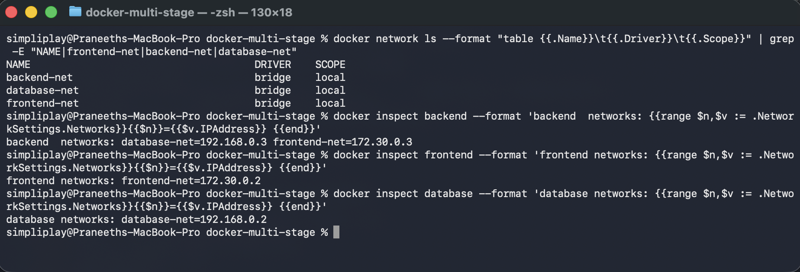
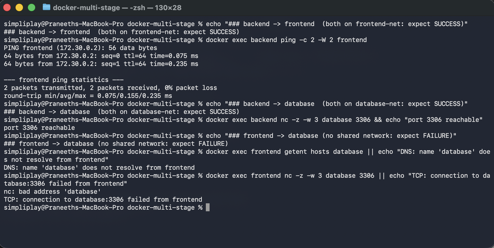
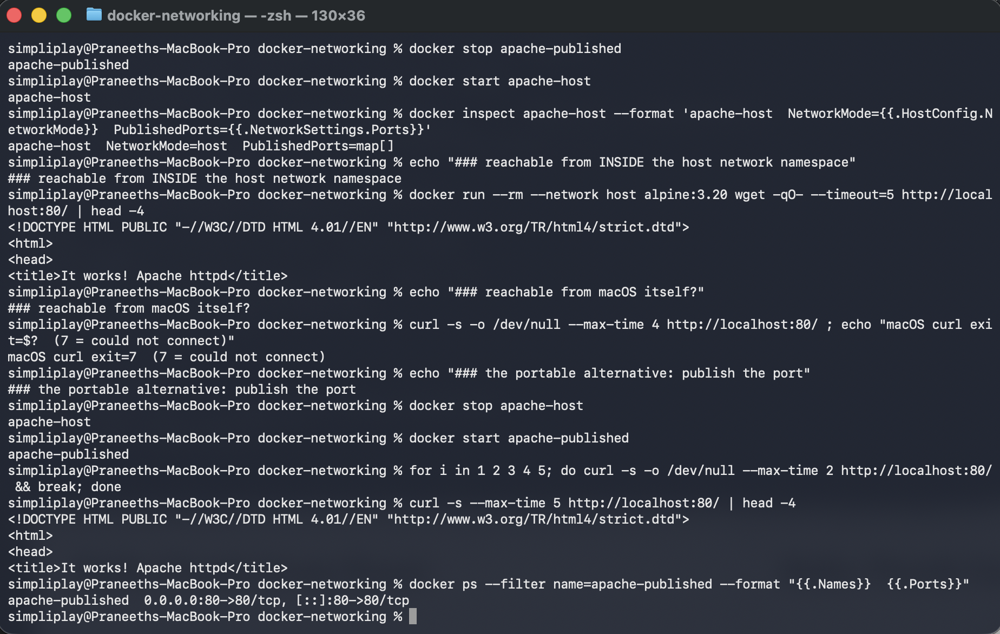
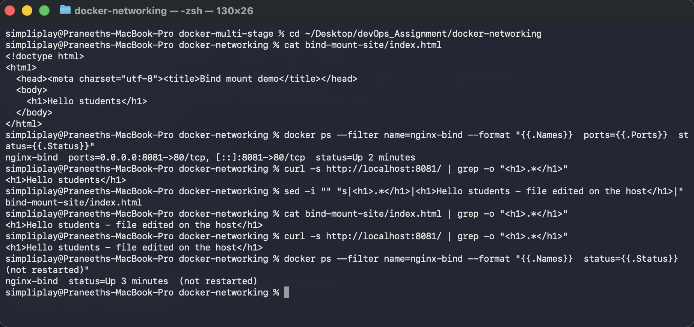
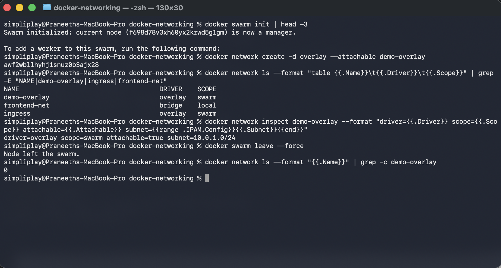

# Docker Networking and Volumes

Four tasks run against Docker 29.6.2 on an Apple Silicon Mac. Every block below is real
terminal output, paired with the screenshot from the same run.

---

## Task 1 — Container networking across three networks

Three containers and three user-defined bridge networks, with the backend deliberately attached
to two of them:

| Container | Image | Networks |
|---|---|---|
| `frontend` | `nginx:alpine` | `frontend-net` |
| `backend` | `alpine:3.20` | `frontend-net` **and** `database-net` |
| `database` | `mysql:8` | `database-net` |

`backend-net` was also created, to show a network can exist with nothing attached.

```bash
docker network create frontend-net
docker network create backend-net
docker network create database-net

docker run -d --name frontend --network frontend-net nginx:alpine
docker run -d --name database --network database-net -e MYSQL_ROOT_PASSWORD=hwpass123 mysql:8
docker run -d --name backend  --network frontend-net alpine:3.20 sleep 3600

# a container can only be given one --network at run time; add the second afterwards
docker network connect database-net backend
```

```
simpliplay@Praneeths-MacBook-Pro docker-multi-stage % docker network ls --format "table {{.Name}}\t{{.Driver}}\t{{.Scope}}" | grep -E "NAME|frontend-net|backend-net|database-net"
NAME                                     DRIVER    SCOPE
backend-net                              bridge    local
database-net                             bridge    local
frontend-net                             bridge    local
simpliplay@Praneeths-MacBook-Pro docker-multi-stage % docker inspect backend --format 'backend  networks: {{range $n,$v := .NetworkSettings.Networks}}{{$n}}={{$v.IPAddress}} {{end}}'
backend  networks: database-net=192.168.0.3 frontend-net=172.30.0.3 
simpliplay@Praneeths-MacBook-Pro docker-multi-stage % docker inspect frontend --format 'frontend networks: {{range $n,$v := .NetworkSettings.Networks}}{{$n}}={{$v.IPAddress}} {{end}}'
frontend networks: frontend-net=172.30.0.2 
simpliplay@Praneeths-MacBook-Pro docker-multi-stage % docker inspect database --format 'database networks: {{range $n,$v := .NetworkSettings.Networks}}{{$n}}={{$v.IPAddress}} {{end}}'
database networks: database-net=192.168.0.2 
simpliplay@Praneeths-MacBook-Pro docker-multi-stage %
```



The backend has **two IP addresses**, one per network — `192.168.0.3` on `database-net` and
`172.30.0.3` on `frontend-net`. Each network is its own subnet, allocated independently by
Docker.

### Connectivity between the containers

```
simpliplay@Praneeths-MacBook-Pro docker-multi-stage % echo "### backend -> frontend  (both on frontend-net: expect SUCCESS)"
### backend -> frontend  (both on frontend-net: expect SUCCESS)
simpliplay@Praneeths-MacBook-Pro docker-multi-stage % docker exec backend ping -c 2 -W 2 frontend
PING frontend (172.30.0.2): 56 data bytes
64 bytes from 172.30.0.2: seq=0 ttl=64 time=0.075 ms
64 bytes from 172.30.0.2: seq=1 ttl=64 time=0.235 ms

--- frontend ping statistics ---
2 packets transmitted, 2 packets received, 0% packet loss
round-trip min/avg/max = 0.075/0.155/0.235 ms
simpliplay@Praneeths-MacBook-Pro docker-multi-stage % echo "### backend -> database  (both on database-net: expect SUCCESS)"
### backend -> database  (both on database-net: expect SUCCESS)
simpliplay@Praneeths-MacBook-Pro docker-multi-stage % docker exec backend nc -z -w 3 database 3306 && echo "port 3306 reachable"
port 3306 reachable
simpliplay@Praneeths-MacBook-Pro docker-multi-stage % echo "### frontend -> database (no shared network: expect FAILURE)"
### frontend -> database (no shared network: expect FAILURE)
simpliplay@Praneeths-MacBook-Pro docker-multi-stage % docker exec frontend getent hosts database || echo "DNS: name 'database' does not resolve from frontend"
DNS: name 'database' does not resolve from frontend
simpliplay@Praneeths-MacBook-Pro docker-multi-stage % docker exec frontend nc -z -w 3 database 3306 || echo "TCP: connection to database:3306 failed from frontend"
nc: bad address 'database'
TCP: connection to database:3306 failed from frontend
simpliplay@Praneeths-MacBook-Pro docker-multi-stage %
```



Three tests, and the third is the point of the exercise:

| From → to | Shared network | Result |
|---|---|---|
| `backend` → `frontend` | `frontend-net` | ping succeeds, 0% loss |
| `backend` → `database` | `database-net` | TCP 3306 reachable |
| `frontend` → `database` | **none** | name does not resolve, connection fails |

**What I understood.** On a user-defined bridge network Docker runs an embedded DNS server, so
containers reach each other by **container name** — `ping frontend` works without knowing any IP.
That resolution is scoped to the network: from `frontend`, the name `database` does not resolve
at all (`getent hosts database` returns nothing, and `nc` reports `bad address 'database'`).

So the isolation is not a firewall rule that blocks traffic — the name simply does not exist in
that container's DNS view, and there is no route to the other subnet either. The backend works as
a bridge between the two tiers precisely because it is a member of both, which is the standard
way to keep a database off the front-end network while still letting the application talk to it.

Worth noting: `docker run` accepts only one `--network`, so the second attachment needs
`docker network connect` afterwards.

---

## Task 2 — Host network

```bash
docker pull httpd:2.4
docker run -d --name apache-host --network host httpd:2.4
```

```
simpliplay@Praneeths-MacBook-Pro docker-networking % docker stop apache-published
apache-published
simpliplay@Praneeths-MacBook-Pro docker-networking % docker start apache-host
apache-host
simpliplay@Praneeths-MacBook-Pro docker-networking % docker inspect apache-host --format 'apache-host  NetworkMode={{.HostConfig.NetworkMode}}  PublishedPorts={{.NetworkSettings.Ports}}'
apache-host  NetworkMode=host  PublishedPorts=map[]
simpliplay@Praneeths-MacBook-Pro docker-networking % echo "### reachable from INSIDE the host network namespace"
### reachable from INSIDE the host network namespace
simpliplay@Praneeths-MacBook-Pro docker-networking % docker run --rm --network host alpine:3.20 wget -qO- --timeout=5 http://localhost:80/ | head -4
<!DOCTYPE HTML PUBLIC "-//W3C//DTD HTML 4.01//EN" "http://www.w3.org/TR/html4/strict.dtd">
<html>
<head>
<title>It works! Apache httpd</title>
simpliplay@Praneeths-MacBook-Pro docker-networking % echo "### reachable from macOS itself?"
### reachable from macOS itself?
simpliplay@Praneeths-MacBook-Pro docker-networking % curl -s -o /dev/null --max-time 4 http://localhost:80/ ; echo "macOS curl exit=$?  (7 = could not connect)"
macOS curl exit=7  (7 = could not connect)
simpliplay@Praneeths-MacBook-Pro docker-networking % echo "### the portable alternative: publish the port"
### the portable alternative: publish the port
simpliplay@Praneeths-MacBook-Pro docker-networking % docker stop apache-host
apache-host
simpliplay@Praneeths-MacBook-Pro docker-networking % docker start apache-published
apache-published
simpliplay@Praneeths-MacBook-Pro docker-networking % for i in 1 2 3 4 5; do curl -s -o /dev/null --max-time 2 http://localhost:80/ && break; done
simpliplay@Praneeths-MacBook-Pro docker-networking % curl -s --max-time 5 http://localhost:80/ | head -4
<!DOCTYPE HTML PUBLIC "-//W3C//DTD HTML 4.01//EN" "http://www.w3.org/TR/html4/strict.dtd">
<html>
<head>
<title>It works! Apache httpd</title>
simpliplay@Praneeths-MacBook-Pro docker-networking % docker ps --filter name=apache-published --format "{{.Names}}  {{.Ports}}"
apache-published  0.0.0.0:80->80/tcp, [::]:80->80/tcp
simpliplay@Praneeths-MacBook-Pro docker-networking %
```



`docker inspect` shows `NetworkMode=host` and, importantly, `PublishedPorts=map[]` — a
host-network container has no port mappings because it is not isolated in the first place. It
binds directly in the host's network namespace.

And Apache **is** serving on port 80: another container started with `--network host` fetches
`It works! Apache httpd` from `localhost:80`, because it shares that same namespace.

### The honest result: macOS cannot reach it

```
macOS curl exit=7  (7 = could not connect)
```

`--network host` is a Linux feature, and on Docker Desktop the "host" is the **Linux VM** that
Docker runs inside, not macOS. Apache bound port 80 of the VM, which is not the Mac's port 80, so
nothing is reachable from the Mac's browser. (Docker Desktop has an opt-in host-networking
feature that bridges this; it is not enabled here.)

Two things confirm the container really did take the VM's port 80 rather than failing silently:

1. The in-namespace fetch above returns Apache's page.
2. While `apache-host` was running, starting a second container with `-p 80:80` failed with
   `failed to bind host port 0.0.0.0:80/tcp: address already in use` — the host-mode container
   was genuinely holding it.

### The portable equivalent

Stopping the host-mode container and publishing the port instead makes it reachable from macOS:

```bash
docker run -d --name apache-published -p 80:80 httpd:2.4
```

That returns `It works! Apache httpd` from the Mac, with `0.0.0.0:80->80/tcp` in `docker ps`.

**What I understood.** Host networking removes the network namespace entirely: no NAT, no
port mapping, slightly less overhead, and the container can use any host port. The costs are that
it only works on Linux hosts, two containers cannot both bind the same port, and you lose the
isolation that makes published ports explicit. On a Mac it is effectively unusable for reaching a
service from the desktop, and `-p` is the right choice.

---

## Task 3 — Bind mount

```bash
mkdir bind-mount-site   # contains index.html with "Hello students"

docker run -d --name nginx-bind -p 8081:80 \
  -v ~/Desktop/devOps_Assignment/docker-networking/bind-mount-site:/usr/share/nginx/html:ro \
  nginx:alpine
```

```
simpliplay@Praneeths-MacBook-Pro docker-multi-stage % cd ~/Desktop/devOps_Assignment/docker-networking
simpliplay@Praneeths-MacBook-Pro docker-networking % cat bind-mount-site/index.html
<!doctype html>
<html>
  <head><meta charset="utf-8"><title>Bind mount demo</title></head>
  <body>
    <h1>Hello students</h1>
  </body>
</html>
simpliplay@Praneeths-MacBook-Pro docker-networking % docker ps --filter name=nginx-bind --format "{{.Names}}  ports={{.Ports}}  status={{.Status}}"
nginx-bind  ports=0.0.0.0:8081->80/tcp, [::]:8081->80/tcp  status=Up 2 minutes
simpliplay@Praneeths-MacBook-Pro docker-networking % curl -s http://localhost:8081/ | grep -o "<h1>.*</h1>"
<h1>Hello students</h1>
simpliplay@Praneeths-MacBook-Pro docker-networking % sed -i "" "s|<h1>.*</h1>|<h1>Hello students - file edited on the host</h1>|" bind-mount-site/index.html
simpliplay@Praneeths-MacBook-Pro docker-networking % cat bind-mount-site/index.html | grep -o "<h1>.*</h1>"
<h1>Hello students - file edited on the host</h1>
simpliplay@Praneeths-MacBook-Pro docker-networking % curl -s http://localhost:8081/ | grep -o "<h1>.*</h1>"
<h1>Hello students - file edited on the host</h1>
simpliplay@Praneeths-MacBook-Pro docker-networking % docker ps --filter name=nginx-bind --format "{{.Names}}  status={{.Status}}  (not restarted)"
nginx-bind  status=Up 3 minutes  (not restarted)
simpliplay@Praneeths-MacBook-Pro docker-networking %
```



In the browser at `http://localhost:8081`:


The sequence in that block is the whole demonstration:

1. `curl` returns `<h1>Hello students</h1>` — the host folder is being served.
2. `sed` edits `index.html` **on the Mac**, not inside the container.
3. `curl` immediately returns the new heading.
4. `docker ps` shows the container went from `Up 2 minutes` to `Up 3 minutes` — **the same
   container, never restarted**.

**What I understood.** A bind mount maps a host directory straight into the container, so both
sides see one set of files — there is no copy and nothing to rebuild or restart. That is why it is
the normal choice for local development, where you want an editor save to show up on refresh.

Two details worth keeping:

- I mounted it `:ro`, so the container cannot modify the files, but the **host** still can. The
  flag restricts the container's access, not mine.
- A bind mount replaces whatever was at that path in the image. `/usr/share/nginx/html` already
  had nginx's default page; after mounting, only the host folder's contents exist there.

The contrast with a named volume is that a volume is managed by Docker in its own storage area
and is the right tool for data that should outlive the container (a database's files); a bind
mount is for a specific host path you want to work in directly.

---

## Task 4 — Overlay networks

Bridge networks only connect containers on **one** Docker host. An overlay network spans
**multiple** hosts, so a container on machine A can reach a container on machine B by name as if
they shared a switch. It requires swarm mode, which provides the cluster membership and the
key-value store that keeps the network state consistent across nodes.

I created a real one to see the difference:

```bash
docker swarm init
docker network create -d overlay --attachable demo-overlay
```

```
simpliplay@Praneeths-MacBook-Pro docker-networking % docker swarm init | head -3
Swarm initialized: current node (f698d78v3xh60yx2krwd5g1gm) is now a manager.

To add a worker to this swarm, run the following command:
simpliplay@Praneeths-MacBook-Pro docker-networking % docker network create -d overlay --attachable demo-overlay
awf2wbllhyhj1snuz0b3ajx28
simpliplay@Praneeths-MacBook-Pro docker-networking % docker network ls --format "table {{.Name}}\t{{.Driver}}\t{{.Scope}}" | grep -E "NAME|demo-overlay|ingress|frontend-net"
NAME                                     DRIVER    SCOPE
demo-overlay                             overlay   swarm
frontend-net                             bridge    local
ingress                                  overlay   swarm
simpliplay@Praneeths-MacBook-Pro docker-networking % docker network inspect demo-overlay --format "driver={{.Driver}} scope={{.Scope}} attachable={{.Attachable}} subnet={{range .IPAM.Config}}{{.Subnet}}{{end}}"
driver=overlay scope=swarm attachable=true subnet=10.0.1.0/24
simpliplay@Praneeths-MacBook-Pro docker-networking % docker swarm leave --force
Node left the swarm.
simpliplay@Praneeths-MacBook-Pro docker-networking % docker network ls --format "{{.Name}}" | grep -c demo-overlay
0
simpliplay@Praneeths-MacBook-Pro docker-networking %
```



The contrast is visible in `docker network ls`:

| Network | Driver | Scope |
|---|---|---|
| `frontend-net` | `bridge` | **local** |
| `demo-overlay` | `overlay` | **swarm** |
| `ingress` | `overlay` | `swarm` |

`scope=local` means the network exists only on this daemon; `scope=swarm` means its definition is
shared across every node in the cluster. `docker swarm init` also created `ingress`
automatically — the overlay swarm uses for routing published service ports to whichever node is
running a task.

`docker swarm leave --force` removed the node from the swarm, and the overlay network went with
it (the final `grep -c` returns `0`).

### How it works

Traffic between hosts is encapsulated with **VXLAN**: an Ethernet frame from the container is
wrapped in a UDP packet (port 4789), sent across the physical network to the other host, and
unwrapped there. The containers see a flat layer-2 segment — here `10.0.1.0/24` — while the
packets actually travel over whatever routed network sits between the machines.

For this to work the hosts must be able to reach each other on:

| Port | Protocol | Purpose |
|---|---|---|
| 2377 | TCP | cluster management |
| 7946 | TCP + UDP | node-to-node discovery |
| 4789 | UDP | VXLAN data plane |

`--attachable` was needed because, by default, an overlay network only accepts swarm
*services*; that flag also lets a plain `docker run` container join, which is useful for testing.
Overlay networks also support `--opt encrypted` to IPsec-encrypt the VXLAN traffic, at some
throughput cost.

### Use cases

- A service on several machines that needs one flat network with DNS by service name.
- Scaling past a single host while keeping the same "containers talk by name" model as a bridge
  network, so application config does not change.
- Rolling deployments where a container may be rescheduled onto a different node and must remain
  reachable at the same name.

The limitation to remember is the cost: VXLAN adds encapsulation overhead and its own failure
modes (MTU problems if the underlying network cannot carry the extra ~50 bytes, and the
requirement that those three ports are open between hosts). On one machine a bridge network is
simpler and faster.

---

## Cleanup

```bash
docker rm -f frontend backend database nginx-bind apache-host apache-published
docker network rm frontend-net backend-net database-net
```
