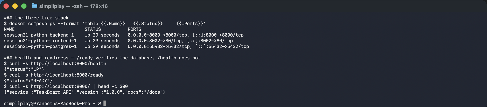
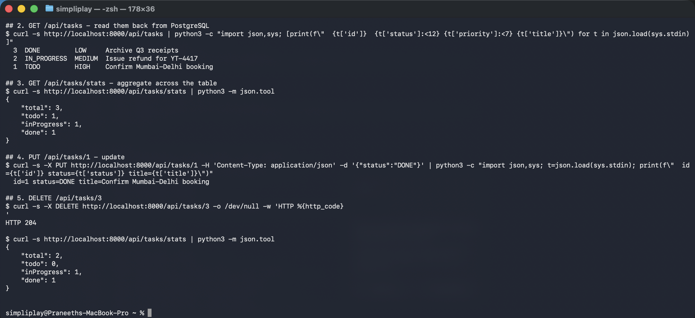
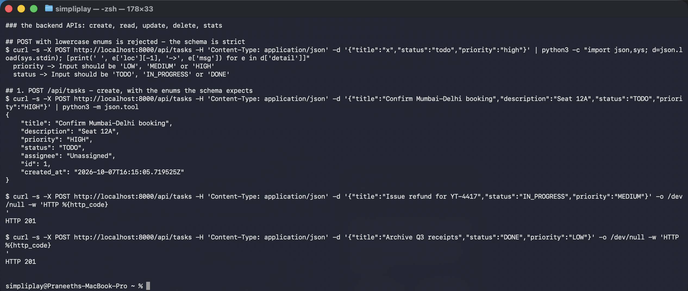
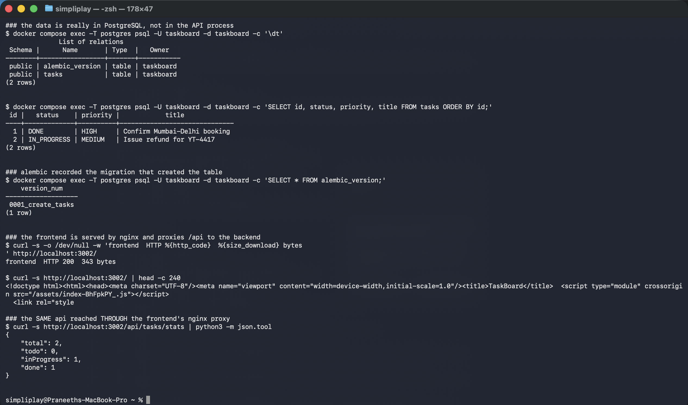

# Session 21 — Final DevOps Project: running TaskBoard

The session 21 homework: run the provided `session21-python` stack, exercise the backend
APIs, and record the evidence.

**Source:** [`Nency-Ravaliya/devops-heros`](https://github.com/Nency-Ravaliya/devops-heros)
→ `session21-python/`. The application code is the course's, not mine; this folder is the
run record.

**Environment:** Docker 29.6.2 on macOS (Apple silicon). React + Vite frontend behind
nginx, FastAPI backend, PostgreSQL 16, Alembic migrations.

```bash
git clone https://github.com/Nency-Ravaliya/devops-heros.git
cd devops-heros/session21-python
docker compose up -d --build
```

---

## 1. The stack

```
NAME                          STATUS          PORTS
session21-python-backend-1    Up 29 seconds   0.0.0.0:8000->8000/tcp
session21-python-frontend-1   Up 29 seconds   0.0.0.0:3002->80/tcp
session21-python-postgres-1   Up 29 seconds   0.0.0.0:55432->5432/tcp

### health and readiness - /ready verifies the database, /health does not
$ curl -s http://localhost:8000/health
{"status":"UP"}
$ curl -s http://localhost:8000/ready
{"status":"READY"}
$ curl -s http://localhost:8000/
{"service":"TaskBoard API","version":"1.0.0","docs":"/docs"}
```



### Why the ports differ from the README

Ports **3000** and **5432** were already bound on this machine, so the first
`docker compose up` failed:

```
Error response from daemon: ports are not available: exposing port TCP 0.0.0.0:3000
-> 127.0.0.1:0: listen tcp 0.0.0.0:3000: bind: address already in use
```

Rather than edit the course's `docker-compose.yml`, the remap is in a
`docker-compose.override.yml`, which Compose merges automatically:

```yaml
services:
  frontend:
    ports: !override
      - "3002:80"
  postgres:
    ports: !override
      - "55432:5432"
```

**`!override` is the part that matters.** A plain override **merges** sequences, so the
first attempt published *both* 3000 and 3002 and failed for the same reason as before.
`!override` replaces the list.

Only the **host** side changed. Container ports and every service-to-service address are
untouched — the backend still reaches `postgres:5432`, because Compose networking uses
service names and container ports, not published ones.

`/health` and `/ready` answering differently is the distinction from Session 13's probes:
`/health` is a liveness check that the process is up, `/ready` opens a database connection
first. A readiness probe should use the second, a liveness probe the first.

---

## 2. The backend APIs

```
## POST with lowercase enums is rejected - the schema is strict
  priority -> Input should be 'LOW', 'MEDIUM' or 'HIGH'
  status -> Input should be 'TODO', 'IN_PROGRESS' or 'DONE'

## 1. POST /api/tasks - create
{
    "title": "Confirm Mumbai-Delhi booking",
    "description": "Seat 12A",
    "priority": "HIGH",
    "status": "TODO",
    "assignee": "Unassigned",
    "id": 1,
    "created_at": "2026-10-07T16:15:05.719525Z"
}
HTTP 201
HTTP 201

## 2. GET /api/tasks - read them back
  3  DONE         LOW     Archive Q3 receipts
  2  IN_PROGRESS  MEDIUM  Issue refund for YT-4417
  1  TODO         HIGH    Confirm Mumbai-Delhi booking

## 3. GET /api/tasks/stats - aggregate
{ "total": 3, "todo": 1, "inProgress": 1, "done": 1 }

## 4. PUT /api/tasks/1 - update
  id=1 status=DONE title=Confirm Mumbai-Delhi booking

## 5. DELETE /api/tasks/3
HTTP 204
{ "total": 2, "todo": 0, "inProgress": 1, "done": 1 }
```





Five endpoints, and the responses are consistent with each other — `stats` went from
`total: 3` to `total: 2` after the delete, and the `PUT` moved one task from `todo` to
`done`, which `stats` then reflected. That cross-checking is what makes it a working
application rather than five endpoints that each return something.

**The first attempt returned 422, not 201.** Sending `"status":"todo"` and
`"priority":"high"` was rejected:
`Input should be 'TODO', 'IN_PROGRESS' or 'DONE'`. FastAPI derives request validation from
the Pydantic schema, so the enum casing is enforced at the edge and the error names the
field and the permitted values. Worth keeping in the record — it is the API behaving
correctly, and it is the kind of thing to check against `/docs` before guessing.

Note also `"assignee": "Unassigned"` on a task that never specified one: a schema default,
applied server-side.

Swagger is at `http://localhost:8000/docs`.

---

## 3. The data tier

```
### the data is really in PostgreSQL, not in the API process
$ docker compose exec postgres psql -U taskboard -d taskboard -c '\dt'
 Schema |      Name       | Type  |   Owner
--------+-----------------+-------+-----------
 public | alembic_version | table | taskboard
 public | tasks           | table | taskboard
(2 rows)

$ ... -c 'SELECT id, status, priority, title FROM tasks ORDER BY id;'
 id |   status    | priority |            title
----+-------------+----------+------------------------------
  1 | DONE        | HIGH     | Confirm Mumbai-Delhi booking
  2 | IN_PROGRESS | MEDIUM   | Issue refund for YT-4417
(2 rows)

### alembic recorded the migration that created the table
    version_num
-------------------
 0001_create_tasks
(1 row)

### the frontend is served by nginx
frontend  HTTP 200  343 bytes
<!doctype html><html><head>...<title>TaskBoard</title>
  <script type="module" crossorigin src="/assets/index-BhFpkPY_.js"></script>

### the SAME api reached THROUGH the frontend's nginx proxy
{ "total": 2, "todo": 0, "inProgress": 1, "done": 1 }
```



Three separate things confirmed here.

**The rows are in PostgreSQL.** Queried with `psql` inside the database container, which has
never spoken to the API. The row contents match what the API returned, including the `PUT`
that set task 1 to `DONE` and the `DELETE` that removed task 3 — so the writes were
persisted, not held in process memory.

**Alembic ran.** `alembic_version` holds `0001_create_tasks`, which is how the table exists
without anyone running SQL. That table is the migration state: Alembic reads it to decide
what still needs applying, which is the same idea as Terraform state in Session 18.

**The frontend proxies `/api` to the backend.** `curl http://localhost:3002/api/tasks/stats`
returned the same JSON as port 8000 — but port 3002 is **nginx**, not FastAPI. The browser
therefore never needs to know the backend's address, which is why `index.html` can call
`/api/tasks` as a relative path. The same job is done by an Ingress in Kubernetes, which is
the point the README makes about the browser not needing the internal hostname.

The HTML is a Vite production build (`/assets/index-BhFpkPY_.js`, content-hashed), served
as static files — not a dev server.

---

## What this session is, and is not

This is the **homework**: run the provided stack, exercise the APIs, record the output. Per
the session discussion, the separate **end-term project** is building an equivalent
three-tier application in a domain of your own, with the full pipeline around it — and it
has its own deadline and its own grading against
[`GRADING.md`](https://github.com/Nency-Ravaliya/devops-heros/blob/main/session21-python/GRADING.md).

The pieces this course already covered, mapped onto this stack:

| Layer | Where it was practised |
|---|---|
| Docker image, multi-stage | [Session 7](../docker-multi-stage/) |
| Compose, three tiers, one network | [Session 8](../docker-networking/) |
| Deployment, Service, probes | Sessions [10](../kubernetes-core-objects/), [11](../kubernetes-services/), [13](../kubernetes-storage-hpa-probes/) |
| ConfigMap, Secret, Ingress | [Session 12](../kubernetes-ingress-config/) |
| PVC for the database | [Session 13](../kubernetes-storage-hpa-probes/01-kubernetes-volumes/) |
| Helm packaging | [Session 15](../helm/) |
| CI/CD, image publish | [Session 16](../cicd-github-actions/) |
| SAST, SCA, secret and image scanning | [Session 17](../devsecops-pipeline/) |
| Terraform infrastructure | Sessions [18](../terraform-infrastructure-as-code/), [19](../cloud-terraform-in-action/) |
| Prometheus, Grafana, Argo CD | [Session 20](../monitoring-observability-gitops/) |

---

## Cleanup

```bash
docker compose down -v        # -v also drops the postgres volume
```
