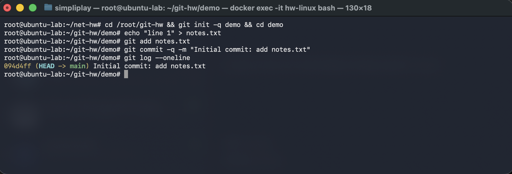
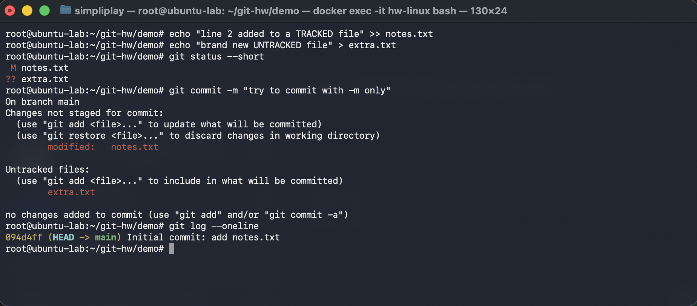
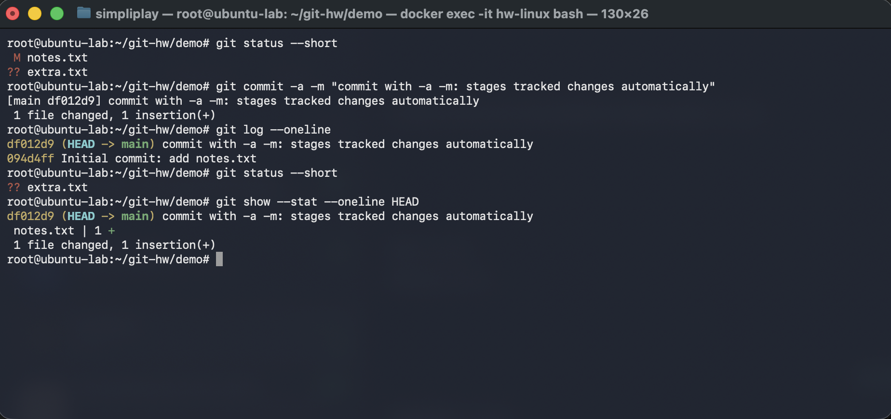
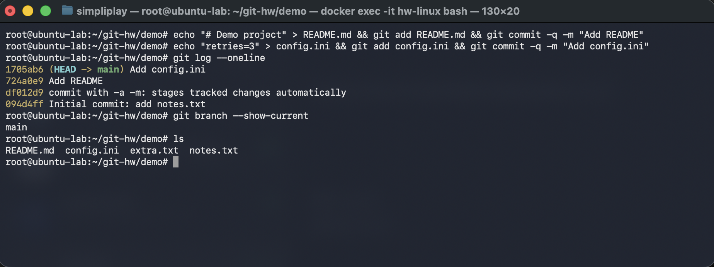
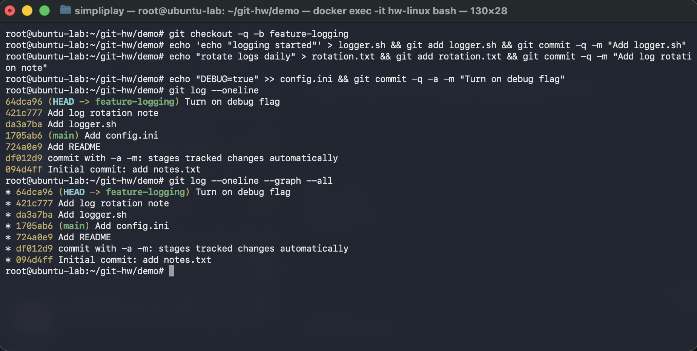
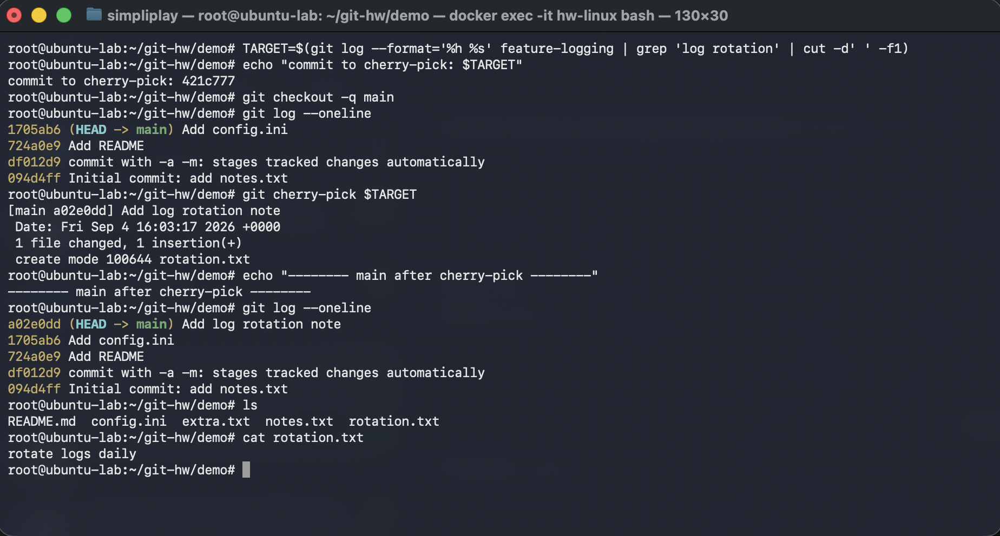
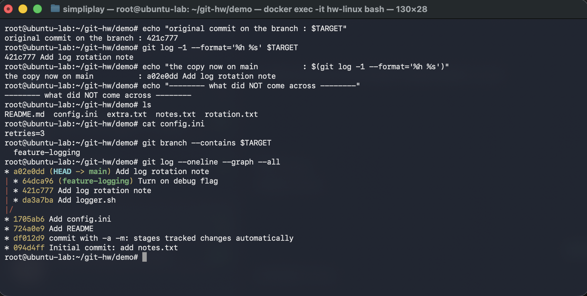

# Git and GitHub

Two tasks: the difference between `git commit -m` and `git commit -a -m`, and cherry-picking a
single commit from a branch into `main`. Everything was run in a throwaway repository inside an
Ubuntu 24.04 container, so the history is small enough to read in full at every step. The
terminal text and the screenshot in each section come from the same run.

---

## Task 1 — `git commit -m` vs `git commit -a -m`

### Setting up a repo with one commit

```
root@ubuntu-lab:~/net-hw# cd /root/git-hw && git init -q demo && cd demo
root@ubuntu-lab:~/git-hw/demo# echo "line 1" > notes.txt
root@ubuntu-lab:~/git-hw/demo# git add notes.txt
root@ubuntu-lab:~/git-hw/demo# git commit -q -m "Initial commit: add notes.txt"
root@ubuntu-lab:~/git-hw/demo# git log --oneline
094d4ff (HEAD -> main) Initial commit: add notes.txt
root@ubuntu-lab:~/git-hw/demo#
```



### The test: one tracked change and one untracked file

To tell the two commands apart you need both kinds of change present at once — a modification to
a file git already knows about, and a file git has never seen.

```
root@ubuntu-lab:~/git-hw/demo# echo "line 2 added to a TRACKED file" >> notes.txt
root@ubuntu-lab:~/git-hw/demo# echo "brand new UNTRACKED file" > extra.txt
root@ubuntu-lab:~/git-hw/demo# git status --short
 M notes.txt
?? extra.txt
root@ubuntu-lab:~/git-hw/demo# git commit -m "try to commit with -m only"
On branch main
Changes not staged for commit:
  (use "git add <file>..." to update what will be committed)
  (use "git restore <file>..." to discard changes in working directory)
	modified:   notes.txt

Untracked files:
  (use "git add <file>..." to include in what will be committed)
	extra.txt

no changes added to commit (use "git add" and/or "git commit -a")
root@ubuntu-lab:~/git-hw/demo# git log --oneline
094d4ff (HEAD -> main) Initial commit: add notes.txt
root@ubuntu-lab:~/git-hw/demo#
```



`git status --short` shows the two states in its two columns:

- ` M notes.txt` — the `M` is in the **second** column, meaning modified in the working tree but
  **not staged**.
- `?? extra.txt` — untracked; git is not following this file at all.

Then `git commit -m` **committed nothing**:

```
no changes added to commit (use "git add" and/or "git commit -a")
```

`git log` still shows a single commit. This is the point of the task: `git commit -m` only ever
commits **what is already in the index**. Nothing had been `git add`ed since the last commit, so
there was nothing to commit. The `-m` flag has nothing to do with it — it only supplies the
message inline instead of opening an editor.

### Now the same situation with `-a`

```
root@ubuntu-lab:~/git-hw/demo# git status --short
 M notes.txt
?? extra.txt
root@ubuntu-lab:~/git-hw/demo# git commit -a -m "commit with -a -m: stages tracked changes automatically"
[main df012d9] commit with -a -m: stages tracked changes automatically
 1 file changed, 1 insertion(+)
root@ubuntu-lab:~/git-hw/demo# git log --oneline
df012d9 (HEAD -> main) commit with -a -m: stages tracked changes automatically
094d4ff Initial commit: add notes.txt
root@ubuntu-lab:~/git-hw/demo# git status --short
?? extra.txt
root@ubuntu-lab:~/git-hw/demo# git show --stat --oneline HEAD
df012d9 (HEAD -> main) commit with -a -m: stages tracked changes automatically
 notes.txt | 1 +
 1 file changed, 1 insertion(+)
root@ubuntu-lab:~/git-hw/demo#
```



This time the commit succeeded — `1 file changed, 1 insertion(+)`.

The detail that matters is what happened to `extra.txt`. Look at `git status --short` *after* the
commit:

```
?? extra.txt
```

It is still untracked. `git show --stat HEAD` confirms the commit contains `notes.txt` and
nothing else.

So `-a` does **not** mean "commit everything". It means *stage every tracked file that has been
modified or deleted, then commit*. A file git has never seen is not tracked, so `-a` skips it
entirely. This is the part that is easy to get wrong: you add a new file, run
`git commit -a -m "..."`, see a successful commit, and assume the new file went in — it did not.

### Summary

| | `git commit -m "msg"` | `git commit -a -m "msg"` |
|---|---|---|
| Modified **tracked** files | only if already `git add`ed | staged automatically |
| Deleted **tracked** files | only if already staged | staged automatically |
| New **untracked** files | never | **never** — still needs `git add` |
| What it commits | exactly the index | the index plus tracked modifications |
| If nothing is staged | fails: "no changes added to commit" | commits the tracked changes |

The mental model that makes this stick: `-a` is a shortcut for
`git add -u` (update tracked files) followed by `git commit`. It is *not* `git add -A`, which
would also pick up untracked files.

---

## Task 2 — Cherry-pick

### Four commits on `main`

```
root@ubuntu-lab:~/git-hw/demo# echo "# Demo project" > README.md && git add README.md && git commit -q -m "Add README"
root@ubuntu-lab:~/git-hw/demo# echo "retries=3" > config.ini && git add config.ini && git commit -q -m "Add config.ini"
root@ubuntu-lab:~/git-hw/demo# git log --oneline
1705ab6 (HEAD -> main) Add config.ini
724a0e9 Add README
df012d9 commit with -a -m: stages tracked changes automatically
094d4ff Initial commit: add notes.txt
root@ubuntu-lab:~/git-hw/demo# git branch --show-current
main
root@ubuntu-lab:~/git-hw/demo# ls
README.md  config.ini  extra.txt  notes.txt
root@ubuntu-lab:~/git-hw/demo#
```



`main` now has four commits, the two from Task 1 plus `Add README` and `Add config.ini`. Note
`config.ini` contains just `retries=3` — that matters at the end.

### A branch with three more commits

```
root@ubuntu-lab:~/git-hw/demo# git checkout -q -b feature-logging
root@ubuntu-lab:~/git-hw/demo# echo 'echo "logging started"' > logger.sh && git add logger.sh && git commit -q -m "Add logger.sh"
root@ubuntu-lab:~/git-hw/demo# echo "rotate logs daily" > rotation.txt && git add rotation.txt && git commit -q -m "Add log rotation note"
root@ubuntu-lab:~/git-hw/demo# echo "DEBUG=true" >> config.ini && git commit -q -a -m "Turn on debug flag"
root@ubuntu-lab:~/git-hw/demo# git log --oneline
64dca96 (HEAD -> feature-logging) Turn on debug flag
421c777 Add log rotation note
da3a7ba Add logger.sh
1705ab6 (main) Add config.ini
724a0e9 Add README
df012d9 commit with -a -m: stages tracked changes automatically
094d4ff Initial commit: add notes.txt
root@ubuntu-lab:~/git-hw/demo# git log --oneline --graph --all
* 64dca96 (HEAD -> feature-logging) Turn on debug flag
* 421c777 Add log rotation note
* da3a7ba Add logger.sh
* 1705ab6 (main) Add config.ini
* 724a0e9 Add README
* df012d9 commit with -a -m: stages tracked changes automatically
* 094d4ff Initial commit: add notes.txt
root@ubuntu-lab:~/git-hw/demo#
```



`git checkout -b feature-logging` created the branch and switched to it in one step. Three
commits went on top:

| Commit | Change |
|---|---|
| `da3a7ba` | `Add logger.sh` — new file |
| `421c777` | `Add log rotation note` — new file `rotation.txt` |
| `64dca96` | `Turn on debug flag` — appends `DEBUG=true` to `config.ini` |

At this point `--graph --all` draws a straight line, because the branch is simply ahead of `main`
with nothing yet diverging.

### Picking exactly one commit into `main`

The middle commit is the one I want on `main` — not the logger, not the debug flag. I found its
hash from `git log` rather than typing it by hand, so the block is reproducible:

```bash
TARGET=$(git log --format='%h %s' feature-logging | grep 'log rotation' | cut -d' ' -f1)
```

```
root@ubuntu-lab:~/git-hw/demo# TARGET=$(git log --format='%h %s' feature-logging | grep 'log rotation' | cut -d' ' -f1)
root@ubuntu-lab:~/git-hw/demo# echo "commit to cherry-pick: $TARGET"
commit to cherry-pick: 421c777
root@ubuntu-lab:~/git-hw/demo# git checkout -q main
root@ubuntu-lab:~/git-hw/demo# git log --oneline
1705ab6 (HEAD -> main) Add config.ini
724a0e9 Add README
df012d9 commit with -a -m: stages tracked changes automatically
094d4ff Initial commit: add notes.txt
root@ubuntu-lab:~/git-hw/demo# git cherry-pick $TARGET
[main a02e0dd] Add log rotation note
 Date: Fri Sep 4 16:03:17 2026 +0000
 1 file changed, 1 insertion(+)
 create mode 100644 rotation.txt
root@ubuntu-lab:~/git-hw/demo# echo "-------- main after cherry-pick --------"
-------- main after cherry-pick --------
root@ubuntu-lab:~/git-hw/demo# git log --oneline
a02e0dd (HEAD -> main) Add log rotation note
1705ab6 Add config.ini
724a0e9 Add README
df012d9 commit with -a -m: stages tracked changes automatically
094d4ff Initial commit: add notes.txt
root@ubuntu-lab:~/git-hw/demo# ls
README.md  config.ini  extra.txt  notes.txt  rotation.txt
root@ubuntu-lab:~/git-hw/demo# cat rotation.txt
rotate logs daily
root@ubuntu-lab:~/git-hw/demo#
```



After switching back to `main` and running `git cherry-pick $TARGET`, `rotation.txt` exists on
`main` and `git log` shows the commit at the tip.

### Verifying that only that one commit came across

```
root@ubuntu-lab:~/git-hw/demo# echo "original commit on the branch : $TARGET"
original commit on the branch : 421c777
root@ubuntu-lab:~/git-hw/demo# git log -1 --format='%h %s' $TARGET
421c777 Add log rotation note
root@ubuntu-lab:~/git-hw/demo# echo "the copy now on main          : $(git log -1 --format='%h %s')"
the copy now on main          : a02e0dd Add log rotation note
root@ubuntu-lab:~/git-hw/demo# echo "-------- what did NOT come across --------"
-------- what did NOT come across --------
root@ubuntu-lab:~/git-hw/demo# ls
README.md  config.ini  extra.txt  notes.txt  rotation.txt
root@ubuntu-lab:~/git-hw/demo# cat config.ini
retries=3
root@ubuntu-lab:~/git-hw/demo# git branch --contains $TARGET
  feature-logging
root@ubuntu-lab:~/git-hw/demo# git log --oneline --graph --all
* a02e0dd (HEAD -> main) Add log rotation note
| * 64dca96 (feature-logging) Turn on debug flag
| * 421c777 Add log rotation note
| * da3a7ba Add logger.sh
|/  
* 1705ab6 Add config.ini
* 724a0e9 Add README
* df012d9 commit with -a -m: stages tracked changes automatically
* 094d4ff Initial commit: add notes.txt
root@ubuntu-lab:~/git-hw/demo#
```



Four independent checks, and this is the part that actually proves it worked:

1. **The hash changed.** The commit is `421c777` on the branch and `a02e0dd` on `main` — same
   message, same diff, different commit. Cherry-pick does not move or share a commit; it
   *replays the change* as a brand-new commit with a new parent, so it gets a new hash.
2. **`git branch --contains 421c777` lists only `feature-logging`.** The original commit is still
   exclusively on the branch. `main` has a copy, not the original.
3. **`config.ini` on `main` is still just `retries=3`.** The later branch commit that added
   `DEBUG=true` did not follow along.
4. **`ls` on `main` shows no `logger.sh`.** The earlier branch commit did not come either.

And the graph now shows the real shape:

```
* a02e0dd (HEAD -> main) Add log rotation note
| * 64dca96 (feature-logging) Turn on debug flag
| * 421c777 Add log rotation note
| * da3a7ba Add logger.sh
|/
* 1705ab6 Add config.ini
```

The two lines have genuinely diverged. `main` carries the change but not the branch's history.

### What I understood

Cherry-pick answers "I need *this one fix*, not the branch it happens to live on". A merge or
rebase would bring the whole line of development; cherry-pick takes a single commit's diff and
applies it somewhere else.

Two consequences worth remembering:

- Because it creates a new commit, the same change now exists twice in the repository under two
  hashes. If the branch is merged into `main` later, git usually recognises the duplicate patch
  and skips it, but a change that has been edited in the meantime can conflict.
- The picked commit is applied on top of a *different parent* than it was written against. It
  worked cleanly here because `rotation.txt` was a new file that nothing else touched. Had the
  commit modified a line that `main` had also changed, cherry-pick would have stopped with a
  conflict to resolve, exactly like a merge.

The typical real use is a hotfix committed on a development branch that has to reach a release
branch immediately, without dragging along everything else that branch has accumulated.
