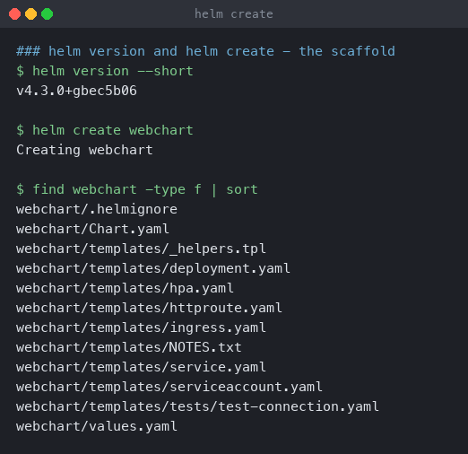
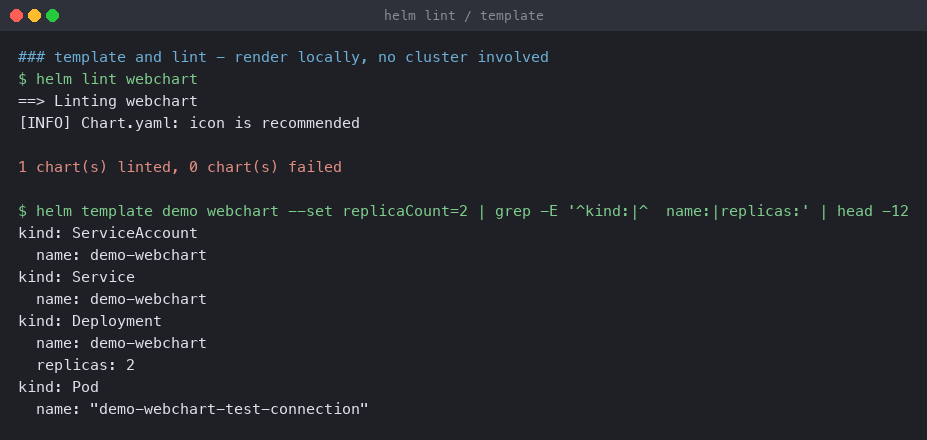
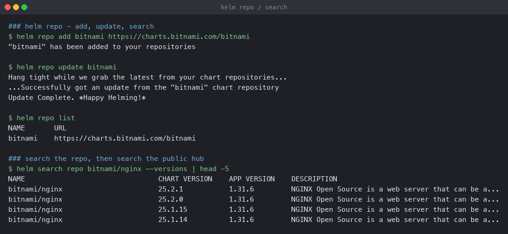
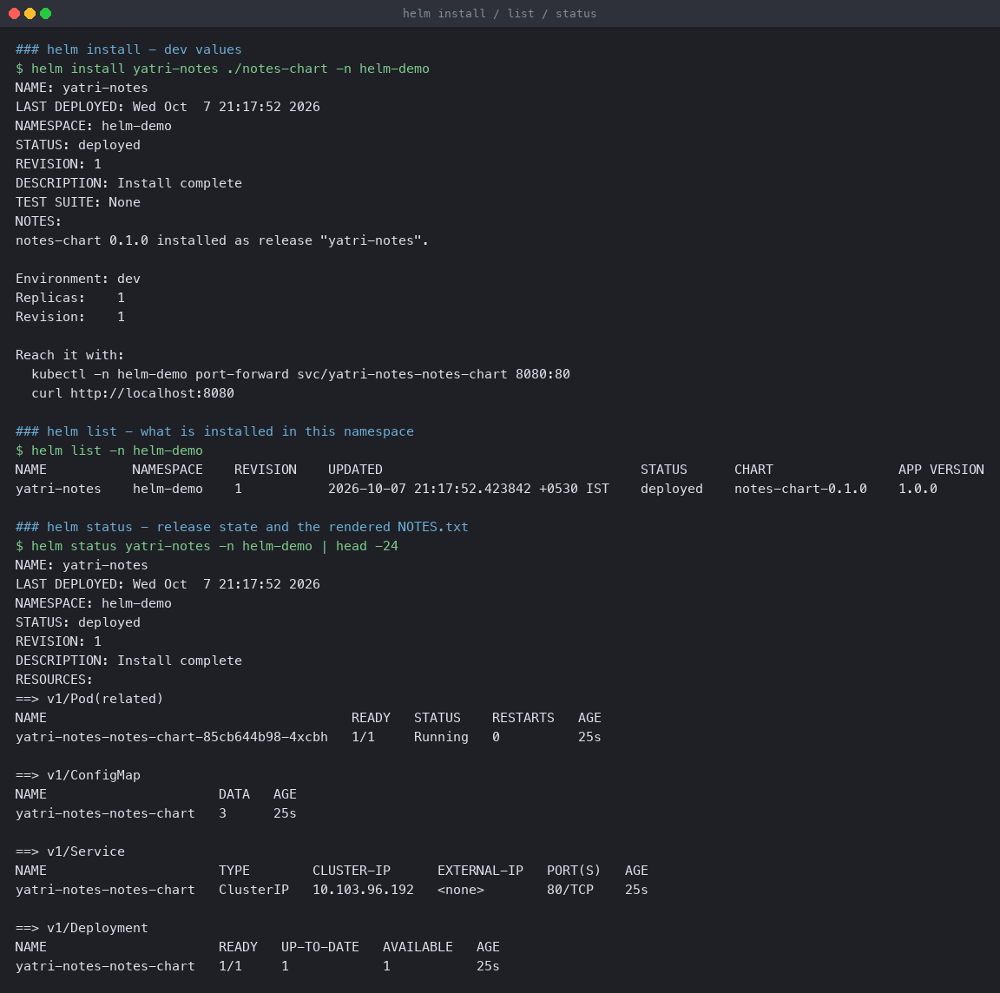
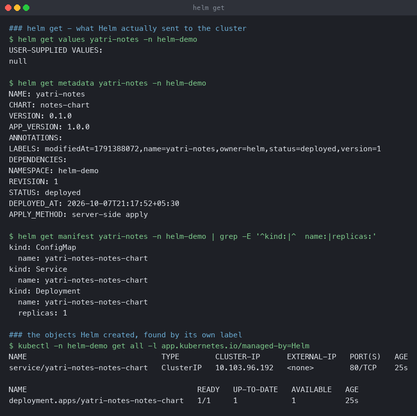
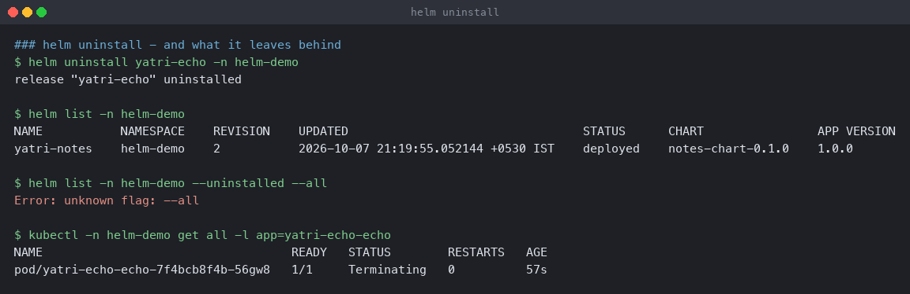

# The Helm command surface

Every command from the session, run for real. Grouped by whether it touches a cluster.

**Environment:** Helm v4.3.0, Minikube v1.39.0, Kubernetes v1.37.0, namespace `helm-demo`.

---

## Local: create, lint, template

```bash
helm version --short
helm create webchart
```

```
v4.3.0+gbec5b06
Creating webchart
```



`helm create` scaffolds a working chart: `Chart.yaml`, `values.yaml`, `templates/` with a
Deployment, Service, ServiceAccount, Ingress, HPA and a test Pod, plus `_helpers.tpl` and
`NOTES.txt`. Useful as a starting point and as a reference for the label conventions.

```bash
helm lint webchart
helm template demo webchart --set replicaCount=2
```

```
==> Linting webchart
[INFO] Chart.yaml: icon is recommended
1 chart(s) linted, 0 chart(s) failed

kind: ServiceAccount
  name: demo-webchart
kind: Service
  name: demo-webchart
kind: Deployment
  name: demo-webchart
  replicas: 2
kind: Pod
  name: "demo-webchart-test-connection"
```



**`helm template` is where debugging should start.** It renders locally, needs no cluster,
creates no release, and shows exactly what would be applied — including the effect of
`--set replicaCount=2`, visible as `replicas: 2` above. Template errors, bad indentation and
wrong value paths all surface here in a second.

`helm lint` checks chart structure and `Chart.yaml` metadata. `[INFO]` is advisory;
`[ERROR]` fails the chart. It belongs in CI.

Note the `test-connection` Pod in the rendered output — that is a `helm test` hook, which
only runs on `helm test <release>`, not on install.

---

## Repositories: add, update, list, search

```bash
helm repo add bitnami https://charts.bitnami.com/bitnami
helm repo update bitnami
helm repo list
helm search repo bitnami/nginx --versions
```

```
"bitnami" has been added to your repositories
...Successfully got an update from the "bitnami" chart repository
Update Complete. ⎈Happy Helming!⎈

NAME     URL
bitnami  https://charts.bitnami.com/bitnami

NAME            CHART VERSION  APP VERSION  DESCRIPTION
bitnami/nginx   25.2.1         1.31.6       NGINX Open Source is a web server...
bitnami/nginx   25.2.0         1.31.6       NGINX Open Source is a web server...
bitnami/nginx   25.1.15        1.31.6       NGINX Open Source is a web server...
```



`helm repo update` fetches the repository index; **`helm search repo` reads that local index
only**, so a chart published five minutes ago is invisible until you update. `--versions`
lists every version rather than just the newest, which is what you need when pinning.

The two columns are different things: `CHART VERSION` is the packaging, `APP VERSION` is the
software inside. A chart can be revised many times for the same application version.

`helm search hub` searches Artifact Hub across all public repositories, and needs no repo
added.

---

## Cluster: install, list, status

```bash
helm install yatri-notes ./notes-chart -n helm-demo
helm list -n helm-demo
helm status yatri-notes -n helm-demo
```

```
NAME: yatri-notes
LAST DEPLOYED: Wed Oct  7 21:17:52 2026
NAMESPACE: helm-demo
STATUS: deployed
REVISION: 1

NAME         NAMESPACE  REVISION  STATUS    CHART              APP VERSION
yatri-notes  helm-demo  1         deployed  notes-chart-0.1.0  1.0.0
```



`helm list` is **namespace-scoped by default** — `-A` for every namespace. It shows only
deployed releases; `--uninstalled` and `--all` reveal the rest.

`helm status` reprints the rendered `NOTES.txt`, which is why that template is worth writing
properly: it is the one piece of documentation a user sees at exactly the moment they need
it.

---

## Cluster: get

```bash
helm get values yatri-notes -n helm-demo
helm get metadata yatri-notes -n helm-demo
helm get manifest yatri-notes -n helm-demo
kubectl -n helm-demo get all -l app.kubernetes.io/managed-by=Helm
```

```
$ helm get values yatri-notes -n helm-demo
USER-SUPPLIED VALUES:
null                                  <- nothing overridden; all chart defaults

$ helm get metadata yatri-notes -n helm-demo
NAME: yatri-notes
CHART: notes-chart
VERSION: 0.1.0
APP_VERSION: 1.0.0
REVISION: 1
STATUS: deployed
APPLY_METHOD: server-side apply

$ helm get manifest yatri-notes -n helm-demo | grep -E '^kind:|^  name:|replicas:'
kind: ConfigMap
  name: yatri-notes-notes-chart
kind: Service
  name: yatri-notes-notes-chart
kind: Deployment
  name: yatri-notes-notes-chart
  replicas: 1
```



Three different questions:

- **`get values`** — only what the *user* supplied. `null` here because nothing was
  overridden. `--all` includes the chart defaults, and the difference between the two is
  exactly what makes a release non-default.
- **`get metadata`** — the release record itself.
- **`get manifest`** — the rendered YAML Helm stored. This is the source of truth for what
  is in the cluster, and what `rollback` re-applies.

The `kubectl` line matters too: every object carries
`app.kubernetes.io/managed-by=Helm`, so **everything Helm owns is findable without Helm**.
That is the escape hatch when a release is wedged.

---

## Cluster: uninstall

```bash
helm uninstall yatri-echo -n helm-demo
helm list -n helm-demo
helm list -n helm-demo --uninstalled --all
kubectl -n helm-demo get all -l app=yatri-echo-echo
```



`helm uninstall` deletes the release's objects and its history. What it does **not** delete:
PersistentVolumeClaims created by a StatefulSet `volumeClaimTemplate`, and CRDs installed
from the `crds/` directory. Both are deliberate — losing data or breaking other releases on
an uninstall would be worse.

`--keep-history` leaves the release record behind as `uninstalled`, which keeps it
rollback-able.
