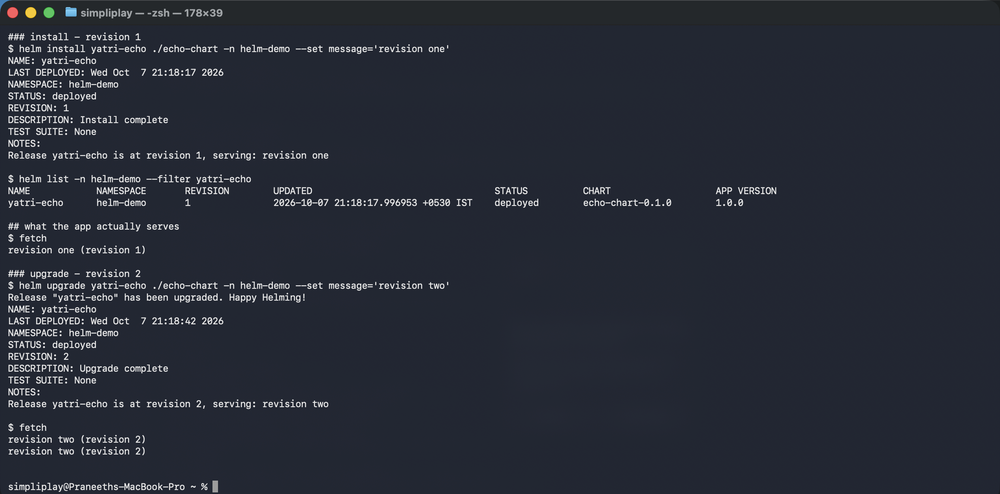
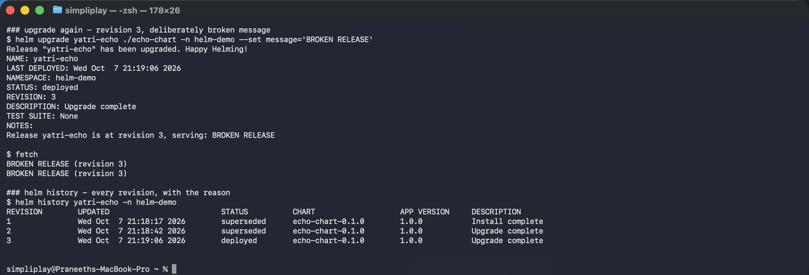
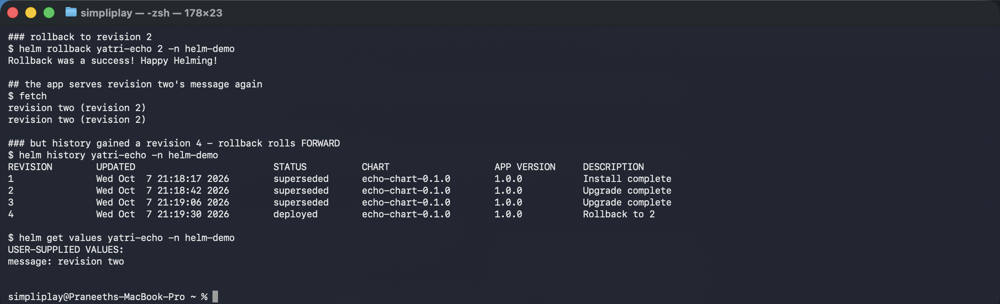

# Install, upgrade, rollback

A complete release lifecycle where **the application itself tells you which revision is
live**, so the rollback is proven from outside Helm rather than from Helm's own report.

**Environment:** Helm v4.3.0, Minikube v1.39.0, Kubernetes v1.37.0, namespace `helm-demo`.

[`echo-chart`](echo-chart/) renders its `message` value and `.Release.Revision` into a
ConfigMap mounted as `index.html`. Fetching the page through the Service is therefore a
direct read of what is deployed.

---

## install → upgrade → upgrade

```bash
helm install yatri-echo ./echo-chart -n helm-demo --set message='revision one'
helm upgrade yatri-echo ./echo-chart -n helm-demo --set message='revision two'
helm upgrade yatri-echo ./echo-chart -n helm-demo --set message='BROKEN RELEASE'
```

```
NAME: yatri-echo
STATUS: deployed
REVISION: 1
NOTES:
Release yatri-echo is at revision 1, serving: revision one

### what the app actually serves
revision one (revision 1)

Release "yatri-echo" has been upgraded. Happy Helming!
REVISION: 2
revision two (revision 2)

Release "yatri-echo" has been upgraded. Happy Helming!
REVISION: 3
BROKEN RELEASE (revision 3)
```

```
$ helm history yatri-echo -n helm-demo
REVISION  UPDATED                   STATUS      CHART             DESCRIPTION
1         Wed Oct  7 21:18:17 2026  superseded  echo-chart-0.1.0  Install complete
2         Wed Oct  7 21:18:42 2026  superseded  echo-chart-0.1.0  Upgrade complete
3         Wed Oct  7 21:19:06 2026  deployed    echo-chart-0.1.0  Upgrade complete
```





Each `helm upgrade` incremented the revision and the served page followed. Exactly one
revision is `deployed`; the rest are `superseded`.

The reason the content changed at all is the checksum annotation in
[`echo-chart/templates/deployment.yaml`](echo-chart/templates/deployment.yaml):

```yaml
annotations:
  checksum/config: {{ include (print $.Template.BasePath "/configmap.yaml") . | sha256sum }}
```

Without it, `helm upgrade` would update the ConfigMap and **leave the running Pods serving
the old file**, because a ConfigMap-backed volume change does not restart a Pod. The release
would report success while the application was unchanged — one of the most confusing
outcomes in Helm, and the same class of trap as the environment-variable snapshot in
Session 12.

---

## rollback

```bash
helm rollback yatri-echo 2 -n helm-demo
helm history yatri-echo -n helm-demo
helm get values yatri-echo -n helm-demo
```

```
Rollback was a success! Happy Helming!

### the app serves revision two's message again
revision two (revision 2)

REVISION  UPDATED                   STATUS      CHART             DESCRIPTION
1         Wed Oct  7 21:18:17 2026  superseded  echo-chart-0.1.0  Install complete
2         Wed Oct  7 21:18:42 2026  superseded  echo-chart-0.1.0  Upgrade complete
3         Wed Oct  7 21:19:06 2026  superseded  echo-chart-0.1.0  Upgrade complete
4         Wed Oct  7 21:19:30 2026  deployed    echo-chart-0.1.0  Rollback to 2

$ helm get values yatri-echo -n helm-demo
USER-SUPPLIED VALUES:
message: revision two
```



Three things to take from that output.

**A rollback rolls forward.** Asking for revision 2 produced **revision 4**, described as
`Rollback to 2`. Revision 3 is not deleted or rewritten — it becomes `superseded` and stays
inspectable. The history is append-only, so there is never a state where you have lost the
ability to go somewhere else.

**The served page says `revision two (revision 2)`, not `(revision 4)`.** The ConfigMap is
rendered from revision 2's stored manifest, including its `.Release.Revision` value of 2.
Helm **re-applies a stored manifest**; it does not re-render the chart with a new revision
number. That is why a rollback is reliable even if the chart files on disk have since
changed, or are gone entirely.

**`helm get values` reports `message: revision two`.** The release's current user-supplied
values are revision 2's values. Running `helm upgrade` now, with no `--set`, would deploy
from that base — not from revision 3's.

---

## The one thing to know before relying on it

`helm rollback` restores **Kubernetes objects**, and nothing else. A release that ran a
database migration on upgrade will have its Deployment rolled back and its schema left
migrated. Rollback is not a time machine for state, only for manifests — which is the same
boundary as `terraform destroy` and a PersistentVolume.

Useful flags: `--timeout`, and `--wait` to block until resources are ready rather than
reporting success as soon as the API accepts the manifest. For upgrades, `--atomic` rolls
back automatically on failure, which makes a failed deploy self-cleaning.
