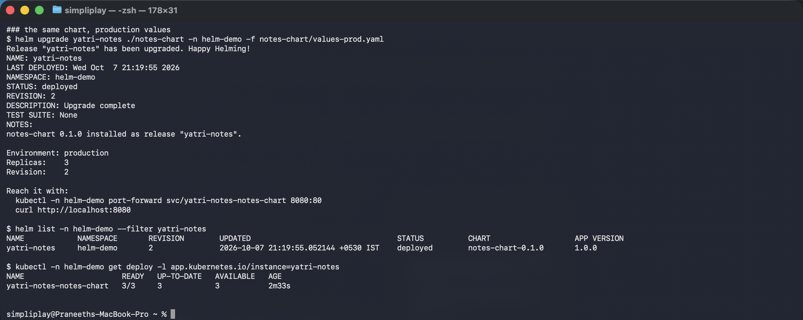
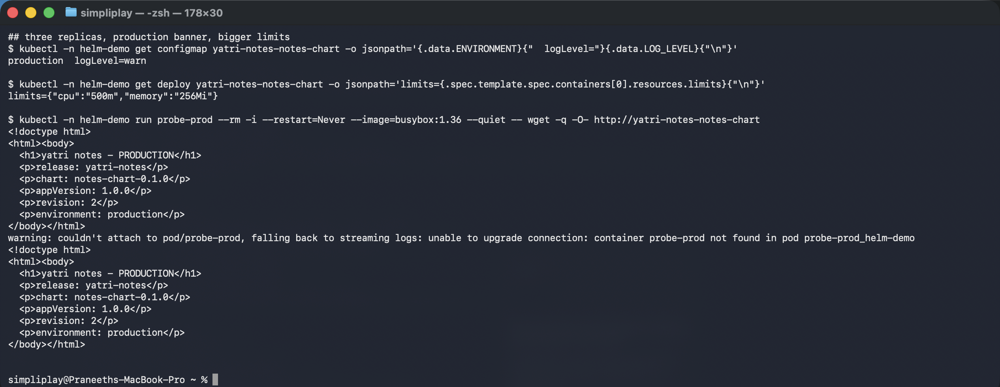
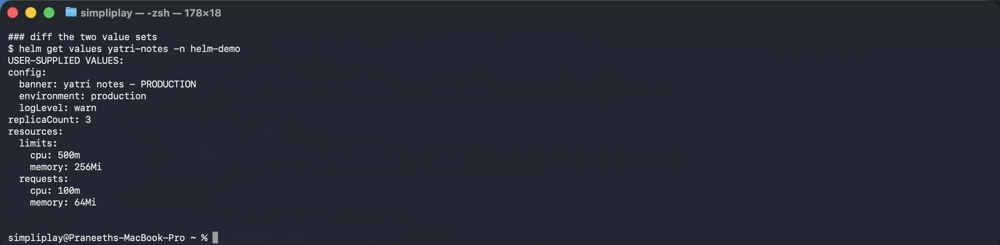

# Mini project — one chart, two environments

[`notes-chart`](notes-chart/) is a chart written from scratch rather than scaffolded, and
deployed twice: once with its defaults as dev, once with an overlay as production.

**Environment:** Helm v4.3.0, Minikube v1.39.0, Kubernetes v1.37.0, namespace `helm-demo`.

```
notes-chart/
├── Chart.yaml
├── values.yaml            # dev defaults
├── values-prod.yaml       # ONLY the differences
└── templates/
    ├── _helpers.tpl       # name and label helpers
    ├── configmap.yaml     # config + the served index.html
    ├── deployment.yaml    # with the config checksum annotation
    ├── service.yaml
    └── NOTES.txt
```

---

## Dev

```bash
helm install yatri-notes ./notes-chart -n helm-demo
```

Defaults from [`values.yaml`](notes-chart/values.yaml): one replica, `logLevel: debug`,
200m CPU limit, banner `yatri notes - development`.

## Production

```bash
helm upgrade yatri-notes ./notes-chart -n helm-demo -f notes-chart/values-prod.yaml
```

```
NAME         NAMESPACE  REVISION  STATUS    CHART              APP VERSION
yatri-notes  helm-demo  2         deployed  notes-chart-0.1.0  1.0.0

NAME                      READY   UP-TO-DATE   AVAILABLE   AGE
yatri-notes-notes-chart   3/3     3            3           2m

production  logLevel=warn
limits={"cpu":"500m","memory":"256Mi"}

### the page, fetched from inside the cluster
<!doctype html>
<html><body>
  <h1>yatri notes - PRODUCTION</h1>
  <p>release: yatri-notes</p>
  <p>chart: notes-chart-0.1.0</p>
  <p>appVersion: 1.0.0</p>
  <p>revision: 2</p>
  <p>environment: production</p>
</body></html>

```





```
$ helm get values yatri-notes -n helm-demo
USER-SUPPLIED VALUES:
config:
  banner: yatri notes - PRODUCTION
  environment: production
  logLevel: warn
replicaCount: 3
resources:
  limits:
    cpu: 500m
    memory: 256Mi
  requests:
    cpu: 100m
    memory: 64Mi
```



Three replicas, `warn` logging, 500m limit, production banner — and the entire difference is
[`values-prod.yaml`](notes-chart/values-prod.yaml), a 12-line file. There is no second copy
of the Deployment, Service or ConfigMap.

**`helm get values` returns only the overlay**, not the merged result. That is the useful
view: it answers "how does production differ from the chart's intent" in one command.
`helm get values --all` shows the merged values if you need the effective configuration.

Values merge **deeply**, which is what lets `values-prod.yaml` set
`resources.limits.cpu` without restating `resources.requests`. The exception is lists —
those are replaced wholesale, not merged element by element, which surprises people who try
to append one environment variable via an overlay.

---

## The two template decisions worth defending

**`selectorLabels` deliberately excludes the version.** From
[`templates/_helpers.tpl`](notes-chart/templates/_helpers.tpl):

```
notes-chart.labels          -> name, instance, version, managed-by, chart
notes-chart.selectorLabels  -> name, instance only
```

A Deployment's `spec.selector` is **immutable after creation**. Including
`app.kubernetes.io/version` would mean the first `Chart.yaml` version bump fails with
`field is immutable`, and the only fix is deleting and recreating the release — an outage
caused by a label. The scaffold from `helm create` splits these for exactly this reason, and
it is the detail most hand-written charts get wrong.

**The config checksum annotation forces a rollout on config change:**

```yaml
checksum/config: {{ include (print $.Template.BasePath "/configmap.yaml") . | sha256sum }}
```

Changing only `logLevel` alters the ConfigMap but not the Pod template, so without this the
Pods would keep the old value and `helm upgrade` would report success having changed nothing
observable. Hashing the rendered ConfigMap into the Pod annotations makes any config change
a template change, which is a rollout.

## Cleanup

```bash
helm uninstall yatri-notes -n helm-demo
kubectl delete namespace helm-demo
```
