# Kubernetes Core Objects

Pods, the states they pass through, the controllers that manage them, and the four
deployment strategies — each one run against a live cluster and captured as it happened.

**Environment:** Minikube v1.39.0 with the Docker driver on macOS (Apple silicon),
Kubernetes v1.37.0, containerd 2.3.4. Single node, so it is both control plane and worker.

---

## Task 1: Cluster health

One line each: client version, where the control plane and CoreDNS are, and whether the
node is `Ready`. Worth doing before anything else — almost every "my Pod won't start"
turns out to be answered here.

```bash
kubectl version --client --output=yaml
kubectl cluster-info
kubectl get nodes -o wide
```

```
Kubernetes control plane is running at https://127.0.0.1:55267
CoreDNS is running at https://127.0.0.1:55267/api/v1/namespaces/kube-system/services/kube-dns:dns/proxy

NAME       STATUS   ROLES           AGE   VERSION   INTERNAL-IP    EXTERNAL-IP   OS-IMAGE                         CONTAINER-RUNTIME
minikube   Ready    control-plane   99m   v1.37.0   192.168.49.2   <none>        Debian GNU/Linux 12 (bookworm)   containerd://2.3.4
```

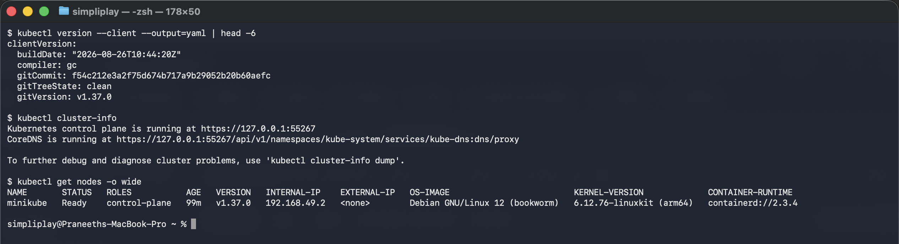

`ROLES: control-plane` with no worker node listed is the single-node shape: the
control-plane taint is lifted so ordinary Pods schedule here too.

---

## Task 2: A standalone Pod

[`pod.yml`](pod.yml) has the four mandatory top-level fields — `apiVersion`, `kind`,
`metadata`, `spec` — and nothing else. No controller owns it, so deleting it is final:
nothing will bring it back.

```bash
kubectl apply -f pod.yml
kubectl get pods nginx-pod -o wide
kubectl logs nginx-pod
kubectl delete -f pod.yml
```

```
NAME        READY   STATUS    RESTARTS   AGE   IP            NODE
nginx-pod   1/1     Running   0          1s    10.244.0.16   minikube

### after delete
Error from server (NotFound): pods "nginx-pod" not found
```

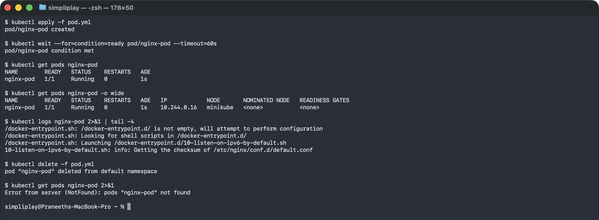

`READY 1/1` is containers ready / containers total, and it is not the same as `STATUS:
Running` — Task 5's readiness probe shows a Pod that is Running and `0/1` for twenty
seconds. The Pod IP `10.244.0.16` comes from the cluster's Pod CIDR and is gone the
moment the Pod is.

---

## Task 3: ErrImagePull and ImagePullBackOff

[`pod-lifecycle/06-imagepullbackoff.yaml`](pod-lifecycle/06-imagepullbackoff.yaml) asks
for a tag that does not exist.

```bash
kubectl apply -f pod-lifecycle/06-imagepullbackoff.yaml
kubectl get pod lifecycle-image-error
kubectl describe pod lifecycle-image-error | grep -A 8 "Events:"
```

```
NAME                    READY   STATUS         RESTARTS   AGE
lifecycle-image-error   0/1     ErrImagePull   0          8s

### events
Normal   Pulling    17s (x2 over 33s)   kubelet   Pulling image "nginx:this-tag-does-not-exist-9999"
Warning  Failed     16s (x2 over 31s)   kubelet   Failed to pull image ...: not found
Warning  Failed     16s (x2 over 31s)   kubelet   Error: ErrImagePull
Normal   BackOff     3s (x2 over 31s)   kubelet   Back-off pulling image "nginx:this-tag-does-not-exist-9999"
Warning  Failed      3s (x2 over 31s)   kubelet   Error: ImagePullBackOff
```

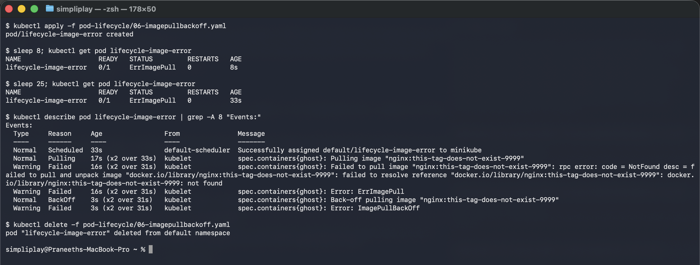

The distinction the task is really about: **the API object was created successfully.**
`kubectl apply` returned `created`, the scheduler placed it, etcd has it. Nothing at the
API layer failed. The failure is entirely at the runtime layer, in the kubelet, which is
why `kubectl get pod` reports a healthy-looking object with a broken container.

`ErrImagePull` is the first failed attempt; `ImagePullBackOff` is what it becomes once
the kubelet starts backing off between retries. Both appear in the events above — the
`STATUS` column just shows whichever the Pod is in at the instant you look.

---

## Task 4: The three transient phases

[`hello.yml`](hello.yml) runs for five seconds and exits 0 under `restartPolicy: Never`.
Polling every two seconds catches all three stages:

```bash
kubectl apply -f hello.yml
for i in $(seq 1 12); do printf "t+%-3ss " $((i*2)); kubectl get pod hello-pod --no-headers; sleep 2; done
```

```
t+2  s hello-pod   0/1   ContainerCreating   0   0s
t+4  s hello-pod   1/1   Running             0   2s
t+6  s hello-pod   1/1   Running             0   4s
t+8  s hello-pod   0/1   Completed           0   6s
...
### kubectl get pod hello-pod -o jsonpath="{.status.phase}"
Succeeded
```

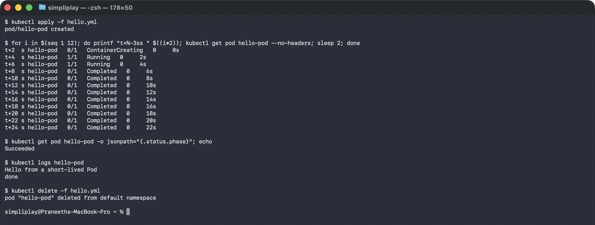

Two names for one thing: the `STATUS` column says `Completed`, but the actual API field
`status.phase` says `Succeeded`. `Completed` is a friendlier rendering kubectl prints for
a Pod whose containers all exited 0 — scripts should read the phase, not the column.

`restartPolicy: Never` is what makes this terminal. The default `Always` would restart
the container the moment it exited, and the Pod would never reach `Succeeded` — which is
exactly what Task 5's CrashLoopBackOff does.

---

## Task 5: The lifecycle lab

Twelve manifests in [`pod-lifecycle/`](pod-lifecycle/), one per state or mechanism.

| Manifest | What it demonstrates |
|---|---|
| [`01-running.yaml`](pod-lifecycle/01-running.yaml) | the ordinary case |
| [`02-pending.yaml`](pod-lifecycle/02-pending.yaml) | unschedulable: requests no node can satisfy |
| [`03-succeeded.yaml`](pod-lifecycle/03-succeeded.yaml) | exit 0, `restartPolicy: Never` |
| [`04-failed.yaml`](pod-lifecycle/04-failed.yaml) | exit 1, `restartPolicy: Never` |
| [`05-crashloopbackoff.yaml`](pod-lifecycle/05-crashloopbackoff.yaml) | exit 1 on the default `Always` |
| [`06-imagepullbackoff.yaml`](pod-lifecycle/06-imagepullbackoff.yaml) | bad image tag (Task 3) |
| [`07-readiness.yaml`](pod-lifecycle/07-readiness.yaml) | Running ≠ Ready |
| [`08-liveness.yaml`](pod-lifecycle/08-liveness.yaml) | automatic restart on probe failure |
| [`09-startup.yaml`](pod-lifecycle/09-startup.yaml) | protecting a slow boot from liveness |
| [`10-init-container.yaml`](pod-lifecycle/10-init-container.yaml) | ordered prerequisite container |
| [`11-multi-container.yaml`](pod-lifecycle/11-multi-container.yaml) | app + logging sidecar |
| [`12-termination.yaml`](pod-lifecycle/12-termination.yaml) | graceful SIGTERM shutdown |

### Pending, CrashLoopBackOff, and liveness restarts

```
### 02-pending.yaml -- requests 500Gi memory and 100 CPUs
lifecycle-pending   0/1   Pending   0   6s
Warning  FailedScheduling  6s  default-scheduler  0/1 nodes are available:
  1 Insufficient cpu, 1 Insufficient memory.

### 05-crashloopbackoff.yaml -- sampled every 15s
t+15 s lifecycle-crashloop  0/1  ContainerCreating  0             0s
t+30 s lifecycle-crashloop  0/1  Error              1 (12s ago)  15s
t+45 s lifecycle-crashloop  0/1  Error              2 (23s ago)  30s
t+60 s lifecycle-crashloop  1/1  Running            3 (24s ago)  45s
t+75 s lifecycle-crashloop  0/1  Error              3 (39s ago)  60s
t+90 s lifecycle-crashloop  0/1  Error              3 (54s ago)  75s
Warning  BackOff  46s (x3 over 83s)  kubelet  Back-off restarting failed container crasher

### 08-liveness.yaml -- sampled every 15s
t+60 s lifecycle-liveness   1/1  Running   0            45s
t+75 s lifecycle-liveness   1/1  Running   1 (3s ago)   60s
Warning  Unhealthy  48s (x3 over 54s)  kubelet  Liveness probe failed: cat: can't open '/tmp/alive'
```

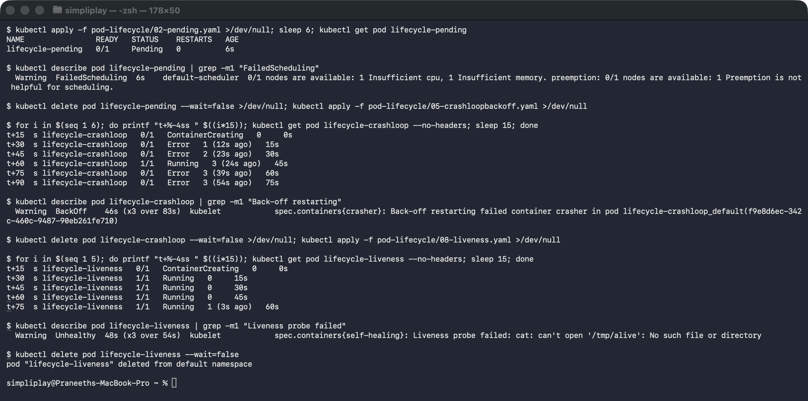

Three things worth reading carefully:

**Pending is a scheduling failure, not a runtime one.** The Pod exists and is perfectly
valid; the scheduler simply found no node that could satisfy `500Gi` of memory. This is
the single most common cause of a Pod that "does nothing" — and `describe` names it
outright.

**The crash loop's `RESTARTS` column is the real signal, not `STATUS`.** Sampling every
15 seconds mostly caught `Error` and once caught `Running`, because the container runs
for 3 seconds before exiting. The state actually named `CrashLoopBackOff` is the waiting
period between restarts, and it lengthens each time — 10s, 20s, 40s, up to 5 minutes.
The `BackOff` event is the unambiguous evidence; the `STATUS` column is a snapshot of
whichever half of the cycle you happened to catch.

**Liveness restarts the container, not the Pod.** `RESTARTS` went 0 → 1 while the Pod
name, IP and node stayed identical. A restart is the kubelet killing and re-running the
container in place — no rescheduling, no new identity. That is why `RESTARTS` climbing
on a stable Pod means a sick container, whereas a Pod that keeps reappearing under new
names means something is deleting it.

### Readiness, init containers, sidecars and graceful shutdown

```
### 07-readiness.yaml -- Running long before Ready
t+12 s lifecycle-readiness  0/1  Running  0   6s
t+18 s lifecycle-readiness  0/1  Running  0  12s
t+24 s lifecycle-readiness  0/1  Running  0  18s
t+30 s lifecycle-readiness  1/1  Running  0  24s

### 10-init-container.yaml -- Init:0/1 until the init container exits
t+6  s lifecycle-init  0/1  Init:0/1  0   0s
t+12 s lifecycle-init  0/1  Init:0/1  0   6s
t+18 s lifecycle-init  1/1  Running   0  12s

### 11-multi-container.yaml -- two containers, one Pod
lifecycle-multi-container  2/2  Running  0  20s

### the sidecar tailing the app container's log file
Thu Sep 17 18:43:14 UTC 2026 request 5 handled
Thu Sep 17 18:43:17 UTC 2026 request 6 handled

### 12-termination.yaml -- delete blocks while the container drains
real    0m10.695s
```

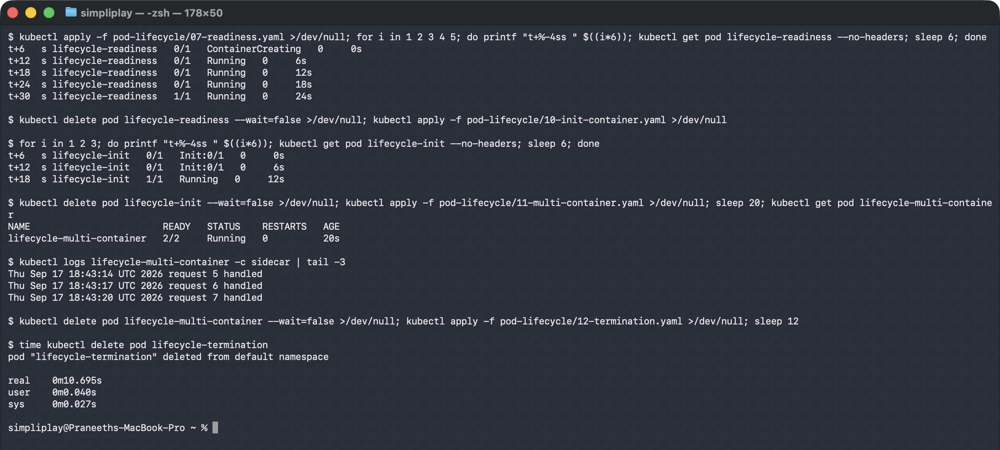

`0/1 Running` for the first twenty seconds is the whole point of a readiness probe: the
container is up, but the Pod is deliberately kept out of Service endpoints until it says
it can serve. That is the mechanism behind zero-downtime rollouts — a new Pod receives no
traffic until it is genuinely ready.

`Init:0/1` is a phase of its own. Init containers run to completion, in order, before any
app container starts, which is how you express "wait for the database" or "fetch config"
without putting that logic in the application.

Graceful termination is visible as *elapsed time*: `time kubectl delete` measured
**10.695s** for a Pod whose container traps `SIGTERM` and sleeps 10 seconds before
exiting. Deleting an ordinary Pod returns in well under a second; that extra ten seconds
is the container draining. Kubernetes sends `SIGTERM`, waits up to
`terminationGracePeriodSeconds` (30 here), and only then sends `SIGKILL`. A server that
ignores `SIGTERM` gets killed mid-request; one that drains finishes its work first.

---

## Task 6: ReplicaSet and StatefulSet

### ReplicaSet — self-healing

[`replicaset.yml`](replicaset.yml) keeps three Pods alive. Deleting one by hand is the
test:

```bash
kubectl apply -f replicaset.yml
POD=$(kubectl get pods -l app=nginx-rs -o jsonpath="{.items[0].metadata.name}")
kubectl delete pod $POD
kubectl get pods -l app=nginx-rs
```

```
### before
nginx-rs-6tfb4   1/1   Running   0   13s
nginx-rs-lt7wl   1/1   Running   0   13s
nginx-rs-wshqp   1/1   Running   0   13s

### deleting nginx-rs-6tfb4, then six seconds later
nginx-rs-lt7wl   1/1   Running   0   19s
nginx-rs-nlrxt   1/1   Running   0    6s   <-- brand new, different name
nginx-rs-wshqp   1/1   Running   0   19s
```

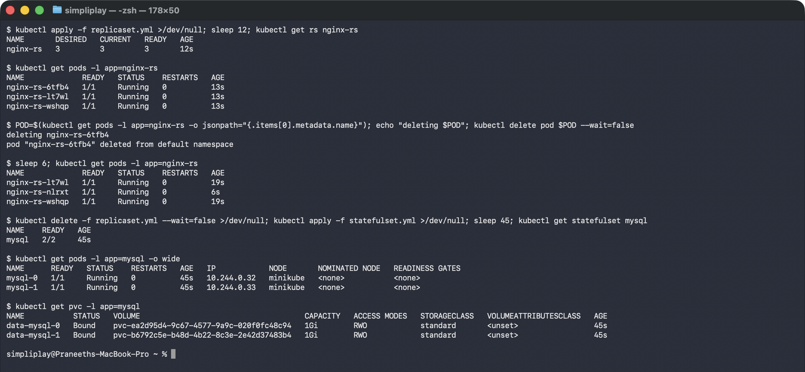

The count is restored, but the replacement is a *different Pod*: `nginx-rs-nlrxt`, six
seconds old, with a new name and a new IP. The ReplicaSet guarantees **how many**, never
**which**. Anything that cared about `nginx-rs-6tfb4` specifically is out of luck — which
is exactly the assumption a StatefulSet exists to fix.

### StatefulSet — stable identity and storage

[`statefulset.yml`](statefulset.yml) runs MySQL with a `volumeClaimTemplates` block:

```
NAME    READY   AGE
mysql   2/2     45s

NAME      READY   STATUS    AGE   IP             NODE
mysql-0   1/1     Running   45s   10.244.0.32    minikube
mysql-1   1/1     Running   45s   10.244.0.33    minikube

### the PVC per replica, created automatically
NAME           STATUS   VOLUME                                     CAPACITY   STORAGECLASS
data-mysql-0   Bound    pvc-ea2d95d4-9c67-4577-9a9c-020f0fc48c94   1Gi        standard
data-mysql-1   Bound    pvc-b6792c5e-b48d-4b22-8c3e-2e42d37483b4   1Gi        standard
```

Ordinal names — `mysql-0`, `mysql-1` — not random suffixes, and one PVC per replica named
after it. `data-mysql-0` follows `mysql-0` through deletion and rescheduling; that binding
of name to storage is the entire reason databases run as StatefulSets. They are also
created in order, 0 before 1, and torn down in reverse.

---

## Task 7: DaemonSet

[`daemonset.yml`](daemonset.yml) has no `replicas` field. The node count *is* the replica
count.

```bash
kubectl apply -f daemonset.yml
kubectl get ds node-exporter
kubectl get pods -l app=node-exporter -o wide
```

```
NAME            DESIRED   CURRENT   READY   UP-TO-DATE   AVAILABLE   NODE SELECTOR   AGE
node-exporter   1         1         1       1            1           <none>          20s

NAME                  READY   STATUS    AGE   IP            NODE
node-exporter-d97t2   1/1     Running   20s   10.244.0.34   minikube

nodes in cluster: 1
```

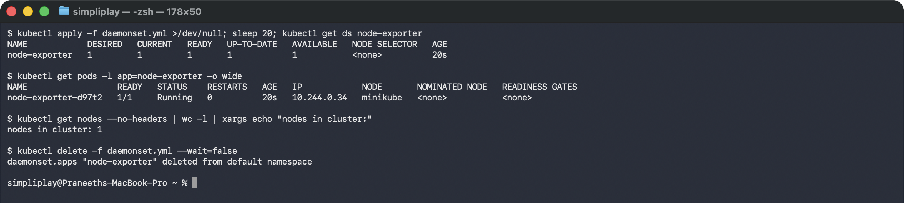

`DESIRED 1` because the cluster has exactly one node — the DaemonSet controller derived
it rather than being told. Add a node and a Pod appears there automatically; drain one and
its Pod goes with it.

The `tolerations` block in the manifest matters here: this node carries the control-plane
role, and without tolerating that taint the agent would skip the very node you most want
telemetry from. On a single-node cluster, omitting it would mean zero Pods.

---

## Task 8: Rolling update and rollback

[`01-rolling-update/`](01-rolling-update/) — `maxSurge: 1`, `maxUnavailable: 0`, three
replicas.

```bash
kubectl apply -f 01-rolling-update/deployment-v1.yaml -f 01-rolling-update/service.yaml
kubectl apply -f 01-rolling-update/deployment-v2.yaml
kubectl rollout status deployment/app-rolling
kubectl rollout history deployment/app-rolling
kubectl rollout undo deployment/app-rolling
```

```
### mid-rollout: v2 Pods up before the last v1 Pod goes
NAME                          READY  STATUS        AGE     VERSION
app-rolling-55ccb46cf9-7thb5  1/1    Running       2s      v2
app-rolling-55ccb46cf9-sfq8l  1/1    Running       1s      v2
app-rolling-55ccb46cf9-vng6w  1/1    Running       1s      v2
app-rolling-dc4b44ddd-fncxm   1/1    Terminating   7m26s   v1

### rollout history
REVISION   CHANGE-CAUSE
3          <none>
4          <none>

### after `rollout undo` -- back to the v1 ReplicaSet's hash
app-rolling-dc4b44ddd-59c8t   1/1    Running       6s      v1
app-rolling-dc4b44ddd-pqr5l   1/1    Running       6s      v1
app-rolling-dc4b44ddd-q6w7z   1/1    Running       5s      v1
```

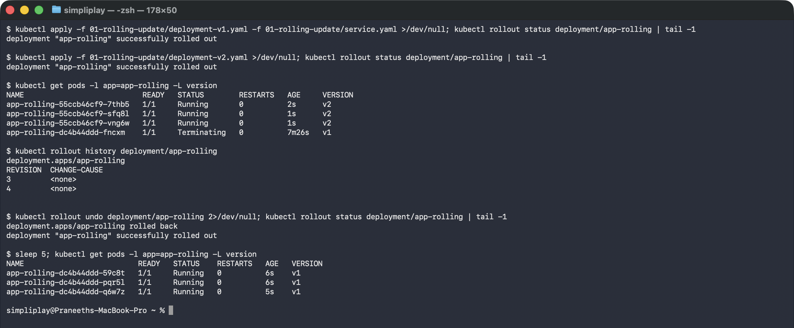

Four Pods exist at once — three `v2` Running plus one `v1` still Terminating. That is
`maxSurge: 1` in action, and it is why capacity never dips: the old Pod is only torn down
*after* its replacement is Ready.

The rollback is the detail worth internalising. The Pod name prefix goes back to
`dc4b44ddd` — the **same ReplicaSet hash** as the original v1 Pods. `rollout undo` does
not rebuild anything; the old ReplicaSet was kept at zero replicas the whole time, and
the rollback simply scales it back up. That is why it is near-instant, and why
`rollout history` retains revisions at all.

The warning about `last-applied-configuration` is real and worth heeding: `rollout undo`
changes the live object without updating what `kubectl apply` thinks the config is, so a
later `apply` of the v2 file would silently re-apply v2. In practice, roll back in Git.

---

## Task 9: Two troubleshooting drills

### Drill 1 — a rollout that stalls instead of failing

[`troubleshooting/broken-image-v2.yaml`](troubleshooting/broken-image-v2.yaml) points at
a tag that does not exist.

```
$ kubectl rollout status deployment/yatri-backend --timeout=25s
Waiting for deployment "yatri-backend" rollout to finish: 1 out of 3 new replicas have been updated...
error: timed out waiting for the condition

NAME                             READY   STATUS             RESTARTS   AGE
yatri-backend-7b9cdd8797-bcrkg   1/1     Running            0          26s
yatri-backend-7b9cdd8797-c5xn5   1/1     Running            0          26s
yatri-backend-7b9cdd8797-s4f82   1/1     Running            0          26s
yatri-backend-b4d846dfd-mwqcl    0/1     ImagePullBackOff   0          25s
```

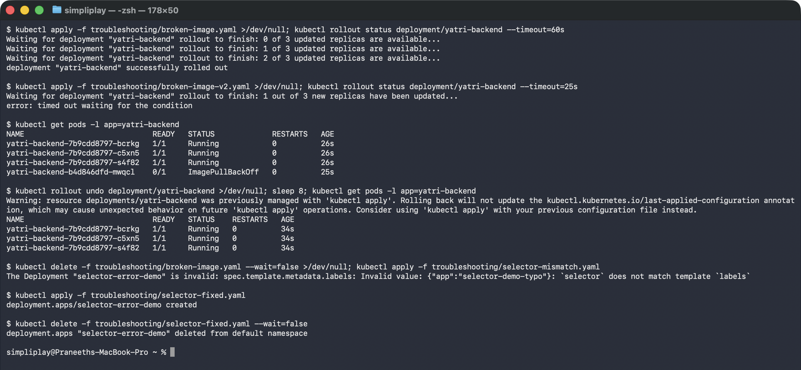

**The application never went down.** All three original Pods are still `Running` and still
serving; only the one surged Pod is broken. `maxUnavailable: 0` is what bought that — the
rollout refuses to remove a working Pod until the new one is Ready, and since it never
will be, the rollout simply waits forever.

That is the failure mode to recognise: not an outage, but a deployment permanently stuck
at "1 of 3 updated", quietly still serving the old version. It will sit there until
someone looks. `kubectl rollout undo` clears it in seconds.

### Drill 2 — rejected before anything runs

[`troubleshooting/selector-mismatch.yaml`](troubleshooting/selector-mismatch.yaml) has
`selector.matchLabels: app=selector-demo` but template labels `app=selector-demo-typo`:

```
$ kubectl apply -f troubleshooting/selector-mismatch.yaml
The Deployment "selector-error-demo" is invalid: spec.template.metadata.labels:
  Invalid value: {"app":"selector-demo-typo"}: `selector` does not match template `labels`

$ kubectl apply -f troubleshooting/selector-fixed.yaml
deployment.apps/selector-error-demo created
```

The opposite kind of failure from Drill 1: this one is caught by **validation at the API
server**, before a single Pod is created. A Deployment whose selector cannot match its own
template would create Pods it then refuses to own, so the object is rejected outright.

Worth knowing alongside it: `spec.selector` is **immutable** after creation. Fixing a
mismatch on a live Deployment means deleting and recreating it, not editing it — which is
why the version label in [`01-rolling-update/`](01-rolling-update/) lives only in the Pod
template and never in the selector.
---

## Task 10: The concepts behind the labs

### The four ports

They are four different things that all happen to be called "port", and mixing them
up is the most common Service bug after a selector typo.

| Field | Lives on | Who dials it | Notes |
|---|---|---|---|
| `containerPort` | the Pod spec | nobody, directly | Documentation. The container listens whether or not you declare it; declaring it lets you give the port a **name**. |
| `targetPort` | the Service | kube-proxy | Where the Service forwards to on the Pod. Can be a number or the `containerPort`'s name. |
| `port` | the Service | in-cluster clients | The port on the ClusterIP itself. |
| `nodePort` | the Service | anything that can reach a node | 30000–32767, opened on **every** node. NodePort and LoadBalancer only. |

```
client ──► nodePort 30080 (every node's IP)
             └─► port 8080 (the Service's virtual IP)
                   └─► targetPort 80 (the Pod's IP)
                         └─► containerPort 80 (the process)
```

Naming the container port and writing `targetPort: http` means renumbering the
container never breaks the Service.

### Labels vs selectors

A **label** is data written on an object. A **selector** is a query run against
those labels. Labels are nouns, selectors are questions — the Pod does not know
which Services select it, and nothing links them but a matching key/value.

That indirection is what makes blue-green possible: editing one selector
reassigns traffic across a whole fleet without touching a single Pod.

### The four deployment strategies

| Strategy | Downtime | Extra capacity | Rollback speed | Cost |
|---|---|---|---|---|
| **RollingUpdate** | none | `maxSurge` (1 extra here) | one rollout (~seconds–minutes) | cheapest |
| **Recreate** | yes, deliberate | none | another full recreate | cheapest |
| **Blue-Green** | none | 2x, for the whole cutover | instant (flip the selector back) | most expensive |
| **Canary** | none | 1 extra Pod | fast (scale canary to 0) | cheap |

RollingUpdate is the default and the right answer most of the time. Recreate
exists for workloads that genuinely cannot run two versions at once — a schema
migration, or a single-writer lock.

### maxSurge vs maxUnavailable

Both accept a count or a percentage of `replicas`.

For the `replicas: 3`, `maxSurge: 1`, `maxUnavailable: 0` used in
[01-rolling-update](01-rolling-update/):

- ceiling during rollout: `3 + 1 = 4` Pods
- floor during rollout: `3 - 0 = 3` Pods

The floor is the important one: at no point is capacity reduced, which is what
"zero downtime" actually means. The cost is that the rollout needs room for a
4th Pod, and it cannot start until one is schedulable.

Invert it (`maxSurge: 0`, `maxUnavailable: 1`) and the rollout needs no extra
room but runs at 2/3 capacity throughout. Setting **both** to 0 is rejected —
it would deadlock.

### Requests vs limits, and GB vs GiB

- **Request** — what the scheduler reserves. Placement is decided on requests
  alone; a node is "full" when requests are committed, regardless of real usage.
- **Limit** — the cgroup ceiling. Over the CPU limit the container is
  *throttled*; over the memory limit it is *OOM-killed*, because memory cannot
  be reclaimed by slowing down.

That asymmetry is why CPU limits are often omitted while memory limits are not.

Units are powers of two with an `i`, powers of ten without:

| Suffix | Bytes |
|---|---|
| `1M` | 1,000,000 |
| `1Mi` | 1,048,576 |
| `1G` | 1,000,000,000 |
| `1Gi` | 1,073,741,824 |

`memory: "128M"` and `memory: "128Mi"` differ by about 6%. Kubernetes examples
use `Mi`/`Gi` throughout, and mixing the two is a quiet source of OOM kills.

---

## Task 11: Blue-green

[`02-blue-green/`](02-blue-green/) runs both versions at full size, simultaneously, and
switches traffic by editing one line of the Service.

```bash
kubectl apply -f 02-blue-green/deployment-blue.yaml -f 02-blue-green/deployment-green.yaml
kubectl apply -f 02-blue-green/service-blue.yaml
kubectl apply -f 02-blue-green/service-green.yaml    # the cutover
```

```
### six Pods, two slots, all Running at once
app-blue-74dc67dbf7-gflrp    1/1  Running  0  4m19s  blue
app-blue-74dc67dbf7-p294f    1/1  Running  0  4m19s  blue
app-blue-74dc67dbf7-x25nm    1/1  Running  0  4m19s  blue
app-green-7d8b58fdc5-4ckqb   1/1  Running  0  4m19s  green
app-green-7d8b58fdc5-5b59s   1/1  Running  0  4m19s  green
app-green-7d8b58fdc5-xslcx   1/1  Running  0  4m19s  green

### before
Selector:    app=myapp,slot=blue
Endpoints:   10.244.0.48:80,10.244.0.51:80,10.244.0.49:80
<p>BLUE ENVIRONMENT</p>  x3

### after applying service-green.yaml
service/myapp-service configured
Selector:    app=myapp,slot=green
Endpoints:   10.244.0.50:80,10.244.0.53:80,10.244.0.52:80
<p>GREEN ENVIRONMENT</p>  x3

### rollback: re-apply service-blue.yaml
<p>BLUE ENVIRONMENT</p>
```

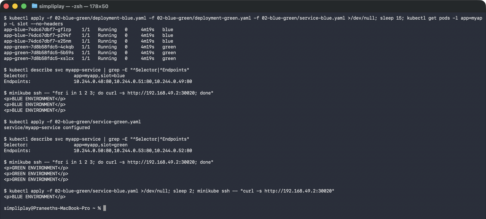

The endpoint list changed completely — three blue Pod IPs replaced by three green ones —
and **not one Pod was created, deleted or restarted**. All six were already running before
the switch and all six were still running after. The only thing that changed is which
label the Service selects.

That is what makes the cutover atomic: there is no window where some requests get v1 and
others get v2, because endpoints are replaced as a set. Compare Task 8's rolling update,
where mixed-version traffic is unavoidable by design.

The rollback is the same operation in reverse and just as fast, which is the real selling
point — a bad release is one `kubectl apply` away from being undone, with the old version
still warm. The cost is right there in the Pod list: 2x the compute, for as long as both
slots exist.

---

## Task 12: Canary

[`03-canary/`](03-canary/) puts both versions behind **one** Service. The trick is in the
selector: `service.yaml` matches `app: myapp-canary` and deliberately ignores the `track`
label, so stable and canary Pods land in the same endpoint pool.

```bash
kubectl apply -f 03-canary/deployment-stable.yaml -f 03-canary/service.yaml
kubectl apply -f 03-canary/deployment-canary.yaml
kubectl scale deployment app-canary --replicas=3 && kubectl scale deployment app-stable --replicas=7
kubectl scale deployment app-canary --replicas=0 && kubectl scale deployment app-stable --replicas=9
```

```
### 9 stable + 1 canary
   1 canary
   9 stable

### 20 requests
   2 CANARY v2
  18 STABLE v1      -> 10%

### scaled to 3 canary / 7 stable, 20 requests
   6 CANARY v2
  14 STABLE v1      -> 30%

### canary scaled to 0, 10 requests
  10 STABLE v1      -> 0%
```

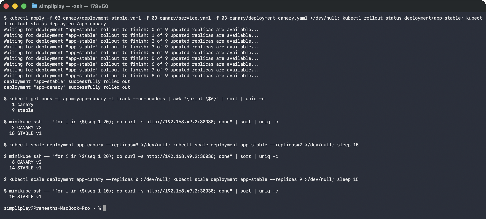

The split tracked the Pod ratio almost exactly — 10% at 1-in-10, 30% at 3-in-10 — because
that is literally all it is. kube-proxy picks an endpoint per connection with equal
probability, so the share of traffic a version receives is just its share of the
endpoints. There is no weighting knob anywhere.

Two consequences worth stating plainly:

**The granularity is limited by replica count.** 1 Pod in 10 is the finest split available
here; 1% would need 100 Pods. Real percentage-based routing needs an L7 proxy — an Ingress
controller or a service mesh — which splits by request, not by endpoint.

**Rollback is `--replicas=0`,** which took effect in seconds and needed no rollout, no
image change and no Service edit. That is the strength of the pattern: the blast radius is
bounded to the canary's share, and withdrawing it is the cheapest operation in Kubernetes.

Against Task 11's blue-green: canary needs one extra Pod instead of a duplicate fleet, but
exposes real users to the new version and cannot switch the whole fleet atomically.

---

## Task 13: Recreate, and the outage it causes

[`04-recreate/`](04-recreate/) sets `strategy.type: Recreate`. Polling once a second
through the update catches the gap:

```bash
kubectl apply -f 04-recreate/deployment-v1.yaml -f 04-recreate/service.yaml
kubectl apply -f 04-recreate/deployment-v2.yaml   # while the loop below runs
minikube ssh -- 'for i in $(seq 1 18); do curl -s --max-time 1 http://192.168.49.2:30040 \
  || echo "[OUTAGE] no pods serving"; sleep 1; done'
```

```
### before
VERSION: v1

### during the update
t+1  s [OUTAGE] no pods serving
t+2  s VERSION: v2 (UPGRADED)
t+3  s VERSION: v2 (UPGRADED)
...

### after rollout undo
VERSION: v1
```

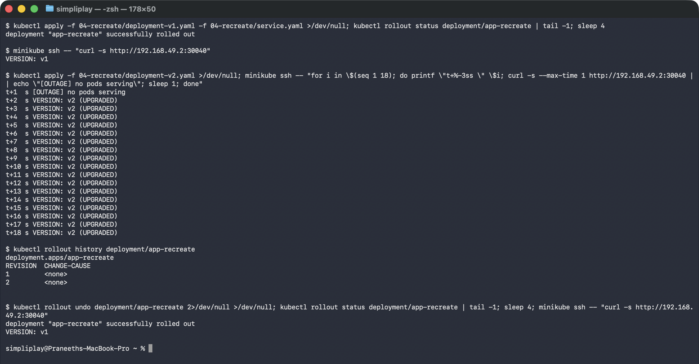

There it is: a request that got **nothing**. Not a slow response, not an old version — a
refused connection, because for that moment zero Pods existed. Every v1 Pod is terminated
before the first v2 Pod is created, so the endpoint list is briefly empty and kube-proxy
has nowhere to send traffic.

The window was about a second here because nginx starts almost instantly and there are
only three Pods. A real application with a 30-second boot would produce a 30-second
outage, and that is the honest trade-off — Recreate is the only strategy that guarantees
two versions never run simultaneously, which some workloads genuinely require: a schema
migration that would corrupt data if the old code kept writing, or anything holding a
single-writer lock.

Note that the rollback is *also* a Recreate, and so causes a second outage. Unlike
blue-green there is no warm fleet to switch back to.

---

## Cleanup

```bash
kubectl delete -f 01-rolling-update -f 02-blue-green -f 03-canary -f 04-recreate
kubectl delete -f troubleshooting/broken-image.yaml --ignore-not-found
kubectl delete -f statefulset.yml -f daemonset.yml -f replicaset.yml --ignore-not-found
kubectl delete pvc -l app=mysql          # volumeClaimTemplates PVCs outlive the StatefulSet
```

The PVC line is not optional housekeeping — deleting a StatefulSet deliberately leaves its
PersistentVolumeClaims behind so the data survives a recreate. They have to be removed
explicitly, and forgetting is how clusters quietly fill up.
