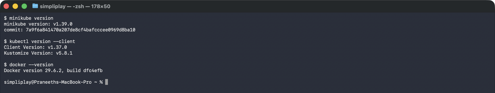
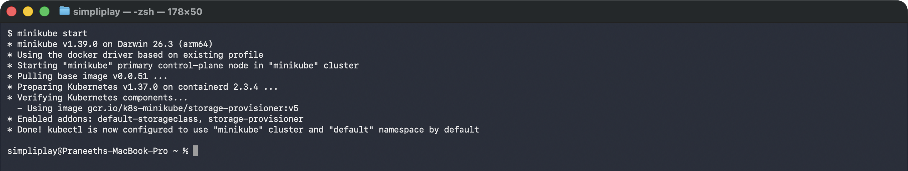
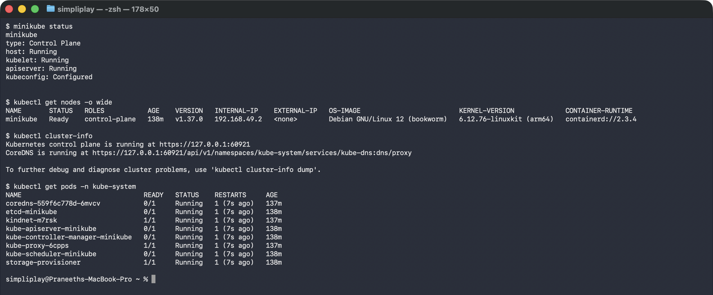
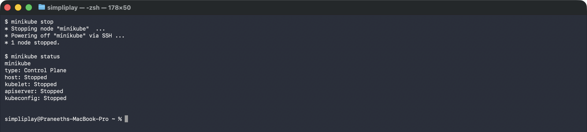

# Kubernetes Fundamentals

Installing Minikube, taking a single-node cluster through its full lifecycle, and reading
the architecture that lifecycle exercises.

**Environment:** macOS (Darwin 26.3, Apple silicon) with Docker Desktop as the Minikube
driver.

---

## Task 1: Minikube and kubectl are installed

```bash
minikube version
kubectl version --client
docker --version
```

```
minikube version: v1.39.0
commit: 7a9f6a841470a207de8cf4bafcccee0969d8ba10

Client Version: v1.37.0
Kustomize Version: v5.8.1

Docker version 29.6.2, build dfc4efb
```



`kubectl version --client` is deliberately client-only: it answers "is the CLI installed"
without needing a cluster to exist. Drop `--client` and it tries to reach an API server,
which fails before the cluster is started.

Docker matters here because it is the **driver** — Minikube does not create a VM on this
machine, it runs the whole Kubernetes node as a Docker container. That single fact explains
most of the networking behaviour in the later assignments, including
[why a NodePort is unreachable from the laptop](../kubernetes-services/#why-nodeport-fails-from-the-laptop).

---

## Task 2: Starting the cluster

```bash
minikube start
```

```
* minikube v1.39.0 on Darwin 26.3 (arm64)
* Using the docker driver based on existing profile
* Starting "minikube" primary control-plane node in "minikube" cluster
* Pulling base image v0.0.51 ...
* Preparing Kubernetes v1.37.0 on containerd 2.3.4 ...
* Verifying Kubernetes components...
  - Using image gcr.io/k8s-minikube/storage-provisioner:v5
* Enabled addons: default-storageclass, storage-provisioner
* Done! kubectl is now configured to use "minikube" cluster and "default" namespace by default
```



Worth being precise about what this output is: **"based on existing profile"** means this
is a restart, not a first-time provision. A genuinely fresh `minikube start` additionally
prints the steps that only happen once — creating the Docker container with its CPU and
memory allocation, generating certificates and keys, booting the control plane,
configuring RBAC rules, and configuring the bridge CNI. On a restart the node already
exists with all of that on disk, so Minikube just powers it back on.

Either way the last two lines are the ones that matter:

- **`Enabled addons: default-storageclass, storage-provisioner`** — these are what make
  PersistentVolumeClaims work, which is why the StatefulSet in
  [kubernetes-core-objects](../kubernetes-core-objects/) could bind `1Gi` volumes without
  any storage being configured by hand.
- **`kubectl is now configured`** — `minikube start` wrote the cluster's address and
  credentials into `~/.kube/config` and made it the current context. That is why `kubectl`
  works immediately afterwards with no flags.

---

## Task 3: Verifying the cluster

```bash
minikube status
kubectl get nodes -o wide
kubectl cluster-info
kubectl get pods -n kube-system
```

```
minikube
type: Control Plane
host: Running
kubelet: Running
apiserver: Running
kubeconfig: Configured

NAME       STATUS   ROLES           AGE    VERSION   INTERNAL-IP    OS-IMAGE                         CONTAINER-RUNTIME
minikube   Ready    control-plane   138m   v1.37.0   192.168.49.2   Debian GNU/Linux 12 (bookworm)   containerd://2.3.4

Kubernetes control plane is running at https://127.0.0.1:60921
CoreDNS is running at https://127.0.0.1:60921/api/v1/namespaces/kube-system/services/kube-dns:dns/proxy

NAME                              READY   STATUS    RESTARTS      AGE
coredns-559f6c778d-6mvcv          0/1     Running   1 (7s ago)    137m
etcd-minikube                     0/1     Running   1 (7s ago)    138m
kindnet-m7rsk                     1/1     Running   1 (7s ago)    137m
kube-apiserver-minikube           0/1     Running   1 (7s ago)    138m
kube-controller-manager-minikube  0/1     Running   1 (7s ago)    138m
kube-proxy-6cpps                  1/1     Running   1 (7s ago)    137m
kube-scheduler-minikube           0/1     Running   1 (7s ago)    138m
storage-provisioner               1/1     Running   1 (7s ago)    138m
```



`minikube status` reports the **host** (the Docker container), the **kubelet**, the
**apiserver** and the **kubeconfig** separately, which is genuinely useful when something
is half-broken — a Running host with a stopped apiserver is a very different problem from
a stopped host.

The `kube-system` listing is the best part of this task, because it is Task 5's diagram as
running processes: `etcd-minikube`, `kube-apiserver-minikube`, `kube-scheduler-minikube`
and `kube-controller-manager-minikube` are the control plane; `kube-proxy` and `kindnet`
are the per-node networking; `coredns` is cluster DNS.

Two details from this exact snapshot:

**`RESTARTS 1 (7s ago)` on everything** — because the cluster had just been stopped and
started seven seconds earlier. These are static Pods whose containers restarted with the
node.

**Several show `0/1 READY` while `Running`** — the containers were up but their readiness
probes had not passed yet, caught mid-startup. This is the same `Running ≠ Ready`
distinction the [readiness probe lab](../kubernetes-core-objects/#task-5-the-lifecycle-lab)
demonstrates deliberately; here it happened on its own.

`ROLES: control-plane` on the only node is the single-node shape — the control-plane taint
is removed so ordinary workloads schedule here too, which is why every Pod in the later
assignments lands on this one node.

---

## Task 4: Stopping the cluster

```bash
minikube stop
minikube status
```

```
* Stopping node "minikube"  ...
* Powering off "minikube" via SSH ...
* 1 node stopped.

minikube
type: Control Plane
host: Stopped
kubelet: Stopped
apiserver: Stopped
kubeconfig: Stopped
```



`minikube stop` powers the node off but keeps it on disk — the container, its pulled images
and any PersistentVolume data all survive, and `minikube start` brings the same cluster
back (which is exactly what Task 2 captured). That is the difference from `minikube
delete`, which destroys the node and forces a full re-provision and image re-pull.

---

## Task 5: Cluster architecture

A Kubernetes cluster splits into a **control plane** that decides what should be
running, and **worker nodes** that actually run it. Every component below is a
control loop: read the desired state, compare it to reality, act on the gap.

```
+-------------------------------------------------------------------------+
|                          CONTROL PLANE                                  |
|                                                                         |
|   +---------------+      +------------------+      +----------------+   |
|   |     etcd      |<---->|  kube-apiserver  |<---->| kube-scheduler |   |
|   | desired state |      |  the only door   |      |   placement    |   |
|   +---------------+      +--------+---------+      +----------------+   |
|                                   |                                     |
|                                   v                                     |
|                     +--------------------------+                        |
|                     | kube-controller-manager  |                        |
|                     |   reconciliation loops   |                        |
|                     +--------------------------+                        |
+-----------------------------------+-------------------------------------+
                                    | (kubelet watches the API server)
                +-------------------+-------------------+
                v                                       v
    +-----------------------------+        +-----------------------------+
    |        WORKER NODE 1        |        |        WORKER NODE 2        |
    |  +---------+ +-----------+  |        |  +---------+ +-----------+  |
    |  | kubelet | | kube-proxy|  |        |  | kubelet | | kube-proxy|  |
    |  +----+----+ +-----+-----+  |        |  +----+----+ +-----+-----+  |
    |       v            v        |        |       v            v        |
    |  +------------------------+ |        |  +------------------------+ |
    |  | container runtime (CRI)| |        |  | container runtime (CRI)| |
    |  +------------------------+ |        |  +------------------------+ |
    |       v                     |        |       v                     |
    |  +---------+ +---------+    |        |  +---------+ +---------+    |
    |  |  Pod A  | |  Pod B  |    |        |  |  Pod C  | |  Pod D  |    |
    |  +---------+ +---------+    |        |  +---------+ +---------+    |
    +-----------------------------+        +-----------------------------+
```

On this Minikube cluster all of it runs on a single node, which is both control
plane and worker — that is what the `control-plane` role in `kubectl get nodes`
means, and why there is no separate machine to point at.

### Control plane

**`kube-apiserver`** — the only component anything talks to. It serves the REST
API, authenticates and authorises every request, validates objects, and is the
sole writer to etcd. `kubectl`, the scheduler, the controllers and every kubelet
all go through it. Nothing else touches etcd directly, which is why the API
server is the single place to enforce policy.

**`etcd`** — a distributed key-value store holding the entire cluster state:
every object, its spec and its status. It is the only stateful component, and
the only one whose loss actually loses data — backing up a cluster means backing
up etcd.

**`kube-scheduler`** — watches for Pods with no `nodeName` and picks a node for
each. It filters nodes that *can* run the Pod (resource requests, taints,
affinity, node selectors), scores the survivors, and writes the winner back
through the API server. It does not start anything; it only decides where.
A Pod stuck in `Pending` usually means this step found nowhere to put it.

**`kube-controller-manager`** — one binary running many reconciliation loops.
The Node controller notices unreachable nodes and evicts their Pods; the
ReplicaSet controller creates or deletes Pods until the count matches; the
EndpointSlice controller keeps Service endpoints tracking live Pod IPs. Each
watches the API server and writes corrections back to it.

### Worker node

**`kubelet`** — the agent on every node. It watches the API server for Pods
assigned to *its* node, tells the container runtime to pull images and start
containers, runs the liveness/readiness/startup probes, and reports status back.
It manages only Pods it was given; it never schedules.

**`kube-proxy`** — programs the node's packet-forwarding rules (iptables or IPVS)
so that traffic to a Service's virtual IP is rewritten to one of the backing Pod
IPs. This is why a ClusterIP is reachable from inside the cluster and nowhere
else: the IP exists only as forwarding rules on nodes.

**Container runtime (CRI)** — what actually runs containers. Kubernetes talks to
it over the Container Runtime Interface, so `containerd` (used here — see
`CONTAINER-RUNTIME` in the node output above), CRI-O or others are
interchangeable. The old built-in Docker shim was removed in v1.24.

**Pod** — the smallest schedulable unit: one or more containers sharing a network
namespace (one IP, one port space) and volumes. Containers in a Pod reach each
other on `localhost` and are always scheduled together.

### How a `kubectl apply` actually flows

1. `kubectl` POSTs the object to **kube-apiserver**, which authenticates,
   validates and persists it to **etcd**. At this point the object exists but
   nothing is running.
2. The **controller-manager** sees a Deployment with no ReplicaSet and creates
   one; the ReplicaSet controller sees no Pods and creates them — still
   unscheduled.
3. The **scheduler** sees Pods with no node, picks one, and patches `nodeName`.
4. That node's **kubelet** sees a Pod assigned to it and asks the **runtime** to
   pull the image and start containers.
5. **kube-proxy** picks up any Service endpoints that now point at the new Pod.

Every arrow is a watch on the API server, not a direct call. That is why the
failure in [the ImagePullBackOff lab](../kubernetes-core-objects/#task-3-errimagepull-and-imagepullbackoff) is a *runtime* failure with a perfectly
healthy API object — steps 1–3 all succeeded, and step 4 is where it broke.
