# Ingress, ConfigMaps and Secrets

Getting configuration out of the container image, keeping credentials out of it too, and
putting one HTTP router in front of several Services.

**Environment:** Minikube v1.39.0 with the Docker driver on macOS (Apple silicon),
Kubernetes v1.37.0, `ingress-nginx` via `minikube addons enable ingress`.

**The app.** Two tiers, deliberately split by what they need:

| | Image | Reads config? | Service |
|---|---|---|---|
| `yatri-frontend` | `nginx:1.27-alpine` | no | `yatri-frontend-svc` (ClusterIP :80) |
| `yatri-backend` | `python:3.12-alpine` | yes — ConfigMap **and** Secret | `yatri-backend-svc` (ClusterIP :8080) |

The backend serves a plain-text page listing the environment variables it was given, which
is what makes the injection in Task 6 visible from outside the cluster.

---

## Task 1: ConfigMaps

[`01-configmap/app-config.yaml`](01-configmap/app-config.yaml) holds five non-sensitive
settings.

```bash
kubectl apply -f 01-configmap/app-config.yaml
kubectl describe configmap yatri-app-config
kubectl get configmap yatri-app-config -o jsonpath='{.data.ENVIRONMENT}'
```

```
Name:         yatri-app-config
Data
====
DEFAULT_CURRENCY:  INR
ENVIRONMENT:       production
LOG_LEVEL:         INFO
MAX_BOOKING_DAYS:  90
PORT:              8080

### jsonpath query for one key
production
```

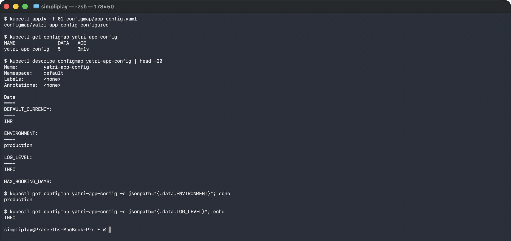

The point of the object is that none of these values are in the image. The same
`python:3.12-alpine` runs in dev, staging and production; only the ConfigMap differs. Note
that every value is a **string** — `PORT: "8080"` is quoted, because ConfigMap values are
strings and an unquoted `8080` would be a YAML integer and rejected.

---

## Task 2: A ConfigMap change does not reach a running Pod

This is the one that surprises people.

```bash
kubectl patch configmap yatri-app-config --type merge -p '{"data":{"ENVIRONMENT":"staging"}}'
kubectl exec deploy/yatri-backend -- env | grep ENVIRONMENT      # still production
kubectl rollout restart deployment/yatri-backend
kubectl exec deploy/yatri-backend -- env | grep ENVIRONMENT      # now staging
```

```
### before
ENVIRONMENT=production

### after patching the ConfigMap
configmap/yatri-app-config patched
staging       <- the ConfigMap changed

### the running Pod, five seconds later
ENVIRONMENT=production      <- the running Pod did NOT

### after rollout restart
deployment "yatri-backend" successfully rolled out
ENVIRONMENT=staging         <- new Pods picked it up
```

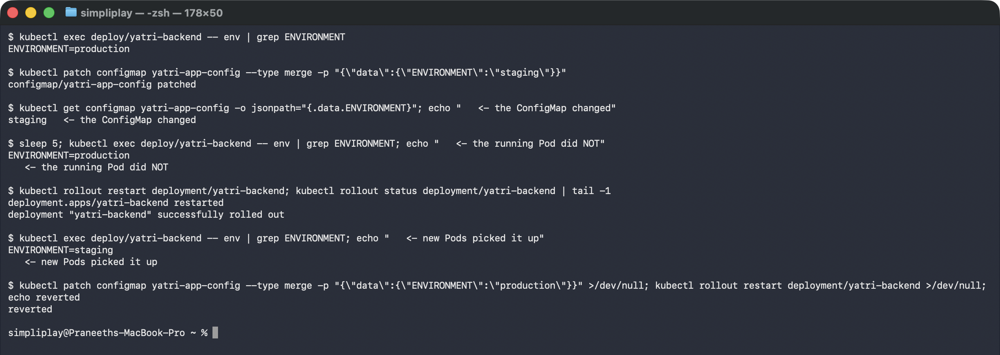

**Environment variables are copied into the container at creation time.** They are a
snapshot, not a live reference — the process has them in its own memory and nothing can
change them from outside. Waiting longer does not help; the value would never update.

`kubectl rollout restart` is the fix, and it is a normal rolling update: new Pods are
created with the current ConfigMap, old ones drain, and capacity is maintained throughout.

Worth knowing: a ConfigMap mounted as a **volume** behaves differently — the kubelet
refreshes the files within a minute or so, without a restart. That only helps if the
application re-reads the file, which most do not. Environment variables are the common case
and they always need the restart.

---

## Task 3: Secrets, and what base64 is for

[`02-secret/db-secret.yaml`](02-secret/db-secret.yaml) is an `Opaque` Secret with two keys.

```bash
kubectl apply -f 02-secret/db-secret.yaml
kubectl describe secret yatri-db-secret
kubectl get secret yatri-db-secret -o jsonpath='{.data.POSTGRES_PASSWORD}' | base64 --decode
```

```
### describe hides the values
Type:  Opaque
Data
====
POSTGRES_PASSWORD:  14 bytes
POSTGRES_USER:      11 bytes

### the stored value
c2VjcmV0cGFzc3dvcmQ=      <- stored value

### one command to get it back
secretpassword            <- decoded in one command
yatri_admin
```

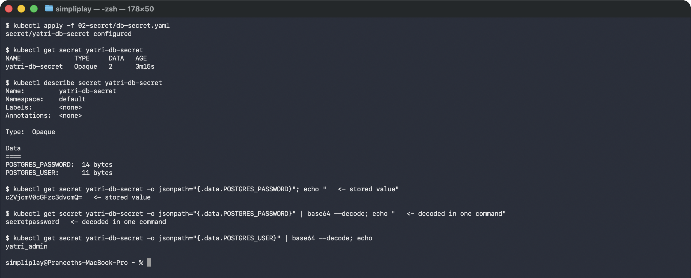

`kubectl describe` prints `14 bytes` instead of the value, which looks like protection and
is not — it keeps passwords out of terminal scrollback and screen shares, nothing more. The
very next command retrieves the plaintext, and any user who can `get secrets` can do the
same.

**Base64 is an encoding, not encryption.** It is there so the field can carry arbitrary
bytes — binary TLS keys, certificates, values with newlines — inside a JSON string. It
provides exactly zero secrecy. What actually protects a Secret is RBAC on the object,
encryption at rest in etcd, and not committing it to Git (Task 5).

---

## Task 4: The trailing-newline bug

The classic way to create a Secret that looks right and fails authentication.

```bash
echo   "secretpassword" | xxd | tail -1
printf "secretpassword" | xxd | tail -1
echo   "secretpassword" | base64
printf "secretpassword" | base64
```

```
### echo appends 0x0a
00000000: 7365 6372 6574 7061 7373 776f 7264 0a    secretpassword.
                                             ^^ the newline

### printf does not
00000000: 7365 6372 6574 7061 7373 776f 7264       secretpassword

### and the encodings differ
wrong: c2VjcmV0cGFzc3dvcmQK   right: c2VjcmV0cGFzc3dvcmQ=

### decoding the wrong one shows the newline survived
00000000: 7365 6372 6574 7061 7373 776f 7264 0a    secretpassword.
```

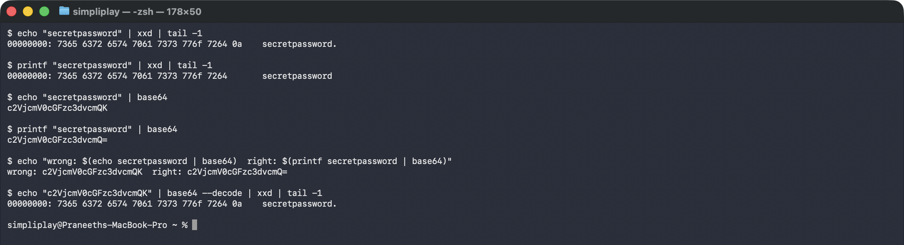

`echo` adds a newline. `base64` faithfully encodes it, Kubernetes faithfully stores it, and
the application faithfully sends `secretpassword\n` to the database — which rejects it.

The tell is in the last two characters: `...Q=` is 14 bytes, `...QK` is 15. The `K` **is**
the newline. Once you have seen it, a Secret ending in `K` where you expected `=` is worth
a second look.

The failure is nasty because everything looks correct. The manifest is valid, the Secret
exists, `describe` shows a plausible byte count, the env var is present in the container —
and authentication fails with no clue why. Two ways to avoid it:

```bash
printf 'secretpassword' | base64          # no trailing newline
echo -n 'secretpassword' | base64         # same, but -n is not portable across shells

kubectl create secret generic yatri-db-secret \
  --from-literal=POSTGRES_PASSWORD=secretpassword    # kubectl encodes it for you
```

The last one is the real advice: let `kubectl create secret` do the encoding and the bug
cannot happen. The manifests here are hand-written only so the encoded values are visible.
## Task 5: How secrets are actually handled in production

Everything in [02-secret/](02-secret/) is fine for a lab and wrong for production. The
object in that file is committed to Git with the password recoverable by anyone who can
read the repository.

**Why committing a Secret manifest is the problem, specifically:**

- Base64 is not encryption. `git show` plus one `base64 --decode` is the whole attack.
- Git history is permanent. Rotating the password later does not remove the old one from
  history — every clone keeps it forever, and rewriting history across a team is painful.
- Repository access is much broader than cluster access. Anyone with read access to the
  repo — including CI runners, forks and integrations — effectively has the database
  password, which is not what the cluster's RBAC says.
- There is no rotation story. The value only changes when a human edits YAML.

**What replaces it.** The secret lives in a dedicated store, and something inside the
cluster fetches it at runtime:

```
  AWS Secrets Manager  /  Azure Key Vault  /  HashiCorp Vault
                 │  (the only place the real value lives;
                 │   versioned, audited, rotated on a schedule)
                 ▼
     External Secrets Operator  or  Vault Agent Injector
                 │  (runs in-cluster, authenticates with a
                 │   workload identity, polls for changes)
                 ▼
          a normal Kubernetes Secret, created at runtime
                 │
                 ▼
        Pod  ──  envFrom / secretKeyRef / mounted volume
```

The Pod spec does not change at all — it still references a Secret by name. What changes
is that the Secret is *produced* in the cluster rather than committed. Git holds an
`ExternalSecret` object that names which key to fetch from which store, and contains no
secret value.

**In the pipeline.** The same principle: the CI system holds a reference, not a value.
GitHub Actions secrets and Azure DevOps variable groups inject values as masked environment
variables at job runtime, so the manifest in the repository carries a placeholder and the
real value never touches source control.

**Two things worth knowing about Kubernetes Secrets themselves**, independent of where the
value comes from:

- By default they are stored **unencrypted** in etcd. Encryption at rest is a separate
  cluster-level setting (`EncryptionConfiguration`), not something the Secret object turns
  on.
- Anyone who can create a Pod in a namespace can mount any Secret in that namespace. RBAC
  on the Secret itself is not sufficient; Pod-creation rights are equivalent to read access.


---

## Task 6: Injecting both into one Pod

[`04-full-demo/backend.yaml`](04-full-demo/backend.yaml) uses the two mechanisms
side by side, and the difference is deliberate:

```yaml
envFrom:
  - configMapRef:
      name: yatri-app-config        # bulk: every key becomes an env var
env:
  - name: POSTGRES_PASSWORD         # granular: named one at a time
    valueFrom:
      secretKeyRef:
        name: yatri-db-secret
        key: POSTGRES_PASSWORD
```

```
### what the Deployment declares
yatri-app-config  <- envFrom (bulk)
POSTGRES_USER=yatri-db-secret/POSTGRES_USER
POSTGRES_PASSWORD=yatri-db-secret/POSTGRES_PASSWORD

### what the container actually got
DEFAULT_CURRENCY=INR
ENVIRONMENT=production
LOG_LEVEL=INFO
MAX_BOOKING_DAYS=90
POSTGRES_PASSWORD=secretpassword
POSTGRES_USER=yatri_admin
```

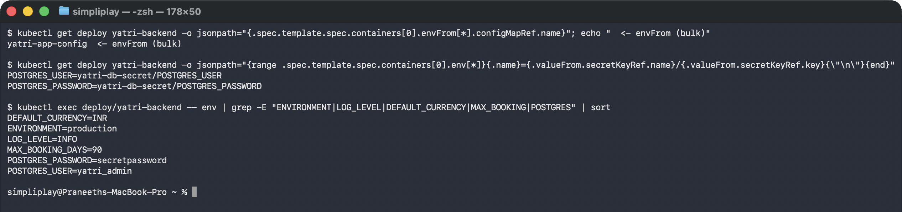

Both sources land in one flat environment — by the time the process reads
`os.getenv("POSTGRES_PASSWORD")` there is no trace of which object it came from.

`envFrom` is convenient and slightly dangerous: adding a key to the ConfigMap silently adds
an env var to every Pod that imports it, including one that shadows something the image
relies on. For secrets the explicit `secretKeyRef` form is the better default anyway —
it documents exactly which credentials a workload consumes, which is what an auditor asks
for.

Note the password is readable via `kubectl exec ... env`. Anyone who can exec into a Pod
can read every secret that Pod holds; that is a property of the Pod, not a weakness of
Secrets, and it is why exec rights in production are restricted.

## Task 7: Ingress resource vs Ingress controller

Two different things with confusingly similar names. The resource is data; the controller
is a program.

| | Ingress **resource** | Ingress **controller** |
|---|---|---|
| What it is | a Kubernetes API object — YAML | a Pod running a reverse proxy |
| What it does on its own | **nothing** | watches the API for Ingress objects |
| Contains | hostnames, paths, TLS secret refs, backend Services | NGINX/Traefik/HAProxy/Envoy, plus a control loop |
| Installed by | you, with `kubectl apply` | a cluster addon or Helm chart |
| How many | one per app or per team | usually one per cluster |
| Here | [04-full-demo/ingress.yaml](04-full-demo/ingress.yaml), [03-ingress/ingress-tls.yaml](03-ingress/ingress-tls.yaml) | `ingress-nginx-controller` in the `ingress-nginx` namespace |

The loop between them:

```
you: kubectl apply -f ingress.yaml
        │
        ▼
   API server stores the Ingress object
        │  (the controller is watching)
        ▼
   ingress-nginx-controller reads the rules,
   generates an nginx.conf, reloads nginx
        │
        ▼
   traffic to the controller's IP is now routed
   by Host header and path to the right Service
```

The consequence that catches people out: **applying an Ingress to a cluster with no
controller does nothing at all**. The object is accepted, `kubectl get ingress` lists it,
and its `ADDRESS` column stays empty forever — exactly the way `type: LoadBalancer` stays
`<pending>` without a cloud provider. There is no error, because the object is valid; it
is simply that nothing is listening for it.

```bash
kubectl api-resources | grep -i ingress
kubectl get ingressclass
```

```
ingressclasses        networking.k8s.io/v1   false   IngressClass
ingresses        ing  networking.k8s.io/v1   true    Ingress

NAME             CONTROLLER             PARAMETERS   AGE
nginx (default)  k8s.io/ingress-nginx   <none>       5m7s

### which controller claims this rule set
nginx
```

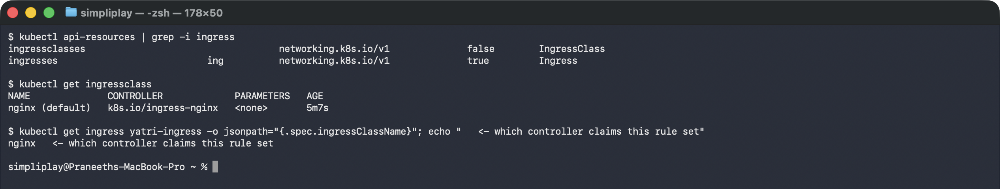

`ingressClassName: nginx` is what claims a rule set for a particular controller. A cluster
can run several (say `nginx` for public traffic and an internal one for private), and the
class is how each controller knows which Ingress objects are its own. The `(default)`
marker means an Ingress that omits `ingressClassName` is handed to this one — convenient,
and a trap on a cluster with more than one class.

---

## Task 8: Enabling the NGINX Ingress Controller

```bash
minikube addons enable ingress
kubectl get pods -n ingress-nginx
kubectl wait --namespace ingress-nginx --for=condition=ready pod \
  --selector=app.kubernetes.io/component=controller --timeout=120s
```

```
NAME                                       READY   STATUS      RESTARTS   AGE
ingress-nginx-admission-create-lhvsx       0/1     Completed   0          31s
ingress-nginx-admission-patch-dx9lx        0/1     Completed   0          31s
ingress-nginx-controller-d7cd8c989-ks4lq   1/1     Running     0          30s

pod/ingress-nginx-controller-d7cd8c989-ks4lq condition met
```

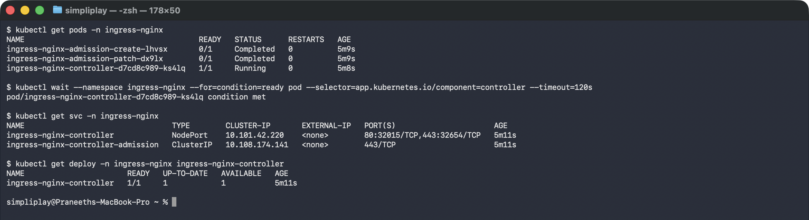

Three Pods, but only one is a server. The two `admission-*` Pods are Jobs that ran once and
are `Completed` — they generate the TLS certificate for the **validating admission
webhook**, which is what catches a malformed Ingress at `kubectl apply` time rather than
silently ignoring it later.

`kubectl wait` matters in scripts: the controller needs a few seconds before it will accept
Ingress objects, and applying one too early fails with a webhook connection error. Waiting
on the condition is more reliable than sleeping.

---

## Task 9: Name resolution, and why `/etc/hosts` is not enough here

```
$ minikube ip
192.168.49.2

$ grep -E "yatri|campus" /etc/hosts
(no entry -- see the note in the README)

### from the Mac, straight at the ingress
from the Mac to the ingress: HTTP 000
curl exit: 28 (28 = timed out, no route)

### the same request from inside the node
from inside the node: HTTP 200
```

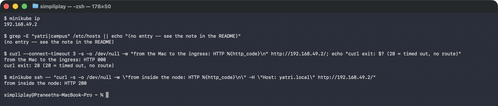

The assignment's step is to map the hostname in `/etc/hosts`:

```bash
echo "$(minikube ip)  yatri.local portal.campus.local api.campus.local" | sudo tee -a /etc/hosts
```

**I have not run that, for two reasons.** It needs `sudo`, so it is a change to your machine
rather than to the cluster — that is your call, not mine. More importantly, on this setup it
would not actually work: the third command above shows `192.168.49.2` timing out from macOS
with **exit 28, no route**, exactly as in
[the NodePort analysis](../kubernetes-services/#why-nodeport-fails-from-the-laptop).
`/etc/hosts` only maps a name to an address; it cannot create a route to one. With the
Docker driver the ingress would still be unreachable from the host.

So every request in the tasks below uses one of two equivalent substitutes, both of which
do exactly what a hosts entry does — tell the client which IP to use for a name:

```bash
curl -H "Host: yatri.local" http://192.168.49.2/                    # HTTP: set the header
curl --resolve portal.campus.local:443:192.168.49.2 https://...     # HTTPS: needed for SNI
```

For HTTPS the `--resolve` form is required rather than optional: the server picks its
certificate from the TLS SNI name, which is set from the URL, and a `Host:` header is sent
too late to influence it.

If you do want browser access from the Mac, `minikube tunnel` (a separate terminal, with
`sudo`) adds the missing route — and then a `/etc/hosts` entry becomes useful.

---

## Task 10: Path-based routing

[`04-full-demo/ingress.yaml`](04-full-demo/ingress.yaml) puts both tiers under one hostname.

```
NAME            CLASS   HOSTS         ADDRESS        PORTS   AGE
yatri-ingress   nginx   yatri.local   192.168.49.2   80      3m24s

Rules:
  Host         Path            Backends
  yatri.local
               /api(/|$)(.*)   yatri-backend-svc:8080  (10.244.0.20:8080,10.244.0.21:8080)
               /               yatri-frontend-svc:80   (10.244.0.16:80,10.244.0.17:80)
Annotations:   nginx.ingress.kubernetes.io/rewrite-target: /$2

### GET /
<title>Yatri frontend</title><h1>Yatri frontend (tier=frontend)</h1>

### GET /api/bookings
yatri-backend API
path: /bookings
ENVIRONMENT: production
...
```

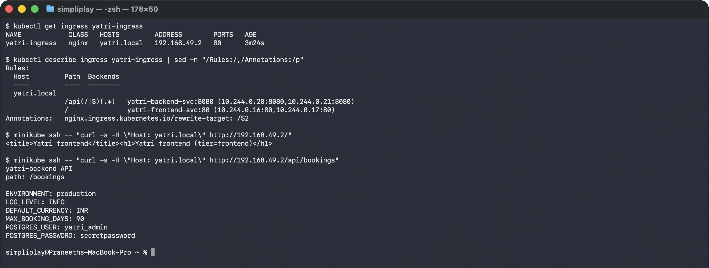

Two things to read carefully.

**`path: /bookings`, not `/api/bookings`.** The request went to `/api/bookings`; the backend
received `/bookings`. That is `rewrite-target: /$2` at work — the regex `/api(/|$)(.*)`
captures everything after `/api` into group 2, and the rewrite replaces the whole path with
it. Without it the backend would receive `/api/bookings` and 404, because it knows nothing
about being mounted under `/api`.

**The Backends column lists Pod IPs, not the Service IP.** ingress-nginx reads the
EndpointSlices and proxies straight to Pods, bypassing kube-proxy entirely. The Service is
used for *discovery*, not as a hop — which is why an Ingress can do sticky sessions and
per-request load balancing that a ClusterIP cannot.

Rule order matters: `/api(/|$)(.*)` must come before `/`, or the catch-all would swallow
API requests.

---

## Task 11: Host-based routing, and Task 12: both together

[`03-ingress/ingress-tls.yaml`](03-ingress/ingress-tls.yaml) is a single Ingress doing
host-based *and* path-based routing, with TLS on both hostnames.

```
NAME                 CLASS   HOSTS                                 ADDRESS        PORTS     AGE
campus-ingress-tls   nginx   portal.campus.local,api.campus.local  192.168.49.2   80, 443   2m44s

### https://portal.campus.local/        -> frontend
<title>Yatri frontend</title><h1>Yatri frontend (tier=frontend)</h1>

### https://api.campus.local/api/trips  -> backend, path rewritten
yatri-backend API
path: /trips

### https://api.campus.local/           -> falls through to frontend
<title>Yatri frontend</title><h1>Yatri frontend (tier=frontend)</h1>

### plain HTTP on a TLS-enabled host
plain HTTP on a TLS host: HTTP 308
```

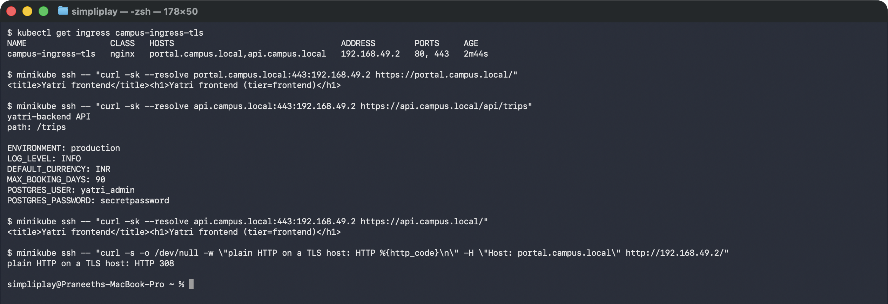

Both hostnames resolve to the **same** `192.168.49.2`. Nothing about the network
distinguishes them — the controller reads the `Host` header (or the TLS SNI name) and picks
a rule set. That is the entire mechanism behind "one load balancer, many domains", and it is
why the cost argument in
[the Service decision tree](../kubernetes-services/#choosing-a-service-type) works out.

`api.campus.local` carries both kinds of rule at once: `/api/*` to the backend, everything
else to the frontend. Host-based and path-based routing are not alternatives; they compose.

The **308** is worth knowing: once a host appears under `spec.tls`, ingress-nginx redirects
its plain-HTTP traffic to HTTPS automatically (`ssl-redirect` defaults to on). A client
that does not follow redirects sees a 308 rather than content, which looks like a routing
bug and is not.

```
### the full rule table, from kubectl describe
TLS:
  campus-tls-cert terminates portal.campus.local,api.campus.local
Rules:
  Host                 Path            Backends
  portal.campus.local  /()(.*)         yatri-frontend-svc:80
  api.campus.local     /api(/|$)(.*)   yatri-backend-svc:8080
                       /()(.*)         yatri-frontend-svc:80
```

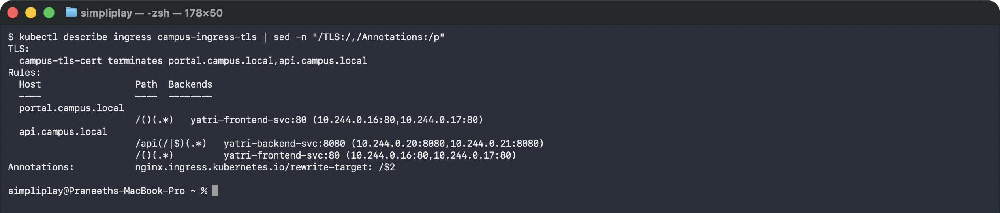

---

## Task 13: TLS termination

The certificate is generated locally and stored as a `kubernetes.io/tls` Secret. Both
hostnames go in the SAN, or clients get a name mismatch:

```bash
openssl req -x509 -nodes -days 365 -newkey rsa:2048 \
  -keyout tls.key -out tls.crt \
  -subj "/CN=campus.local/O=CampusDevOps" \
  -addext "subjectAltName=DNS:portal.campus.local,DNS:api.campus.local"

kubectl create secret tls campus-tls-cert --cert=tls.crt --key=tls.key
```

```
NAME              TYPE                DATA   AGE
campus-tls-cert   kubernetes.io/tls   2      2m51s

subject=CN=campus.local, O=CampusDevOps
issuer=CN=campus.local, O=CampusDevOps
notBefore=Sep 18 21:10:33 2026 GMT
notAfter=Sep 18 21:10:33 2027 GMT

X509v3 Subject Alternative Name:
    DNS:portal.campus.local, DNS:api.campus.local

### the handshake
* SSL connection using TLSv1.3 / TLS_AES_256_GCM_SHA384
*  subject: CN=campus.local; O=CampusDevOps
*  issuer: CN=campus.local; O=CampusDevOps
< HTTP/2 200
```

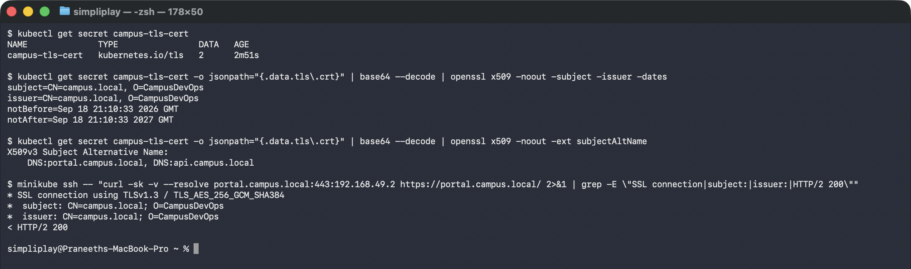

`subject == issuer` is the definition of self-signed, and it is why `curl -k` is needed —
no CA vouches for this certificate. In production the Secret is produced by cert-manager
from Let's Encrypt or an internal CA; the Ingress side does not change at all, only where
the Secret comes from.

`type: kubernetes.io/tls` is not cosmetic. Unlike `Opaque` it is validated: the two keys
must be `tls.crt` and `tls.key`, and Kubernetes checks the key actually matches the
certificate. A mismatched pair is rejected at creation rather than at the first handshake.

**TLS is terminated at the ingress controller.** Traffic from the controller to the Pods is
plain HTTP over the cluster network — which is normally what you want (one place to manage
certificates), but is worth being explicit about if the threat model includes the cluster
network itself.

The private key is generated locally and **not committed**; [`.gitignore`](.gitignore)
excludes `tls.key` and `tls.crt`. Regenerate them with the command above.

---

## Task 14: The automation scripts

[`04-full-demo/run-demo.sh`](04-full-demo/run-demo.sh) brings the stack up in dependency
order; [`04-full-demo/cleanup.sh`](04-full-demo/cleanup.sh) tears it down by label.

```bash
bash 04-full-demo/cleanup.sh
bash 04-full-demo/run-demo.sh
```

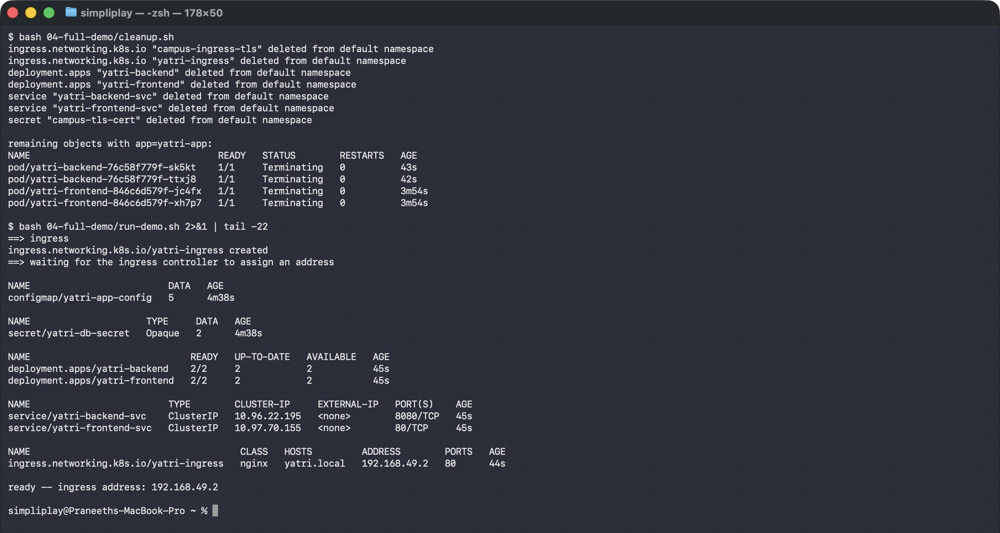

Three things the scripts encode that are easy to get wrong by hand:

**Order.** ConfigMap and Secret are applied *before* the Deployments. A Pod whose
`envFrom` names a ConfigMap that does not exist yet does not wait politely — it fails with
`CreateContainerConfigError` and has to be restarted.

**Waiting.** `kubectl apply` returns as soon as the object is stored, not when the app is
serving. `kubectl rollout status` is what makes the script mean "it is up".

**One label to delete by.** Every object carries `app: yatri-app`, so cleanup is a single
selector rather than a list of names that drifts out of date. (The Pods still showing
`Terminating` in the capture are mid-shutdown — `kubectl delete` returns once the deletion
is recorded, not once the last container has exited.) That is also why the
standalone ConfigMap and Secret in [01-configmap/](01-configmap/) and [02-secret/](02-secret/)
carry the same label.

The multi-document YAML (`---` separating a Deployment and its Service in one file) is the
same idea: the two objects always change together, so they live together and cannot be
applied separately by accident.

---

## Cleanup

```bash
bash 04-full-demo/cleanup.sh
kubectl delete ingress campus-ingress-tls --ignore-not-found
kubectl delete secret campus-tls-cert --ignore-not-found
minikube addons disable ingress
```
