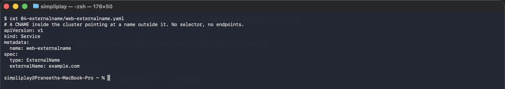
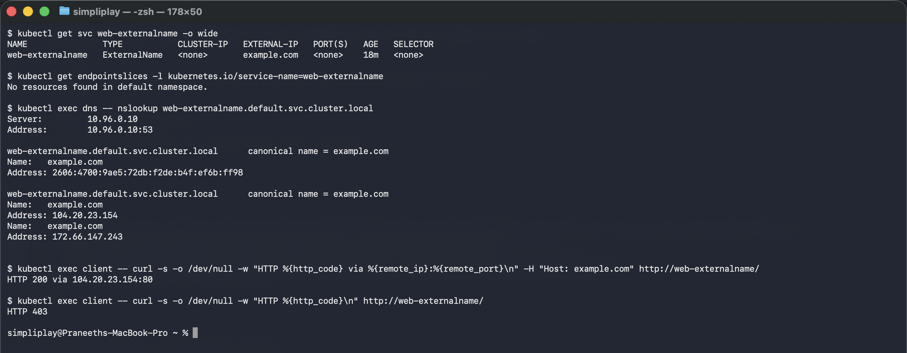

# ExternalName

An ExternalName Service has no selector, no ClusterIP, no EndpointSlice and no kube-proxy
rules. It is purely a DNS record: CoreDNS answers
`web-externalname.default.svc.cluster.local` with a CNAME pointing at whatever `externalName`
says.

The use case is giving an outside dependency — a managed database, a partner API, an S3
endpoint — a stable name inside the cluster. Application config says `db`, and when the real
hostname changes you edit one Service instead of every Deployment.

## Manifest

[`web-externalname.yaml`](web-externalname.yaml): `type: ExternalName`, `externalName:
example.com`, and nothing else. No `ports`, because there is nothing to proxy.

```bash
kubectl apply -f 04-externalname/web-externalname.yaml
```



## Nothing where the other types have something

```
### kubectl get svc web-externalname -o wide
NAME               TYPE           CLUSTER-IP   EXTERNAL-IP   PORT(S)   AGE   SELECTOR
web-externalname   ExternalName   <none>       example.com   <none>    5s    <none>

### endpointslices for it
No resources found in default namespace.
```

`CLUSTER-IP` is `<none>`, `SELECTOR` is `<none>`, `PORT(S)` is `<none>`, and no EndpointSlice
was created. The `EXTERNAL-IP` column is showing a hostname, not an IP — the column heading is
just being reused.

## The CNAME

```
### nslookup
Server:		10.96.0.10
Address:	10.96.0.10:53

web-externalname.default.svc.cluster.local	canonical name = example.com
Name:	example.com
Address: 2606:4700:9ae5:72db:f2de:b4f:ef6b:ff98

web-externalname.default.svc.cluster.local	canonical name = example.com
Name:	example.com
Address: 104.20.23.154
Name:	example.com
Address: 172.66.147.243
```

CoreDNS served the CNAME, then followed it out to the upstream resolver, which returned
example.com's real A and AAAA records. The whole Service is that one line of redirection.

## The caveat that bites people

```
### curl through the alias
HTTP 200 via 104.20.23.154:80

### curl without the Host header
HTTP 403
```

```bash
kubectl exec client -- curl -s -o /dev/null -w "HTTP %{http_code} via %{remote_ip}:%{remote_port}\n" -H "Host: example.com" http://web-externalname/
kubectl exec client -- curl -s -o /dev/null -w "HTTP %{http_code}\n" http://web-externalname/
```



Same connection, same server, two different answers. curl sets `Host: web-externalname` by
default, and the server on the other end has never heard of that name, so it refuses with 403.
Force the real hostname and it returns 200.

ExternalName rewrites **DNS**, not the request. Anything that depends on the hostname
travelling with the request — HTTP virtual hosting, TLS SNI and certificate validation — sees
the alias, not the target. For an HTTPS endpoint this usually shows up as a certificate name
mismatch. That is the standard reason to reach for an ExternalName pointing at an internal
name, or an Ingress/egress gateway, rather than aliasing a public HTTPS service.

Note also that `remote_ip` is a real public IP: unlike every other type here, traffic leaves
the cluster entirely.
