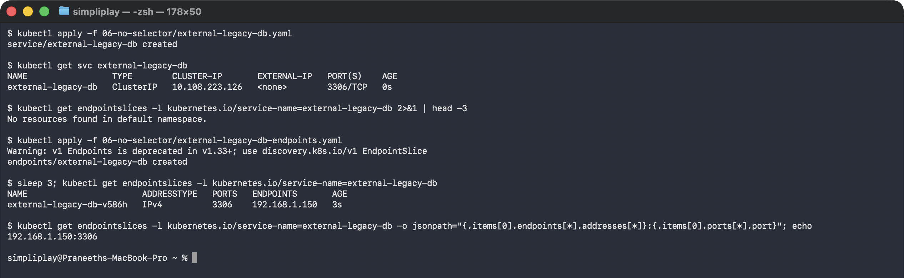

# Services without selectors

Every Service in the folders above finds its backends by selector. This one has none.
Kubernetes still allocates a ClusterIP and still programs kube-proxy — it just has no way
to discover endpoints, so you supply them yourself.

The use case is a backend that is not a Pod: a managed database, a VM that has not been
migrated yet, an appliance, a service in another cluster. The application dials an ordinary
in-cluster name and never learns that the thing on the other end is outside.

## Manifests

[`external-legacy-db.yaml`](external-legacy-db.yaml) — a ClusterIP Service with `ports`
but **no `selector`**.

[`external-legacy-db-endpoints.yaml`](external-legacy-db-endpoints.yaml) — the hand-written
backend list. The `metadata.name` must equal the Service name; that is the only thing
linking them.

```bash
kubectl apply -f 06-no-selector/external-legacy-db.yaml
kubectl apply -f 06-no-selector/external-legacy-db-endpoints.yaml
```

## Empty, then populated

```
### the Service exists and has a ClusterIP
NAME                 TYPE        CLUSTER-IP      EXTERNAL-IP   PORT(S)    AGE
external-legacy-db   ClusterIP   10.108.223.126  <none>        3306/TCP   0s

### endpointslices before the Endpoints object
No resources found in default namespace.

### applying the Endpoints object
Warning: v1 Endpoints is deprecated in v1.33+; use discovery.k8s.io/v1 EndpointSlice
endpoints/external-legacy-db created

### endpointslices after -- mirrored automatically
NAME                       ADDRESSTYPE   PORTS   ENDPOINTS       AGE
external-legacy-db-v586h   IPv4          3306    192.168.1.150   3s
```



Three things this shows.

**The Service is complete without endpoints.** It has a ClusterIP, it resolves in DNS, and
connecting to it fails exactly the way the broken Service in [../troubleshooting](../troubleshooting/)
does. "Has an IP" and "has somewhere to send traffic" are independent.

**The address is outside the cluster.** `192.168.1.150` is not a Pod IP and is not in the
Pod CIDR. Nothing validates that it exists — Kubernetes will happily forward to an
unreachable address, which makes a typo here silent.

**The legacy API is mirrored forward.** Applying a `v1 Endpoints` object produced a
deprecation warning *and* an `EndpointSlice` named `external-legacy-db-v586h` — the control
plane mirrors the old API into the new one. Note the generated suffix: the slice is not
named after the Service, so look it up by the
`kubernetes.io/service-name` label rather than by name.

## Against ExternalName

Both point at something outside the cluster, and they are not interchangeable:

| | No-selector Service | [ExternalName](../04-externalname/) |
|---|---|---|
| Works at | L4, real ClusterIP + kube-proxy rules | DNS only, a CNAME |
| Backend given as | IP address | hostname |
| Client's `Host` header / TLS SNI | the in-cluster name | the in-cluster name — which is [the problem](../04-externalname/#the-caveat-that-bites-people) |
| Survives backend IP change | no — update the Endpoints | yes, DNS re-resolves |
| Works for non-HTTP | yes | yes, but with the same naming caveat |

Use ExternalName when the target has a stable hostname and the client tolerates the alias.
Use a no-selector Service when you need a real cluster IP — or when the target has no DNS
name at all, only an address.

## Cleanup

```bash
kubectl delete -f 06-no-selector/
```
