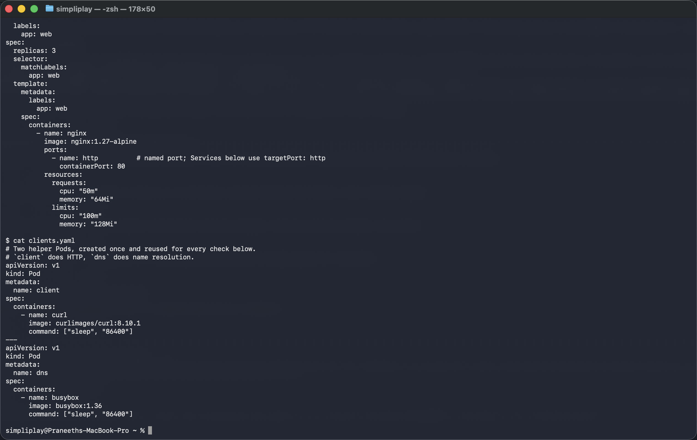
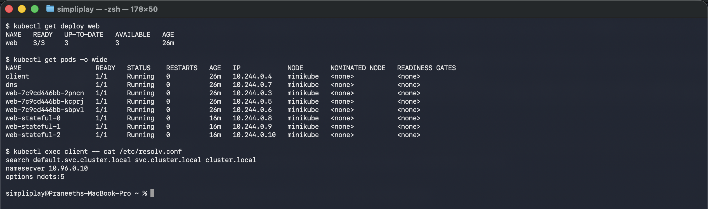

# Kubernetes Services

The five Service types, all pointed at the same Nginx workload, each verified from wherever
that type is supposed to be reachable: from inside the cluster, from inside the node, from
the laptop, or through DNS.

**Environment:** Minikube v1.39.0 with the Docker driver on macOS (Apple silicon),
Kubernetes v1.37.0, containerd 2.3.4. The node's internal IP is `192.168.49.2` and Pods get
addresses out of `10.244.0.0/24`.

```
### minikube status
minikube
type: Control Plane
host: Running
kubelet: Running
apiserver: Running
kubeconfig: Configured

### kubectl get nodes -o wide
NAME       STATUS   ROLES           AGE     VERSION   INTERNAL-IP    EXTERNAL-IP   OS-IMAGE                         KERNEL-VERSION             CONTAINER-RUNTIME
minikube   Ready    control-plane   8m10s   v1.37.0   192.168.49.2   <none>        Debian GNU/Linux 12 (bookworm)   6.12.76-linuxkit (arm64)   containerd://2.3.4
```

## The workload

[`web-deployment.yaml`](web-deployment.yaml) runs three `nginx:1.27-alpine` replicas labelled
`app: web`, with a **named** container port `http` (80). Every selector-based Service below
matches that label and writes `targetPort: http`, referring to the port by name rather than
by number — rename or renumber the container port and the Services keep working.

[`clients.yaml`](clients.yaml) adds two helper Pods used for every check: `client`
(`curlimages/curl`) for HTTP and `dns` (`busybox`) for `nslookup`.

```
kubectl apply -f web-deployment.yaml -f clients.yaml
```



```
NAME                   READY   STATUS    RESTARTS   AGE    IP           NODE       NOMINATED NODE   READINESS GATES
client                 1/1     Running   0          7m8s   10.244.0.4   minikube   <none>           <none>
dns                    1/1     Running   0          7m8s   10.244.0.7   minikube   <none>           <none>
web-7c9cd446bb-2pncn   1/1     Running   0          7m8s   10.244.0.3   minikube   <none>           <none>
web-7c9cd446bb-kcprj   1/1     Running   0          7m8s   10.244.0.5   minikube   <none>           <none>
web-7c9cd446bb-sbpvl   1/1     Running   0          7m8s   10.244.0.6   minikube   <none>           <none>
```



The screenshot was taken later in the run, so the three `web-stateful-*` Pods from
[05-headless](05-headless/) are present too, along with the `resolv.conf` discussed below.

Three Pods, three IPs, and every one of them is disposable. That is the problem Services
exist to solve: a client that hard-codes `10.244.0.3` breaks the moment that Pod is
rescheduled.

## The five types

| Folder | Service | Reachable from | Verified by |
|---|---|---|---|
| [01-clusterip](01-clusterip/) | `web-clusterip` | inside the cluster only | `curl` from the `client` Pod returned 200; the same IP from the laptop timed out |
| [02-nodeport](02-nodeport/) | `web-nodeport` `8080:30080` | any node IP, on port 30080 | `curl` inside the node returned 200; a `minikube service` tunnel served it to the laptop |
| [03-loadbalancer](03-loadbalancer/) | `web-loadbalancer` | an external IP from the cloud provider | `EXTERNAL-IP` stays `<pending>` on Minikube; the ClusterIP and node port underneath both work |
| [04-externalname](04-externalname/) | `web-externalname` | resolves to `example.com` | `nslookup` returned a CNAME to `example.com`, and `curl` reached it |
| [05-headless](05-headless/) | `web-headless` (`clusterIP: None`) | by DNS, straight to Pod IPs | `nslookup` returned all three Pod IPs, plus a name per StatefulSet replica |

Each folder has its manifest, the commands, and the output they produced.
[troubleshooting/](troubleshooting/) is a sixth: a deliberately broken Service, to see what a
selector typo looks like from the outside.

## How they relate

ClusterIP is the base. NodePort is a ClusterIP **plus** a port opened on every node.
LoadBalancer is a NodePort **plus** a request to the cloud for an external IP forwarding to
that node port. That layering is visible in the final state below — `web-loadbalancer` has a
ClusterIP (`10.107.154.114`) and a node port (`32378`) even though no external IP ever arrived.

Headless and ExternalName are different in kind: neither allocates a virtual IP and neither
involves kube-proxy. Headless hands out the Pod IPs through DNS; ExternalName hands out a
CNAME to a name outside the cluster.

## DNS, in one command

Every Pod is handed a resolver configuration that makes the short names above work:

```
### resolv.conf inside a Pod
search default.svc.cluster.local svc.cluster.local cluster.local
nameserver 10.96.0.10
options ndots:5
```

`nameserver 10.96.0.10` is CoreDNS. The `search` list is why `curl http://web-clusterip:8080`
resolves at all — the resolver appends `default.svc.cluster.local` and gets a hit on the
first try. From another namespace that first suffix would be wrong, which is why
cross-namespace calls need at least `web-clusterip.default`, or the full
`web-clusterip.default.svc.cluster.local`.

## Final state

```
### kubectl get svc
NAME               TYPE           CLUSTER-IP       EXTERNAL-IP   PORT(S)          AGE
kubernetes         ClusterIP      10.96.0.1        <none>        443/TCP          12m
web-clusterip      ClusterIP      10.96.6.96       <none>        8080/TCP         3m53s
web-externalname   ExternalName   <none>           example.com   <none>           82s
web-headless       ClusterIP      None             <none>        8080/TCP         65s
web-loadbalancer   LoadBalancer   10.107.154.114   <pending>     8080:32378/TCP   2m12s
web-nodeport       NodePort       10.105.220.99    <none>        8080:30080/TCP   2m54s

### kubectl get endpointslices
NAME                     ADDRESSTYPE   PORTS   ENDPOINTS                           AGE
kubernetes               IPv4          8443    192.168.49.2                        12m
web-clusterip-2ssjv      IPv4          80      10.244.0.3,10.244.0.5,10.244.0.6    3m53s
web-headless-vl7j5       IPv4          80      10.244.0.8,10.244.0.9,10.244.0.10   65s
web-loadbalancer-ngcdf   IPv4          80      10.244.0.3,10.244.0.6,10.244.0.5    2m12s
web-nodeport-6d52v       IPv4          80      10.244.0.6,10.244.0.3,10.244.0.5    2m54s
```

Four of the five Services have an EndpointSlice; `web-externalname` has none, because it has
no selector to match Pods with. The three selector-based Services on `app: web` list the same
three Pod IPs — one EndpointSlice per Service, all tracking the same endpoints.

## Cleanup

```bash
kubectl delete -f 01-clusterip -f 02-nodeport -f 03-loadbalancer -f 04-externalname -f 05-headless
kubectl delete -f web-deployment.yaml -f clients.yaml
minikube stop
```
