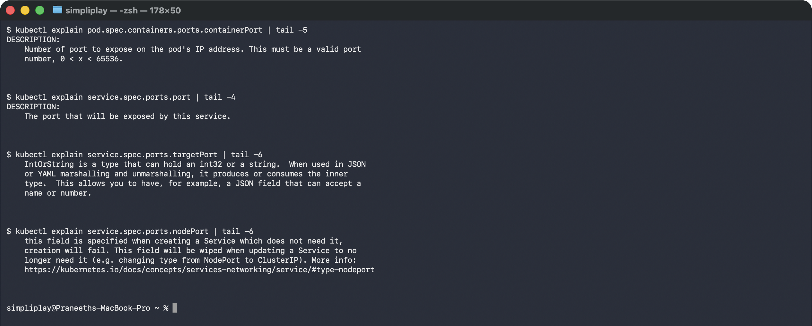
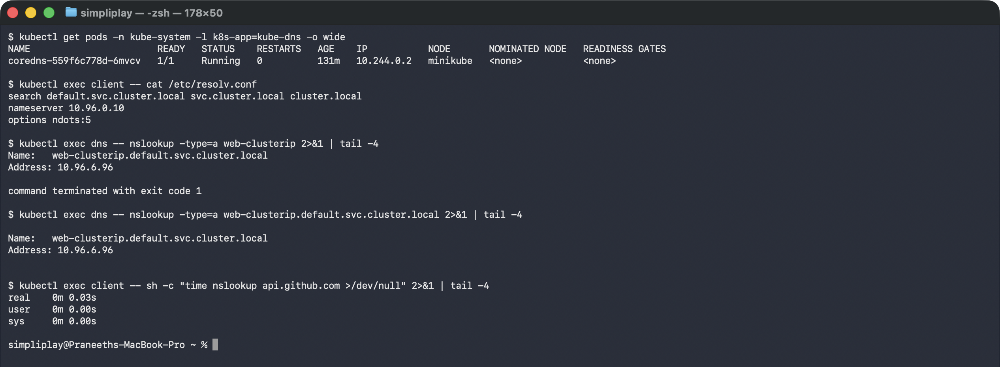
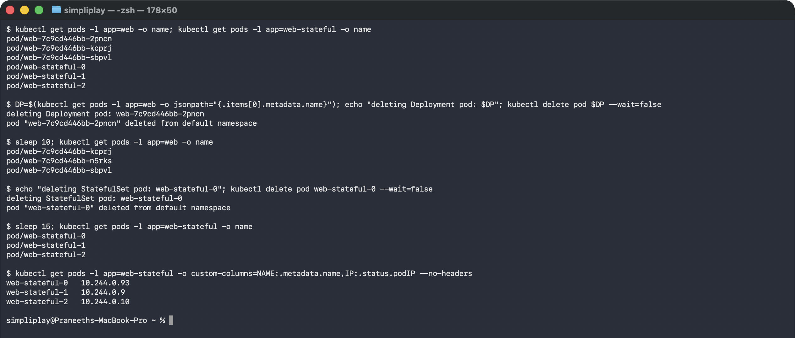
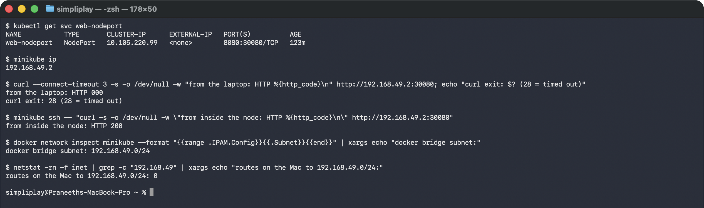

# Kubernetes Services

The five Service types, all pointed at the same Nginx workload, each verified from wherever
that type is supposed to be reachable: from inside the cluster, from inside the node, from
the laptop, or through DNS.

**Environment:** Minikube v1.39.0 with the Docker driver on macOS (Apple silicon),
Kubernetes v1.37.0, containerd 2.3.4. The node's internal IP is `192.168.49.2` and Pods get
addresses out of `10.244.0.0/24`.

```
### minikube status
minikube
type: Control Plane
host: Running
kubelet: Running
apiserver: Running
kubeconfig: Configured

### kubectl get nodes -o wide
NAME       STATUS   ROLES           AGE     VERSION   INTERNAL-IP    EXTERNAL-IP   OS-IMAGE                         KERNEL-VERSION             CONTAINER-RUNTIME
minikube   Ready    control-plane   8m10s   v1.37.0   192.168.49.2   <none>        Debian GNU/Linux 12 (bookworm)   6.12.76-linuxkit (arm64)   containerd://2.3.4
```

## The workload

[`web-deployment.yaml`](web-deployment.yaml) runs three `nginx:1.27-alpine` replicas labelled
`app: web`, with a **named** container port `http` (80). Every selector-based Service below
matches that label and writes `targetPort: http`, referring to the port by name rather than
by number — rename or renumber the container port and the Services keep working.

[`clients.yaml`](clients.yaml) adds two helper Pods used for every check: `client`
(`curlimages/curl`) for HTTP and `dns` (`busybox`) for `nslookup`.

```
kubectl apply -f web-deployment.yaml -f clients.yaml
```


```
NAME                   READY   STATUS    RESTARTS   AGE    IP           NODE       NOMINATED NODE   READINESS GATES
client                 1/1     Running   0          7m8s   10.244.0.4   minikube   <none>           <none>
dns                    1/1     Running   0          7m8s   10.244.0.7   minikube   <none>           <none>
web-7c9cd446bb-2pncn   1/1     Running   0          7m8s   10.244.0.3   minikube   <none>           <none>
web-7c9cd446bb-kcprj   1/1     Running   0          7m8s   10.244.0.5   minikube   <none>           <none>
web-7c9cd446bb-sbpvl   1/1     Running   0          7m8s   10.244.0.6   minikube   <none>           <none>
```


The screenshot was taken later in the run, so the three `web-stateful-*` Pods from
[05-headless](05-headless/) are present too, along with the `resolv.conf` discussed below.

Three Pods, three IPs, and every one of them is disposable. That is the problem Services
exist to solve: a client that hard-codes `10.244.0.3` breaks the moment that Pod is
rescheduled.

## The four ports

Four fields, four different scopes, all called "port". Getting them confused is the
second most common Service bug after a selector typo.

```
external client ──► nodePort 30080        opened on EVERY node's IP
                         │
                         ▼
                    port 8080             on the Service's virtual IP
                         │
                         ▼
                    targetPort 80 (http)  on the Pod's IP
                         │
                         ▼
                    containerPort 80      what nginx actually binds
```

| Field | Declared on | Scope | Required? |
|---|---|---|---|
| `containerPort` | Pod template | inside the Pod | no — purely informational, but lets you **name** the port |
| `targetPort` | Service | Pod network | defaults to `port` if omitted |
| `port` | Service | cluster-internal | yes, for every type except ExternalName |
| `nodePort` | Service | every node's IP | NodePort/LoadBalancer only; auto-assigned from 30000–32767 if omitted |

`containerPort` does not open anything. The container listens because the process inside
binds a socket; declaring the port is documentation, plus the one genuinely useful thing —
a **name**. Every Service in this folder writes `targetPort: http` rather than `80`, so
renumbering the container port would not break a single Service.



---

## The five types

| Folder | Service | Reachable from | Verified by |
|---|---|---|---|
| [01-clusterip](01-clusterip/) | `web-clusterip` | inside the cluster only | `curl` from the `client` Pod returned 200; the same IP from the laptop timed out |
| [02-nodeport](02-nodeport/) | `web-nodeport` `8080:30080` | any node IP, on port 30080 | `curl` inside the node returned 200; a `minikube service` tunnel served it to the laptop |
| [03-loadbalancer](03-loadbalancer/) | `web-loadbalancer` | an external IP from the cloud provider | `EXTERNAL-IP` stays `<pending>` on Minikube; the ClusterIP and node port underneath both work |
| [04-externalname](04-externalname/) | `web-externalname` | resolves to `example.com` | `nslookup` returned a CNAME to `example.com`, and `curl` reached it |
| [05-headless](05-headless/) | `web-headless` (`clusterIP: None`) | by DNS, straight to Pod IPs | `nslookup` returned all three Pod IPs, plus a name per StatefulSet replica |

| [06-no-selector](06-no-selector/) | `external-legacy-db` | inside the cluster, to an address outside it | endpoints written by hand; an EndpointSlice appeared with no selector involved |

Each folder has its manifest, the commands, and the output they produced.
[troubleshooting/](troubleshooting/) is a seventh: a deliberately broken Service, to see
what a selector typo looks like from the outside.

## How they relate

ClusterIP is the base. NodePort is a ClusterIP **plus** a port opened on every node.
LoadBalancer is a NodePort **plus** a request to the cloud for an external IP forwarding to
that node port. That layering is visible in the final state below — `web-loadbalancer` has a
ClusterIP (`10.107.154.114`) and a node port (`32378`) even though no external IP ever arrived.

Headless and ExternalName are different in kind: neither allocates a virtual IP and neither
involves kube-proxy. Headless hands out the Pod IPs through DNS; ExternalName hands out a
CNAME to a name outside the cluster.

## DNS, CoreDNS and ndots

Every Pod is handed a resolver configuration that makes the short names above work:

```
### the CoreDNS Pod serving the whole cluster
NAME                       READY   STATUS    AGE    IP           NODE
coredns-559f6c778d-6mvcv   1/1     Running   131m   10.244.0.2   minikube

### resolv.conf inside a Pod
search default.svc.cluster.local svc.cluster.local cluster.local
nameserver 10.96.0.10
options ndots:5

### short name and FQDN resolve to the same VIP
Name:    web-clusterip.default.svc.cluster.local
Address: 10.96.6.96
```



`nameserver 10.96.0.10` is the `kube-dns` Service, backed by the CoreDNS Pod above. The
full name of any Service is `<service>.<namespace>.svc.cluster.local`, and the `search`
list is what lets you omit most of it.

`curl http://web-clusterip:8080` resolves because the resolver appends
`default.svc.cluster.local` and gets a hit on the first try. From another namespace that
first suffix would be wrong, which is why cross-namespace calls need at least
`web-clusterip.default`, or the full `web-clusterip.default.svc.cluster.local`.

### What ndots:5 actually costs

`ndots:5` means "if the name has fewer than 5 dots, try the search suffixes **first**".
Every name here qualifies, so `web-clusterip` (0 dots) is looked up as:

```
web-clusterip.default.svc.cluster.local   <- hit
```

One query. But an *external* name like `api.github.com` has only 2 dots, so it is also
treated as partial:

```
api.github.com.default.svc.cluster.local   <- NXDOMAIN
api.github.com.svc.cluster.local           <- NXDOMAIN
api.github.com.cluster.local               <- NXDOMAIN
api.github.com                             <- hit, on the 4th try
```

Three wasted round trips to CoreDNS before the real answer, on every lookup that is not
already cached. On this cluster the whole thing still finished in 30ms, so it is invisible
here — but at production request rates it is a well-known source of both DNS latency and
CoreDNS load.

The standard fixes are to write the name fully-qualified with a trailing dot
(`api.github.com.`, which has 3 dots and skips the search list entirely) or to set
`dnsConfig.options` on the Pod to lower `ndots`.

## Pod identity: Deployment vs StatefulSet

The two controllers behind the Services above answer different questions. Deleting one Pod
from each makes the difference concrete:

```bash
kubectl delete pod $(kubectl get pods -l app=web -o jsonpath="{.items[0].metadata.name}")
kubectl delete pod web-stateful-0
```

```
### Deployment: deleted web-7c9cd446bb-2pncn
pod/web-7c9cd446bb-kcprj
pod/web-7c9cd446bb-n5rks     <-- a different name entirely
pod/web-7c9cd446bb-sbpvl

### StatefulSet: deleted web-stateful-0
pod/web-stateful-0           <-- the same name came back
pod/web-stateful-1
pod/web-stateful-2

### but the IP did not survive
web-stateful-0   10.244.0.93   (was 10.244.0.8)
web-stateful-1   10.244.0.9
web-stateful-2   10.244.0.10
```



The Deployment replaced its Pod with `web-7c9cd446bb-n5rks` — same ReplicaSet hash, new
random suffix. It satisfied "three Pods", which is all it ever promised. The StatefulSet
recreated `web-stateful-0` under exactly that name, because the ordinal *is* the identity.

The last block is the part people get wrong: **the name is stable, the IP is not.**
`web-stateful-0` came back on `10.244.0.93` rather than its original `10.244.0.8`. That is
precisely why [05-headless](05-headless/) matters — peers must address each other by DNS
name, never by a cached address, and only a headless Service publishes a name per Pod.

---

## Deployment vs StatefulSet vs DaemonSet

| | Deployment | StatefulSet | DaemonSet |
|---|---|---|---|
| **For** | stateless apps, APIs, web tiers | databases, queues, anything with durable per-instance state | per-node agents: log shippers, metrics exporters, CNI, security |
| **Pod names** | `<name>-<rs-hash>-<random>` | `<name>-0`, `-1`, `-2` | `<name>-<random>`, one per node |
| **Identity** | disposable — a replacement is a new Pod | stable — `mysql-0` comes back as `mysql-0` | tied to the node |
| **Start/stop order** | parallel, no ordering | strictly sequential, reversed on scale-down | parallel |
| **Storage** | shared PVC or ephemeral | one PVC per replica via `volumeClaimTemplates` | usually `hostPath` |
| **Replica count** | you set it | you set it | the node count sets it |
| **Usual Service** | ClusterIP / NodePort / LoadBalancer | **headless** (`clusterIP: None`) | often none |
| **Examples** | nginx, a REST API | PostgreSQL, Kafka, Cassandra | Fluent Bit, node-exporter, Cilium |

The identity column is the whole distinction. A Deployment answers "how many?"; a
StatefulSet answers "which one?". [05-headless](05-headless/) exists because that second
question needs per-Pod DNS names, and only a headless Service provides them.

---

## Choosing a Service type

```
Does anything outside the cluster need to reach it?
│
├── NO ─── Do clients need to address individual Pods (Kafka, a DB cluster)?
│          ├── YES ──► Headless   (clusterIP: None)
│          └── NO  ──► ClusterIP  (the default, and the right answer most of the time)
│
└── YES ── Is the target actually outside the cluster (RDS, a partner API)?
           ├── YES ──► ExternalName   (or a no-selector Service + manual endpoints,
           │                           if you need a real cluster IP — see 06-no-selector/)
           └── NO  ── On a cloud provider?
                      ├── YES, HTTP/HTTPS ──► ONE LoadBalancer in front of an Ingress
                      │                       controller; every app stays ClusterIP
                      ├── YES, raw TCP/UDP ──► LoadBalancer directly
                      └── NO (dev / on-prem) ──► NodePort
```

### Why "one LoadBalancer, not fifty"

`type: LoadBalancer` provisions a real cloud load balancer per Service, billed per hour
whether or not it carries traffic. At roughly $18–25/month each:

| Approach | 50 microservices | Monthly |
|---|---|---|
| A LoadBalancer per Service | 50 load balancers | ~$1,250 |
| One Ingress behind one LoadBalancer | 1 load balancer + 50 ClusterIPs | ~$25 |

The second shape also gives you one place for TLS termination, hostname and path routing,
and access logging — which is why it is the default in production, not merely the cheap
option. Cost is the symptom; the architectural point is that L7 routing belongs in one
component, not replicated across fifty cloud resources.

This is also why [03-loadbalancer](03-loadbalancer/) staying `<pending>` on Minikube is
not a problem to solve: on a real cluster you would deliberately have very few of them.

---

## Why NodePort fails from the laptop

[02-nodeport](02-nodeport/) and [03-loadbalancer](03-loadbalancer/) both noted that the
node IP is unreachable from macOS. Here is the actual cause rather than the symptom:

```
### the Service is fine
web-nodeport   NodePort   10.105.220.99   <none>   8080:30080/TCP   123m

### from the laptop
from the laptop: HTTP 000
curl exit: 28 (28 = timed out)

### from inside the node, same address and port
from inside the node: HTTP 200

### the node's network, and the Mac's routes to it
docker bridge subnet: 192.168.49.0/24
routes on the Mac to 192.168.49.0/24: 0
```



The last two lines are the whole explanation. `192.168.49.0/24` is a bridge network that
exists **inside Docker's Linux VM**, and the Mac's routing table has **zero** entries for
it. The packets have nowhere to go, so curl times out rather than being refused.

This is not a Kubernetes problem and not a NodePort problem — from inside the node the very
same URL returns 200. On Linux, where Docker's bridge is a real interface on the host,
`curl http://<node-ip>:30080` works exactly as the documentation says.

Two standard workarounds:

| | What it does | Lifetime |
|---|---|---|
| `minikube service <svc> --url` | opens a proxy from a random `127.0.0.1` port into the node | only while the command runs |
| `minikube tunnel` | adds host routes and assigns real `EXTERNAL-IP`s to LoadBalancer Services | only while it runs; needs `sudo` |

Both print a warning that the terminal must stay open, and that warning is the point: they
are development conveniences, not part of the cluster. Note also that they block, so a
script that captures their output without backgrounding them will hang.

## Final state

```
### kubectl get svc
NAME               TYPE           CLUSTER-IP       EXTERNAL-IP   PORT(S)          AGE
kubernetes         ClusterIP      10.96.0.1        <none>        443/TCP          12m
web-clusterip      ClusterIP      10.96.6.96       <none>        8080/TCP         3m53s
web-externalname   ExternalName   <none>           example.com   <none>           82s
web-headless       ClusterIP      None             <none>        8080/TCP         65s
web-loadbalancer   LoadBalancer   10.107.154.114   <pending>     8080:32378/TCP   2m12s
web-nodeport       NodePort       10.105.220.99    <none>        8080:30080/TCP   2m54s

### kubectl get endpointslices
NAME                     ADDRESSTYPE   PORTS   ENDPOINTS                           AGE
kubernetes               IPv4          8443    192.168.49.2                        12m
web-clusterip-2ssjv      IPv4          80      10.244.0.3,10.244.0.5,10.244.0.6    3m53s
web-headless-vl7j5       IPv4          80      10.244.0.8,10.244.0.9,10.244.0.10   65s
web-loadbalancer-ngcdf   IPv4          80      10.244.0.3,10.244.0.6,10.244.0.5    2m12s
web-nodeport-6d52v       IPv4          80      10.244.0.6,10.244.0.3,10.244.0.5    2m54s
```

This snapshot was taken during the original five-type run, before
[06-no-selector](06-no-selector/) was added — that Service appears in its own folder above.

Four of the five Services have an EndpointSlice; `web-externalname` has none, because it has
no selector to match Pods with. The three selector-based Services on `app: web` list the same
three Pod IPs — one EndpointSlice per Service, all tracking the same endpoints.

## Cleanup

```bash
kubectl delete -f 01-clusterip -f 02-nodeport -f 03-loadbalancer -f 04-externalname -f 05-headless -f 06-no-selector
kubectl delete -f web-deployment.yaml -f clients.yaml
minikube stop
```
