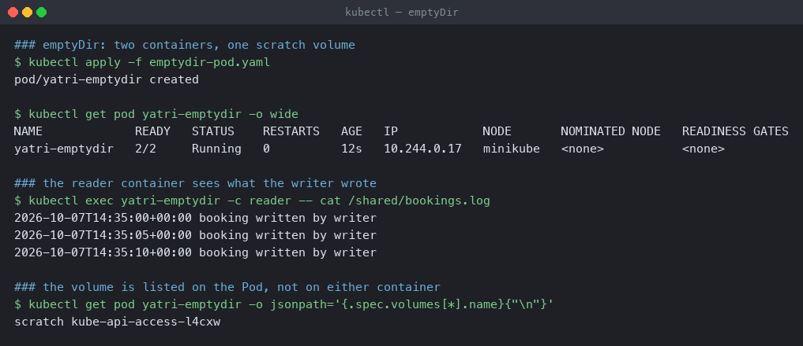
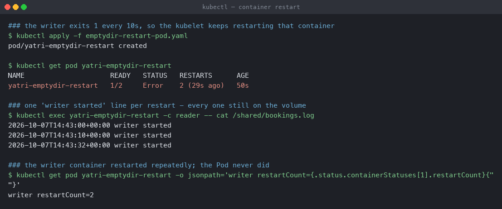
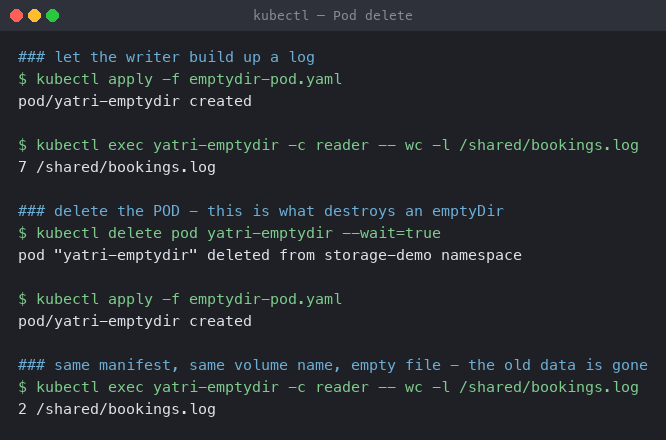
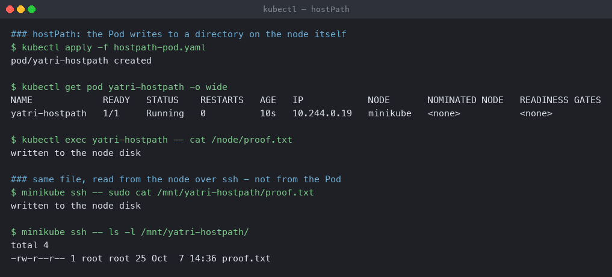
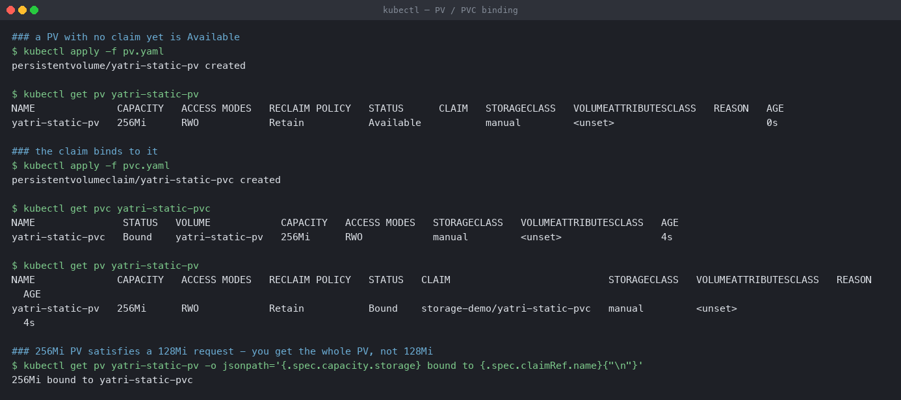
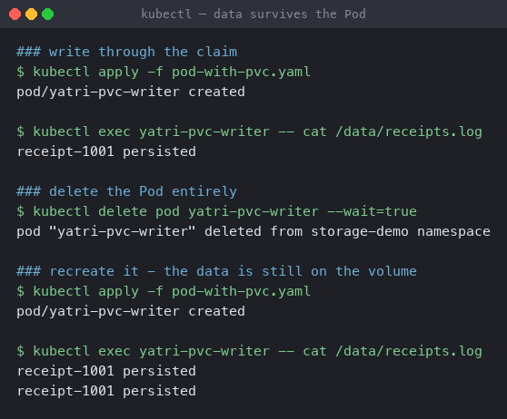
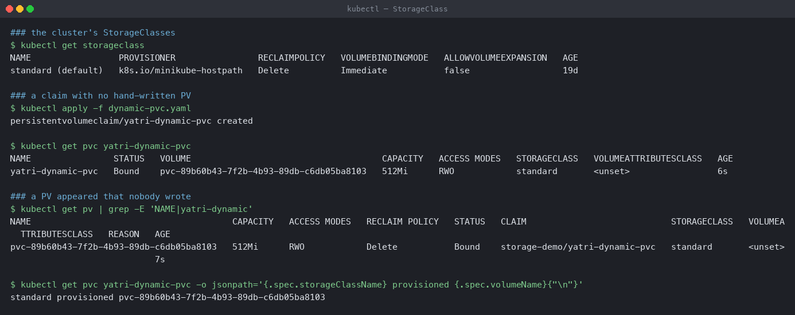

# Kubernetes Volumes

Six storage mechanisms, each one applied to a live cluster and then deliberately broken to
show what it does *not* survive. The question every one of them answers differently is:
**when this thing dies, does my data die with it?**

**Environment:** Minikube v1.39.0 with the Docker driver on macOS (Apple silicon),
Kubernetes v1.37.0. Namespace `storage-demo`. The default StorageClass is `standard`,
backed by the `k8s.io/minikube-hostpath` provisioner.

| Mechanism | Survives container restart | Survives Pod delete | Tied to one node |
|---|---|---|---|
| `emptyDir` | yes | **no** | yes |
| `hostPath` | yes | yes | **yes** |
| PV + PVC (static) | yes | yes | depends on the backing volume |
| StorageClass (dynamic) | yes | yes | depends on the provisioner |

---

## 1. emptyDir — scratch space that belongs to the Pod

[`emptydir-pod.yaml`](emptydir-pod.yaml) runs two containers over one `emptyDir`. The
`writer` appends a timestamped line every five seconds; the `reader` mounts the same volume
read-only.

```bash
kubectl apply -f emptydir-pod.yaml
kubectl get pod yatri-emptydir -o wide
kubectl exec yatri-emptydir -c reader -- cat /shared/bookings.log
kubectl get pod yatri-emptydir -o jsonpath='{.spec.volumes[*].name}{"\n"}'
```

```
### the reader container sees what the writer wrote
2026-10-07T14:35:00+00:00 booking written by writer
2026-10-07T14:35:05+00:00 booking written by writer
2026-10-07T14:35:10+00:00 booking written by writer

### the volume is listed on the Pod, not on either container
scratch kube-api-access-l4cxw
```



Two containers, one filesystem, and neither needed a network call to reach the other. This
is the normal way to pair a sidecar with an application — a log shipper reading what the app
writes, or an init container preparing files the app then serves.

Note the jsonpath output: the volume list is a property of **`.spec.volumes`** on the Pod.
Containers only choose where to mount it. That single fact predicts everything below.

### A container restart keeps the data

[`emptydir-restart-pod.yaml`](emptydir-restart-pod.yaml) makes this deterministic — the
writer appends one line, sleeps ten seconds, then `exit 1`. With the default
`restartPolicy: Always`, the kubelet restarts it forever.

```bash
kubectl apply -f emptydir-restart-pod.yaml
kubectl get pod yatri-emptydir-restart
kubectl exec yatri-emptydir-restart -c reader -- cat /shared/bookings.log
```

```
NAME                     READY   STATUS   RESTARTS      AGE
yatri-emptydir-restart   1/2     Error    2 (29s ago)   50s

### one 'writer started' line per restart - every one still on the volume
2026-10-07T14:43:00+00:00 writer started
2026-10-07T14:43:10+00:00 writer started
2026-10-07T14:43:32+00:00 writer started

writer restartCount=2
```



Three start lines across two restarts, all still readable. The container was destroyed and
rebuilt from the image twice and the volume did not care.

The `reader` sidecar exists for a practical reason: `kubectl exec` into a container that is
mid-restart fails with `unable to upgrade connection: container not found`. A long-lived
second container gives a stable way in to the shared volume.

### Deleting the Pod destroys it

```bash
kubectl exec yatri-emptydir -c reader -- wc -l /shared/bookings.log
kubectl delete pod yatri-emptydir
kubectl apply -f emptydir-pod.yaml
kubectl exec yatri-emptydir -c reader -- wc -l /shared/bookings.log
```

```
### before
7 /shared/bookings.log

### delete the POD - this is what destroys an emptyDir
pod "yatri-emptydir" deleted from storage-demo namespace
pod/yatri-emptydir created

### same manifest, same volume name, empty file - the old data is gone
2 /shared/bookings.log      <- a fresh volume, two new lines
```



Seven lines down to two. The second count is not leftover data, it is the two lines the new
writer managed in the eight seconds before the check.

**`emptyDir` is created when the Pod is assigned to a node and deleted when the Pod leaves
it.** Since a Deployment replaces Pods on every rollout, anything an `emptyDir` holds is
gone at the next `kubectl apply`. That makes it right for caches, scratch space and
inter-container handoff, and wrong for anything a user would notice losing.

---

## 2. hostPath — a directory on the node

[`hostpath-pod.yaml`](hostpath-pod.yaml) mounts `/mnt/yatri-hostpath` from the node, with
`type: DirectoryOrCreate` so the kubelet creates it if missing.

```bash
kubectl apply -f hostpath-pod.yaml
kubectl exec yatri-hostpath -- cat /node/proof.txt
minikube ssh -- sudo cat /mnt/yatri-hostpath/proof.txt
minikube ssh -- ls -l /mnt/yatri-hostpath/
```

```
### from inside the Pod
written to the node disk

### same file, read from the node over ssh - not from the Pod
written to the node disk

total 4
-rw-r--r-- 1 root root 25 Oct  7 14:36 proof.txt
```



The file is genuinely on the node's filesystem — `minikube ssh` is a different machine
boundary from `kubectl exec`, and the bytes are there either way. The data now outlives the
Pod completely.

**The catch is the one thing the demo cannot show on a single-node cluster.** The volume is
a path on *one* node. Reschedule that Pod onto a different node and it finds an empty
directory, or worse, a different application's files at the same path. There is nothing in
the manifest that pins the Pod to the node it wrote on.

It also punches through container isolation: mount `/var/run/docker.sock` or `/etc` and the
Pod can act on the host. Real uses are node-level agents — a log collector reading
`/var/log`, a monitoring agent reading `/proc` — which are deployed as DaemonSets precisely
because one copy per node is the point.

---

## 3. PersistentVolume and PersistentVolumeClaim

These split one decision into two roles. [`pv.yaml`](pv.yaml) is what a cluster admin
writes: a 256Mi volume, `storageClassName: manual`, `persistentVolumeReclaimPolicy: Retain`.
[`pvc.yaml`](pvc.yaml) is what a developer writes: *"I need 128Mi, ReadWriteOnce"* — and
names no volume at all.

```bash
kubectl apply -f pv.yaml
kubectl get pv yatri-static-pv
kubectl apply -f pvc.yaml
kubectl get pvc yatri-static-pvc
kubectl get pv yatri-static-pv
```

```
### a PV with no claim yet is Available
NAME              CAPACITY   ACCESS MODES   RECLAIM POLICY   STATUS      CLAIM                           STORAGECLASS
yatri-static-pv   256Mi      RWO            Retain           Available                                   manual

### the claim binds to it
NAME               STATUS   VOLUME            CAPACITY   ACCESS MODES   STORAGECLASS
yatri-static-pvc   Bound    yatri-static-pv   256Mi      RWO            manual

### and the PV now records who holds it
yatri-static-pv   256Mi      RWO            Retain           Bound       storage-demo/yatri-static-pvc   manual

256Mi bound to yatri-static-pvc
```



Three details worth reading off that output:

- **`Available` → `Bound`.** The control plane matched them. Nothing in either file
  mentions the other.
- **The PVC reports `256Mi`, not the `128Mi` it asked for.** Static binding hands over a
  whole PV. A request is a *minimum*; the claim gets the volume's full capacity.
- **`storageClassName: manual`** on both. That string is not a real StorageClass — it exists
  to stop the default dynamic provisioner from creating a PV and binding to that instead.
  Leave it off and this demo quietly becomes section 4.

### The data survives the Pod

[`pod-with-pvc.yaml`](pod-with-pvc.yaml) appends one receipt line, then gets deleted and
recreated.

```bash
kubectl apply -f pod-with-pvc.yaml
kubectl exec yatri-pvc-writer -- cat /data/receipts.log
kubectl delete pod yatri-pvc-writer
kubectl apply -f pod-with-pvc.yaml
kubectl exec yatri-pvc-writer -- cat /data/receipts.log
```

```
### first Pod
receipt-1001 persisted

### delete the Pod entirely
pod "yatri-pvc-writer" deleted from storage-demo namespace

### recreate it - the data is still on the volume
receipt-1001 persisted      <- written by the Pod that no longer exists
receipt-1001 persisted      <- appended by the new one
```



Two lines is the proof. The container command uses `>>`, so if the volume had been wiped
there would be exactly one line again — same as the `emptyDir` case. The first line was
written by a Pod that no longer exists.

`Retain` is why the volume is still there at all. The alternatives matter: `Delete` destroys
the backing storage when the claim goes, and `Recycle` is deprecated. For anything holding
real data, `Retain` means a deleted PVC is recoverable instead of a data-loss incident.

---

## 4. StorageClass and dynamic provisioning

Sections 1–3 all needed someone to create storage up front. A StorageClass removes that
step.

```bash
kubectl get storageclass
kubectl apply -f dynamic-pvc.yaml
kubectl get pvc yatri-dynamic-pvc
kubectl get pv | grep yatri-dynamic
```

```
### the cluster's StorageClasses
NAME                 PROVISIONER                RECLAIMPOLICY   VOLUMEBINDINGMODE   AGE
standard (default)   k8s.io/minikube-hostpath   Delete          Immediate           19d

### a claim with no hand-written PV
NAME                STATUS   VOLUME                                     CAPACITY   STORAGECLASS
yatri-dynamic-pvc   Bound    pvc-89b60b43-7f2b-4b93-89db-c6db05ba8103   512Mi      standard

### a PV appeared that nobody wrote
pvc-89b60b43-...   512Mi   RWO   Delete   Bound   storage-demo/yatri-dynamic-pvc   standard
```



[`dynamic-pvc.yaml`](dynamic-pvc.yaml) is the only file involved. No PV was written, yet one
exists — named `pvc-<uid>` by the provisioner rather than by a human.

The capacity is **exactly** the 512Mi requested, unlike the static case. The provisioner
creates the volume to order instead of handing over a pre-made one.

Two fields from the StorageClass row decide the behaviour:

- **`RECLAIMPOLICY: Delete`** — delete the PVC and the PV and its data go too. That is the
  opposite default from the `Retain` PV above, and it is the one that catches people. A
  `kubectl delete pvc` on a production database with a `Delete` class is unrecoverable.
- **`VOLUMEBINDINGMODE: Immediate`** — the volume is provisioned as soon as the claim
  exists, before any Pod uses it. The alternative, `WaitForFirstConsumer`, delays
  provisioning until a Pod is scheduled, so the volume can be created in the same zone as
  the Pod. On a single-node Minikube that makes no difference; on multi-zone cloud it is the
  difference between a working Pod and one stuck `Pending` forever because its disk is in
  the wrong zone.

`standard` is marked `(default)`, which is what lets a PVC omit `storageClassName`
altogether and still get storage.

---

## What ties it together

The access mode is the constraint that outlasts all of this. Every volume here is
`ReadWriteOnce` — mountable read-write by **one node** at a time. It is the default and it
is usually what people want without realising it limits them: a Deployment scaled to three
replicas sharing one RWO claim will schedule all three onto one node, or leave some
`Pending`. Shared read-write access across nodes needs `ReadWriteMany`, which the
`minikube-hostpath` provisioner does not offer and most cloud block storage does not either
— that is NFS or a filesystem service.

So the choice reduces to a short list:

- **Caches, scratch, sidecar handoff** → `emptyDir`
- **Node-level agents that must read the host** → `hostPath`, as a DaemonSet
- **Application data, cluster-managed** → PVC against a StorageClass
- **Anything irreplaceable** → PVC with a `Retain` class, and a backup that is not the
  volume

Cleanup:

```bash
kubectl delete -f . --ignore-not-found
kubectl delete pv yatri-static-pv
```
