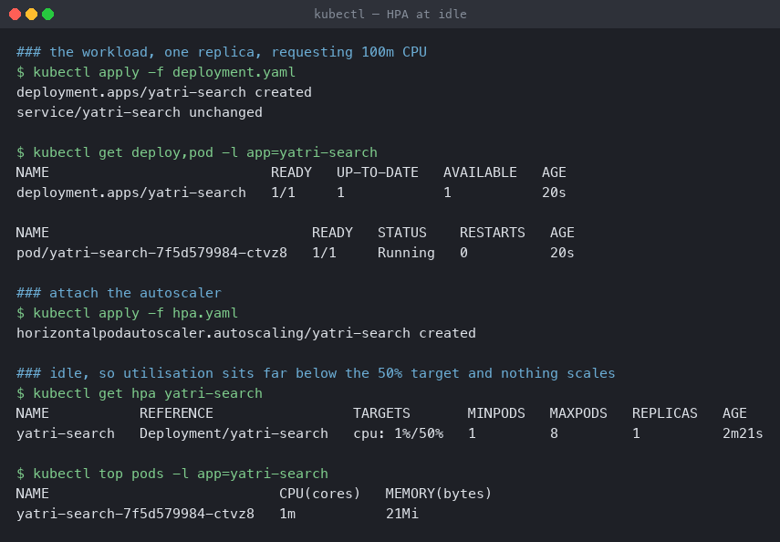
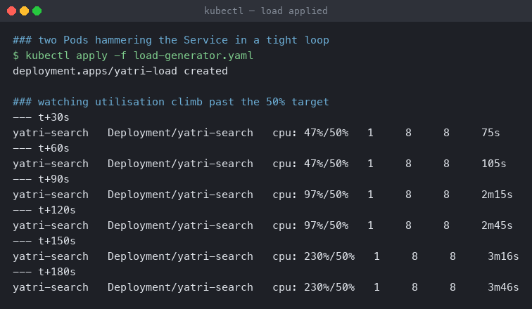
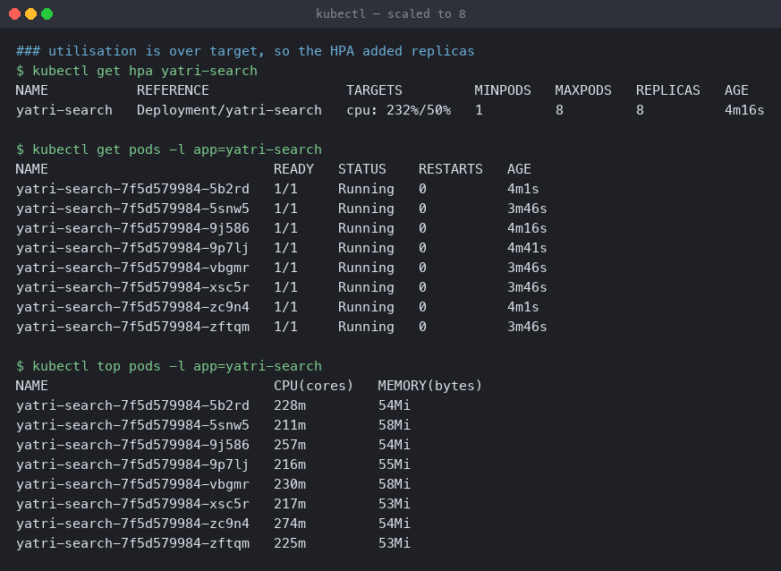
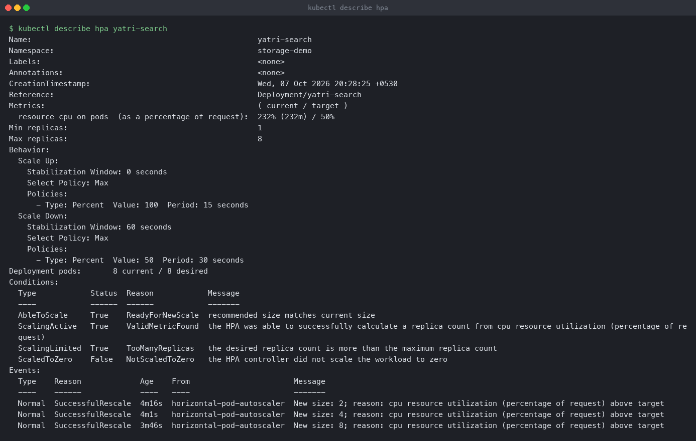
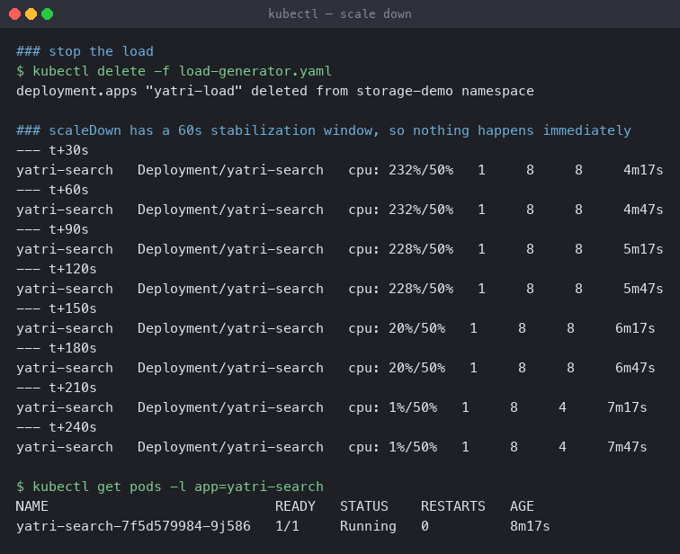
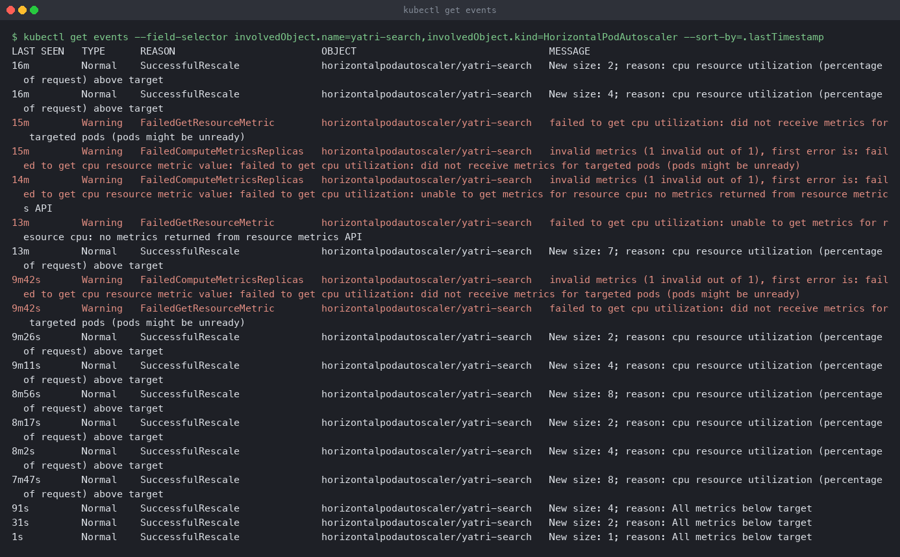

# Horizontal Pod Autoscaler

One Deployment taken from 1 replica to 8 and back to 1 by nothing but CPU load, with the
autoscaler's own reasoning read out of `kubectl describe` at each stage.

**Environment:** Minikube v1.39.0 with the Docker driver on macOS (Apple silicon),
Kubernetes v1.37.0, `metrics-server` via `minikube addons enable metrics-server`.
Namespace `storage-demo`. The node has 15 allocatable CPUs, which is what makes 8 replicas
of a CPU-burning container possible at all.

| File | What it is |
|---|---|
| [`deployment.yaml`](deployment.yaml) | `yatri-search`, 1 replica, `registry.k8s.io/hpa-example` |
| [`hpa.yaml`](hpa.yaml) | `autoscaling/v2` HPA, 1–8 replicas, 50% CPU target |
| [`load-generator.yaml`](load-generator.yaml) | 2 Pods × 8 parallel request loops |

---

## The prerequisite everything depends on

```yaml
resources:
  requests:
    cpu: 100m
```

**Without `requests.cpu` the HPA cannot work at all.** Target utilisation is a percentage
*of the request*, so with no request there is no denominator and the HPA reports
`<unknown>` forever. This is the single most common reason a correctly written HPA does
nothing.

`50%` of a `100m` request means the autoscaler aims for **50m of actual CPU per Pod**.

---

## Step 1 — idle

```bash
kubectl apply -f deployment.yaml
kubectl get deploy,pod -l app=yatri-search
kubectl apply -f hpa.yaml
kubectl get hpa yatri-search
kubectl top pods -l app=yatri-search
```

```
NAME                           READY   UP-TO-DATE   AVAILABLE   AGE
deployment.apps/yatri-search   1/1     1            1           20s

### idle, so utilisation sits far below the 50% target and nothing scales
NAME           REFERENCE                 TARGETS       MINPODS   MAXPODS   REPLICAS   AGE
yatri-search   Deployment/yatri-search   cpu: 1%/50%   1         8         1          2m21s

NAME                            CPU(cores)   MEMORY(bytes)
yatri-search-7f5d579984-ctvz8   1m           21Mi
```



1m of CPU against a 100m request is 1%. Well under target, so the HPA holds at
`minReplicas`.

Worth noting the `AGE` of 2m21s. For the first 60–90 seconds after the HPA is created, the
`TARGETS` column reads `cpu: <unknown>/50%` — metrics-server needs a couple of scrape
cycles before a utilisation figure exists. An HPA checked immediately after `apply` always
looks broken.

---

## Step 2 — load on

```bash
kubectl apply -f load-generator.yaml
kubectl get hpa yatri-search      # every 30s
```

```
### two Pods hammering the Service in a tight loop
deployment.apps/yatri-load created

--- t+30s
yatri-search   Deployment/yatri-search   cpu: 47%/50%   1   8   8   75s
--- t+60s
yatri-search   Deployment/yatri-search   cpu: 47%/50%   1   8   8   105s
--- t+90s
yatri-search   Deployment/yatri-search   cpu: 97%/50%   1   8   8   2m15s
--- t+120s
yatri-search   Deployment/yatri-search   cpu: 97%/50%   1   8   8   2m45s
```



By the first 30-second sample the Deployment is **already at 8**. That is not an error in
the reading — it is how fast the configured `scaleUp` behaviour is:

```yaml
scaleUp:
  stabilizationWindowSeconds: 0
  policies:
    - type: Percent
      value: 100
      periodSeconds: 15
```

100% growth every 15 seconds means doubling: 1 → 2 → 4 → 8 in 45 seconds. The polling
interval was too coarse to see it, but `describe` below records every step.

A note on the load generator. The first version of
[`load-generator.yaml`](load-generator.yaml) ran one serial loop per Pod:

```sh
while true; do wget -q -O- http://yatri-search; done
```

That moved the target's CPU to **3%** and never triggered scaling. A serial loop is bounded
by process startup on the client, not by the server — each `wget` is a fork, an exec and a
TCP handshake. Running 8 loops in parallel per Pod is what produced real load.

---

## Step 3 — scaled to the ceiling

```bash
kubectl get hpa yatri-search
kubectl get pods -l app=yatri-search
kubectl top pods -l app=yatri-search
```

```
NAME           REFERENCE                 TARGETS         MINPODS   MAXPODS   REPLICAS   AGE
yatri-search   Deployment/yatri-search   cpu: 232%/50%   1         8         8          4m16s

NAME                            CPU(cores)   MEMORY(bytes)
yatri-search-7f5d579984-5b2rd   228m         54Mi
yatri-search-7f5d579984-5snw5   211m         58Mi
yatri-search-7f5d579984-9j586   257m         54Mi
yatri-search-7f5d579984-9p7lj   216m         55Mi
yatri-search-7f5d579984-vbgmr   230m         58Mi
yatri-search-7f5d579984-xsc5r   217m         53Mi
yatri-search-7f5d579984-zc9n4   274m         54Mi
yatri-search-7f5d579984-zftqm   225m         53Mi
```



Eight Pods, each at 211–274m of actual CPU against a 100m request — so 232% average, far
above the 50% target, and the HPA **cannot do anything about it**. It is at `maxReplicas`.

Two things to read from this:

- Load is spread evenly. The Service is load-balancing across all eight endpoints; a hot
  Pod here would have meant a Service or readiness problem.
- `232%/50%` while stuck at 8 is the signal that `maxReplicas` is too low for this load.
  In production that is the alert worth having — not "CPU is high", but "the autoscaler has
  run out of room".

---

## Step 4 — the autoscaler's own account

```bash
kubectl describe hpa yatri-search
```

```
Metrics:                                               ( current / target )
  resource cpu on pods  (as a percentage of request):  232% (232m) / 50%
Min replicas:                                          1
Max replicas:                                          8
Behavior:
  Scale Up:
    Stabilization Window: 0 seconds
    Select Policy: Max
    Policies:
      - Type: Percent  Value: 100  Period: 15 seconds
  Scale Down:
    Stabilization Window: 60 seconds
    Select Policy: Max
    Policies:
      - Type: Percent  Value: 50  Period: 30 seconds
Deployment pods:       8 current / 8 desired
Conditions:
  Type            Status  Reason            Message
  AbleToScale     True    ReadyForNewScale  recommended size matches current size
  ScalingActive   True    ValidMetricFound  the HPA was able to successfully calculate a replica count
  ScalingLimited  True    TooManyReplicas   the desired replica count is more than the maximum replica count
Events:
  Normal  SuccessfulRescale  4m16s  New size: 2; reason: cpu resource utilization above target
  Normal  SuccessfulRescale  4m1s   New size: 4; reason: cpu resource utilization above target
  Normal  SuccessfulRescale  3m46s  New size: 8; reason: cpu resource utilization above target
```



This is the output to reach for when an HPA misbehaves, and it answers three separate
questions:

- **`ScalingActive: True / ValidMetricFound`** — metrics are arriving. `False` here with
  `FailedGetResourceMetric` means metrics-server or the CPU request is the problem, not the
  HPA.
- **`ScalingLimited: True / TooManyReplicas`** — it wants more than 8 and is clamped. This
  condition being `True` is the machine-readable version of "raise `maxReplicas`".
- **The three events, 15 seconds apart** — 2, then 4, then 8. The doubling that step 2's
  polling was too slow to catch, timestamped.

---

## Step 5 — load off

```bash
kubectl delete -f load-generator.yaml
kubectl get hpa yatri-search      # every 30s
```

```
### scaleDown has a 60s stabilization window, so nothing happens immediately
--- t+30s    cpu: 232%/50%   1   8   8   4m17s
--- t+60s    cpu: 232%/50%   1   8   8   4m47s
--- t+90s    cpu: 228%/50%   1   8   8   5m17s
--- t+120s   cpu: 228%/50%   1   8   8   5m47s
--- t+150s   cpu: 20%/50%    1   8   8   6m17s      <- metrics caught up
--- t+180s   cpu: 20%/50%    1   8   8   6m47s
--- t+210s   cpu: 1%/50%     1   8   4   7m17s      <- first scale-down
--- t+240s   cpu: 1%/50%     1   8   4   7m47s

NAME                            READY   STATUS    RESTARTS   AGE
yatri-search-7f5d579984-9j586   1/1     Running   0          8m17s
```



Scaling down is deliberately much slower than scaling up, and the delay comes from three
places stacked on top of each other:

1. **Metric staleness.** CPU is still reported as 232% for two minutes after the load
   stopped. metrics-server serves a rolling window, so the figure lags reality.
2. **The 60-second stabilization window.** The HPA takes the *highest* recommendation from
   the last 60 seconds, so one quiet sample is not enough.
3. **The 50%-per-30s policy.** It can only halve: 8 → 4 → 2 → 1.

That asymmetry is the right default. Scaling up late means dropped requests; scaling down
late just costs a little compute. Aggressive scale-down causes *thrashing* — Pods removed
and immediately recreated on the next traffic spike.

---

## Step 6 — every rescale decision

```bash
kubectl get events --field-selector involvedObject.kind=HorizontalPodAutoscaler --sort-by=.lastTimestamp
```

```
16m     Normal    SuccessfulRescale   New size: 2; reason: cpu resource utilization above target
16m     Normal    SuccessfulRescale   New size: 4; reason: cpu resource utilization above target
15m     Warning   FailedGetResourceMetric   failed to get cpu utilization: did not receive
                  metrics for targeted pods (pods might be unready)
14m     Warning   FailedComputeMetricsReplicas   invalid metrics (1 invalid out of 1)
13m     Normal    SuccessfulRescale   New size: 7; reason: cpu resource utilization above target
9m26s   Normal    SuccessfulRescale   New size: 2; reason: cpu resource utilization above target
9m11s   Normal    SuccessfulRescale   New size: 4; reason: cpu resource utilization above target
8m56s   Normal    SuccessfulRescale   New size: 8; reason: cpu resource utilization above target
91s     Normal    SuccessfulRescale   New size: 4; reason: All metrics below target
31s     Normal    SuccessfulRescale   New size: 2; reason: All metrics below target
1s      Normal    SuccessfulRescale   New size: 1; reason: All metrics below target
```



The whole lifecycle in one place, including the `Warning` lines from earlier attempts at
this exercise — which are worth keeping rather than tidying away.

`FailedGetResourceMetric: did not receive metrics for targeted pods (pods might be unready)`
appeared when an earlier, much heavier load generator (3 Pods × 25 loops) saturated the node.
metrics-server was starved of the CPU it needed to scrape, so the HPA lost its input and
froze at whatever replica count it had last computed. The lesson is that **the autoscaler
degrades when the cluster it is measuring is overloaded** — the control loop needs headroom
to function, which is an argument for leaving some, and for alerting on `ScalingActive`
going `False`.

---

## What the numbers mean

The HPA's arithmetic is one line:

```
desiredReplicas = ceil( currentReplicas × currentUtilisation / targetUtilisation )
```

At the moment load arrived: `ceil(1 × 232 / 50)` = 5 — but the `Percent 100 / 15s` policy
caps growth at doubling, so it went 1 → 2 → 4 → 8 rather than straight to 5 and then up.
`selectPolicy: Max` picks the most permissive policy when several apply.

Practical settings:

- **Target 50–70%** for CPU. Higher leaves no headroom for the scale-up to complete; much
  lower wastes capacity.
- **`minReplicas` ≥ 2** for anything user-facing, so a single Pod's failure is not an
  outage. This demo uses 1 only to make the scaling visible.
- **Set `maxReplicas` from the cluster's capacity**, and alert on `ScalingLimited`.
- **Requests, not limits, drive the HPA.** Limits only decide when the kernel throttles the
  container.

Cleanup:

```bash
kubectl delete -f . --ignore-not-found
```
