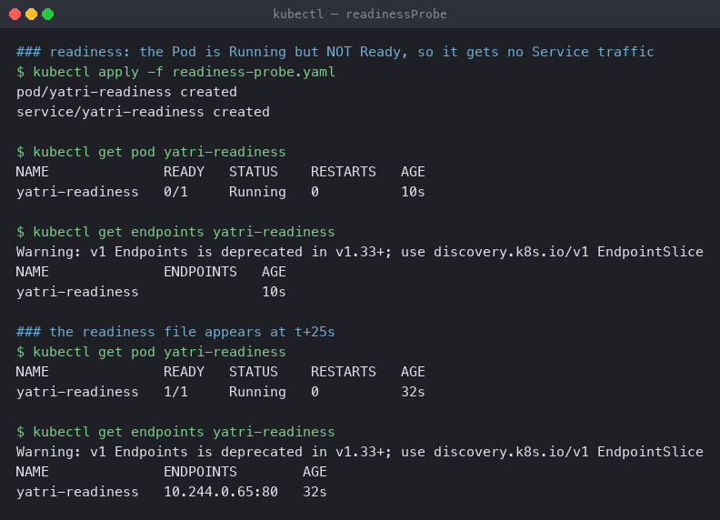
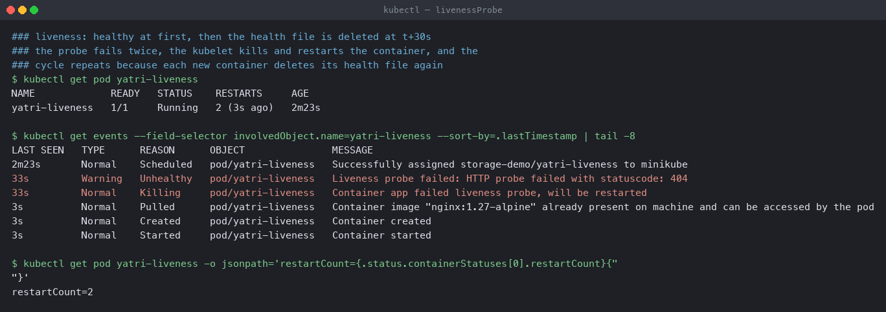
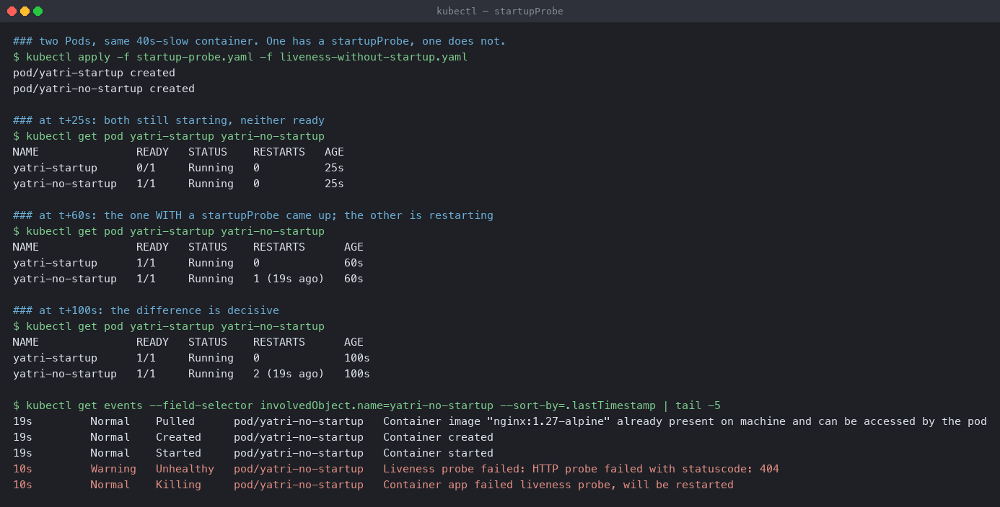

# Probes

Three probes that look almost identical in YAML and do completely different things. Each one
here is demonstrated by making it fail on purpose.

**Environment:** Minikube v1.39.0 with the Docker driver on macOS (Apple silicon),
Kubernetes v1.37.0. Namespace `storage-demo`.

| Probe | Question it answers | Consequence of failing |
|---|---|---|
| `readinessProbe` | can this Pod serve traffic **now**? | removed from Service Endpoints |
| `livenessProbe` | is this container **wedged**? | container is **restarted** |
| `startupProbe` | has it **finished starting**? | suppresses liveness until it passes |

---

## 1. readinessProbe — traffic, not restarts

[`readiness-probe.yaml`](readiness-probe.yaml) runs Nginx but deletes `/ready` at startup
and only creates it after 25 seconds. The probe polls `GET /ready` every 3 seconds.

```bash
kubectl apply -f readiness-probe.yaml
kubectl get pod yatri-readiness
kubectl get endpoints yatri-readiness
```

```
### at t+10s - running, but not ready
NAME              READY   STATUS    RESTARTS   AGE
yatri-readiness   0/1     Running   0          10s

NAME              ENDPOINTS   AGE
yatri-readiness               10s        <- empty

### the readiness file appears at t+25s
NAME              READY   STATUS    RESTARTS   AGE
yatri-readiness   1/1     Running   0          32s

NAME              ENDPOINTS        AGE
yatri-readiness   10.244.0.65:80   32s      <- now routable
```



`0/1 Running` is the state worth recognising. The container is up — not crashed, not
restarting — and the Pod is deliberately receiving no traffic.

The Endpoints object is the mechanism. A Service does not route to Pods, it routes to the
Endpoints (now EndpointSlices) that kube-controller-manager maintains, and **only ready Pods
are listed**. Readiness failing is not an error condition; it is flow control.

Two consequences that matter in production:

- **Rolling updates depend on it.** A Deployment waits for new Pods to become ready before
  terminating old ones. With no readiness probe, Kubernetes assumes ready the moment the
  container starts, and a rollout can route traffic to an application still loading its
  config — a deploy that "works" but 502s for thirty seconds.
- **It can recover.** A Pod that fails readiness under load is pulled out, stops receiving
  requests, recovers, and is added back. The same situation with only a liveness probe gets
  the container killed instead, which is strictly worse.

Note the deprecation warning in the real output — `v1 Endpoints is deprecated in v1.33+;
use discovery.k8s.io/v1 EndpointSlice`. `kubectl get endpointslices` is the current command;
`endpoints` still works and is still what most documentation shows.

---

## 2. livenessProbe — restarts

[`liveness-probe.yaml`](liveness-probe.yaml) inverts the readiness demo: `/healthz` exists
at startup and is **deleted** after 30 seconds. `failureThreshold: 2` with
`periodSeconds: 5` means two consecutive failures, so ~10 seconds after the file goes.

```bash
kubectl apply -f liveness-probe.yaml
kubectl get pod yatri-liveness
kubectl get events --field-selector involvedObject.name=yatri-liveness --sort-by=.lastTimestamp
```

```
NAME             READY   STATUS    RESTARTS     AGE
yatri-liveness   1/1     Running   2 (3s ago)   2m23s

LAST SEEN   TYPE      REASON      MESSAGE
2m23s       Normal    Scheduled   Successfully assigned storage-demo/yatri-liveness to minikube
33s         Warning   Unhealthy   Liveness probe failed: HTTP probe failed with statuscode: 404
33s         Normal    Killing     Container app failed liveness probe, will be restarted
3s          Normal    Created     Container created
3s          Normal    Started     Container started

restartCount=2
```



The two events are the whole story: `Unhealthy ... statuscode: 404`, then
`Killing ... will be restarted`. The container is replaced, the new one starts with
`/healthz` present, deletes it 30 seconds later, and the cycle repeats — hence
`restartCount=2` and climbing.

This is exactly what a liveness probe is for and exactly how it goes wrong. **A liveness
probe that checks anything other than "is this process wedged" turns a transient problem
into a restart loop.** The classic mistake is probing an endpoint that touches the database:
the database has a brief hiccup, every replica fails liveness simultaneously, every replica
restarts, and a 10-second dependency blip becomes an outage.

Rules that follow:

- Liveness should test the process itself, not its dependencies. A trivial handler that
  returns 200 is usually right.
- Dependency health belongs in **readiness**, where the consequence is "stop sending
  traffic" rather than "kill it".
- Set `failureThreshold` and `periodSeconds` so a slow GC pause or a brief CPU spike cannot
  trip it.
- Many services do not need a liveness probe at all. If the process exits when it breaks,
  `restartPolicy` already handles it.

---

## 3. startupProbe — and what happens without one

The most convincing way to show what a startup probe is for is to run the same slow
container twice, with and without one.

Both Pods take **40 seconds** to create `/started`.
[`startup-probe.yaml`](startup-probe.yaml) has a `startupProbe` allowing up to 100 seconds
(`periodSeconds: 5 × failureThreshold: 20`) plus a liveness probe.
[`liveness-without-startup.yaml`](liveness-without-startup.yaml) has the liveness probe
only.

```bash
kubectl apply -f startup-probe.yaml -f liveness-without-startup.yaml
kubectl get pod yatri-startup yatri-no-startup
```

```
### at t+25s: both still starting, neither serving
NAME               READY   STATUS    RESTARTS   AGE
yatri-startup      0/1     Running   0          25s
yatri-no-startup   1/1     Running   0          25s

### at t+60s: the one WITH a startupProbe came up; the other is restarting
NAME               READY   STATUS    RESTARTS      AGE
yatri-startup      1/1     Running   0             60s
yatri-no-startup   1/1     Running   1 (19s ago)   60s

### at t+100s: the difference is decisive
NAME               READY   STATUS    RESTARTS      AGE
yatri-startup      1/1     Running   0             100s
yatri-no-startup   1/1     Running   2 (19s ago)   100s
```

```
### why the second one never starts
10s   Warning   Unhealthy   Liveness probe failed: HTTP probe failed with statuscode: 404
10s   Normal    Killing     Container app failed liveness probe, will be restarted
```



`yatri-startup`: **Ready at 60s, 0 restarts.** `yatri-no-startup`: **restart 2 at 100s, and
it will never start.** Its liveness probe begins immediately, fails at 10 seconds, the
container is killed, the replacement starts from zero, and it is killed again before
reaching 40 seconds. A permanent restart loop caused by a container that was only slow.

While `startupProbe` is in progress, **liveness and readiness are not evaluated at all**.
That is the entire mechanism: it gives a container a long grace period without loosening the
liveness probe that protects it afterwards. The older workaround —
`initialDelaySeconds: 60` on liveness — means 60 seconds of no protection for the whole life
of the container, not just at startup.

One more detail in that output worth catching: **`yatri-no-startup` reports `1/1 READY` the
entire time it is failing.** It has no readiness probe, so Kubernetes assumes it is ready
and a Service would have sent it traffic. The broken Pod looks healthier in `kubectl get
pods` than the working one.

---

## Choosing values

```yaml
startupProbe:                     # generous: slow start is not failure
  periodSeconds: 5
  failureThreshold: 30            # 150s budget
readinessProbe:                   # responsive: pull traffic quickly
  periodSeconds: 5
  failureThreshold: 2
livenessProbe:                    # conservative: restarting is destructive
  periodSeconds: 10
  failureThreshold: 3
```

The asymmetry is the point — fast to stop sending traffic, slow to kill.

Probe types: `httpGet` (any 200–399 passes), `tcpSocket` (connection succeeds),
`exec` (command exits 0, the most expensive since it forks a process in the container),
and `grpc`.

Cleanup:

```bash
kubectl delete -f . --ignore-not-found
```
