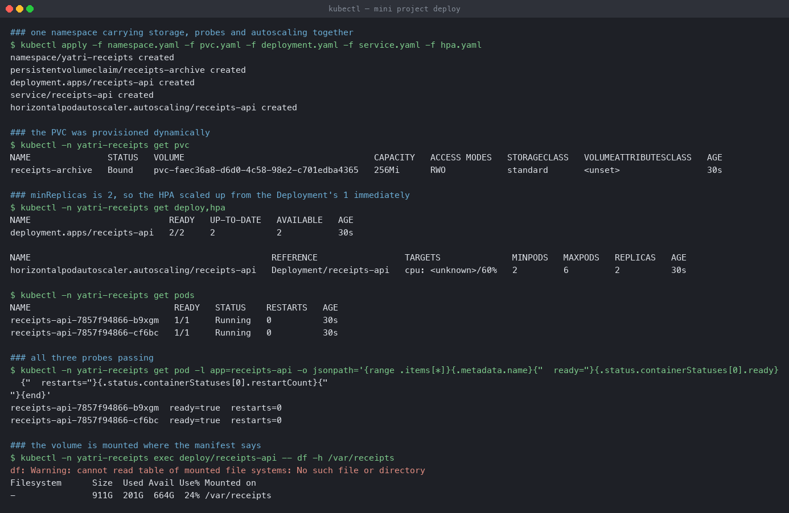
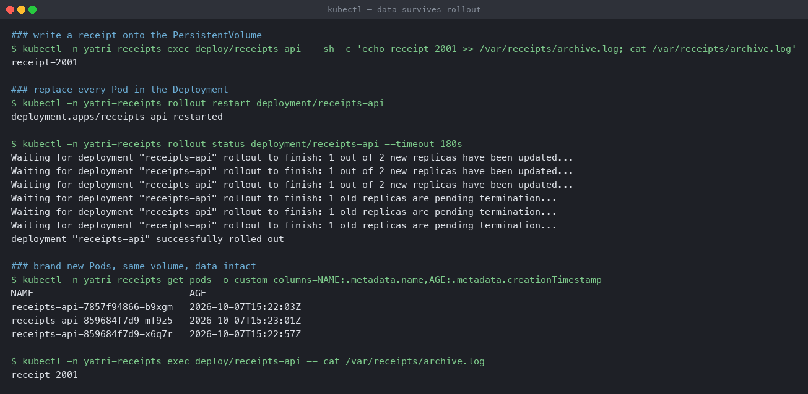
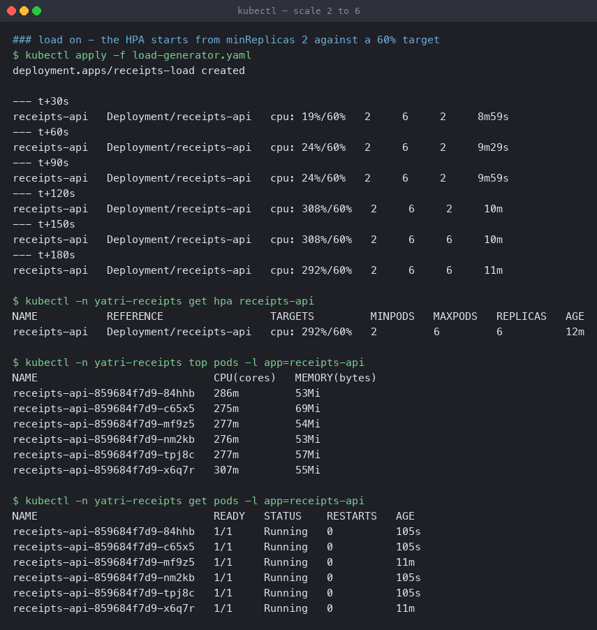
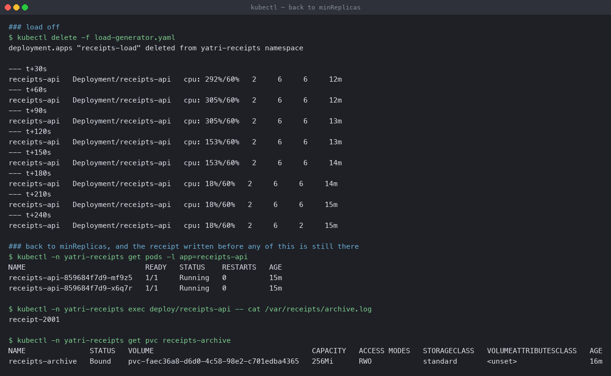

# Mini project — receipts API

One Deployment using everything from this session at once: a dynamically provisioned PVC,
all three probes, CPU requests, and an HPA that takes it from 2 replicas to 6 and back —
with the data on the volume surviving a full Pod replacement in the middle.

**Environment:** Minikube v1.39.0 with the Docker driver on macOS (Apple silicon),
Kubernetes v1.37.0, metrics-server enabled. Namespace `yatri-receipts`.

| File | Purpose |
|---|---|
| [`namespace.yaml`](namespace.yaml) | `yatri-receipts` |
| [`pvc.yaml`](pvc.yaml) | 256Mi claim against the `standard` StorageClass |
| [`deployment.yaml`](deployment.yaml) | PVC mount + startup/readiness/liveness probes + CPU requests |
| [`service.yaml`](service.yaml) | ClusterIP on port 80 |
| [`hpa.yaml`](hpa.yaml) | 2–6 replicas, 60% CPU target |
| [`load-generator.yaml`](load-generator.yaml) | 2 Pods × 8 parallel request loops |

---

## 1. Deploy

```bash
kubectl apply -f namespace.yaml -f pvc.yaml -f deployment.yaml -f service.yaml -f hpa.yaml
kubectl -n yatri-receipts get pvc
kubectl -n yatri-receipts get deploy,hpa
kubectl -n yatri-receipts exec deploy/receipts-api -- df -h /var/receipts
```

```
### the PVC was provisioned dynamically
NAME               STATUS   VOLUME                                     CAPACITY   STORAGECLASS
receipts-archive   Bound    pvc-faec36a8-d6d0-4c58-98e2-c701edba4365   256Mi      standard

### minReplicas is 2, so the HPA scaled up from the Deployment's 1 immediately
NAME                           READY   UP-TO-DATE   AVAILABLE   AGE
deployment.apps/receipts-api   2/2     2            2           30s

NAME                           REFERENCE                 TARGETS              MINPODS   MAXPODS   REPLICAS
.../receipts-api               Deployment/receipts-api   cpu: <unknown>/60%   2         6         2

### all three probes passing
receipts-api-7857f94866-b9xgm  ready=true  restarts=0
receipts-api-7857f94866-cf6bc  ready=true  restarts=0

### the volume is mounted where the manifest says
Filesystem      Size  Used Avail Use% Mounted on
-               911G  201G  664G  24% /var/receipts
```



Two details worth catching.

**The Deployment says `replicas: 1` but two Pods exist.** `minReplicas: 2` on the HPA won,
within seconds of the HPA being created. Once an HPA targets a Deployment, the
Deployment's own `replicas` field is only an initial value — the HPA owns it from then on,
which is why editing `replicas` by hand on an autoscaled Deployment appears to do nothing.

**`df` reports 911G for a 256Mi claim.** The `minikube-hostpath` provisioner backs the
volume with a directory on the node's filesystem, so `df` reports the underlying disk. The
256Mi is a request recorded in the API, not an enforced quota — a reminder that the
PVC capacity is a scheduling and accounting figure here, not a hard limit.

---

## 2. Data survives a full Pod replacement

```bash
kubectl -n yatri-receipts exec deploy/receipts-api -- sh -c 'echo receipt-2001 >> /var/receipts/archive.log; cat /var/receipts/archive.log'
kubectl -n yatri-receipts rollout restart deployment/receipts-api
kubectl -n yatri-receipts rollout status deployment/receipts-api
kubectl -n yatri-receipts exec deploy/receipts-api -- cat /var/receipts/archive.log
```

```
### write a receipt onto the PersistentVolume
receipt-2001

### replace every Pod in the Deployment
deployment.apps/receipts-api restarted
Waiting for deployment "receipts-api" rollout to finish: 1 out of 2 new replicas have been updated...
Waiting for deployment "receipts-api" rollout to finish: 1 old replicas are pending termination...
deployment "receipts-api" successfully rolled out

### brand new Pods, same volume, data intact
NAME                            AGE
receipts-api-859684f7d9-mf9z5   2026-10-07T15:23:01Z
receipts-api-859684f7d9-x6q7r   2026-10-07T15:22:57Z

receipt-2001
```



The Pod names changed (`7857f94866` → `859684f7d9`, a new ReplicaSet hash) and the file is
still there. This is the difference between this Deployment and the `emptyDir` one in
[`../01-kubernetes-volumes/`](../01-kubernetes-volumes/): the same rollout would have wiped
an `emptyDir` completely.

The rollout is also where the **readiness probe** earns its place. `rollout status` waited
for each new Pod to pass readiness before terminating an old one — without it, Kubernetes
would have considered the new Pods available immediately and briefly served traffic from
containers that had not finished starting.

---

## 3. Autoscale under load

```bash
kubectl apply -f load-generator.yaml
kubectl -n yatri-receipts get hpa receipts-api      # every 30s
kubectl -n yatri-receipts top pods -l app=receipts-api
```

```
--- t+30s    cpu: 19%/60%    2   6   2   8m59s
--- t+60s    cpu: 24%/60%    2   6   2   9m29s
--- t+90s    cpu: 24%/60%    2   6   2   9m59s
--- t+120s   cpu: 308%/60%   2   6   2   10m      <- metrics catch up
--- t+150s   cpu: 308%/60%   2   6   6   10m      <- scaled to max

NAME                            CPU(cores)   MEMORY(bytes)
receipts-api-859684f7d9-84hhb   286m         53Mi
receipts-api-859684f7d9-c65x5   275m         69Mi
receipts-api-859684f7d9-mf9z5   277m         54Mi
receipts-api-859684f7d9-nm2kb   276m         53Mi
receipts-api-859684f7d9-tpj8c   277m         57Mi
receipts-api-859684f7d9-x6q7r   307m         55Mi

NAME                            READY   STATUS    RESTARTS   AGE
receipts-api-859684f7d9-84hhb   1/1     Running   0          105s
receipts-api-859684f7d9-mf9z5   1/1     Running   0          11m      <- original
```



Six Pods at 275–307m each. The `AGE` column separates them cleanly: two at 11m are the
originals, four at 105s were created by the autoscaler.

The two-minute gap before the utilisation figure moved is metric lag, not scheduling delay
— the same lag as in [`../02-hpa/`](../02-hpa/), and the reason an HPA is a poor fit for
traffic that spikes faster than it can react.

**Note the `RESTARTS: 0` across all six.** Every Pod is running the liveness probe while
the container is pinned near its CPU limit of 400m, and none of them tripped it. A liveness
probe with a tight `timeoutSeconds` would have started killing healthy-but-busy containers
here, turning a load spike into a restart storm. This is the failure mode described in
[`../03-probes/`](../03-probes/), and the run is the evidence that these settings avoid it.

---

## 4. Load off, and the data is still there

```bash
kubectl delete -f load-generator.yaml
kubectl -n yatri-receipts get hpa receipts-api      # every 30s
kubectl -n yatri-receipts exec deploy/receipts-api -- cat /var/receipts/archive.log
kubectl -n yatri-receipts get pvc receipts-archive
```

```
--- t+150s   cpu: 153%/60%   2   6   6   14m
--- t+180s   cpu: 18%/60%    2   6   6   14m
--- t+210s   cpu: 18%/60%    2   6   6   15m
--- t+240s   cpu: 18%/60%    2   6   2   15m      <- straight back to minReplicas

### back to minReplicas, and the receipt written before any of this is still there
NAME                            READY   STATUS    RESTARTS   AGE
receipts-api-859684f7d9-mf9z5   1/1     Running   0          15m
receipts-api-859684f7d9-x6q7r   1/1     Running   0          15m

receipt-2001

NAME               STATUS   VOLUME                                     CAPACITY   STORAGECLASS   AGE
receipts-archive   Bound    pvc-faec36a8-d6d0-4c58-98e2-c701edba4365   256Mi      standard       16m
```



It went **6 → 2 in one step**, not 6 → 3 → 2. `minReplicas: 2` is a floor, and the
`scaleDown` policy's 50%-per-30s allowance was enough to reach it directly.

The two surviving Pods are the two originals — the autoscaler removed the four it had
created. And `receipt-2001`, written before the rollout and before any scaling, reads back
from a Pod that has now outlived four siblings.

That is the whole point of the exercise: **the compute scaled from 2 to 6 to 2 while the
data did not move.** Pods are disposable, the PersistentVolumeClaim is not, and the
`ReadWriteOnce` access mode held only because every replica was scheduled onto the same
single node. On a multi-node cluster those six replicas sharing one RWO claim would have
been a problem — see the access-mode note in
[`../01-kubernetes-volumes/`](../01-kubernetes-volumes/).

---

## Cleanup

```bash
kubectl delete -f load-generator.yaml --ignore-not-found
kubectl delete namespace yatri-receipts
```

Deleting the namespace deletes the PVC, and because the `standard` StorageClass has
`reclaimPolicy: Delete`, the PersistentVolume and the receipt go with it. On a class with
`Retain` the volume would survive and need removing by hand.
