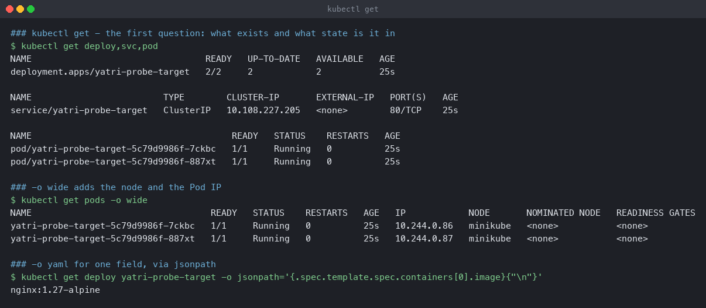
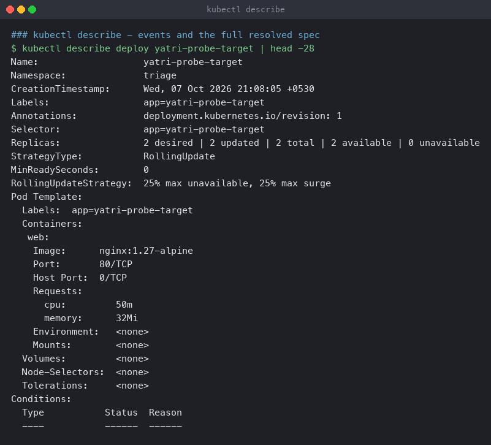
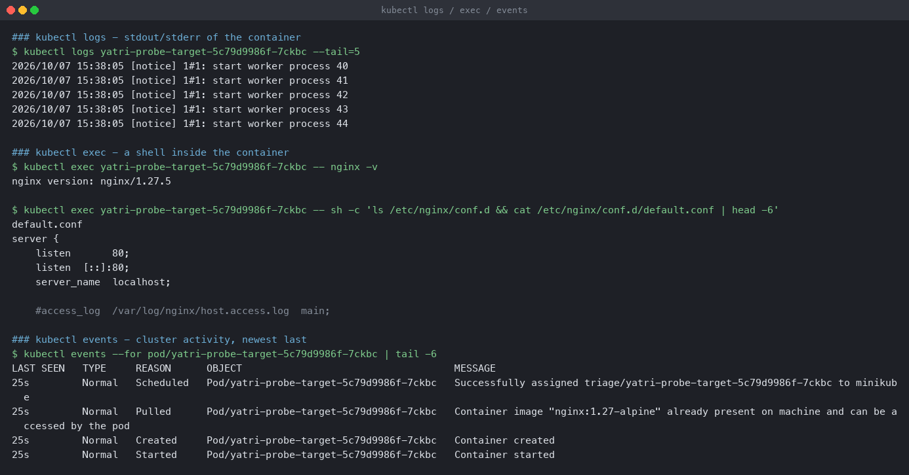
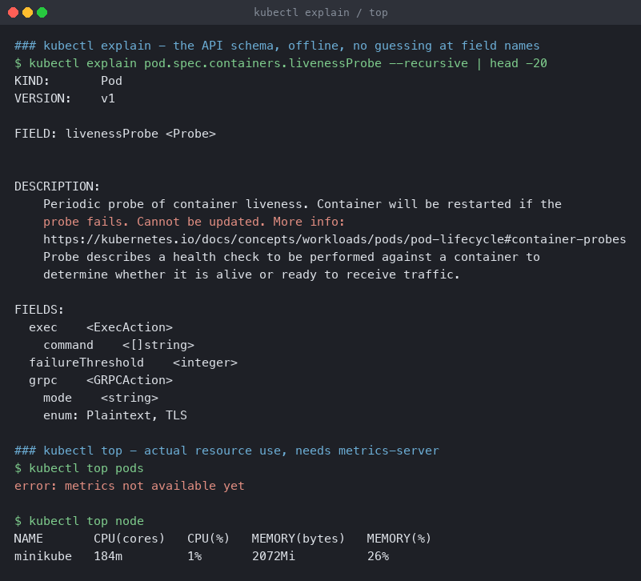

# The diagnostic commands

The eight commands that answer almost every "why is this not working" question, run against
a healthy two-replica Deployment so the normal output is clear before the broken cases in
[`../02-scenarios/`](../02-scenarios/).

**Environment:** Minikube v1.39.0 with the Docker driver on macOS (Apple silicon),
Kubernetes v1.37.0. Namespace `triage`, subject [`demo.yaml`](demo.yaml).

| Command | Answers |
|---|---|
| `kubectl get` | what exists, and what state is it in |
| `kubectl get -o wide` | which node, which Pod IP |
| `kubectl describe` | **the events** — usually the root cause verbatim |
| `kubectl logs` | what the application said |
| `kubectl exec` | what is actually inside the container |
| `kubectl events` | cluster activity, in order |
| `kubectl explain` | the API schema, without guessing field names |
| `kubectl top` | real CPU and memory use |

---

## `kubectl get`

```bash
kubectl get deploy,svc,pod
kubectl get pods -o wide
kubectl get deploy yatri-probe-target -o jsonpath='{.spec.template.spec.containers[0].image}{"\n"}'
```

```
NAME                                 READY   UP-TO-DATE   AVAILABLE   AGE
deployment.apps/yatri-probe-target   2/2     2            2           25s

NAME                         TYPE        CLUSTER-IP       EXTERNAL-IP   PORT(S)   AGE
service/yatri-probe-target   ClusterIP   10.108.227.205   <none>        80/TCP    25s

NAME                                      READY   STATUS    RESTARTS   AGE
pod/yatri-probe-target-5c79d9986f-7ckbc   1/1     Running   0          25s
pod/yatri-probe-target-5c79d9986f-887xt   1/1     Running   0          25s

### -o wide adds the node and the Pod IP
NAME                                  READY   STATUS    RESTARTS   AGE   IP            NODE
yatri-probe-target-5c79d9986f-7ckbc   1/1     Running   0          25s   10.244.0.86   minikube
yatri-probe-target-5c79d9986f-887xt   1/1     Running   0          25s   10.244.0.87   minikube

### one field, via jsonpath
nginx:1.27-alpine
```



Always the first command. `kubectl get deploy,svc,pod` in one call is worth the habit —
comma-separated types avoid three round trips and show the relationship between them.

The two columns that matter most:

- **`READY`** — `2/2` on the Deployment means two replicas available; `1/1` on a Pod means
  one of one container passing readiness. `0/1 Running` is the state to recognise: up, but
  deliberately receiving no traffic.
- **`RESTARTS`** — anything non-zero is a container that died. Worth asking about even when
  the Pod currently looks fine.

`-o wide` adds the Pod IP and node, which is what you need for any networking question.
`-o jsonpath` extracts a single field — far better than `-o yaml | grep`, because it
addresses the structure rather than the text.

---

## `kubectl describe`

```bash
kubectl describe deploy yatri-probe-target
```



**The `Events` section at the bottom is the single most valuable output in Kubernetes.** In
eight of the nine broken scenarios in the next folder, the event message named the root
cause outright — the missing ConfigMap key, the unresolvable image tag, the Secret that does
not exist.

`describe` also shows the **resolved** spec, with defaults filled in. Comparing it against
the YAML on disk catches a field that was silently ignored because it was misspelled or at
the wrong nesting level.

The caveat: **events expire.** The default retention is one hour, so a Pod that broke
overnight has no events left and `describe` gets much less useful. That is an argument for
shipping events somewhere, and for checking them early.

---

## `kubectl logs`, `exec` and `events`

```bash
kubectl logs <pod> --tail=5
kubectl exec <pod> -- nginx -v
kubectl exec <pod> -- sh -c 'ls /etc/nginx/conf.d && cat /etc/nginx/conf.d/default.conf | head -6'
kubectl events --for pod/<pod>
```

```
### logs - stdout/stderr of the container
2026/10/07 15:38:05 [notice] 1#1: start worker process 40
2026/10/07 15:38:05 [notice] 1#1: start worker process 41

### exec - what is actually inside the container
nginx version: nginx/1.27.5

default.conf
server {
    listen       80;
    listen  [::]:80;
    server_name  localhost;

### events - cluster activity, newest last
LAST SEEN   TYPE     REASON      MESSAGE
25s         Normal   Scheduled   Successfully assigned triage/yatri-probe-target-... to minikube
25s         Normal   Pulled      Container image "nginx:1.27-alpine" already present on machine
```



**`logs` only works once a container has run.** It is useless for `Pending`,
`ContainerCreating` and `CreateContainerConfigError`, which is why it is third on the list
rather than first. Useful flags: `--previous` for the container before the last restart
(though it fails if that container has been garbage collected — see scenario 1),
`-f` to follow, `--since=10m`, and `-l app=foo --prefix` to read every replica at once.

**`exec` answers "is the thing inside the container what I think it is".** Listing the
config directory that nginx actually loaded is a different question from reading the
ConfigMap — scenario 9 is exactly the case where those two disagree. Note that `exec` needs
a shell in the image, which a distroless or scratch image does not have; `kubectl debug`
with an ephemeral container is the way in there.

**`kubectl events`** is newer than `get events` and supports `--for`, which scopes to one
object without a field selector. It sorts oldest-first by default, which is the order you
want when reconstructing what happened.

---

## `kubectl explain` and `kubectl top`

```bash
kubectl explain pod.spec.containers.livenessProbe --recursive
kubectl top pods
kubectl top node
```

```
KIND:       Pod
VERSION:    v1

FIELD: livenessProbe <Probe>

DESCRIPTION:
    Periodic probe of container liveness. Container will be restarted if the
    probe fails. Cannot be updated.

FIELDS:
  exec	<ExecAction>
    command	<[]string>
  failureThreshold	<integer>
  grpc	<GRPCAction>
    mode	<string>
    enum: Plaintext, TLS

### top
$ kubectl top pods
error: metrics not available yet

$ kubectl top node
NAME       CPU(cores)   CPU(%)   MEMORY(bytes)   MEMORY(%)
minikube   184m         1%       2072Mi          26%
```



**`explain` is the offline schema**, served from the cluster's own API definitions, so it is
correct for the exact version you are running rather than for whatever a web search found.
`--recursive` prints the whole subtree, which is the fastest way to find the field you half
remember. It also prints `enum:` values — `Plaintext, TLS` above — so there is no guessing
at valid strings.

**`kubectl top pods` failed in this capture:** `error: metrics not available yet`. The Pods
were 25 seconds old and metrics-server had not completed a scrape cycle for them yet. That
is not a broken cluster — `top node` in the same breath returned fine, because the node has
been reporting for far longer. It is worth knowing because the same lag is what makes a
freshly created HPA read `<unknown>`, as seen in
[`../kubernetes-storage-hpa-probes/02-hpa/`](../../kubernetes-storage-hpa-probes/02-hpa/).
Waiting a minute and re-running is the fix; there is nothing to debug.

`top` needs metrics-server, which is not installed by default:
`minikube addons enable metrics-server`.

---

## The order, and why

1. **`get`** — narrow the problem to a phase. The status column tells you whether it was
   never scheduled, never configured, never started, or started and died.
2. **`describe`** — read the events. Most of the time, stop here.
3. **`logs`** — only if the container ran.
4. **`exec` / `explain` / `top`** — when the declared state and the actual state need
   comparing.

The failures this order does *not* catch are the ones with no event and no log: a Service
selector that matches nothing, or a `targetPort` pointing at the wrong port. Those need
step 4 — comparing two objects that each look correct alone. Scenarios 6 and 8 next door are
both of that kind.
