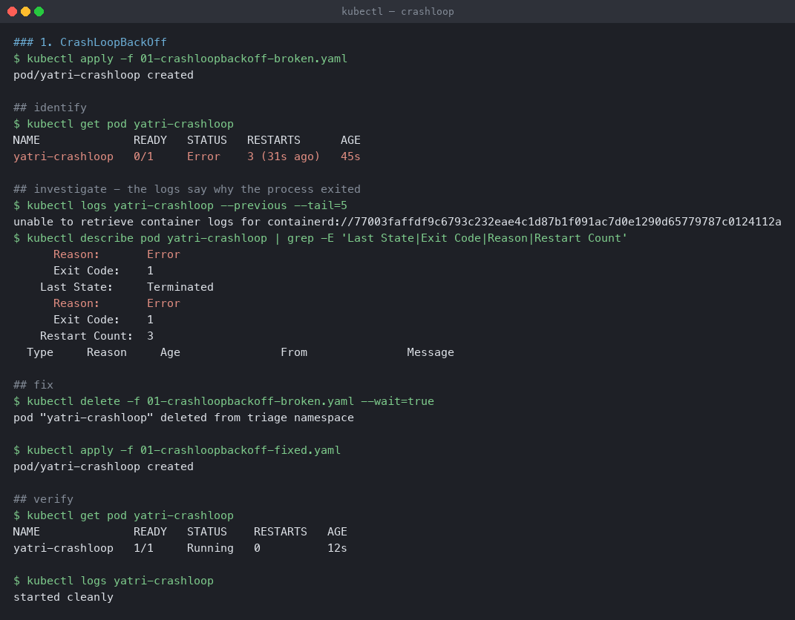
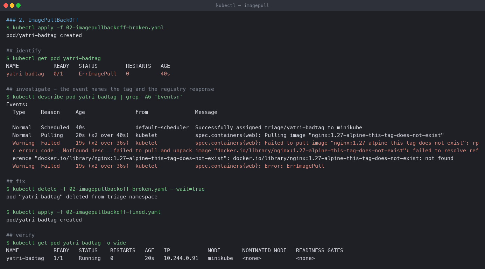
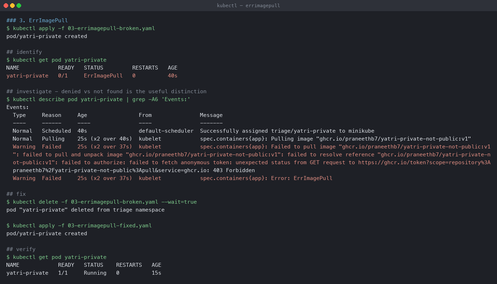
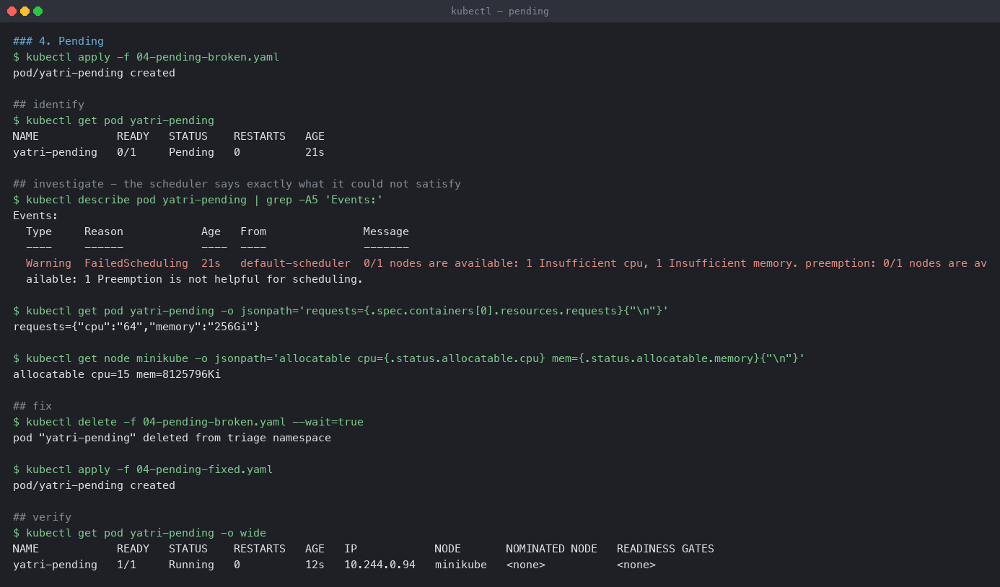
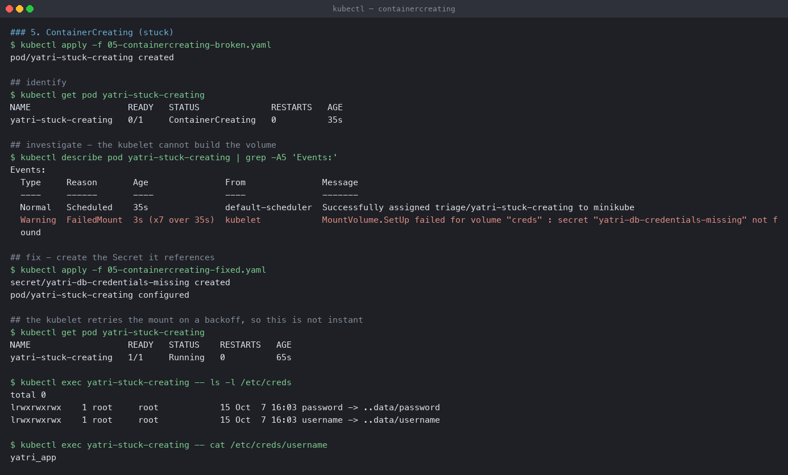
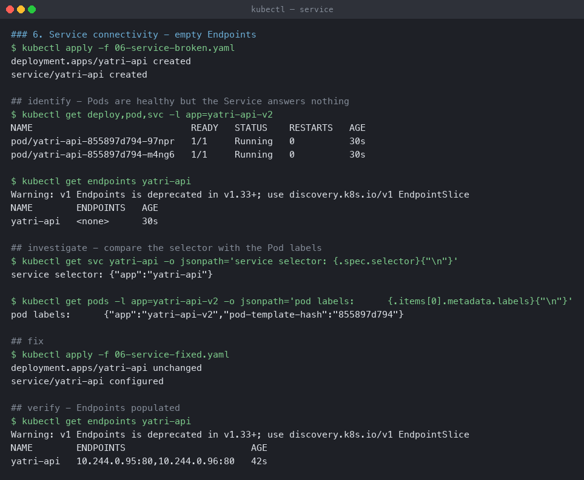
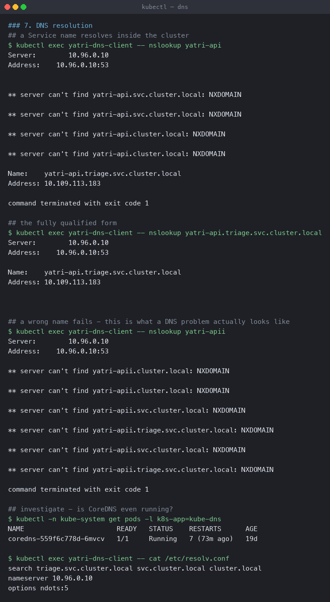
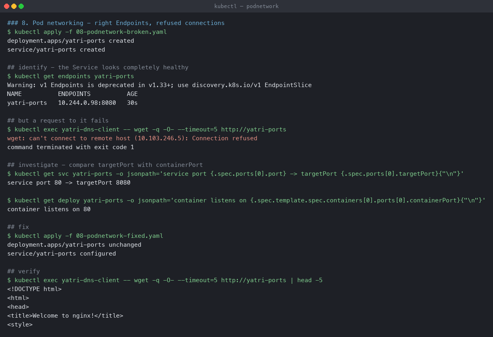
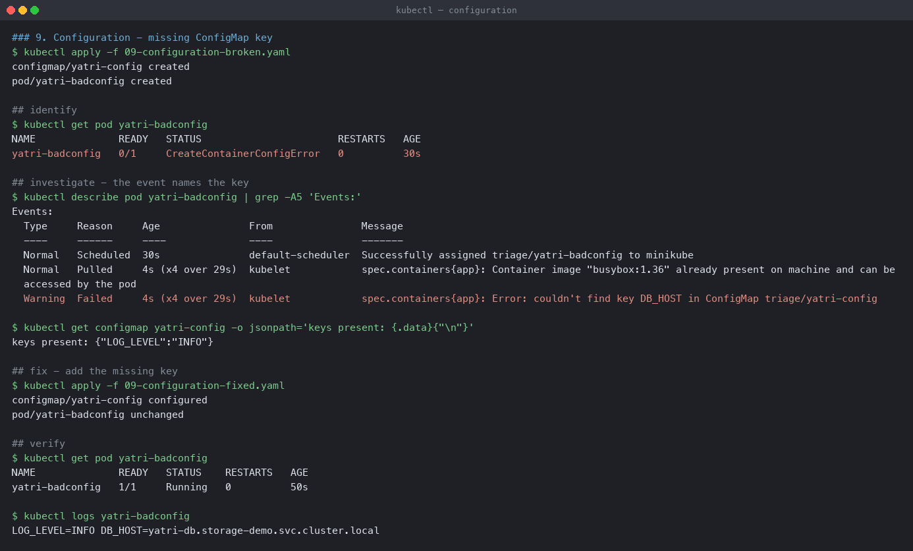

# Nine broken-and-fixed scenarios

Each scenario is a pair of manifests — `-broken.yaml` and `-fixed.yaml` — and each one was
applied to a live cluster, diagnosed with `kubectl`, fixed and verified. The output below is
what the cluster actually said.

**Environment:** Minikube v1.39.0 with the Docker driver on macOS (Apple silicon),
Kubernetes v1.37.0. Namespace `triage`.

| # | Symptom | Root cause |
|---|---|---|
| 1 | `CrashLoopBackOff` | the container's command exits non-zero |
| 2 | `ImagePullBackOff` | image tag does not exist in the registry |
| 3 | `ErrImagePull` | repository does not exist / no pull credentials |
| 4 | `Pending` | no node can satisfy the resource request |
| 5 | `ContainerCreating` (stuck) | a referenced Secret does not exist |
| 6 | Service returns nothing | selector does not match Pod labels |
| 7 | DNS failure | wrong Service name |
| 8 | Connection refused, Endpoints fine | `targetPort` ≠ `containerPort` |
| 9 | Pod will not start | ConfigMap key referenced but missing |

---

## 1. CrashLoopBackOff

[`01-crashloopbackoff-broken.yaml`](01-crashloopbackoff-broken.yaml) runs
`echo 'config file missing, refusing to start'; exit 1`.

```
## identify
NAME              READY   STATUS   RESTARTS      AGE
yatri-crashloop   0/1     Error    3 (31s ago)   45s

## investigate
$ kubectl logs yatri-crashloop --previous --tail=5
unable to retrieve container logs for containerd://77003faffdf9...

$ kubectl describe pod yatri-crashloop | grep -E 'Last State|Exit Code|Reason|Restart Count'
      Reason:       Error
      Exit Code:    1
    Last State:     Terminated
      Restart Count:  3

## verify after the fix
NAME              READY   STATUS    RESTARTS   AGE
yatri-crashloop   1/1     Running   0          12s
started cleanly
```



**`Exit Code: 1` is the whole diagnosis.** A non-zero exit means the application decided to
stop; the kubelet is only obeying `restartPolicy: Always`.

Note that `kubectl logs --previous` **failed here** —
`unable to retrieve container logs`. The previous container had already been garbage
collected, which is common when a container has restarted several times. That is why
`describe` matters: the `Last State` / `Exit Code` fields are kept in the Pod status by the
API server and survive the container being cleaned up.

`CrashLoopBackOff` is not an error itself, it is the **backoff**: the kubelet waits 10s,
20s, 40s… up to 5 minutes between restarts. A Pod alternating between `Error` and
`CrashLoopBackOff` is normal for a container that keeps failing.

Usual real causes: missing config or environment variable, a dependency not reachable at
startup, a failing migration, or the wrong `command`/`args` so the entrypoint exits
immediately.

---

## 2. ImagePullBackOff

```
## identify
NAME           READY   STATUS         RESTARTS   AGE
yatri-badtag   0/1     ErrImagePull   0          40s

## investigate
Warning  Failed  19s (x2 over 36s)  kubelet  Failed to pull image
  "nginx:1.27-alpine-this-tag-does-not-exist": rpc error: code = NotFound
  desc = failed to resolve reference "docker.io/library/nginx:1.27-alpine-this-tag-does-not-exist":
  not found

## verify
NAME           READY   STATUS    RESTARTS   AGE   IP             NODE
yatri-badtag   1/1     Running   0          20s   10.244.0.81    minikube
```



`code = NotFound` is the useful part. The registry was reached and answered — the tag simply
is not there. That distinguishes it from a credentials or network problem.

`ErrImagePull` is the immediate failure; `ImagePullBackOff` is the state it settles into
once the kubelet starts backing off between attempts. They are the same problem at
different ages, which is why `get pods` shows one or the other depending on when you look.

---

## 3. ErrImagePull — repository, not tag

[`03-errimagepull-broken.yaml`](03-errimagepull-broken.yaml) references
`ghcr.io/praneethb7/yatri-private-not-public:v1`, which does not exist.

```
## identify
NAME            READY   STATUS         RESTARTS   AGE
yatri-private   0/1     ErrImagePull   0          40s

## investigate
Warning  Failed  kubelet  Failed to pull image "ghcr.io/praneethb7/yatri-private-not-public:v1":
  failed to resolve reference: failed to authorize: failed to fetch anonymous token:
  unexpected status from GET request to
  https://ghcr.io/token?scope=repository%3Apraneethb7%2Fyatri-private-not-public%3Apull
  &service=ghcr.io: 403 Forbidden
```



**The failure is at `failed to authorize`, and the status is `403 Forbidden`, not
`404 Not Found`.** That is the diagnosis. The kubelet asked GHCR for an *anonymous* pull
token for this repository and was refused — registries deliberately return 403 rather than
404 for a repository you cannot see, so that a private repository's existence is not
leaked.

So the practical reading is "either it does not exist, or you are not authorised", and both
have the same fix path:

```bash
kubectl create secret docker-registry ghcr-creds \
  --docker-server=ghcr.io --docker-username=<user> --docker-password=<token>
```

then `imagePullSecrets` on the Pod spec. The fixed manifest uses a public image instead,
with the real fix documented in its comments.

---

## 4. Pending

The Pod requests 64 CPUs and 256Gi of memory.

```
## identify
NAME            READY   STATUS    RESTARTS   AGE
yatri-pending   0/1     Pending   0          20s

## investigate
Warning  FailedScheduling  default-scheduler  0/1 nodes are available:
  1 Insufficient cpu, 1 Insufficient memory.
  preemption: 0/1 nodes are available: 1 Preemption is not helpful for scheduling.

requests={"cpu":"64","memory":"256Gi"}
allocatable cpu=15 mem=8125796Ki

## verify
NAME            READY   STATUS    RESTARTS   AGE   IP             NODE
yatri-pending   1/1     Running   0          12s   10.244.0.94   minikube
```



`Pending` means **the scheduler has not placed the Pod**, so no node, no container, nothing
to get logs from. `kubectl logs` on a Pending Pod is always useless; `describe` is the only
tool.

The message is unusually explicit: `1 Insufficient cpu, 1 Insufficient memory` — one node
failed on each count. Comparing `requests` with the node's `allocatable` confirms it:
64 CPUs requested, 15 available.

The `preemption:` line is worth reading too — `1 Preemption is not helpful for scheduling`.
The scheduler also considered evicting lower-priority Pods to make room, and concluded that
even doing so would not produce a node big enough. Which is correct: nothing fits a 64-CPU
request on a 15-CPU node.

Other common `Pending` causes: no node matches a `nodeSelector` or affinity rule, a taint
with no matching toleration, or an unbound PVC — which is `Pending` for a storage reason
rather than a CPU one.

---

## 5. ContainerCreating, stuck

The Pod mounts a Secret named `yatri-db-credentials-missing` that does not exist.

```
## identify
NAME                   READY   STATUS              RESTARTS   AGE
yatri-stuck-creating   0/1     ContainerCreating   0          35s

## investigate
Warning  FailedMount  kubelet  MountVolume.SetUp failed for volume "creds":
  secret "yatri-db-credentials-missing" not found

## fix
secret/yatri-db-credentials-missing created
pod/yatri-stuck-creating configured

## the kubelet retries the mount on a backoff, so this is not instant
NAME                   READY   STATUS    RESTARTS   AGE
yatri-stuck-creating   1/1     Running   0          65s

$ kubectl exec yatri-stuck-creating -- ls -l /etc/creds
total 0
lrwxrwxrwx    1 root     root            15 Oct  7 16:03 password -> ..data/password
lrwxrwxrwx    1 root     root            15 Oct  7 16:03 username -> ..data/username

$ kubectl exec yatri-stuck-creating -- cat /etc/creds/username
yatri_app
```



The Pod **was** scheduled — this is past the `Pending` stage. The kubelet is trying to build
the container's filesystem and cannot, so it retries indefinitely rather than failing.

`ContainerCreating` for more than a few seconds always means `describe`. Causes: a missing
Secret or ConfigMap, a PVC that is not `Bound`, a slow image pull, or a CNI problem
assigning a Pod IP.

Note `FailedMount ... 3s (x7 over 35s)` — the kubelet had already retried seven times. That
backoff is also why **the fix is not instant**: creating the Secret does not immediately
unblock the Pod, and the first attempt at this scenario recorded the Pod still
`ContainerCreating` 60 seconds after the Secret existed. It needs waiting for, not
re-applying.

The symlinks in `/etc/creds` are how Kubernetes projects a Secret volume — `..data` is an
atomically-swapped directory, which is what lets a Secret update in place without a partial
read.

---

## 6. Service connectivity — empty Endpoints

[`06-service-broken.yaml`](06-service-broken.yaml): the Service selects `app: yatri-api`,
the Pods are labelled `app: yatri-api-v2`.

```
## identify - the Pods are perfectly healthy
NAME                         READY   UP-TO-DATE   AVAILABLE   AGE
deployment.apps/yatri-api    2/2     2            2           30s

NAME             ENDPOINTS   AGE
yatri-api                    30s        <- nothing

## investigate
service selector: {"app":"yatri-api"}
pod labels:       {"app":"yatri-api-v2","pod-template-hash":"855897d794"}

## verify
NAME        ENDPOINTS                       AGE
yatri-api   10.244.0.95:80,10.244.0.96:80   42s
```



This is the one that wastes the most time, because **everything looks fine**. The Deployment
is `2/2`, the Pods are `Running` and `Ready`, the Service exists and has a ClusterIP. Only
the Endpoints list is empty.

**`kubectl get endpoints <svc>` is the single most useful Service debugging command.** Empty
endpoints means the selector matches nothing — go compare the two label sets. Populated
endpoints means the problem is elsewhere, which is scenario 8.

Note that nothing validates this. A Service selector is a free-form label query; selecting
labels no Pod has is legal, and produces a Service that silently answers nothing.

---

## 7. DNS

```
## the short name resolves - but look at the noise on the way there
$ kubectl exec yatri-dns-client -- nslookup yatri-api
Server:		10.96.0.10
Address:	10.96.0.10:53

** server can't find yatri-api.svc.cluster.local: NXDOMAIN
** server can't find yatri-api.svc.cluster.local: NXDOMAIN
** server can't find yatri-api.cluster.local: NXDOMAIN
** server can't find yatri-api.cluster.local: NXDOMAIN

Name:	yatri-api.triage.svc.cluster.local
Address: 10.109.113.183
command terminated with exit code 1

## the fully qualified form, one clean query
$ kubectl exec yatri-dns-client -- nslookup yatri-api.triage.svc.cluster.local
Name:	yatri-api.triage.svc.cluster.local
Address: 10.109.113.183

## a wrong name - every suffix fails and nothing resolves
$ kubectl exec yatri-dns-client -- nslookup yatri-apii
** server can't find yatri-apii.cluster.local: NXDOMAIN
** server can't find yatri-apii.cluster.local: NXDOMAIN
** server can't find yatri-apii.svc.cluster.local: NXDOMAIN
** server can't find yatri-apii.triage.svc.cluster.local: NXDOMAIN
** server can't find yatri-apii.svc.cluster.local: NXDOMAIN
** server can't find yatri-apii.triage.svc.cluster.local: NXDOMAIN
command terminated with exit code 1

## is CoreDNS even running?
NAME                       READY   STATUS    RESTARTS      AGE
coredns-559f6c778d-6mvcv   1/1     Running   7 (73m ago)   19d

$ kubectl exec yatri-dns-client -- cat /etc/resolv.conf
search triage.svc.cluster.local svc.cluster.local cluster.local
nameserver 10.96.0.10
options ndots:5
```



The successful lookup is the messier of the two, and that is the interesting part. Resolving
`yatri-api` printed **four `NXDOMAIN` lines before succeeding**, and still exited non-zero.

Those failures are the `search` path being walked. `/etc/resolv.conf` lists three suffixes,
so the resolver tried `yatri-api.svc.cluster.local` and `yatri-api.cluster.local` — which do
not exist — before `yatri-api.triage.svc.cluster.local`, which does. Each appears twice
because busybox queries A and AAAA records separately.

So `NXDOMAIN` in the output does **not** by itself mean the lookup failed; the `Name:` and
`Address:` lines at the end are the answer. Reading the first error line and concluding DNS
is broken is a genuine trap here. `nslookup` also exits 1 whenever any query in the sequence
fails, which makes its exit code useless in a script — a real health check should use the
FQDN, which produced exactly one clean query above.

The search path is also why a Pod can reach a Service in its own namespace by bare name, and
why a Service in *another* namespace needs at least `name.namespace`.

The wrong name is the real failure: **every suffix returned `NXDOMAIN` and no `Address:`
line ever appeared.** That is what a genuine DNS failure looks like — a name problem, not a
connectivity problem.

Contrast it with a *timeout*, which means CoreDNS itself is unreachable. The two have
completely different fixes, and the shape of the `nslookup` output distinguishes them
immediately: refusals mean DNS is working and the name is wrong; silence means DNS is not
working.

`ndots:5` is a real performance trap: any name with fewer than 5 dots is tried against every
search-domain suffix first. Looking up `api.example.com` from a Pod produces four failed
queries before the correct one. Appending a trailing dot (`api.example.com.`) skips the
search path.

---

## 8. Pod networking — Endpoints fine, connections refused

[`08-podnetwork-broken.yaml`](08-podnetwork-broken.yaml) sets `targetPort: 8080` while the
container listens on 80.

```
## identify - the Service looks completely healthy
NAME          ENDPOINTS           AGE
yatri-ports   10.244.0.98:8080   30s

## but a request to it fails
$ kubectl exec yatri-dns-client -- wget -q -O- --timeout=5 http://yatri-ports
wget: can't connect to remote host (10.103.246.5): Connection refused

## investigate
service port 80 -> targetPort 8080
container listens on 80

## verify
<!DOCTYPE html>
<html>
<head>
<title>Welcome to nginx!</title>
```



The contrast with scenario 6 is the point of including both. Here the Endpoints list is
**populated** — `10.244.0.98:8080` — so the selector is right and the Pod is ready. The
address is correct and the **port is not**.

Reading `10.244.0.98:8080` closely is the diagnosis: kube-proxy will forward to port 8080 on
that Pod, where nothing is listening. Hence `Connection refused` rather than a timeout.

Those two failure modes are worth separating:

- **`Connection refused`** — the packet arrived and nothing was listening. Wrong port, or
  the process is not up.
- **Timeout** — the packet went nowhere. Wrong address, a NetworkPolicy, or a routing
  problem.

Note also that `targetPort` can be a **name** rather than a number
(`targetPort: http` matching a named `containerPort`), which makes this class of mistake
impossible to make silently.

---

## 9. Configuration — missing ConfigMap key

The Pod requires `DB_HOST` via `configMapKeyRef`; the ConfigMap only defines `LOG_LEVEL`.

```
## identify
NAME              READY   STATUS                       RESTARTS   AGE
yatri-badconfig   0/1     CreateContainerConfigError   0          30s

## investigate
Warning  Failed  kubelet  Error: couldn't find key DB_HOST in ConfigMap triage/yatri-config

keys present: {"LOG_LEVEL":"INFO"}

## verify
NAME              READY   STATUS    RESTARTS   AGE
yatri-badconfig   1/1     Running   0          20s

LOG_LEVEL=INFO DB_HOST=yatri-db.storage-demo.svc.cluster.local
```



`CreateContainerConfigError` is a distinct status from `ContainerCreating` and from
`CrashLoopBackOff`, and it is specific: the container could not even be *configured*. The
event names the exact key and the exact ConfigMap.

A detail worth knowing: `configMapKeyRef` is **required by default**. Adding
`optional: true` makes a missing key leave the variable unset instead of blocking the Pod —
which is sometimes what you want and sometimes how a missing value reaches production as an
empty string.

---

## The method, generalised

Every one of these followed the same four steps, and the order matters:

1. **`kubectl get`** — what state is it in? The status column narrows the problem to a
   phase: not scheduled (`Pending`), not configured (`CreateContainerConfigError`), not
   starting (`ContainerCreating`), not staying up (`CrashLoopBackOff`), or up but
   unreachable (a Service problem).
2. **`kubectl describe`** — the `Events` section. In **eight of these nine scenarios the
   event message named the root cause outright**, including the exact key, tag or resource.
3. **`kubectl logs`** — only once the container has actually run. Useless for `Pending`,
   `ContainerCreating` and config errors, and unreliable after several restarts.
4. **Compare declared against actual** — selector against labels, `targetPort` against
   `containerPort`, `requests` against `allocatable`. These are the failures that produce no
   error at all, because nothing in Kubernetes validates that two objects agree.

That last category — scenarios 6 and 8 — is the one that needs a deliberate habit, since
there is no event to read and everything reports healthy.

## Cleanup

```bash
kubectl delete namespace triage
```
