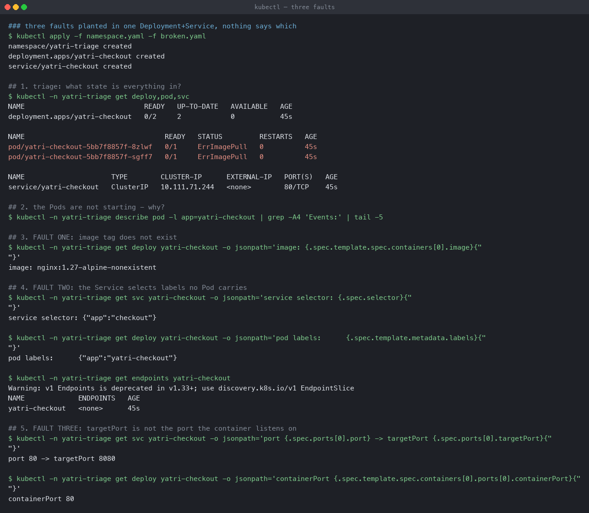
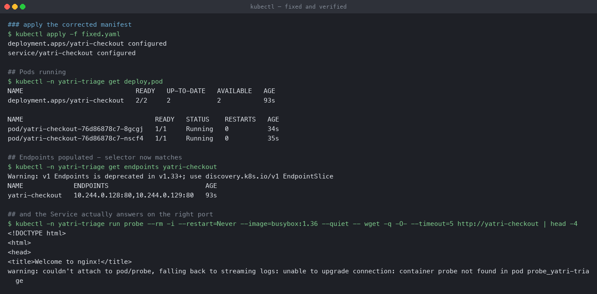

# Mini project — three faults, one manifest

[`broken.yaml`](broken.yaml) is a Deployment and a Service with **three independent faults**
planted in it. Nothing in the file says how many there are or where. The exercise is to find
all three with `kubectl` alone, then compare against [`fixed.yaml`](fixed.yaml).

**Environment:** Minikube v1.39.0 with the Docker driver on macOS (Apple silicon),
Kubernetes v1.37.0. Namespace `yatri-triage`.

---

## Diagnosis

```bash
kubectl apply -f namespace.yaml -f broken.yaml
kubectl -n yatri-triage get deploy,pod,svc
```

```
NAME                             READY   UP-TO-DATE   AVAILABLE   AGE
deployment.apps/yatri-checkout   0/2     2            0           45s

NAME                                  READY   STATUS         RESTARTS   AGE
pod/yatri-checkout-5bb7f8857f-8zlwf   0/1     ErrImagePull   0          45s
pod/yatri-checkout-5bb7f8857f-sgff7   0/1     ErrImagePull   0          45s

NAME                     TYPE        CLUSTER-IP      EXTERNAL-IP   PORT(S)   AGE
service/yatri-checkout   ClusterIP   10.111.71.244   <none>        80/TCP    45s
```

`0/2` available and `ErrImagePull` is the first fault, and it is loud. The other two are
silent — they would still be there after fixing the image, which is the point of planting
three.

### Fault 1 — the image tag

```
$ kubectl -n yatri-triage get deploy yatri-checkout -o jsonpath='image: {...}'
image: nginx:1.27-alpine-nonexistent
```

### Fault 2 — the Service selector matches nothing

```
service selector: {"app":"checkout"}
pod labels:       {"app":"yatri-checkout"}

$ kubectl -n yatri-triage get endpoints yatri-checkout
NAME             ENDPOINTS   AGE
yatri-checkout   <none>      45s
```

`checkout` versus `yatri-checkout`. Close enough to read past, and `<none>` in the Endpoints
column is the proof.

### Fault 3 — targetPort is wrong

```
port 80 -> targetPort 8080
containerPort 80
```



Faults 2 and 3 are both invisible while fault 1 exists — with no running Pods, empty
Endpoints look like a consequence of the image problem rather than a separate bug. That is
the realistic shape of an incident: fixing the obvious thing reveals the next one.

**Neither 2 nor 3 produces any event, log line or error.** Both are two objects that are
individually valid and disagree with each other, and nothing in Kubernetes validates that.
They are found only by reading the declared values side by side.

---

## Fix and verify

```bash
kubectl apply -f fixed.yaml
kubectl -n yatri-triage get deploy,pod
kubectl -n yatri-triage get endpoints yatri-checkout
kubectl -n yatri-triage run probe --rm -i --restart=Never --image=busybox:1.36 -- \
  wget -q -O- --timeout=5 http://yatri-checkout
```

```
deployment.apps/yatri-checkout configured
service/yatri-checkout configured

NAME                             READY   UP-TO-DATE   AVAILABLE   AGE
deployment.apps/yatri-checkout   2/2     2            2           93s

NAME                                  READY   STATUS    RESTARTS   AGE
pod/yatri-checkout-76d86878c7-8gcgj   1/1     Running   0          34s
pod/yatri-checkout-76d86878c7-nscf4   1/1     Running   0          35s

### Endpoints populated - selector now matches
NAME             ENDPOINTS                         AGE
yatri-checkout   10.244.0.128:80,10.244.0.129:80   93s

### and the Service actually answers on the right port
<!DOCTYPE html>
<html>
<head>
<title>Welcome to nginx!</title>
```



All three verified independently, which is what makes this a fix rather than a guess:

1. **Image** — Pods reached `Running` with a new ReplicaSet hash (`5bb7f8857f` →
   `76d86878c7`), because changing the image rolls the Deployment.
2. **Selector** — Endpoints went from `<none>` to two addresses.
3. **targetPort** — an HTTP request from another Pod returned actual HTML. This is the only
   one of the three that populated Endpoints could not have proven; fault 3 would have left
   Endpoints looking correct at `:8080` while every connection was refused.

The last point is the lesson worth keeping: **`kubectl get endpoints` showing addresses is
necessary but not sufficient.** A request through the Service is the only check that covers
the port as well as the selector.

## Cleanup

```bash
kubectl delete namespace yatri-triage
```
