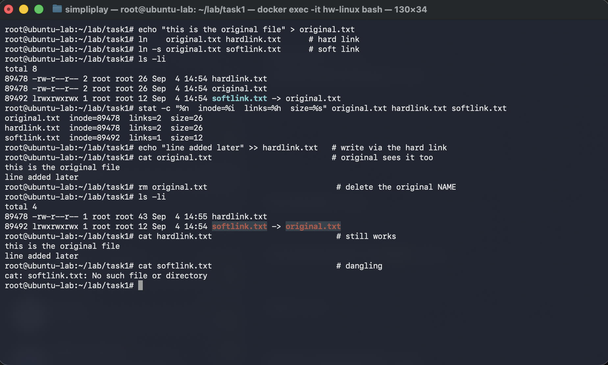
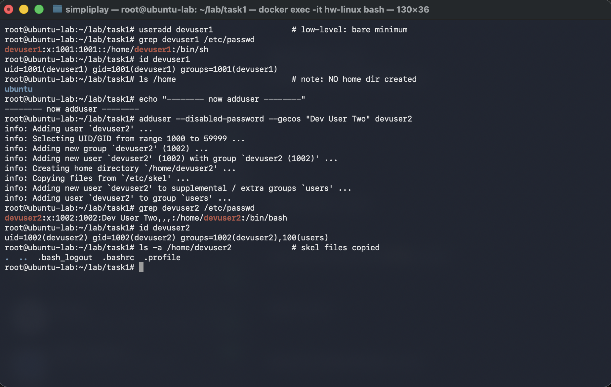
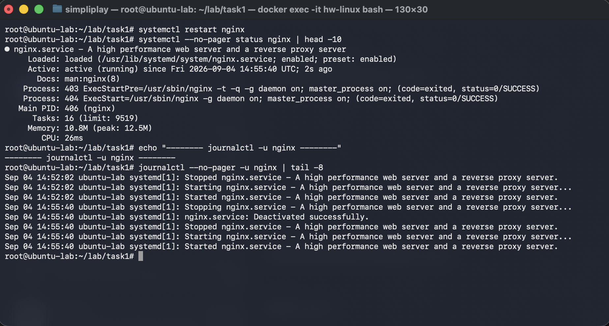
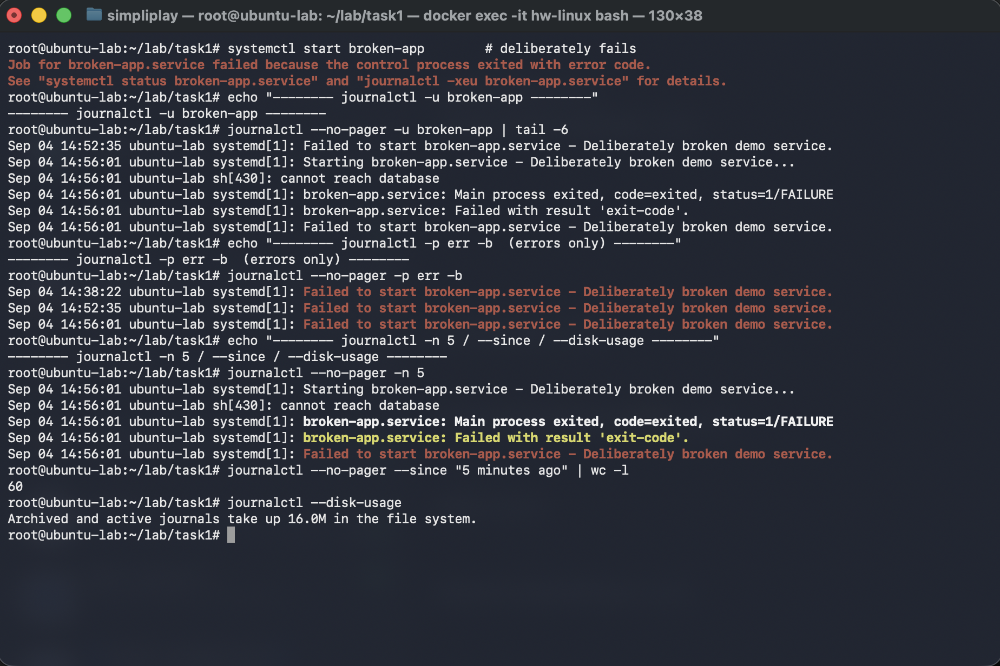
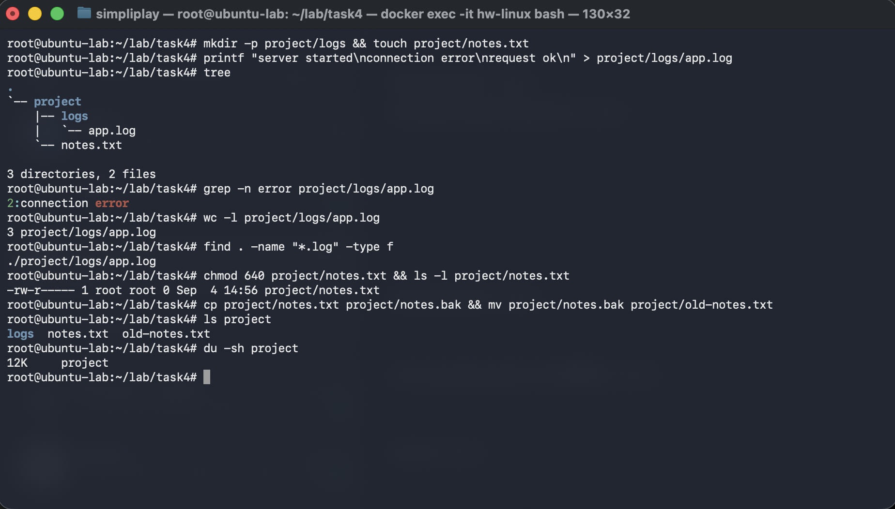
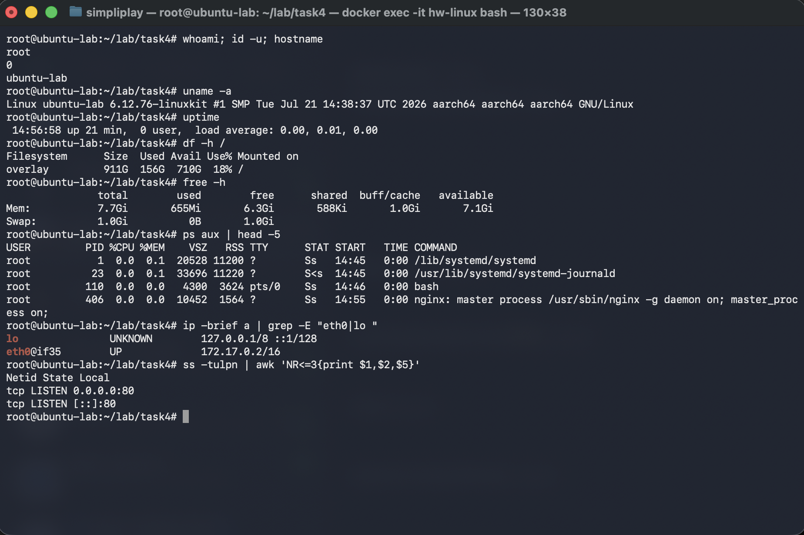

# Linux Fundamentals

Four tasks: hard vs soft links, `useradd` vs `adduser`, `journalctl`, and a working command
cheat sheet. Everything below was actually run — every code block is copied out of the terminal
session shown in the screenshot beside it, so the inode numbers, UIDs and timestamps in the
text and in the images are from the same run.

## The lab environment

My host is an Apple Silicon Mac, so the work happened in an Ubuntu 24.04 container. Task 3
needs a real init system — `journalctl` has nothing to read unless `systemd-journald` is
actually running — so rather than use a plain `ubuntu:24.04` image with `sleep infinity` as
PID 1, I built an image with `systemd` as PID 1 and gave the container what systemd needs:

```dockerfile
FROM ubuntu:24.04
ENV DEBIAN_FRONTEND=noninteractive
RUN apt-get update && apt-get install -y \
      systemd systemd-sysv adduser cron nginx tree iproute2 procps curl less \
    && apt-get clean && rm -rf /var/lib/apt/lists/*
RUN rm -f /lib/systemd/system/multi-user.target.wants/* \
    /etc/systemd/system/*.wants/* \
    /lib/systemd/system/local-fs.target.wants/* \
    /lib/systemd/system/sockets.target.wants/*udev* \
    /lib/systemd/system/basic.target.wants/*
CMD ["/lib/systemd/systemd"]
```

```bash
docker build -t hw-ubuntu-systemd -f Dockerfile.systemd .
docker run -d --name hw-linux --hostname ubuntu-lab \
  --privileged --cgroupns=host \
  -v /sys/fs/cgroup:/sys/fs/cgroup:rw \
  --tmpfs /run --tmpfs /run/lock \
  hw-ubuntu-systemd
docker exec -it hw-linux bash
```

The check that this worked is `systemctl is-system-running` returning `running`. That is what
makes Task 3 a genuine journald exercise instead of a description of one.

---

## Task 1 — Hard links and soft links

### The idea

A filename is not the file. A directory entry is just a name paired with an **inode number**,
and the inode is what actually owns the metadata and the data blocks. That one fact explains
every difference between the two link types:

- A **hard link** is a second directory entry pointing at the *same inode*. It is not a
  reference to the original file — it *is* the file, an equal peer. There is no "real" name and
  no "copy": the inode simply records that two names now refer to it (its **link count**), and
  the data is released only when that count reaches zero.
- A **soft link** (symlink) is a separate, tiny file with its own inode whose *contents* are a
  path string. Resolving it is a second lookup. If the path stops resolving, the symlink is
  still perfectly intact — it just points at nothing.

### The run

```bash
mkdir -p ~/lab/task1 && cd ~/lab/task1
echo "this is the original file" > original.txt
ln    original.txt hardlink.txt      # hard link
ln -s original.txt softlink.txt      # soft link
ls -li
stat -c "%n  inode=%i  links=%h  size=%s" original.txt hardlink.txt softlink.txt
echo "line added later" >> hardlink.txt   # write via the hard link
cat original.txt                          # original sees it too
rm original.txt                            # delete the original NAME
ls -li
cat hardlink.txt                           # still works
cat softlink.txt                           # dangling
```



`ls -li` puts the inode number in the first column, which is where the whole thing becomes
visible:

```
total 8
89478 -rw-r--r-- 2 root root 26 Sep  4 14:54 hardlink.txt
89478 -rw-r--r-- 2 root root 26 Sep  4 14:54 original.txt
89492 lrwxrwxrwx 1 root root 12 Sep  4 14:54 softlink.txt -> original.txt
```

```
original.txt  inode=89478  links=2  size=26
hardlink.txt  inode=89478  links=2  size=26
softlink.txt  inode=89492  links=1  size=12
```

Three things to read out of that:

1. `original.txt` and `hardlink.txt` report **inode 89478** and **link count 2**. One inode,
   two names. Neither is privileged.
2. `softlink.txt` has its own inode (89492) and a link count of 1.
3. The symlink's size is **12 bytes** — exactly the length of the string `original.txt`. That
   is the whole content of the file. The size is literally the length of the path it stores.

Writing through either name reaches the same data, because there is only one set of data:

```
root@ubuntu-lab:~/lab/task1# echo "line added later" >> hardlink.txt
root@ubuntu-lab:~/lab/task1# cat original.txt
this is the original file
line added later
```

Then delete the original *name*:

```
total 4
89478 -rw-r--r-- 1 root root 43 Sep  4 14:55 hardlink.txt
89492 lrwxrwxrwx 1 root root 12 Sep  4 14:54 softlink.txt -> original.txt
```

```
root@ubuntu-lab:~/lab/task1# cat hardlink.txt
this is the original file
line added later
root@ubuntu-lab:~/lab/task1# cat softlink.txt
cat: softlink.txt: No such file or directory
```

`hardlink.txt` keeps the same inode 89478 and the same 43 bytes; only the link count fell from
2 to 1. Nothing was deleted except a name. The symlink is untouched — still 12 bytes, still
pointing at `original.txt` — but that path no longer resolves, so it is dangling. `ls` still
lists it; reading it fails.

### The two limits, checked rather than assumed

Both restrictions people quote for hard links are real, and both produce a specific error. Run
as **root**, in this container:

```
root@ubuntu-lab:/# ln /tmp/d /tmp/dlink
ln: /tmp/d: hard link not allowed for directory

root@ubuntu-lab:/# ln /etc/hostname /dev/shm/hn
ln: failed to create hard link '/dev/shm/hn' => '/etc/hostname': Invalid cross-device link
```

Worth being precise about the first one: hard-linking a directory is **not** a permissions
matter that root can override. It is refused for everyone, because arbitrary directory hard
links would let you build cycles in the directory graph that `..` could not resolve and that
tree-walking tools could not terminate on. The only directory hard links on the system are the
`.` and `..` entries the filesystem maintains itself.

The second is a consequence of the inode model: inode numbers are only meaningful within one
filesystem, so a directory entry cannot point at an inode living in a different one. A symlink
stores a path rather than an inode number, which is exactly why it crosses filesystems freely —
and also why it can dangle.

### Interview answer

| | Hard link | Soft link (symlink) |
|---|---|---|
| What the entry stores | the same inode as the target | a path string |
| Own inode | no — shares the target's | yes |
| Size | the file's size | length of the stored path (12 B here) |
| Effect on link count | increments it | none |
| Survives deleting the original name | yes, data stays reachable | no, becomes dangling |
| Works across filesystems | no (`Invalid cross-device link`) | yes |
| Can point at a directory | no — refused for *everyone*, root included | yes |
| Shows in `ls -l` as | an ordinary file | `l` type, with `-> target` |
| Command | `ln target link` | `ln -s target link` |

The one-sentence version: **`rm` removes a name, not a file.** The data goes away when the
inode's link count hits zero — which is why a hard link keeps a file alive after the original
name is gone, and a symlink, holding only a path, does not.

---

## Task 2 — `useradd` vs `adduser`

### The idea

They are not two competing commands; they sit at different levels.

- **`useradd`** is the low-level binary from `shadow-utils`. It is present on essentially every
  Linux distribution and it does *exactly* what its flags say — nothing implied, nothing
  interactive.
- **`adduser`** is a Debian/Ubuntu front-end script that calls `useradd` underneath and then
  finishes the job: picks the next free UID, creates the home directory, copies `/etc/skel`,
  sets a real login shell, adds the supplementary `users` group, and prompts for a password and
  the GECOS name fields.

### The run

To show the actual difference I called `useradd` **bare**, with no flags. Passing `-m -s
/bin/bash` would have papered over the very contrast the task is about:

```bash
useradd devuser1                 # low-level: bare minimum
grep devuser1 /etc/passwd
id devuser1
ls /home                         # note: NO home dir created
adduser --disabled-password --gecos "Dev User Two" devuser2
grep devuser2 /etc/passwd
id devuser2
ls -a /home/devuser2             # skel files copied
```



Bare `useradd`:

```
root@ubuntu-lab:~/lab/task1# grep devuser1 /etc/passwd
devuser1:x:1001:1001::/home/devuser1:/bin/sh
root@ubuntu-lab:~/lab/task1# id devuser1
uid=1001(devuser1) gid=1001(devuser1) groups=1001(devuser1)
root@ubuntu-lab:~/lab/task1# ls /home
ubuntu
```

The account exists, but read that `passwd` line carefully — it is a half-built user:

- The home field says `/home/devuser1`, and `ls /home` shows **that directory does not exist**.
  The account is configured to have a home it does not have; log in and you land nowhere.
- The shell is `/bin/sh`, the system default, not an interactive login shell.
- The GECOS field is empty, and no password was set.
- Only its own group — one entry in `id`.

Now `adduser`, which narrates every step it takes:

```
info: Adding user `devuser2' ...
info: Selecting UID/GID from range 1000 to 59999 ...
info: Adding new group `devuser2' (1002) ...
info: Adding new user `devuser2' (1002) with group `devuser2 (1002)' ...
info: Creating home directory `/home/devuser2' ...
info: Copying files from `/etc/skel' ...
info: Adding new user `devuser2' to supplemental / extra groups `users' ...
info: Adding user `devuser2' to group `users' ...
```

```
root@ubuntu-lab:~/lab/task1# grep devuser2 /etc/passwd
devuser2:x:1002:1002:Dev User Two,,,:/home/devuser2:/bin/bash
root@ubuntu-lab:~/lab/task1# id devuser2
uid=1002(devuser2) gid=1002(devuser2) groups=1002(devuser2),100(users)
root@ubuntu-lab:~/lab/task1# ls -a /home/devuser2
.  ..  .bash_logout  .bashrc  .profile
```

The differences line up one-for-one with the `info:` lines: `/bin/bash` instead of `/bin/sh`,
the GECOS string `Dev User Two,,,` filled in, a home directory that actually exists and already
contains the `/etc/skel` dotfiles, and `100(users)` as a supplementary group in `id` — a group
membership bare `useradd` never grants.

`--disabled-password --gecos "Dev User Two"` were passed only to keep the run non-interactive.
Plain `adduser devuser2` at a terminal asks for the password and the name fields instead.

### Side by side

| | `useradd devuser1` | `adduser devuser2` |
|---|---|---|
| Type | low-level binary (`shadow-utils`) | Perl front-end, wraps `useradd` |
| Home directory | **not created** (though `passwd` names one) | created |
| `/etc/skel` dotfiles | not copied | copied |
| Login shell | `/bin/sh` (system default) | `/bin/bash` |
| GECOS / full name | empty | set |
| Supplementary groups | none | `users` (gid 100) |
| Password | not set | prompts, unless `--disabled-password` |
| Interactive | never | prompts by default |
| Portability | every distro | Debian/Ubuntu only |

### Which one to use

On Ubuntu, **`adduser` for hands-on administration** — one command leaves a genuinely usable
account, and it is hard to forget a step because it does them all. **`useradd` in scripts,
Dockerfiles and provisioning** — it takes no prompts and every attribute is explicit, which is
what you want when a machine is reading the file. If you do reach for `useradd`, remember it
needs the flags spelled out: `useradd -m -s /bin/bash devuser1` gets you the home directory and
the shell that `adduser` would have given you for free.

---

## Task 3 — `journalctl`

### The idea

`journalctl` is the query tool for the log that `systemd-journald` keeps. The shift from
classic syslog is that services no longer each own a text file under `/var/log`: journald
collects kernel messages, init messages, and **anything a unit writes to stdout/stderr** into a
single indexed binary journal, tagged with structured metadata — unit name, PID, priority,
boot ID, timestamp. You do not grep it; you filter it on those fields.

The practical consequence for a service like the one below: the application never had to be
configured to log anywhere. It printed to stderr and journald captured it, attributed to the
right unit.

### A healthy service

```bash
systemctl restart nginx
systemctl --no-pager status nginx | head -10
journalctl --no-pager -u nginx | tail -8
```



```
● nginx.service - A high performance web server and a reverse proxy server
     Loaded: loaded (/usr/lib/systemd/system/nginx.service; enabled; preset: enabled)
     Active: active (running) since Fri 2026-09-04 14:55:40 UTC; 2s ago
       Docs: man:nginx(8)
    Process: 403 ExecStartPre=/usr/sbin/nginx -t -q -g daemon on; master_process on; (code=exited, status=0/SUCCESS)
    Process: 404 ExecStart=/usr/sbin/nginx -g daemon on; master_process on; (code=exited, status=0/SUCCESS)
   Main PID: 406 (nginx)
      Tasks: 16 (limit: 9519)
     Memory: 10.8M (peak: 12.5M)
        CPU: 26ms
```

`systemctl status` is a snapshot — current state plus the last few log lines. `journalctl -u`
is the history, and the full restart cycle is in it:

```
Sep 04 14:52:02 ubuntu-lab systemd[1]: Started nginx.service - A high performance web server and a reverse proxy server.
Sep 04 14:55:40 ubuntu-lab systemd[1]: Stopping nginx.service - A high performance web server and a reverse proxy server...
Sep 04 14:55:40 ubuntu-lab systemd[1]: nginx.service: Deactivated successfully.
Sep 04 14:55:40 ubuntu-lab systemd[1]: Stopped nginx.service - A high performance web server and a reverse proxy server.
Sep 04 14:55:40 ubuntu-lab systemd[1]: Starting nginx.service - A high performance web server and a reverse proxy server...
Sep 04 14:55:40 ubuntu-lab systemd[1]: Started nginx.service - A high performance web server and a reverse proxy server.
```

Note the entries from `14:52:02`, an earlier restart. The journal outlives the process, which is
the point of it.

### A failing service — where journalctl earns its keep

A log viewer is only interesting when something breaks, so the lab has a unit built to fail:
a `oneshot` that prints `cannot reach database` to stderr and exits 1.

```bash
systemctl start broken-app        # deliberately fails
journalctl --no-pager -u broken-app | tail -6
journalctl --no-pager -p err -b
journalctl --no-pager -n 5
journalctl --no-pager --since "5 minutes ago" | wc -l
journalctl --disk-usage
```



`systemctl` reports the failure but not the reason, and tells you where to look:

```
Job for broken-app.service failed because the control process exited with error code.
See "systemctl status broken-app.service" and "journalctl -xeu broken-app.service" for details.
```

The unit's log has the actual cause:

```
Sep 04 14:56:01 ubuntu-lab systemd[1]: Starting broken-app.service - Deliberately broken demo service...
Sep 04 14:56:01 ubuntu-lab sh[430]: cannot reach database
Sep 04 14:56:01 ubuntu-lab systemd[1]: broken-app.service: Main process exited, code=exited, status=1/FAILURE
Sep 04 14:56:01 ubuntu-lab systemd[1]: broken-app.service: Failed with result 'exit-code'.
Sep 04 14:56:01 ubuntu-lab systemd[1]: Failed to start broken-app.service - Deliberately broken demo service.
```

The middle line is the interesting one. `sh[430]: cannot reach database` is the *service's own
stderr*, interleaved in the correct order with systemd's own messages about the same unit. The
application wrote to stderr and nothing else; journald did the rest.

Filtering by priority pulls that failure out of everything else on the system:

```
root@ubuntu-lab:~/lab/task1# journalctl --no-pager -p err -b
Sep 04 14:38:22 ubuntu-lab systemd[1]: Failed to start broken-app.service - Deliberately broken demo service.
Sep 04 14:52:35 ubuntu-lab systemd[1]: Failed to start broken-app.service - Deliberately broken demo service.
Sep 04 14:56:01 ubuntu-lab systemd[1]: Failed to start broken-app.service - Deliberately broken demo service.
```

`-p err` means priority `err` **and worse** (`crit`, `alert`, `emerg`), not `err` exactly. Three
entries appear here rather than one because `-b` scopes to the current boot and this container
has only ever had one: `journalctl --list-boots` reports a single boot ID whose first entry is
`14:37:48`, so restarting the container did not start a new boot from journald's point of view.
On a real machine `-b` is the "since this reboot" filter you would expect.

The rest:

```
root@ubuntu-lab:~/lab/task1# journalctl --no-pager --since "5 minutes ago" | wc -l
60
root@ubuntu-lab:~/lab/task1# journalctl --disk-usage
Archived and active journals take up 16.0M in the file system.
```

### The flags worth remembering

| Command | What it does |
|---|---|
| `journalctl -u <unit>` | one unit's log — the everyday one |
| `journalctl -u <unit> -f` | follow it live, like `tail -f` |
| `journalctl -n 20` | last 20 entries |
| `journalctl -b` | current boot only; `-b -1` the previous one |
| `journalctl -p err` | priority `err` and worse |
| `journalctl --since "5 minutes ago"` | time window; pairs with `--until` |
| `journalctl -xeu <unit>` | explanations, jump to the end, one unit — the triage combo |
| `journalctl -k` | kernel messages only (`dmesg` equivalent) |
| `journalctl --no-pager` | plain output, for scripts and screenshots |
| `journalctl --list-boots` | boots the journal still holds |
| `journalctl --disk-usage` | space the journal occupies |
| `journalctl --vacuum-time=7d` | drop journal data older than 7 days |

---

## Task 4 — Command cheat sheet

Grouped by what I actually reach for them for, rather than alphabetically.

**Where am I, what is here**

| Command | Notes |
|---|---|
| `pwd` | print working directory |
| `ls -la` | long listing, including dotfiles |
| `ls -li` | same, with inode numbers — see Task 1 |
| `cd -` | jump back to the previous directory |
| `tree` / `tree -L 2` | directory tree, optionally depth-limited |
| `find . -name "*.log" -type f` | search by name; `-type`, `-mtime -1`, `-size +1M` |
| `du -sh *` | size of each item here; `df -h` is per-filesystem |

**Creating, moving, removing**

| Command | Notes |
|---|---|
| `mkdir -p a/b/c` | nested directories in one go |
| `touch file` | create empty, or bump the timestamp |
| `cp file copy` / `cp -r dir dst` | copy; `-r` for directories |
| `mv old new` | move *and* rename — same operation |
| `rm -rf dir` | recursive, no prompting; the one to be careful with |
| `ln` / `ln -s` | hard link / soft link |

**Reading files**

| Command | Notes |
|---|---|
| `cat file` | dump the whole thing |
| `less file` | page through; `/` search, `q` quit |
| `head -n 5` / `tail -n 5` | first / last lines |
| `tail -f app.log` | follow a growing file |
| `grep -n error file` | match with line numbers; `-r` recursive, `-i` ignore case |
| `wc -l file` | count lines |

**Permissions and ownership**

| Command | Notes |
|---|---|
| `chmod 640 file` | owner `rw-`, group `r--`, others none |
| `chmod +x script.sh` | make executable |
| `chown user:group file` | change owner / group |
| `umask` | default mask applied to new files |

**Users and identity**

| Command | Notes |
|---|---|
| `whoami` / `id` | current user; `id` adds uid, gid, groups |
| `adduser name` / `useradd -m -s /bin/bash name` | create a user — see Task 2 |
| `passwd name` | set or change a password |
| `su - name` | switch user with a login shell |
| `groups name` | group membership |

**Processes and resources**

| Command | Notes |
|---|---|
| `ps aux` | every process; pipe into `grep` |
| `top` / `htop` | live view |
| `kill -15 PID` | ask it to exit; `-9` forces |
| `df -h` | free space per filesystem |
| `free -h` | memory and swap |
| `uptime` | how long up, plus load averages |
| `uname -a` | kernel, architecture, hostname |

**Networking**

| Command | Notes |
|---|---|
| `ip a` / `ip -brief a` | interfaces and addresses |
| `ip route` | routing table |
| `ss -tulpn` | listening sockets and the processes owning them |
| `ping -c 4 host` | reachability |
| `curl -I url` | response headers only |

**Services and logs**

| Command | Notes |
|---|---|
| `systemctl status unit` | current state, recent log lines |
| `systemctl restart unit` | restart it |
| `systemctl enable --now unit` | start now and on boot |
| `journalctl -u unit -f` | follow one unit's log — see Task 3 |

**Packages and archives**

| Command | Notes |
|---|---|
| `apt update && apt install pkg` | Debian/Ubuntu packages |
| `tar -czf out.tgz dir` / `tar -xzf out.tgz` | create / extract a gzip tarball |
| `man cmd` / `cmd --help` | the documentation that is already on the box |
| `history \| grep ssh` | find something you ran before |

### Files, search and permissions, run for real

```bash
mkdir -p ~/lab/task4 && cd ~/lab/task4
mkdir -p project/logs && touch project/notes.txt
printf "server started\nconnection error\nrequest ok\n" > project/logs/app.log
tree
grep -n error project/logs/app.log
wc -l project/logs/app.log
find . -name "*.log" -type f
chmod 640 project/notes.txt && ls -l project/notes.txt
cp project/notes.txt project/notes.bak && mv project/notes.bak project/old-notes.txt
ls project
du -sh project
```



```
root@ubuntu-lab:~/lab/task4# tree
.
`-- project
    |-- logs
    |   `-- app.log
    `-- notes.txt

3 directories, 2 files
root@ubuntu-lab:~/lab/task4# grep -n error project/logs/app.log
2:connection error
root@ubuntu-lab:~/lab/task4# wc -l project/logs/app.log
3 project/logs/app.log
root@ubuntu-lab:~/lab/task4# find . -name "*.log" -type f
./project/logs/app.log
root@ubuntu-lab:~/lab/task4# chmod 640 project/notes.txt && ls -l project/notes.txt
-rw-r----- 1 root root 0 Sep  4 14:56 project/notes.txt
root@ubuntu-lab:~/lab/task4# ls project
logs  notes.txt  old-notes.txt
root@ubuntu-lab:~/lab/task4# du -sh project
12K	project
```

Two details worth pulling out. `grep -n` prefixes the line number (`2:`), which is what makes it
useful against a log rather than just a matcher. And the octal in `chmod 640` is three digits for
three audiences — owner `6` = `rw-`, group `4` = `r--`, others `0` = `---` — which `ls -l` then
reads back as exactly `-rw-r-----`.

### System and network inspection, run for real

```bash
whoami; id -u; hostname
uname -a
uptime
df -h /
free -h
ps aux | head -5
ip -brief a | grep -E "eth0|lo "
ss -tulpn | awk 'NR<=3{print $1,$2,$5}'
```



```
root@ubuntu-lab:~/lab/task4# uname -a
Linux ubuntu-lab 6.12.76-linuxkit #1 SMP Tue Jul 21 14:38:37 UTC 2026 aarch64 aarch64 aarch64 GNU/Linux
root@ubuntu-lab:~/lab/task4# uptime
 14:56:58 up 21 min,  0 user,  load average: 0.00, 0.01, 0.00
root@ubuntu-lab:~/lab/task4# df -h /
Filesystem      Size  Used Avail Use% Mounted on
overlay         911G  156G  710G  18% /
root@ubuntu-lab:~/lab/task4# free -h
               total        used        free      shared  buff/cache   available
Mem:           7.7Gi       655Mi       6.3Gi       588Ki       1.0Gi       7.1Gi
Swap:          1.0Gi          0B       1.0Gi
root@ubuntu-lab:~/lab/task4# ps aux | head -5
USER         PID %CPU %MEM    VSZ   RSS TTY      STAT START   TIME COMMAND
root           1  0.0  0.1  20528 11200 ?        Ss   14:45   0:00 /lib/systemd/systemd
root          23  0.0  0.1  33696 11220 ?        S<s  14:45   0:00 /usr/lib/systemd/systemd-journald
root         110  0.0  0.0   4300  3624 pts/0    Ss   14:46   0:00 bash
root         406  0.0  0.0  10452  1564 ?        Ss   14:55   0:00 nginx: master process /usr/sbin/nginx -g daemon on; master_process on;
root@ubuntu-lab:~/lab/task4# ip -brief a | grep -E "eth0|lo "
lo               UNKNOWN        127.0.0.1/8 ::1/128
eth0@if35        UP             172.17.0.2/16
root@ubuntu-lab:~/lab/task4# ss -tulpn | awk 'NR<=3{print $1,$2,$5}'
Netid State Local
tcp LISTEN 0.0.0.0:80
tcp LISTEN [::]:80
```

This output happens to tie the whole assignment together. `ps aux` shows **PID 1 is
`/lib/systemd/systemd`** with `systemd-journald` beside it — that is precisely why Task 3
worked. `uname -a` reports `aarch64` and a `linuxkit` kernel, the honest signature of a
container on an Apple Silicon Mac. And `ss -tulpn` shows something listening on port 80: the
nginx from Task 3, still running.

---

All commands, output and screenshots in this document are from my own run in the container
described at the top.
