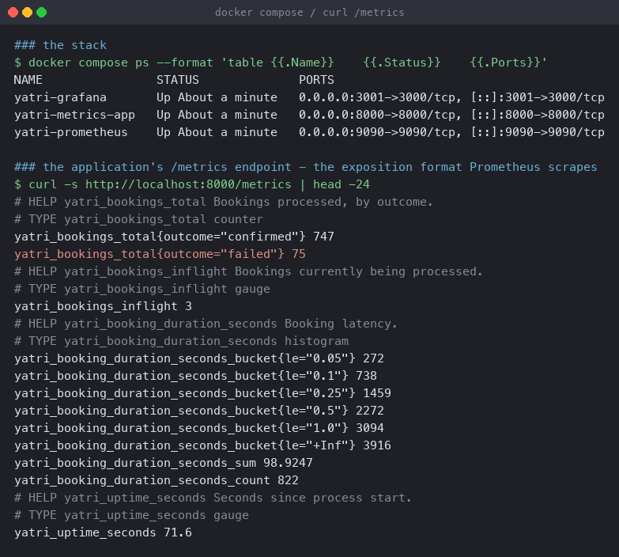
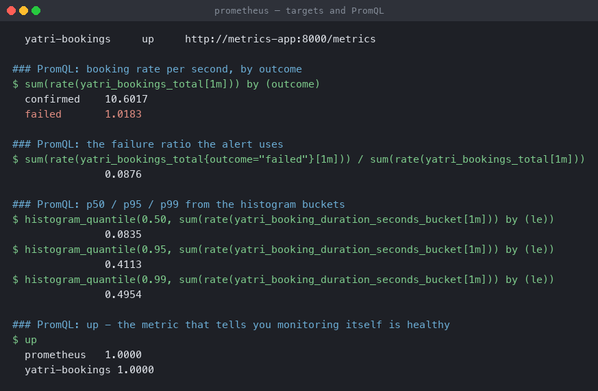
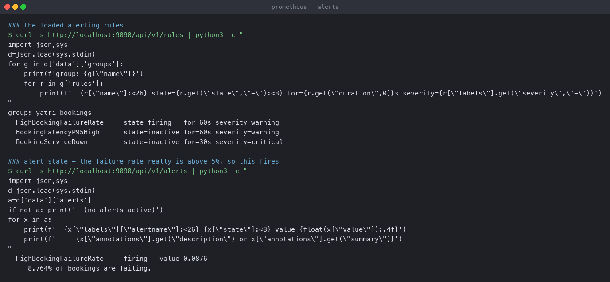
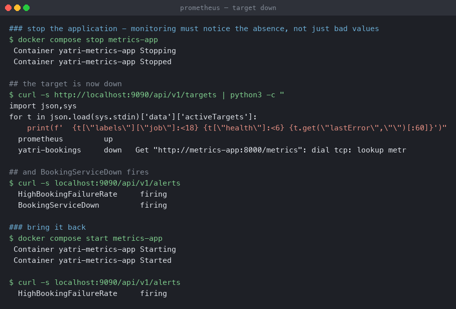
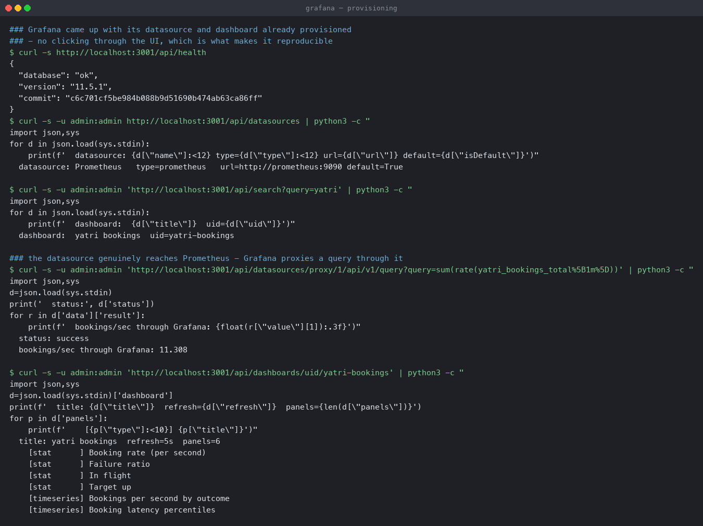

# Monitoring — Prometheus and Grafana

A metrics-emitting service, Prometheus scraping it, alert rules that actually fire, and
Grafana provisioned from files so the stack comes up ready.

**Environment:** Docker Compose on macOS (Apple silicon), Prometheus v3.1.0,
Grafana 11.5.1, application on Python 3.12.

```bash
docker compose up -d --build
```

| Service | Port | Purpose |
|---|---|---|
| `metrics-app` | 8000 | the subject — exposes `/metrics` |
| `prometheus` | 9090 | scrapes, stores, evaluates rules |
| `grafana` | **3001** | dashboards |

Grafana is on 3001 rather than 3000 because 3000 was already bound on the host —
`bind: address already in use`.

---

## 1. The application's `/metrics`

[`metrics-app/app.py`](metrics-app/app.py) emits the Prometheus text format from the
standard library, with no client library, so the exposition format is visible rather than
hidden.

```bash
curl -s http://localhost:8000/metrics
```

```
# HELP yatri_bookings_total Bookings processed, by outcome.
# TYPE yatri_bookings_total counter
yatri_bookings_total{outcome="confirmed"} 747
yatri_bookings_total{outcome="failed"} 75
# HELP yatri_bookings_inflight Bookings currently being processed.
# TYPE yatri_bookings_inflight gauge
yatri_bookings_inflight 3
# HELP yatri_booking_duration_seconds Booking latency.
# TYPE yatri_booking_duration_seconds histogram
yatri_booking_duration_seconds_bucket{le="0.05"} 272
yatri_booking_duration_seconds_bucket{le="0.1"} 738
yatri_booking_duration_seconds_bucket{le="0.25"} 1459
yatri_booking_duration_seconds_bucket{le="0.5"} 2272
yatri_booking_duration_seconds_bucket{le="1.0"} 3094
yatri_booking_duration_seconds_bucket{le="+Inf"} 3916
yatri_booking_duration_seconds_sum 98.9247
yatri_booking_duration_seconds_count 822
```



Three metric types, each answering a different question:

- **counter** — monotonically increasing. `yatri_bookings_total` only goes up, which is why
  you almost always wrap it in `rate()`. The raw value is meaningless on its own.
- **gauge** — goes up and down. `yatri_bookings_inflight` is a current level.
- **histogram** — cumulative buckets plus `_sum` and `_count`, which is what makes
  percentiles possible.

**That output contains a bug, and it is a useful one.** The `+Inf` bucket reads **3916**
while `_count` reads **822**. In a correct histogram those must be **equal** — `+Inf` means
"every observation", which is the definition of the count.

The cause was in `observe()`: the loop incremented *every* bucket at or above the observed
value, and the `/metrics` handler then accumulated them again, double-counting. Adding a
`break` so each observation increments only the bucket it falls into, leaving the handler to
build the cumulative counts, fixed it:

```
yatri_booking_duration_seconds_bucket{le="+Inf"} 520
yatri_booking_duration_seconds_count 520
```

**`+Inf` == `_count` is the check worth remembering** for any hand-rolled histogram, because
`histogram_quantile()` returns plausible-looking nonsense when the buckets are wrong rather
than failing.

---

## 2. Scrape targets and PromQL

[`prometheus/prometheus.yml`](prometheus/prometheus.yml) scrapes the app every 5 seconds,
and scrapes itself.

```bash
curl -s http://localhost:9090/api/v1/targets
```

```
### scrape targets - both jobs up
  prometheus         up     http://localhost:9090/metrics
  yatri-bookings     up     http://metrics-app:8000/metrics

### booking rate per second, by outcome
$ sum(rate(yatri_bookings_total[1m])) by (outcome)
  confirmed    10.6017
  failed       1.0183

### the failure ratio the alert uses
$ sum(rate(yatri_bookings_total{outcome="failed"}[1m])) / sum(rate(yatri_bookings_total[1m]))
               0.0876

### percentiles from the histogram buckets
$ histogram_quantile(0.50, sum(rate(yatri_booking_duration_seconds_bucket[1m])) by (le))
               0.0835
$ histogram_quantile(0.95, ...)
               0.4113
$ histogram_quantile(0.99, ...)
               0.4954

### up - the metric that says monitoring itself is healthy
$ up
  prometheus   1.0000
  yatri-bookings 1.0000
```



Three things in those queries are the whole skill:

- **`rate()` before `sum()`**, never after. `rate()` must be applied per time series, while
  the counter is still monotonic; summing counters first and then taking a rate produces
  garbage whenever a Pod restarts and its counter resets.
- **A ratio, not a count.** `0.0876` is 8.76% of bookings failing. "75 failures" means
  nothing without the denominator — it could be 75 out of 80 or 75 out of 800,000.
- **`rate()` inside `histogram_quantile`.** Without it the quantile is computed over the
  lifetime totals, giving the average since process start rather than current latency.

`up` is the most important metric Prometheus produces and it is synthetic — Prometheus
writes it per target per scrape. It is how you distinguish "the service is broken" from
"we cannot see the service".

---

## 3. Alerts that fire

[`prometheus/alerts.yml`](prometheus/alerts.yml) defines three rules.

```
group: yatri-bookings
  HighBookingFailureRate     state=firing   for=60s severity=warning
  BookingLatencyP95High      state=inactive for=60s severity=warning
  BookingServiceDown         state=inactive for=30s severity=critical

### alert state
  HighBookingFailureRate     firing   value=0.0876
     8.764% of bookings are failing.
```



The application fails roughly 8% of bookings by design, which is above the rule's 5%
threshold, so `HighBookingFailureRate` is genuinely `firing` — not a simulation. The
annotation templated the live value through `{{ $value | humanizePercentage }}`, which is
how an alert arrives already saying what is wrong.

`for: 1m` is why this is not noisy: the condition must hold continuously for a minute before
the rule leaves `pending` and becomes `firing`. A single bad scrape cannot page anyone.

### The absence case

A monitoring stack that only notices bad values is half a stack.

```bash
docker compose stop metrics-app
```

```
## the target is now down
  prometheus         up
  yatri-bookings     down   Get "http://metrics-app:8000/metrics": dial tcp: lookup metr...

## and BookingServiceDown fires
  HighBookingFailureRate     firing
  BookingServiceDown         firing

### bring it back
  HighBookingFailureRate     firing       <- BookingServiceDown cleared on its own
```



`up{job="yatri-bookings"} == 0` caught the service disappearing, and the alert cleared by
itself once scraping resumed. Without a rule like this, a crashed application looks
identical to a quiet one — the failure-rate alert goes quiet too, because there are no
samples to compute a ratio from. **Silence is the most dangerous alert state**, and `up` is
what covers it.

---

## 4. Grafana, provisioned from files

```bash
curl -s http://localhost:3001/api/health
curl -s -u admin:admin http://localhost:3001/api/datasources
curl -s -u admin:admin 'http://localhost:3001/api/search?query=yatri'
```

```
{ "database": "ok", "version": "11.5.1" }

  datasource: Prometheus   type=prometheus   url=http://prometheus:9090 default=True
  dashboard:  yatri bookings  uid=yatri-bookings

### the datasource genuinely reaches Prometheus - a query proxied through Grafana
  status: success
  bookings/sec through Grafana: 11.308

  title: yatri bookings  refresh=5s  panels=6
    [stat      ] Booking rate (per second)
    [stat      ] Failure ratio
    [stat      ] In flight
    [stat      ] Target up
    [timeseries] Bookings per second by outcome
    [timeseries] Booking latency percentiles
```



The datasource and dashboard are **files**, not clicks:
[`grafana/provisioning/datasources/prometheus.yml`](grafana/provisioning/datasources/prometheus.yml)
and
[`grafana/dashboards/yatri-bookings.json`](grafana/dashboards/yatri-bookings.json).
A hand-built dashboard lives in one Grafana's database and is gone when the container is
replaced; a provisioned one is in git and comes back identically.

The proxied query is the check that matters. `api/datasources/proxy/1/...` makes Grafana
itself call Prometheus, so a `success` response with real data proves the whole chain —
Grafana → Prometheus → application — rather than just that Grafana started.

The datasource URL is `http://prometheus:9090`, the Compose **service name**, not
`localhost`. Inside the Grafana container `localhost` is Grafana.

---

## Cleanup

```bash
docker compose down -v
```
