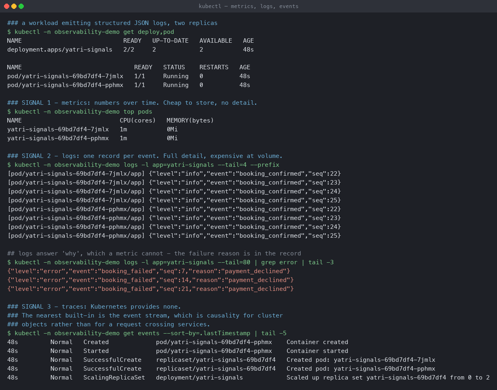

# Observability — the three pillars

Monitoring asks "is the known thing broken". Observability asks "can I answer a question I
had not thought of in advance". The three signals are what make the second possible.

**Environment:** Minikube v1.39.0, Kubernetes v1.37.0, metrics-server enabled, namespace
`observability-demo`.

| Pillar | Shape | Cost | Answers |
|---|---|---|---|
| **Metrics** | numbers over time | very cheap | *is something wrong, and since when* |
| **Logs** | one record per event | expensive at volume | *why this particular thing failed* |
| **Traces** | one record per request, across services | expensive | *where the time went* |

---

## The three signals on Kubernetes

[`k8s-demo.yaml`](k8s-demo.yaml) runs two replicas emitting structured JSON, one record
every two seconds, with every seventh one an error.

```bash
kubectl apply -f k8s-demo.yaml
kubectl -n observability-demo top pods
kubectl -n observability-demo logs -l app=yatri-signals --tail=4 --prefix
kubectl -n observability-demo get events --sort-by=.lastTimestamp
```

```
### SIGNAL 1 - metrics: numbers over time. Cheap to store, no detail.
NAME                           CPU(cores)   MEMORY(bytes)
yatri-signals-69bd7df4-7jmlx   1m           0Mi
yatri-signals-69bd7df4-pphmx   1m           0Mi

### SIGNAL 2 - logs: one record per event. Full detail, expensive at volume.
[pod/yatri-signals-69bd7df4-7jmlx/app] {"level":"info","event":"booking_confirmed","seq":22}
[pod/yatri-signals-69bd7df4-7jmlx/app] {"level":"info","event":"booking_confirmed","seq":23}
[pod/yatri-signals-69bd7df4-pphmx/app] {"level":"info","event":"booking_confirmed","seq":22}
[pod/yatri-signals-69bd7df4-pphmx/app] {"level":"info","event":"booking_confirmed","seq":23}

## logs answer 'why', which a metric cannot
{"level":"error","event":"booking_failed","seq":7,"reason":"payment_declined"}
{"level":"error","event":"booking_failed","seq":14,"reason":"payment_declined"}

### SIGNAL 3 - traces: Kubernetes provides none.
35s  Normal  SuccessfulCreate    replicaset/yatri-signals-69bd7df4  Created pod: ...
35s  Normal  ScalingReplicaSet   deployment/yatri-signals           Scaled up replica set from 0 to 2
```



Read the contrast between signal 1 and signal 2 directly off that output.

**`kubectl top` says `1m` and `0Mi`.** It tells you the Pods are alive and idle. It cannot
tell you that one booking in seven is failing, because a CPU number has no idea what a
booking is.

**The logs say `"reason":"payment_declined"`.** That is the answer metrics structurally
cannot give. But reading it required knowing which Pod, and at what time — logs do not
aggregate, and `--tail=80 | grep error` does not scale past a handful of replicas.

The practical division: **a metric tells you something is wrong and when; a log tells you
what exactly.** You want both, and you want the metric to be what alerts, because
alerting on log volume is how you build a system that pages on a logging change.

**The logs are JSON on purpose.** `{"level":"error","event":"booking_failed","seq":7,...}`
can be indexed on `level` and `event` by a collector. The same information as
`ERROR booking 7 failed: payment declined` is a regex problem for every consumer forever.
Structured logging is the cheapest observability decision available and it has to be made
before there is any log volume to care about.

**Traces: Kubernetes has none**, and that is the honest answer rather than an omission in
this demo. The `kubectl get events` output above is the nearest built-in, and it is
causality for *cluster objects* — Deployment scaled a ReplicaSet, which created Pods. It
says nothing about a request crossing from frontend to backend to database.

Distributed tracing requires the application to propagate context — a trace ID in headers,
through every hop — which no platform can retrofit. That means OpenTelemetry SDKs in the
code, a collector, and a backend such as Jaeger or Tempo. It is the only one of the three
pillars that is a code change rather than a deployment.

---

## Why observability and monitoring are not the same

Monitoring is a fixed set of questions, asked continuously: *is CPU high, is the error rate
above 5%, is the target up.* Session 20's
[`01-monitoring/`](../01-monitoring/) is exactly that, and it is enough for failures you
have seen before.

Observability is the property of being able to ask a **new** question without shipping code.
"Why is p99 latency bad only for users in one region on the checkout path" is not a
dashboard anyone built in advance. Answering it needs high-cardinality data — labels like
region, user tier, endpoint — which is precisely what metrics cannot hold cheaply, because
every label combination is another time series.

That tension is the real engineering decision:

- **Metrics** — low cardinality, aggregate, cheap. `rate(bookings_total[1m])` by outcome is
  fine; by `user_id` will destroy the storage.
- **Logs and traces** — unbounded cardinality, exact, expensive. Sampled in practice.

So the usual shape is: alert on a small number of metrics, then pivot into logs and traces
for the specific instance. The metric finds the fire, the trace finds the room.

---

## On Kubernetes specifically

| Need | Common tooling |
|---|---|
| Metrics | Prometheus, kube-state-metrics, node-exporter, metrics-server for `top`/HPA |
| Logs | Fluent Bit or Promtail → Loki or Elasticsearch |
| Traces | OpenTelemetry Collector → Jaeger or Tempo |
| Dashboards | Grafana over all three |
| Alert routing | Alertmanager |

Two Kubernetes-specific gaps worth knowing:

- **`kubectl logs` reads from the node's disk.** When a Pod is deleted its logs go with it,
  and `--previous` fails once the old container is garbage collected — as it did in
  [Session 14's CrashLoopBackOff scenario](../../kubernetes-troubleshooting/02-scenarios/).
  Debugging a crash after the fact requires logs already shipped off the node.
- **metrics-server is not a monitoring system.** It keeps a short in-memory window to serve
  `kubectl top` and the HPA, and stores no history. It cannot answer "what was CPU doing an
  hour ago" — that is Prometheus's job. Session 13's HPA work shows the other edge of this:
  when the node was saturated, metrics-server was starved and the autoscaler lost its input
  entirely.

## Cleanup

```bash
kubectl delete namespace observability-demo
```
