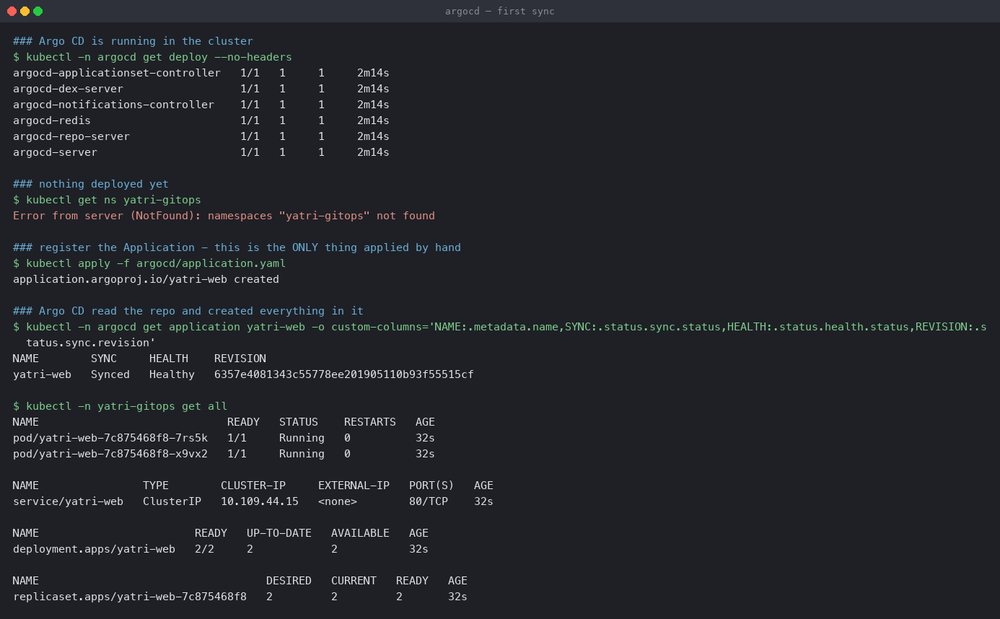
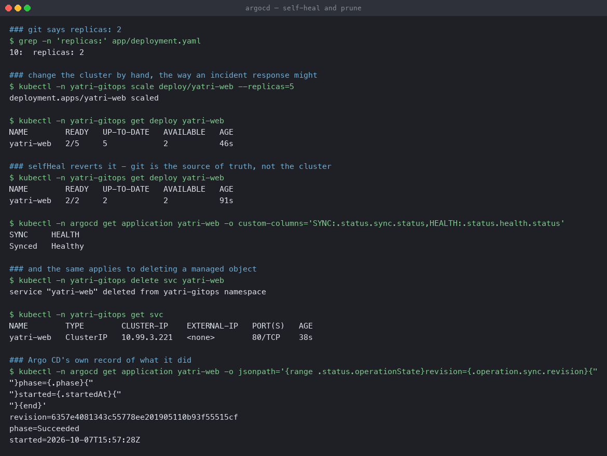

# GitOps with Argo CD

Git as the source of truth, reconciled continuously. The cluster is never deployed *to* — it
is kept in agreement with a repository.

**Environment:** Minikube v1.39.0, Kubernetes v1.37.0, Argo CD from the upstream `stable`
manifests. Namespaces `argocd` and `yatri-gitops`.

```bash
kubectl create namespace argocd
kubectl apply -n argocd -f https://raw.githubusercontent.com/argoproj/argo-cd/stable/manifests/install.yaml
```

| File | Role |
|---|---|
| [`app/`](app/) | the **desired state** — namespace, Deployment, Service |
| [`argocd/application.yaml`](argocd/application.yaml) | tells Argo CD which repo path to reconcile |

---

## 1. One manual apply, then nothing

```bash
kubectl apply -f argocd/application.yaml
```

```
### nothing deployed yet
$ kubectl get ns yatri-gitops
Error from server (NotFound): namespaces "yatri-gitops" not found

### register the Application - this is the ONLY thing applied by hand
application.argoproj.io/yatri-web created

### Argo CD read the repo and created everything in it
NAME        SYNC     HEALTH    REVISION
yatri-web   Synced   Healthy   6357e4081343c55778ee201905110b93f55515cf

$ kubectl -n yatri-gitops get all
NAME                             READY   STATUS    RESTARTS   AGE
pod/yatri-web-7c875468f8-7rs5k   1/1     Running   0          32s
pod/yatri-web-7c875468f8-x9vx2   1/1     Running   0          32s

NAME                TYPE        CLUSTER-IP     EXTERNAL-IP   PORT(S)   AGE
service/yatri-web   ClusterIP   10.109.44.15   <none>        80/TCP    32s

NAME                        READY   UP-TO-DATE   AVAILABLE   AGE
deployment.apps/yatri-web   2/2     2            2           32s
```



The namespace did not exist, then everything in `app/` existed — and **`kubectl apply` was
run exactly once, on the Application object itself**. The Deployment, Service and namespace
were created by Argo CD reading git.

`REVISION 6357e408...` is the git commit SHA. That is the property that makes GitOps
auditable: the live state is identified by a commit, so "what is running in production" and
"what is in git" are the same question. `CreateNamespace=true` in `syncOptions` is what
allowed the namespace to be created.

---

## 2. Continuous reconciliation — the part that is actually different

A CI pipeline that runs `kubectl apply` also deploys from git. The difference is what
happens *afterwards*.

```bash
kubectl -n yatri-gitops scale deploy/yatri-web --replicas=5
```

```
### git says replicas: 2
10:  replicas: 2

### change the cluster by hand, the way an incident response might
deployment.apps/yatri-web scaled

NAME        READY   UP-TO-DATE   AVAILABLE   AGE
yatri-web   2/5     5            2           46s        <- 5 replicas

### selfHeal reverts it - git is the source of truth, not the cluster
NAME        READY   UP-TO-DATE   AVAILABLE   AGE
yatri-web   2/2     2            2           91s        <- back to 2

SYNC     HEALTH
Synced   Healthy
```

```
### and the same applies to deleting a managed object
$ kubectl -n yatri-gitops delete svc yatri-web
service "yatri-web" deleted from yatri-gitops namespace

$ kubectl -n yatri-gitops get svc
NAME        TYPE        CLUSTER-IP    EXTERNAL-IP   PORT(S)   AGE
yatri-web   ClusterIP   10.99.3.221   <none>        80/TCP    38s      <- recreated
```



Scaled to 5 by hand; Argo CD put it back to 2. Deleted the Service; Argo CD recreated it.
The **new ClusterIP** (`10.99.3.221`, where it was `10.109.44.15`) proves it is genuinely a
new object rather than a failed delete.

This is `selfHeal: true`. Without it, Argo CD would have reported the application
`OutOfSync` and waited for someone to press sync. With it, **the cluster cannot drift** —
configuration applied by hand has a lifetime of about thirty seconds.

That has a consequence worth stating plainly: with self-heal on, `kubectl scale`,
`kubectl edit` and `kubectl patch` on a managed object stop working in any lasting way. The
emergency fix during an incident has to be a commit, or Argo CD has to be paused first. That
is the discipline GitOps imposes, and it is the whole value — there is no such thing as an
undocumented production change.

`prune: true` is the matching half: an object **removed from git** is deleted from the
cluster. Without pruning, deleting a manifest leaves the resource orphaned forever.

---

## 3. What Argo CD recorded

```
revision=6357e4081343c55778ee201905110b93f55515cf
phase=Succeeded
started=2026-10-07T15:57:28Z
```

Every sync is an operation with a commit, a phase and a timestamp. Combined with git
history, that is a complete deployment audit trail that nobody had to maintain.

---

## The model, stated

| | Push (CI deploys) | Pull (GitOps) |
|---|---|---|
| Who applies | the pipeline, from outside | a controller, from inside |
| Cluster credentials | held by CI | never leave the cluster |
| Drift | undetected | reverted |
| Rollback | re-run an old pipeline | `git revert` |
| Audit | pipeline logs | git history |

The credentials point is the one that usually decides it in practice. A push pipeline needs
cluster-admin credentials in CI secrets, reachable by anyone who can edit a workflow file.
A pull model needs CI to have **no cluster access at all** — it builds an image and commits
a tag, and the controller inside the cluster does the rest.

### Declarative, and why it matters here

Every file in [`app/`](app/) describes a desired end state, not steps. That is what makes
reconciliation possible at all: a controller can compare "what should be" with "what is" and
compute the difference, repeatedly, forever. A list of imperative commands has no such
property — you cannot diff a `kubectl scale` against reality.

This is the same argument as Terraform's in
[Session 19](../../cloud-terraform-in-action/), applied continuously rather than on demand.
Terraform reconciles when you run it; Argo CD reconciles every few minutes without being
asked.

### The usual full loop

```
code commit -> CI builds and scans the image -> CI commits the new image tag
            -> Argo CD notices the commit -> cluster converges
```

Sessions 16 and 17 build the left half of that; this is the right half.

## Cleanup

```bash
kubectl delete -f argocd/application.yaml
kubectl delete namespace yatri-gitops argocd
```

Deleting the Application prunes everything it created, because of `prune: true`.
