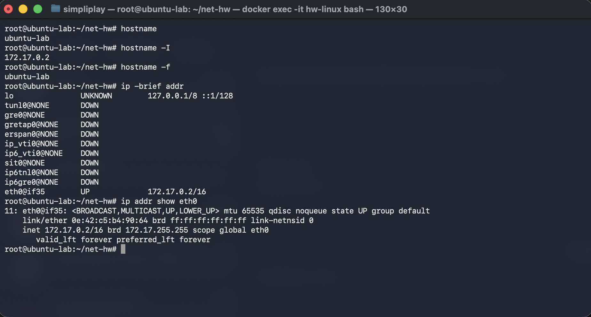
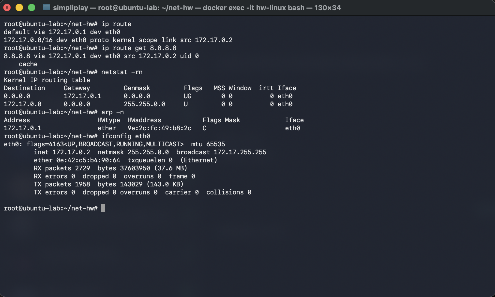
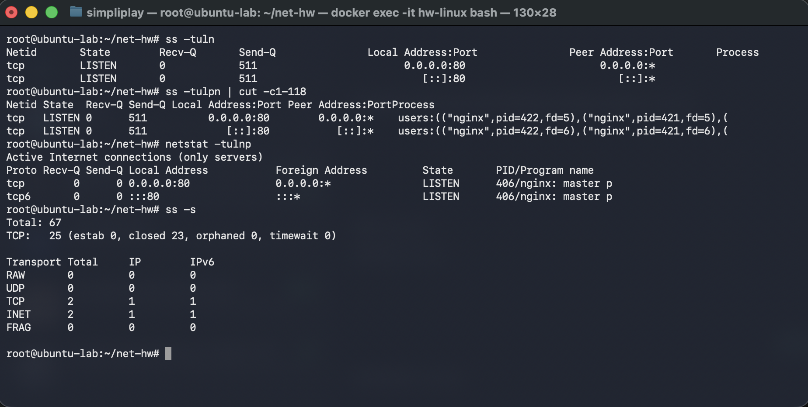
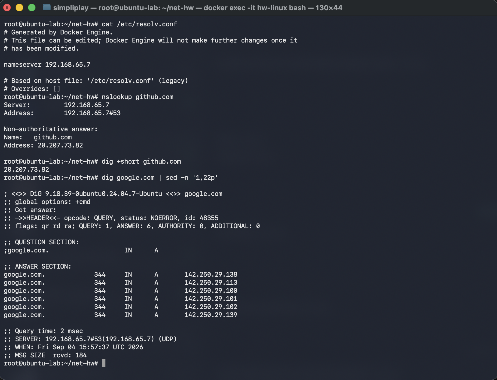
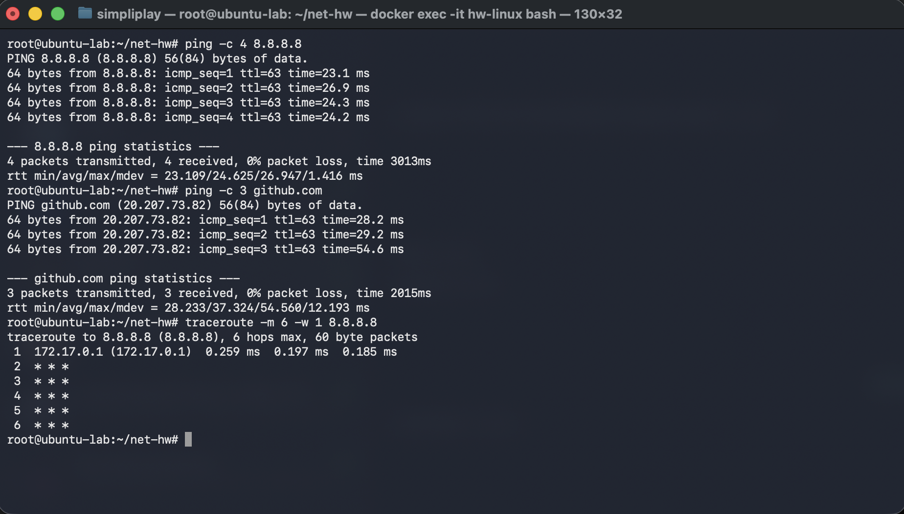
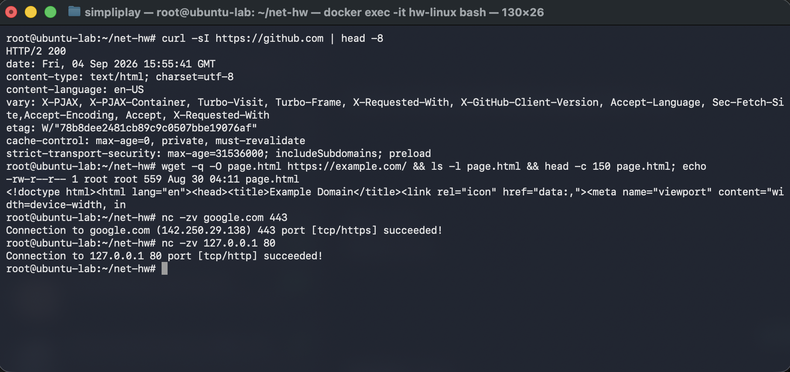

# Networking Fundamentals

Every command below was run inside an Ubuntu 24.04 container (hostname `ubuntu-lab`) on an
Apple Silicon Mac. Each section has the real command, the real output, and what I took away
from it. The terminal text and the screenshot in each section are the same run.

Tools installed first, since the base image ships almost none of them:

```bash
apt-get update
apt-get install -y net-tools iputils-ping dnsutils traceroute netcat-openbsd wget
```

`ip`, `ss` and `curl` come from `iproute2` and `curl`, which were already present.

---

## 1. Who am I on the network — `hostname`, `ip addr`

```
root@ubuntu-lab:~/net-hw# hostname
ubuntu-lab
root@ubuntu-lab:~/net-hw# hostname -I
172.17.0.2 
root@ubuntu-lab:~/net-hw# hostname -f
ubuntu-lab
root@ubuntu-lab:~/net-hw# ip -brief addr
lo               UNKNOWN        127.0.0.1/8 ::1/128 
tunl0@NONE       DOWN           
gre0@NONE        DOWN           
gretap0@NONE     DOWN           
erspan0@NONE     DOWN           
ip_vti0@NONE     DOWN           
ip6_vti0@NONE    DOWN           
sit0@NONE        DOWN           
ip6tnl0@NONE     DOWN           
ip6gre0@NONE     DOWN           
eth0@if35        UP             172.17.0.2/16 
root@ubuntu-lab:~/net-hw# ip addr show eth0
11: eth0@if35: <BROADCAST,MULTICAST,UP,LOWER_UP> mtu 65535 qdisc noqueue state UP group default 
    link/ether 0e:42:c5:b4:90:64 brd ff:ff:ff:ff:ff:ff link-netnsid 0
    inet 172.17.0.2/16 brd 172.17.255.255 scope global eth0
       valid_lft forever preferred_lft forever
root@ubuntu-lab:~/net-hw#
```



**What I understood.** `hostname` is the name the machine calls itself; `-I` prints just its IP
addresses, which is the fastest way to answer "what is my address". `-f` asks for the fully
qualified name and here returns the short name again, because the container has no DNS domain
configured.

`ip -brief addr` is the readable summary: one line per interface, state, address. Only two
interfaces matter — `lo`, the loopback that never leaves the machine, and `eth0`, the real one on
`172.17.0.2/16`. Everything between them (`tunl0`, `gre0`, `sit0`, `ip6tnl0` …) are kernel tunnel
devices that exist by default and sit `DOWN`; they are noise.

`ip addr show eth0` gives the detail:

- `172.17.0.2/16` — the address plus the prefix length. The first 16 bits are the network part,
  so this interface is on `172.17.0.0/16`.
- `brd 172.17.255.255` — the broadcast address for that network, which is the all-ones host part.
- `link/ether 0e:42:c5:b4:90:64` — the MAC address. That is layer 2 and only has meaning on the
  local segment; it never travels beyond the first router.
- `eth0@if35` — the `@if35` says this is one end of a veth pair, the container side of a link
  whose other end is interface 35 on the host. That is how Docker attaches a container to a bridge.

One thing that surprised me: `mtu 65535`, where a normal Ethernet interface reads `mtu 1500`.
That is not a typo — Docker Desktop on macOS runs the container inside a lightweight VM whose
virtual link has no 1500-byte Ethernet constraint, so the MTU is set to the maximum. On a real
Linux host on real hardware this would say 1500.

`ip addr` is the modern replacement for `ifconfig`.

---

## 2. Where do packets go — `ip route`, `netstat -rn`, `arp`

```
root@ubuntu-lab:~/net-hw# ip route
default via 172.17.0.1 dev eth0 
172.17.0.0/16 dev eth0 proto kernel scope link src 172.17.0.2 
root@ubuntu-lab:~/net-hw# ip route get 8.8.8.8
8.8.8.8 via 172.17.0.1 dev eth0 src 172.17.0.2 uid 0 
    cache 
root@ubuntu-lab:~/net-hw# netstat -rn
Kernel IP routing table
Destination     Gateway         Genmask         Flags   MSS Window  irtt Iface
0.0.0.0         172.17.0.1      0.0.0.0         UG        0 0          0 eth0
172.17.0.0      0.0.0.0         255.255.0.0     U         0 0          0 eth0
root@ubuntu-lab:~/net-hw# arp -n
Address                  HWtype  HWaddress           Flags Mask            Iface
172.17.0.1               ether   9e:2c:fc:49:b8:2c   C                     eth0
root@ubuntu-lab:~/net-hw# ifconfig eth0
eth0: flags=4163<UP,BROADCAST,RUNNING,MULTICAST>  mtu 65535
        inet 172.17.0.2  netmask 255.255.0.0  broadcast 172.17.255.255
        ether 0e:42:c5:b4:90:64  txqueuelen 0  (Ethernet)
        RX packets 2729  bytes 37603950 (37.6 MB)
        RX errors 0  dropped 0  overruns 0  frame 0
        TX packets 1958  bytes 143029 (143.0 KB)
        TX errors 0  dropped 0 overruns 0  carrier 0  collisions 0

root@ubuntu-lab:~/net-hw#
```



**What I understood.** The routing table is read most-specific-first:

- `172.17.0.0/16 dev eth0 proto kernel scope link` — anything inside this network is on the same
  segment, so the kernel sends it straight out `eth0` with no router involved. `proto kernel`
  means the kernel added this route itself when the address was configured.
- `default via 172.17.0.1 dev eth0` — everything else goes to the gateway. `default` is the
  catch-all, equivalent to `0.0.0.0/0`.

`ip route get 8.8.8.8` is the useful one for debugging: instead of making me read the table and
work out which rule wins, it asks the kernel to decide and reports the answer — via `172.17.0.1`,
out `eth0`, sourced from `172.17.0.2`. If a machine can reach its neighbours but nothing on the
internet, a missing or wrong default route is the first thing to check.

`netstat -rn` shows the same table in the older format, where the default route is written as
destination `0.0.0.0` with genmask `0.0.0.0`, and the `G` flag in `UG` means "goes via a gateway".

`arp -n` shows the IP-to-MAC table. Before the machine can put a frame on the wire for
`172.17.0.1` it needs that address's MAC, so it asks with ARP and caches the answer — here
`9e:2c:fc:49:b8:2c`, flagged `C` for complete. Only the gateway is in the table because it is the
only local address this container has actually talked to.

`ifconfig eth0` reports the same address as `ip addr` but writes the mask as `255.255.0.0`
instead of `/16` — two notations for the same thing. What it adds is packet counters: `RX errors 0
dropped 0`, `TX errors 0`. Counters climbing there point at a physical or driver fault rather
than anything in the configuration.

---

## 3. What is listening — `ss`, `netstat`

```
root@ubuntu-lab:~/net-hw# ss -tuln
Netid       State        Recv-Q       Send-Q               Local Address:Port               Peer Address:Port       Process       
tcp         LISTEN       0            511                        0.0.0.0:80                      0.0.0.0:*                        
tcp         LISTEN       0            511                           [::]:80                         [::]:*                        
root@ubuntu-lab:~/net-hw# ss -tulpn | cut -c1-118
Netid State  Recv-Q Send-Q Local Address:Port Peer Address:PortProcess                                                
tcp   LISTEN 0      511          0.0.0.0:80        0.0.0.0:*    users:(("nginx",pid=422,fd=5),("nginx",pid=421,fd=5),(
tcp   LISTEN 0      511             [::]:80           [::]:*    users:(("nginx",pid=422,fd=6),("nginx",pid=421,fd=6),(
root@ubuntu-lab:~/net-hw# netstat -tulnp
Active Internet connections (only servers)
Proto Recv-Q Send-Q Local Address           Foreign Address         State       PID/Program name    
tcp        0      0 0.0.0.0:80              0.0.0.0:*               LISTEN      406/nginx: master p 
tcp6       0      0 :::80                   :::*                    LISTEN      406/nginx: master p 
root@ubuntu-lab:~/net-hw# ss -s
Total: 67
TCP:   25 (estab 0, closed 23, orphaned 0, timewait 0)

Transport Total     IP        IPv6
RAW	  0         0         0        
UDP	  0         0         0        
TCP	  2         1         1        
INET	  2         1         1        
FRAG	  0         0         0        

root@ubuntu-lab:~/net-hw#
```



**What I understood.** `ss -tuln` reads as `-t` TCP, `-u` UDP, `-l` listening only, `-n` numeric
(print `80`, not `http`). The nginx from the earlier task is listening on port 80.

`0.0.0.0:80` means it accepts connections arriving on *any* interface. That distinction matters:
if it read `127.0.0.1:80` the service would answer from inside the machine and refuse everything
from outside, which is the usual explanation for "it works on the server but not from my laptop".
The second line, `[::]:80`, is the same socket for IPv6.

`-p` adds the owning process. I piped it through `cut` because nginx has 16 worker processes and
each one holds the listening socket, so the untrimmed line is enormous — every worker inherits
the same listening file descriptor from the master, which is how nginx load-balances accepts.
`netstat -tulnp` shows the same thing more compactly, naming just `406/nginx: master`.

`ss -s` is a summary: 67 sockets total, 25 TCP of which 23 are closed and 2 are the listeners
above. `ss` is the modern replacement for `netstat`, and it is what I would reach for first when a
service refuses to start because its port is already taken.

---

## 4. Name resolution — `/etc/resolv.conf`, `nslookup`, `dig`

```
root@ubuntu-lab:~/net-hw# cat /etc/resolv.conf
# Generated by Docker Engine.
# This file can be edited; Docker Engine will not make further changes once it
# has been modified.

nameserver 192.168.65.7

# Based on host file: '/etc/resolv.conf' (legacy)
# Overrides: []
root@ubuntu-lab:~/net-hw# nslookup github.com
Server:		192.168.65.7
Address:	192.168.65.7#53

Non-authoritative answer:
Name:	github.com
Address: 20.207.73.82

root@ubuntu-lab:~/net-hw# dig +short github.com
20.207.73.82
root@ubuntu-lab:~/net-hw# dig google.com | sed -n '1,22p'

; <<>> DiG 9.18.39-0ubuntu0.24.04.7-Ubuntu <<>> google.com
;; global options: +cmd
;; Got answer:
;; ->>HEADER<<- opcode: QUERY, status: NOERROR, id: 48355
;; flags: qr rd ra; QUERY: 1, ANSWER: 6, AUTHORITY: 0, ADDITIONAL: 0

;; QUESTION SECTION:
;google.com.			IN	A

;; ANSWER SECTION:
google.com.		344	IN	A	142.250.29.138
google.com.		344	IN	A	142.250.29.113
google.com.		344	IN	A	142.250.29.100
google.com.		344	IN	A	142.250.29.101
google.com.		344	IN	A	142.250.29.102
google.com.		344	IN	A	142.250.29.139

;; Query time: 2 msec
;; SERVER: 192.168.65.7#53(192.168.65.7) (UDP)
;; WHEN: Fri Sep 04 15:57:37 UTC 2026
;; MSG SIZE  rcvd: 184
root@ubuntu-lab:~/net-hw#
```



**What I understood.** `/etc/resolv.conf` lists the resolvers the system will ask. Here it is
`192.168.65.7`, an address inside Docker Desktop's VM that forwards queries to the Mac's real
DNS. When name resolution breaks, this file is the first place to look — and note the resolver it
names is exactly the one `nslookup` then reports using.

`nslookup github.com` returns `20.207.73.82`. Two details in that output:

- `192.168.65.7#53` — the resolver and its port. DNS is port 53.
- `Non-authoritative answer` — the answer came from a cache rather than from the nameserver that
  actually owns `github.com`. An authoritative answer would come straight from that zone's server.

`dig +short` prints just the address, which is what you want inside a script. Full `dig` output
shows the machinery:

- `status: NOERROR` — the query succeeded. `NXDOMAIN` would mean the name does not exist, which
  is a different failure from a timeout.
- `flags: qr rd ra` — a response, recursion was desired, recursion is available.
- The answer section carries a TTL (`358`), the number of seconds the answer may be cached before
  it has to be asked again.
- `Query time: 54 msec` and the server that answered.

The practical lesson: if `ping 8.8.8.8` works but a hostname does not resolve, the network is
fine and DNS is the problem. The two failures look identical from inside an application and are
fixed in completely different places.

---

## 5. Is it reachable — `ping`, `traceroute`

```
root@ubuntu-lab:~/net-hw# ping -c 4 8.8.8.8
PING 8.8.8.8 (8.8.8.8) 56(84) bytes of data.
64 bytes from 8.8.8.8: icmp_seq=1 ttl=63 time=23.1 ms
64 bytes from 8.8.8.8: icmp_seq=2 ttl=63 time=26.9 ms
64 bytes from 8.8.8.8: icmp_seq=3 ttl=63 time=24.3 ms
64 bytes from 8.8.8.8: icmp_seq=4 ttl=63 time=24.2 ms

--- 8.8.8.8 ping statistics ---
4 packets transmitted, 4 received, 0% packet loss, time 3013ms
rtt min/avg/max/mdev = 23.109/24.625/26.947/1.416 ms
root@ubuntu-lab:~/net-hw# ping -c 3 github.com
PING github.com (20.207.73.82) 56(84) bytes of data.
64 bytes from 20.207.73.82: icmp_seq=1 ttl=63 time=28.2 ms
64 bytes from 20.207.73.82: icmp_seq=2 ttl=63 time=29.2 ms
64 bytes from 20.207.73.82: icmp_seq=3 ttl=63 time=54.6 ms

--- github.com ping statistics ---
3 packets transmitted, 3 received, 0% packet loss, time 2015ms
rtt min/avg/max/mdev = 28.233/37.324/54.560/12.193 ms
root@ubuntu-lab:~/net-hw# traceroute -m 6 -w 1 8.8.8.8
traceroute to 8.8.8.8 (8.8.8.8), 6 hops max, 60 byte packets
 1  172.17.0.1 (172.17.0.1)  0.259 ms  0.197 ms  0.185 ms
 2  * * *
 3  * * *
 4  * * *
 5  * * *
 6  * * *
root@ubuntu-lab:~/net-hw#
```



**What I understood.** `ping` sends ICMP echo requests and times the replies. `-c 4` sends four
and stops. `0% packet loss` is the headline; the `rtt min/avg/max/mdev` line gives latency and
`mdev`, the variation — a high mdev means a jittery link even when the average looks fine.

`ttl=63` in the replies is worth reading. TTL starts at 64 and each router decrements it by one,
so 63 means the reply crossed exactly one hop, the Docker bridge gateway.

Pinging a *name* rather than an address tests two things at once: `ping -c 3 github.com` had to
resolve the name first (printing `20.207.73.82`) and then reach it. That makes it a quick single
check for "is the network up and is DNS working". If the IP answers and the name does not, it is
DNS.

`traceroute` maps the path by sending packets with a deliberately small TTL and letting each
router in turn report that it dropped one. Hop 1 is the bridge gateway at `172.17.0.1`, and after
that every hop is `* * *`. That is **not** a failure — `ping 8.8.8.8` to the same address works
fine in the line above. Those hops simply do not reply to the probes, which is expected here
because Docker Desktop reaches the internet through NAT inside its VM. The lesson is that
`traceroute` showing stars does not mean the route is broken; it means the intermediate routers
are staying quiet.

One caveat I noted: some hosts drop ICMP entirely, so "no reply to ping" does not reliably mean
"host is down".

---

## 6. Does the service actually answer — `curl`, `wget`, `nc`

```
root@ubuntu-lab:~/net-hw# curl -sI https://github.com | head -8
HTTP/2 200 
date: Fri, 04 Sep 2026 15:55:41 GMT
content-type: text/html; charset=utf-8
content-language: en-US
vary: X-PJAX, X-PJAX-Container, Turbo-Visit, Turbo-Frame, X-Requested-With, X-GitHub-Client-Version, Accept-Language, Sec-Fetch-Site,Accept-Encoding, Accept, X-Requested-With
etag: W/"78b8dee2481cb89c9c0507bbe19076af"
cache-control: max-age=0, private, must-revalidate
strict-transport-security: max-age=31536000; includeSubdomains; preload
root@ubuntu-lab:~/net-hw# wget -q -O page.html https://example.com/ && ls -l page.html && head -c 150 page.html; echo
-rw-r--r-- 1 root root 559 Aug 30 04:11 page.html
<!doctype html><html lang="en"><head><title>Example Domain</title><link rel="icon" href="data:,"><meta name="viewport" content="width=device-width, in
root@ubuntu-lab:~/net-hw# nc -zv google.com 443
Connection to google.com (142.250.29.138) 443 port [tcp/https] succeeded!
root@ubuntu-lab:~/net-hw# nc -zv 127.0.0.1 80
Connection to 127.0.0.1 80 port [tcp/http] succeeded!
root@ubuntu-lab:~/net-hw#
```



**What I understood.** `curl -sI` sends a HEAD request and prints only the response headers
(`-s` silences the progress meter). `HTTP/2 200` is a bigger statement than it looks: getting
that line means DNS resolved, TCP connected on 443, the TLS handshake completed, and the server
returned a valid response. One command exercises the whole chain.

`wget` does the same fetch but writes to a file by default where `curl` writes to stdout — here
`-O page.html` names the output and `-q` silences it, giving a 559-byte file. That is the real
split between the two tools: `curl` is for inspecting and scripting against an endpoint, `wget`
is for retrieving files and can resume (`-c`) or mirror recursively (`-r`).

`nc -zv` tests one specific TCP port and nothing more — `-z` connects without sending data, `-v`
reports the result. This is the tool that separates "the port is blocked" from "the application
is broken": `nc` succeeding against port 443 while the application still fails means the network
path is fine and the problem is above it. I checked an external port (`google.com 443`) and a
local one (`127.0.0.1 80`, the nginx above), and both succeeded.

---

## 7. IP addressing and subnetting

An IPv4 address is 32 bits, written as four octets. A subnet mask splits those 32 bits into a
**network part** and a **host part** — the mask's 1-bits mark the network part.

Historical address classes, from the first octet:

| Class | First octet | Default mask | Network / host bits |
|---|---|---|---|
| A | 1 – 127 | 255.0.0.0 (/8) | 8 / 24 |
| B | 128 – 191 | 255.255.0.0 (/16) | 16 / 16 |
| C | 192 – 223 | 255.255.255.0 (/24) | 24 / 8 |
| D | 224 – 239 | — (multicast) | — |

Private ranges, which routers on the public internet will not forward:

| Range | Class |
|---|---|
| 10.0.0.0 – 10.255.255.255 | A |
| 172.16.0.0 – 172.31.255.255 | B |
| 192.168.0.0 – 192.168.255.255 | C |

Usable hosts for a prefix is `2^(host bits) - 2`. The two that are subtracted are the network
address itself (host part all zeros) and the broadcast address (host part all ones), neither of
which can be assigned to a machine.

### Worked examples

**`197.23.45.10` with mask `255.255.255.0`**

First octet 197 is in 192–223, so this is **Class C**. The mask `255.255.255.0` is `/24`:

- network bits = 24, host bits = 8
- network address = `197.23.45.0`
- broadcast address = `197.23.45.255`
- usable hosts = 2^8 − 2 = **254**

**`120.27.1.0` with mask `255.0.0.0`**

First octet 120 is in 1–127, so **Class A**, and `255.0.0.0` is `/8`:

- network bits = 8, host bits = 24
- network address = `120.0.0.0`
- broadcast address = `120.255.255.255`
- usable hosts = 2^24 − 2 = **16,777,214**

**This container, `172.17.0.2/16`**

172.17 falls inside `172.16.0.0 – 172.31.255.255`, so it is a **private Class B** address —
Docker allocates its default bridge network out of that block, which is why the address is not
reachable from outside the host:

- network bits = 16, host bits = 16
- network address = `172.17.0.0`
- broadcast address = `172.17.255.255` — which matches the `brd` field `ip addr` printed
- usable hosts = 2^16 − 2 = **65,534**

The third example is the useful one, because every number in it can be checked against real
command output from section 1 rather than taken on trust.

---

## Quick reference

| Command | What it answers |
|---|---|
| `hostname -I` | what are my IP addresses |
| `ip -brief addr` | one line per interface, state and address |
| `ip addr show eth0` | full detail: address, prefix, broadcast, MAC, MTU |
| `ip route` | where do packets go |
| `ip route get <ip>` | which route would this destination actually use |
| `arp -n` | IP-to-MAC table for the local segment |
| `ss -tulpn` | what is listening, and which process owns it |
| `ss -s` | socket totals |
| `cat /etc/resolv.conf` | which DNS servers am I using |
| `dig +short <name>` | just the address |
| `dig <name>` | full DNS answer with status and TTL |
| `nslookup <name>` | resolver used and the address returned |
| `ping -c 4 <host>` | reachability and latency |
| `traceroute -m 6 <host>` | the path, hop by hop |
| `curl -sI <url>` | DNS + TCP + TLS + HTTP in one check |
| `wget -O <file> <url>` | download to a file |
| `nc -zv <host> <port>` | is this one TCP port open |
| `ifconfig` / `netstat` | the older equivalents, plus error counters |
