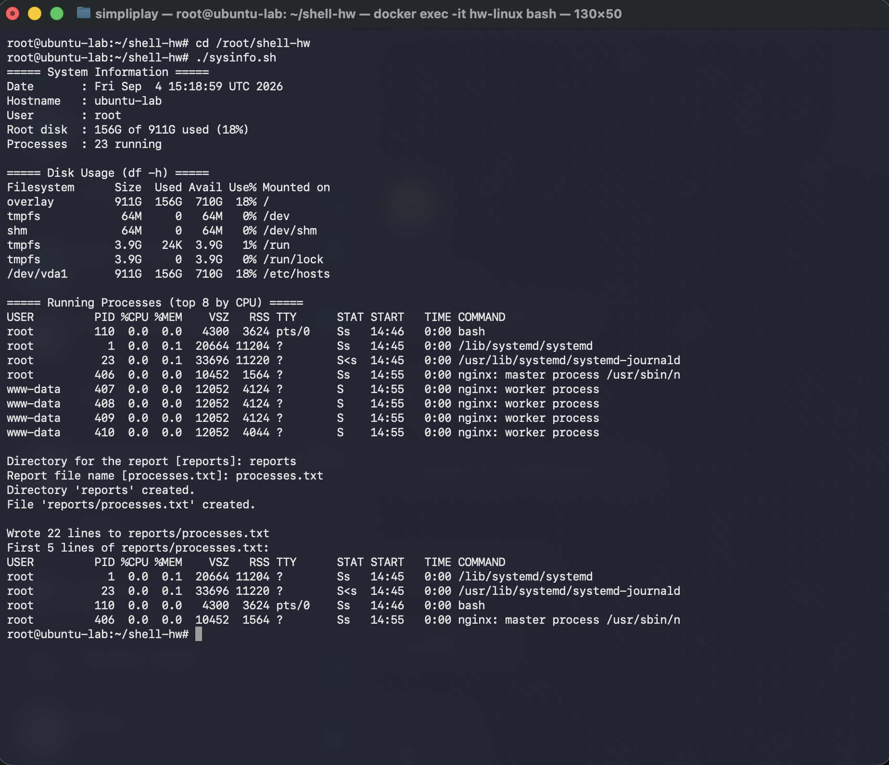
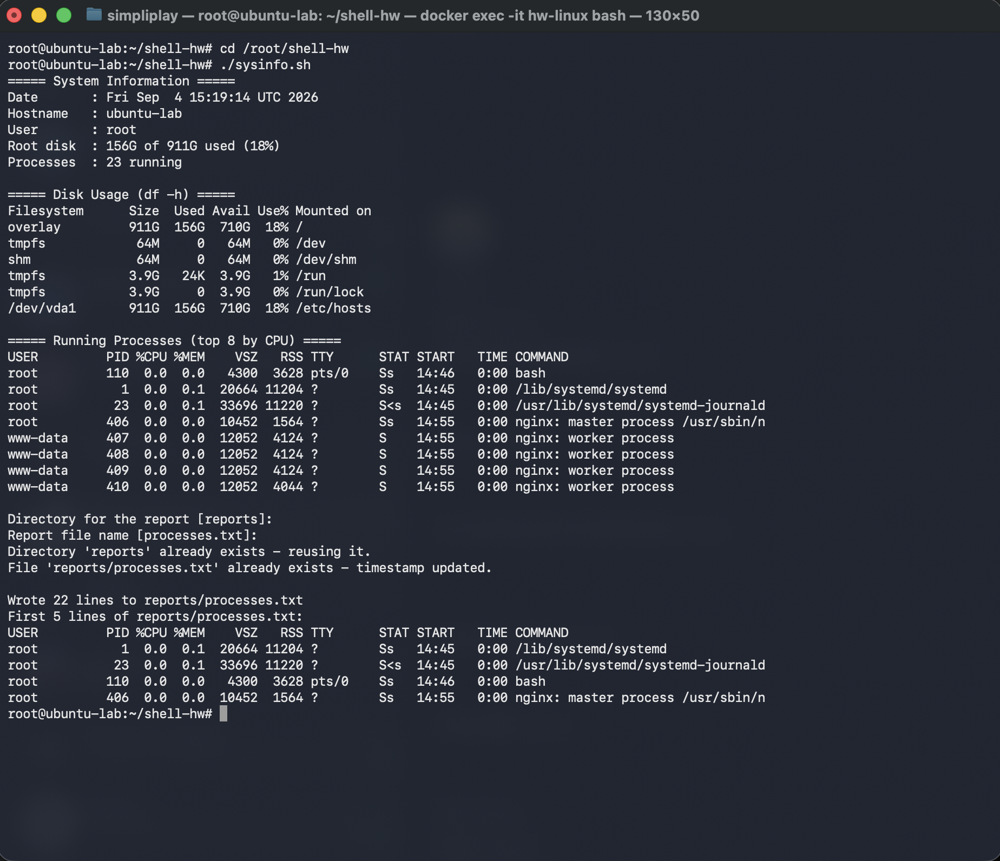
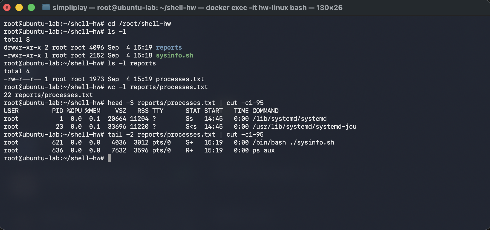

# Shell Scripting — System Information Script

[`sysinfo.sh`](sysinfo.sh) prints the date, hostname, username, disk usage and running
processes, asks the user where to keep a report, creates that directory and file, and writes
the full process list into it with `>` redirection.

Everything in this README is real output from running the script — the terminal text below and
the screenshots beside it are the same session, so the PIDs and timestamps match.

## Requirements covered

| Requirement | How the script does it |
|---|---|
| Print the current date | `CURRENT_DATE=$(date)`, printed with `echo` |
| Print the hostname | `HOST_NAME=$(hostname)` |
| Print the username | `USER_NAME=$(whoami)` |
| Print the disk usage | `df -h` in full, plus a one-line summary parsed with `awk` |
| Print the running processes | `ps aux --sort=-%cpu`, top 8 |
| Use variables | `CURRENT_DATE`, `HOST_NAME`, `USER_NAME`, `ROOT_DISK`, `PROC_COUNT`, `REPORT_DIR`, `REPORT_FILE`, `REPORT_PATH` |
| Take user input with `read -p` | two prompts: directory and file name, each with a default |
| Create a directory with `mkdir` | `mkdir -p "$REPORT_DIR"` |
| Create a file with `touch` | `touch "$REPORT_PATH"` |
| Store processes in the file with `>` | `ps aux > "$REPORT_PATH"` |

## The script

```bash
#!/bin/bash
#
# sysinfo.sh - print a short report about this machine, then ask the user
# where to keep a full process listing and write it there.
#
# Usage:  ./sysinfo.sh      (press Enter at either prompt to take the default)

# ---- collect the facts into variables --------------------------------------
CURRENT_DATE=$(date)
HOST_NAME=$(hostname)
USER_NAME=$(whoami)
ROOT_DISK=$(df -h / | awk 'NR==2 {print $3 " of " $2 " used (" $5 ")"}')
PROC_COUNT=$(($(ps aux | wc -l) - 1))    # -1 drops the ps header row

# ---- print the summary -----------------------------------------------------
echo "===== System Information ====="
echo "Date       : $CURRENT_DATE"
echo "Hostname   : $HOST_NAME"
echo "User       : $USER_NAME"
echo "Root disk  : $ROOT_DISK"
echo "Processes  : $PROC_COUNT running"
echo

echo "===== Disk Usage (df -h) ====="
df -h
echo

echo "===== Running Processes (top 8 by CPU) ====="
ps aux --sort=-%cpu | head -9 | cut -c1-100
echo

# ---- ask where the report should go ----------------------------------------
read -p "Directory for the report [reports]: " REPORT_DIR
read -p "Report file name [processes.txt]: " REPORT_FILE

# an empty answer falls back to the default rather than breaking mkdir
REPORT_DIR=${REPORT_DIR:-reports}
REPORT_FILE=${REPORT_FILE:-processes.txt}
REPORT_PATH="$REPORT_DIR/$REPORT_FILE"

# ---- create the directory and the file -------------------------------------
if [ -d "$REPORT_DIR" ]; then
  echo "Directory '$REPORT_DIR' already exists - reusing it."
else
  mkdir -p "$REPORT_DIR"
  echo "Directory '$REPORT_DIR' created."
fi

# touch either creates the file or, if it is already there, just bumps its
# modification time - so say which one actually happened
if [ -e "$REPORT_PATH" ]; then
  touch "$REPORT_PATH"
  echo "File '$REPORT_PATH' already exists - timestamp updated."
else
  touch "$REPORT_PATH"
  echo "File '$REPORT_PATH' created."
fi

# ---- write the full process list into the file with > redirection ----------
ps aux > "$REPORT_PATH"

echo
echo "Wrote $(wc -l < "$REPORT_PATH") lines to $REPORT_PATH"
echo "First 5 lines of $REPORT_PATH:"
head -5 "$REPORT_PATH" | cut -c1-100
```

## Running it

```bash
chmod +x sysinfo.sh
./sysinfo.sh
```

I ran it inside the Ubuntu 24.04 container from the Linux assignment (hostname `ubuntu-lab`),
answering `reports` and `processes.txt` at the two prompts:

```
root@ubuntu-lab:~/shell-hw# cd /root/shell-hw
root@ubuntu-lab:~/shell-hw# ./sysinfo.sh
===== System Information =====
Date       : Fri Sep  4 15:18:59 UTC 2026
Hostname   : ubuntu-lab
User       : root
Root disk  : 156G of 911G used (18%)
Processes  : 23 running

===== Disk Usage (df -h) =====
Filesystem      Size  Used Avail Use% Mounted on
overlay         911G  156G  710G  18% /
tmpfs            64M     0   64M   0% /dev
shm              64M     0   64M   0% /dev/shm
tmpfs           3.9G   24K  3.9G   1% /run
tmpfs           3.9G     0  3.9G   0% /run/lock
/dev/vda1       911G  156G  710G  18% /etc/hosts

===== Running Processes (top 8 by CPU) =====
USER         PID %CPU %MEM    VSZ   RSS TTY      STAT START   TIME COMMAND
root         110  0.0  0.0   4300  3624 pts/0    Ss   14:46   0:00 bash
root           1  0.0  0.1  20664 11204 ?        Ss   14:45   0:00 /lib/systemd/systemd
root          23  0.0  0.1  33696 11220 ?        S<s  14:45   0:00 /usr/lib/systemd/systemd-journald
root         406  0.0  0.0  10452  1564 ?        Ss   14:55   0:00 nginx: master process /usr/sbin/n
www-data     407  0.0  0.0  12052  4124 ?        S    14:55   0:00 nginx: worker process
www-data     408  0.0  0.0  12052  4124 ?        S    14:55   0:00 nginx: worker process
www-data     409  0.0  0.0  12052  4124 ?        S    14:55   0:00 nginx: worker process
www-data     410  0.0  0.0  12052  4044 ?        S    14:55   0:00 nginx: worker process

Directory for the report [reports]: reports
Report file name [processes.txt]: processes.txt
Directory 'reports' created.
File 'reports/processes.txt' created.

Wrote 22 lines to reports/processes.txt
First 5 lines of reports/processes.txt:
USER         PID %CPU %MEM    VSZ   RSS TTY      STAT START   TIME COMMAND
root           1  0.0  0.1  20664 11204 ?        Ss   14:45   0:00 /lib/systemd/systemd
root          23  0.0  0.1  33696 11220 ?        S<s  14:45   0:00 /usr/lib/systemd/systemd-journald
root         110  0.0  0.0   4300  3624 pts/0    Ss   14:46   0:00 bash
root         406  0.0  0.0  10452  1564 ?        Ss   14:55   0:00 nginx: master process /usr/sbin/n
root@ubuntu-lab:~/shell-hw#
```



The two typed answers are visible after each `read -p` prompt — that is genuine interactive
input, not piped stdin.

## Re-running it: defaults and safe repeats

Pressing Enter at both prompts takes the bracketed defaults, and a second run over an existing
directory reports what it actually found instead of claiming to have created it again:

```

Directory for the report [reports]: 
Report file name [processes.txt]: 
Directory 'reports' already exists - reusing it.
File 'reports/processes.txt' already exists - timestamp updated.

Wrote 22 lines to reports/processes.txt
First 5 lines of reports/processes.txt:
USER         PID %CPU %MEM    VSZ   RSS TTY      STAT START   TIME COMMAND
root           1  0.0  0.1  20664 11204 ?        Ss   14:45   0:00 /lib/systemd/systemd
root          23  0.0  0.1  33696 11220 ?        S<s  14:45   0:00 /usr/lib/systemd/systemd-journald
root         110  0.0  0.0   4300  3628 pts/0    Ss   14:46   0:00 bash
root         406  0.0  0.0  10452  1564 ?        Ss   14:55   0:00 nginx: master process /usr/sbin/n
root@ubuntu-lab:~/shell-hw#
```



Two things make the re-run safe. `mkdir -p` does not fail when the directory is already there,
and `${REPORT_DIR:-reports}` substitutes the default when the answer is empty — without that,
an empty answer would call `mkdir -p ""` and error out.

## The file it produced

```
root@ubuntu-lab:~/shell-hw# cd /root/shell-hw
root@ubuntu-lab:~/shell-hw# ls -l
total 8
drwxr-xr-x 2 root root 4096 Sep  4 15:19 reports
-rwxr-xr-x 1 root root 2152 Sep  4 15:18 sysinfo.sh
root@ubuntu-lab:~/shell-hw# ls -l reports
total 4
-rw-r--r-- 1 root root 1973 Sep  4 15:19 processes.txt
root@ubuntu-lab:~/shell-hw# wc -l reports/processes.txt
22 reports/processes.txt
root@ubuntu-lab:~/shell-hw# head -3 reports/processes.txt | cut -c1-95
USER         PID %CPU %MEM    VSZ   RSS TTY      STAT START   TIME COMMAND
root           1  0.0  0.1  20664 11204 ?        Ss   14:45   0:00 /lib/systemd/systemd
root          23  0.0  0.1  33696 11220 ?        S<s  14:45   0:00 /usr/lib/systemd/systemd-jou
root@ubuntu-lab:~/shell-hw# tail -2 reports/processes.txt | cut -c1-95
root         621  0.0  0.0   4036  3012 pts/0    S+   15:19   0:00 /bin/bash ./sysinfo.sh
root         636  0.0  0.0   7632  3596 pts/0    R+   15:19   0:00 ps aux
root@ubuntu-lab:~/shell-hw#
```



The `reports/` directory is created at run time wherever you run the script from, so it is not
committed here.

## Notes

- **`$(...)` runs a command and stores its output.** `CURRENT_DATE=$(date)` captures the date at
  the moment the script starts; `CURRENT_DATE="date"` would just store the word `date`.
- **`>` truncates, `>>` appends.** The report uses `>` so each run replaces the previous list
  rather than stacking onto it. That is also why the script can be re-run freely.
- **`touch` has two jobs** — create an empty file, or update the timestamp of one that exists.
  The script checks with `[ -e ... ]` first so the message it prints is actually true.
- **Every expansion is quoted** (`"$REPORT_DIR"`, `"$REPORT_PATH"`). Without the quotes a
  directory name containing a space would split into two arguments and the script would break.
- **The shebang matters.** `#!/bin/bash` on line 1 is what makes `./sysinfo.sh` run under bash.
  Without it the kernel falls back to `/bin/sh`, and `read -p` is a bashism that plain `sh`
  (dash on Ubuntu) does not support.
- **A process listing includes the machinery that produced it.** The summary reports
  `23 running` while the saved file has `22` lines. Both are correct: `ps aux | wc -l` is a
  pipeline, so `ps` sees the `wc` process alongside everything else, whereas `ps aux > file`
  spawns no second command. Confirmed directly:

  ```
  # ps aux | wc -l
  23
  # ps aux > /tmp/f; wc -l < /tmp/f
  22
  ```

  The `tail` of the report shows the same effect — `./sysinfo.sh` and `ps aux` are themselves in
  the listing.

The script, its output and the screenshots here are from my own run.
