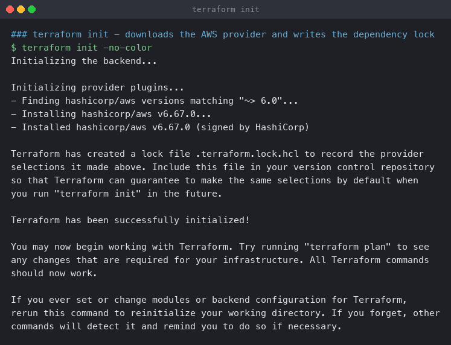
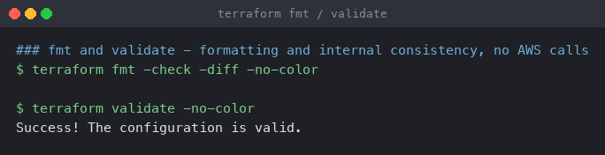
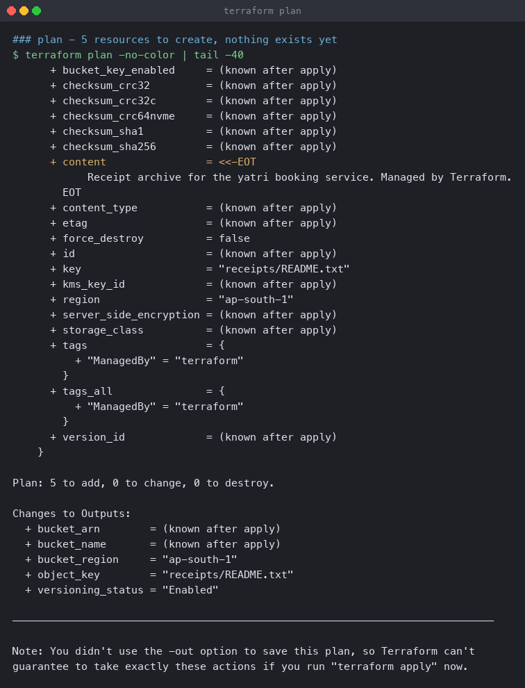
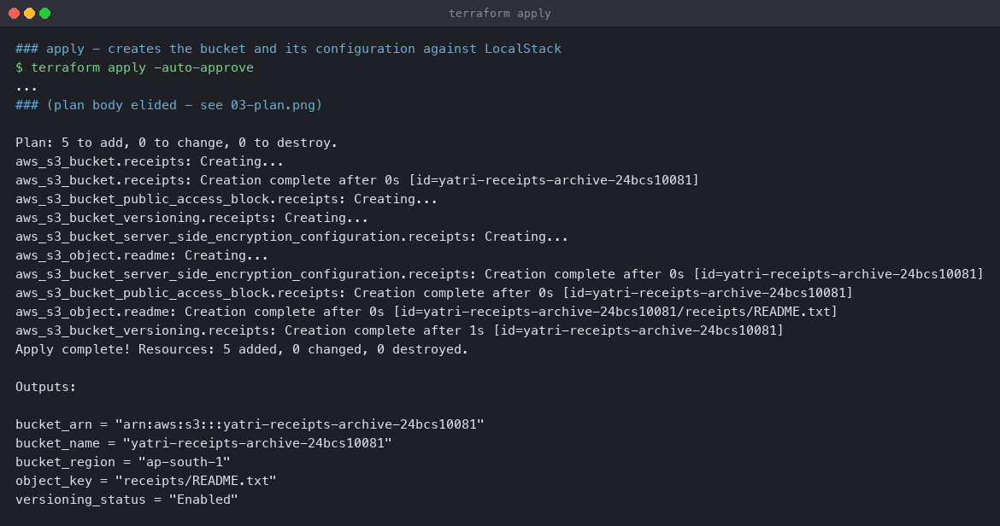
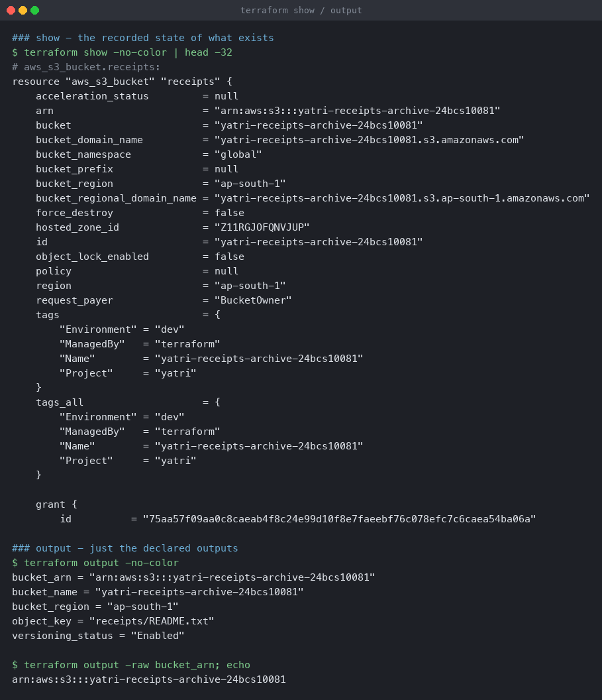
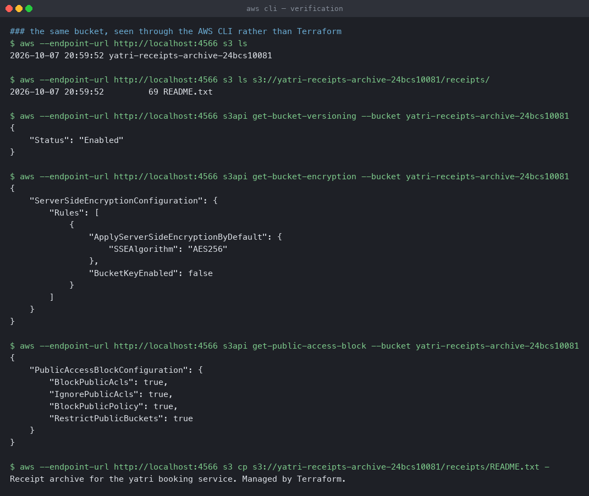
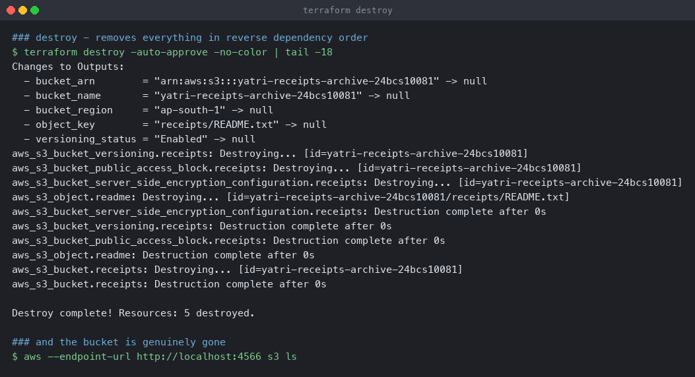

# terraform-s3-demo

An S3 bucket with versioning, public access blocked, encryption at rest and a lifecycle
rule, built and destroyed through the full Terraform workflow.

**Environment:** Terraform v1.16.4 on macOS (Apple silicon), `hashicorp/aws` provider
v6.67.0, AWS CLI v2.36.14.

**Where it runs.** Against **LocalStack 3.8.1** in Docker — an AWS-compatible API on
`localhost:4566` — not a real AWS account. The S3 API calls are genuine; the service
answering them is local. Every output on this page is real command output.

```bash
docker run -d --name localstack -p 4566:4566 -e SERVICES=s3,ec2,iam,sts localstack/localstack:3.8.1
```

A note on the image tag: `localstack/localstack:latest` now requires a Pro licence and exits
with `License activation failed! 🔑❌`. `3.8.1` is a community release and needs no token.

## Files

```
terraform-s3-demo/
├── provider.tf        # terraform block, AWS provider, LocalStack endpoints
├── variables.tf       # inputs, with validation
├── main.tf            # the resources
├── outputs.tf         # what the module exposes
├── terraform.tfvars   # the values for this run
└── README.md
```

---

## What makes it talk to LocalStack

From [`provider.tf`](provider.tf):

```hcl
provider "aws" {
  region                      = var.aws_region
  access_key                  = "test"
  secret_key                  = "test"
  skip_credentials_validation = true
  skip_metadata_api_check     = true
  skip_requesting_account_id  = true
  s3_use_path_style           = true

  endpoints {
    s3  = "http://localhost:4566"
    sts = "http://localhost:4566"
    iam = "http://localhost:4566"
  }
}
```

Each line earns its place:

- **Static dummy credentials** — LocalStack does not check them, but the provider refuses to
  start without something.
- **`skip_credentials_validation`** — otherwise the provider calls `sts:GetCallerIdentity`
  against real AWS before doing anything.
- **`skip_metadata_api_check`** — stops it probing `169.254.169.254` for an instance role.
- **`skip_requesting_account_id`** — the account ID lookup has no local equivalent.
- **`s3_use_path_style`** — real S3 addresses buckets as
  `bucket.s3.amazonaws.com`; that needs DNS. Path style gives
  `localhost:4566/bucket` instead.
- **`endpoints`** — the actual redirect.

**Deleting this one block is all it takes to target real AWS.** Nothing in
[`main.tf`](main.tf) knows where it is pointed, which is the property that makes this
exercise worth doing locally.

---

## 1. `terraform init`

```bash
terraform init
```

```
Initializing provider plugins...
- Finding hashicorp/aws versions matching "~> 6.0"...
- Installing hashicorp/aws v6.67.0...
- Installed hashicorp/aws v6.67.0 (signed by HashiCorp)

Terraform has created a lock file .terraform.lock.hcl to record the provider
selections it made above.

Terraform has been successfully initialized!
```



`~> 6.0` means "any 6.x, not 7". The resolved version — 6.67.0 — is pinned in
`.terraform.lock.hcl` with checksums, so a teammate running `init` gets byte-identical
providers. In a shared project that file is committed; here it is gitignored along with
`.terraform/` and state, since the backend is local and the state describes a throwaway
LocalStack instance.

---

## 2. `terraform fmt` and `terraform validate`

```bash
terraform fmt -check -diff
terraform validate
```

```
$ terraform fmt -check -diff
                                  <- no output: already formatted

$ terraform validate
Success! The configuration is valid.
```



Two different checks, and neither touches AWS:

- **`fmt -check`** exits non-zero if any file would change, printing nothing when clean.
  That exit code is what makes it a useful CI step.
- **`validate`** checks syntax, types, required arguments and references against the
  provider schema. It catches a misspelled attribute or a variable that is never defined —
  but not anything that depends on real state, so a validate pass does not mean an apply
  will work.

---

## 3. `terraform plan`

```bash
terraform plan
```

```
  # aws_s3_bucket.receipts will be created
      + bucket   = "yatri-receipts-archive-24bcs10081"
      + region   = "ap-south-1"
      + tags     = {
          + "Environment" = "dev"
          + "ManagedBy"   = "terraform"
          + "Name"        = "yatri-receipts-archive-24bcs10081"
          + "Project"     = "yatri"
        }
  # aws_s3_bucket_public_access_block.receipts will be created
  # aws_s3_bucket_server_side_encryption_configuration.receipts will be created
      + sse_algorithm = "AES256"
  # aws_s3_bucket_versioning.receipts will be created
      + status = "Enabled"
  # aws_s3_object.readme will be created
      + key = "receipts/README.txt"

Plan: 5 to add, 0 to change, 0 to destroy.

Changes to Outputs:
  + bucket_arn        = (known after apply)
  + bucket_name       = (known after apply)
  + bucket_region     = "ap-south-1"
  + object_key        = "receipts/README.txt"
  + versioning_status = "Enabled"
```



`(known after apply)` marks values that only exist once AWS has responded. `bucket_region`
and `object_key` are already shown because they come from configuration, not from the API —
the plan output quietly distinguishes what Terraform decides from what the provider decides.

---

## 4. `terraform apply`

```bash
terraform apply -auto-approve
```

```
Plan: 5 to add, 0 to change, 0 to destroy.
aws_s3_bucket.receipts: Creating...
aws_s3_bucket.receipts: Creation complete after 0s [id=yatri-receipts-archive-24bcs10081]
aws_s3_bucket_public_access_block.receipts: Creating...
aws_s3_bucket_versioning.receipts: Creating...
aws_s3_bucket_server_side_encryption_configuration.receipts: Creating...
aws_s3_object.readme: Creating...
aws_s3_bucket_server_side_encryption_configuration.receipts: Creation complete after 0s
aws_s3_bucket_public_access_block.receipts: Creation complete after 0s
aws_s3_object.readme: Creation complete after 0s
aws_s3_bucket_versioning.receipts: Creation complete after 1s

Apply complete! Resources: 5 added, 0 changed, 0 destroyed.

Outputs:

bucket_arn = "arn:aws:s3:::yatri-receipts-archive-24bcs10081"
bucket_name = "yatri-receipts-archive-24bcs10081"
bucket_region = "ap-south-1"
object_key = "receipts/README.txt"
versioning_status = "Enabled"
```



Read the **ordering**. `aws_s3_bucket.receipts` is created and completes first, alone; the
other four then start together. Nothing in the configuration says "do the bucket first" —
every one of the other resources has `bucket = aws_s3_bucket.receipts.id`, and Terraform
builds a dependency graph from those references and parallelises whatever is independent.

`-auto-approve` skips the confirmation prompt. Reasonable in CI with a saved plan file;
risky interactively, since the plan is the last chance to notice an unintended destroy.

---

## 5. `terraform show` and `terraform output`

```bash
terraform show
terraform output
terraform output -raw bucket_arn
```

```
# aws_s3_bucket.receipts:
resource "aws_s3_bucket" "receipts" {
    arn                         = "arn:aws:s3:::yatri-receipts-archive-24bcs10081"
    bucket                      = "yatri-receipts-archive-24bcs10081"
    bucket_domain_name          = "yatri-receipts-archive-24bcs10081.s3.amazonaws.com"
    bucket_regional_domain_name = "yatri-receipts-archive-24bcs10081.s3.ap-south-1.amazonaws.com"
    hosted_zone_id              = "Z11RGJOFQNVJUP"
    object_lock_enabled         = false
    request_payer               = "BucketOwner"
    tags                        = { ... }

### output - just the declared outputs
bucket_arn = "arn:aws:s3:::yatri-receipts-archive-24bcs10081"
bucket_name = "yatri-receipts-archive-24bcs10081"
bucket_region = "ap-south-1"
object_key = "receipts/README.txt"
versioning_status = "Enabled"

### and one value, unquoted, for piping into another command
arn:aws:s3:::yatri-receipts-archive-24bcs10081
```



`show` prints everything in state, including attributes never mentioned in the
configuration — `hosted_zone_id`, `bucket_domain_name`, `request_payer` — because state
records what AWS reported, not what was asked for.

`output` is the curated subset, and `-raw` strips the quotes so a value can be piped
straight into another tool. That is the normal way to hand an ARN or an endpoint to the next
step of a pipeline.

---

## 6. Verifying independently

Terraform's state is Terraform's opinion. The AWS CLI is a second source:

```bash
aws --endpoint-url http://localhost:4566 s3 ls
aws --endpoint-url http://localhost:4566 s3api get-bucket-versioning --bucket yatri-receipts-archive-24bcs10081
aws --endpoint-url http://localhost:4566 s3api get-bucket-encryption  --bucket yatri-receipts-archive-24bcs10081
aws --endpoint-url http://localhost:4566 s3api get-public-access-block --bucket yatri-receipts-archive-24bcs10081
aws --endpoint-url http://localhost:4566 s3 cp s3://yatri-receipts-archive-24bcs10081/receipts/README.txt -
```

```
2026-10-07 20:59:52 yatri-receipts-archive-24bcs10081
2026-10-07 20:59:52         69 README.txt

{ "Status": "Enabled" }

{ "ServerSideEncryptionConfiguration": { "Rules": [ {
      "ApplyServerSideEncryptionByDefault": { "SSEAlgorithm": "AES256" },
      "BucketKeyEnabled": false } ] } }

{ "PublicAccessBlockConfiguration": {
      "BlockPublicAcls": true, "IgnorePublicAcls": true,
      "BlockPublicPolicy": true, "RestrictPublicBuckets": true } }

Receipt archive for the yatri booking service. Managed by Terraform.
```



Versioning enabled, AES256 encryption, all four public-access flags true, and the object's
bytes come back. Everything the configuration declared is actually in place, confirmed by a
tool that has never read the Terraform state.

---

## 7. `terraform destroy`

```bash
terraform destroy -auto-approve
aws --endpoint-url http://localhost:4566 s3 ls
```

```
Changes to Outputs:
  - bucket_arn        = "arn:aws:s3:::yatri-receipts-archive-24bcs10081" -> null
  - bucket_name       = "yatri-receipts-archive-24bcs10081" -> null
  - versioning_status = "Enabled" -> null

aws_s3_bucket_versioning.receipts: Destroying...
aws_s3_bucket_public_access_block.receipts: Destroying...
aws_s3_bucket_server_side_encryption_configuration.receipts: Destroying...
aws_s3_object.readme: Destroying...
aws_s3_bucket_server_side_encryption_configuration.receipts: Destruction complete after 0s
aws_s3_bucket_versioning.receipts: Destruction complete after 0s
aws_s3_bucket_public_access_block.receipts: Destruction complete after 0s
aws_s3_object.readme: Destruction complete after 0s
aws_s3_bucket.receipts: Destroying...
aws_s3_bucket.receipts: Destruction complete after 0s

Destroy complete! Resources: 5 destroyed.

### and the bucket is genuinely gone
$ aws --endpoint-url http://localhost:4566 s3 ls
                                  <- no buckets
```



**The order is exactly reversed.** The four dependent resources go first, in parallel, and
`aws_s3_bucket.receipts` goes last — it cannot be deleted while things reference it.
Terraform walks the same dependency graph backwards.

The empty `s3 ls` is the confirmation that matters; `Destroy complete` only says state was
updated.

Worth knowing: `force_destroy = false` on the bucket means a bucket containing objects
Terraform does not manage would **fail** to delete. Here the single object is managed, so it
is removed first. On a real bucket with uploads in it, `destroy` stops with
`BucketNotEmpty` — which is a safety feature, not a bug.

---

## One thing that does not work on LocalStack

[`main.tf`](main.tf) contains a lifecycle rule expiring noncurrent object versions after 30
days. It is gated behind a variable that defaults to **false**:

```hcl
resource "aws_s3_bucket_lifecycle_configuration" "receipts" {
  count  = var.enable_lifecycle_rules ? 1 : 0
  bucket = aws_s3_bucket.receipts.id
  ...
}
```

On the first run, with the rule enabled, the apply hung for three minutes and then failed:

```
Error: creating S3 Bucket (yatri-receipts-archive-24bcs10081) Lifecycle Configuration
While waiting: timeout while waiting for state to become 'true'
(last state: 'false', timeout: 3m0s): operation error S3:
GetBucketLifecycleConfiguration, context deadline exceeded
```

The AWS provider writes the lifecycle configuration and then polls
`GetBucketLifecycleConfiguration` until it reads back — a read-after-write consistency
check. LocalStack 3.8.1 never satisfies that poll, so the provider times out. The other five
resources had already been created successfully, which is visible in `terraform state list`
after the failure.

The resource itself is correct for real AWS. Setting `enable_lifecycle_rules = true` in
[`terraform.tfvars`](terraform.tfvars) enables it there. It is left off by default so the
documented workflow on this page runs clean end to end, and the code stays reviewable.

That failure is also a useful illustration of a Terraform property: **a failed apply is
partial, not atomic.** Five resources existed while the sixth did not, and the state file
recorded exactly that, which is what made the next `apply` able to continue rather than
start over.

---

## Variable validation

[`variables.tf`](variables.tf) rejects a bad environment before any API call:

```hcl
variable "environment" {
  type    = string
  default = "dev"

  validation {
    condition     = contains(["dev", "staging", "prod"], var.environment)
    error_message = "environment must be one of dev, staging or prod."
  }
}
```

A typo like `environment = "produciton"` fails at plan time with that message, rather than
tagging real resources wrongly and being noticed weeks later.

---

## The AWS services behind this

Full notes in [`../aws-services/`](../aws-services/) — this project touches
[S3](../aws-services/03-s3/) directly and [IAM](../aws-services/01-iam/) implicitly on every
call. Pointed at real AWS, the principal running it would need exactly
`s3:CreateBucket`, `s3:PutBucketVersioning`, `s3:PutBucketPublicAccessBlock`,
`s3:PutEncryptionConfiguration`, `s3:PutObject` and the matching `Get*` and `Delete*`
actions — the least-privilege exercise in miniature.
